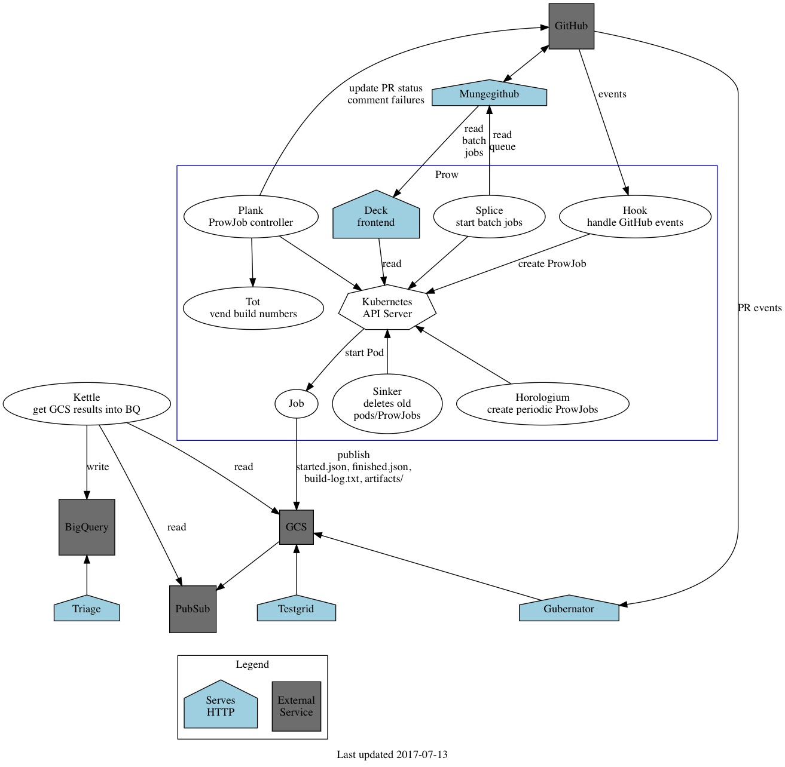

# Kubernetes测试

## 单元测试

单元测试仅依赖于源代码，是测试代码逻辑是否符合预期的最简单方法。

**运行所有的单元测试**

```
make test
```

**仅测试指定的package**

```sh
# 单个package
make test WHAT=./pkg/api
# 多个packages
make test WHAT=./pkg/{api,kubelet} 
```

或者，也可以直接用`go test`

```sh
go test -v k8s.io/kubernetes/pkg/kubelet
```

**仅测试指定package的某个测试case**

```
# Runs TestValidatePod in pkg/api/validation with the verbose flag set
make test WHAT=./pkg/api/validation KUBE_GOFLAGS="-v" KUBE_TEST_ARGS='-run ^TestValidatePod$'

# Runs tests that match the regex ValidatePod|ValidateConfigMap in pkg/api/validation
make test WHAT=./pkg/api/validation KUBE_GOFLAGS="-v" KUBE_TEST_ARGS="-run ValidatePod\|ValidateConfigMap$"
```

或者直接用`go test`

```
go test -v k8s.io/kubernetes/pkg/api/validation -run ^TestValidatePod$
```

**并行测试**

并行测试是root out flakes的一种有效方法：

```sh
# Have 2 workers run all tests 5 times each (10 total iterations).
make test PARALLEL=2 ITERATION=5
```

**生成测试报告**

```
make test KUBE_COVER=y
```

## Benchmark测试

```
go test ./pkg/apiserver -benchmem -run=XXX -bench=BenchmarkWatch
```

## 集成测试

Kubernetes集成测试需要安装etcd（只要按照即可，不需要启动），比如

```
hack/install-etcd.sh  # Installs in ./third_party/etcd
echo export PATH="\$PATH:$(pwd)/third_party/etcd" >> ~/.profile  # Add to PATH
```

集成测试会在需要的时候自动启动etcd和kubernetes服务，并运行[test/integration](https://github.com/kubernetes/kubernetes/tree/master/test/integration)里面的测试。

**运行所有集成测试**

```sh
make test-integration  # Run all integration tests.
```

**指定集成测试用例**

```sh
# Run integration test TestPodUpdateActiveDeadlineSeconds with the verbose flag set.
make test-integration KUBE_GOFLAGS="-v" KUBE_TEST_ARGS="-run ^TestPodUpdateActiveDeadlineSeconds$"
```

## End to end (e2e)测试

End to end (e2e) 测试模拟用户行为操作Kubernetes，用来保证Kubernetes服务或集群的行为完全符合设计预期。

在开启e2e测试之前，需要先编译测试文件，并设置KUBERNETES_PROVIDER（默认为gce）：

```
make WHAT='test/e2e/e2e.test'
make ginkgo
export KUBERNETES_PROVIDER=local
```

**启动cluster，测试，最后停止cluster**

```sh
# build Kubernetes, up a cluster, run tests, and tear everything down
go run hack/e2e.go -- -v --build --up --test --down
```

**仅测试指定的用例**

```sh
go run hack/e2e.go -v -test --test_args='--ginkgo.focus=Kubectl\sclient\s\[k8s\.io\]\sKubectl\srolling\-update\sshould\ssupport\srolling\-update\sto\ssame\simage\s\[Conformance\]$'
```

**略过测试用例**

```sh
go run hack/e2e.go -- -v --test --test_args="--ginkgo.skip=Pods.*env
```

**并行测试**

```sh
# Run tests in parallel, skip any that must be run serially
GINKGO_PARALLEL=y go run hack/e2e.go --v --test --test_args="--ginkgo.skip=\[Serial\]"

# Run tests in parallel, skip any that must be run serially and keep the test namespace if test failed
GINKGO_PARALLEL=y go run hack/e2e.go --v --test --test_args="--ginkgo.skip=\[Serial\] --delete-namespace-on-failure=false"
```

**清理测试**

```sh
go run hack/e2e.go -- -v --down
```

**有用的`-ctl`**

```sh
# -ctl can be used to quickly call kubectl against your e2e cluster. Useful for
# cleaning up after a failed test or viewing logs. Use -v to avoid suppressing
# kubectl output.
go run hack/e2e.go -- -v -ctl='get events'
go run hack/e2e.go -- -v -ctl='delete pod foobar'
```

## Fedaration e2e测试

```sh
export FEDERATION=true
export E2E_ZONES="us-central1-a us-central1-b us-central1-f"
# or export FEDERATION_PUSH_REPO_BASE="quay.io/colin_hom"
export FEDERATION_PUSH_REPO_BASE="gcr.io/${GCE_PROJECT_NAME}"

# build container images
KUBE_RELEASE_RUN_TESTS=n KUBE_FASTBUILD=true go run hack/e2e.go -- -v -build

# push the federation container images
build/push-federation-images.sh

# Deploy federation control plane
go run hack/e2e.go -- -v --up

# Finally, run the tests
go run hack/e2e.go -- -v --test --test_args="--ginkgo.focus=\[Feature:Federation\]"

# Don't forget to teardown everything down
go run hack/e2e.go -- -v --down
```

可以用`cluster/log-dump.sh <directory>`方便的下载相关日志，帮助排查测试中碰到的问题。

## Node e2e测试

Node e2e仅测试Kubelet的相关功能，可以在本地或者集群中测试

```sh
export KUBERNETES_PROVIDER=local
make test-e2e-node FOCUS="InitContainer"
make test_e2e_node TEST_ARGS="--experimental-cgroups-per-qos=true"
```

## 补充说明

借助kubectl的模版可以方便获取想要的数据，比如查询某个container的镜像的方法为

```sh
kubectl get pods nginx-4263166205-ggst4 -o template '--template={{if (exists . "status" "containerStatuses")}}{{range .status.containerStatuses}}{{if eq .name "nginx"}}{{.image}}{{end}}{{end}}{{end}}'
```

## kubernetes测试工具集test-infra

[test-infra](https://github.com/kubernetes/test-infra)是由kubernetes官方开源的测试框架，其中包括了Kubernetes测试工具集和测试结果展示。下图展示了test-infra的架构：




该测试框架主要是真多Google公有云做的，支持kubernetes1.6以上版本的测试。详见<https://github.com/kubernetes/test-infra>。

## 参考文档

* [Kubernetes testing](https://github.com/kubernetes/community/blob/master/contributors/devel/testing.md)
* [End-to-End Testing](https://github.com/kubernetes/community/blob/master/contributors/devel/e2e-tests.md)
* [Node e2e test](https://github.com/kubernetes/community/blob/master/contributors/devel/e2e-node-tests.md)
* [How to write e2e test](https://github.com/kubernetes/community/blob/master/contributors/devel/writing-good-e2e-tests.md)
* [Coding Conventions](https://github.com/kubernetes/community/blob/master/contributors/devel/coding-conventions.md#testing-conventions)
* https://github.com/kubernetes/test-infra
