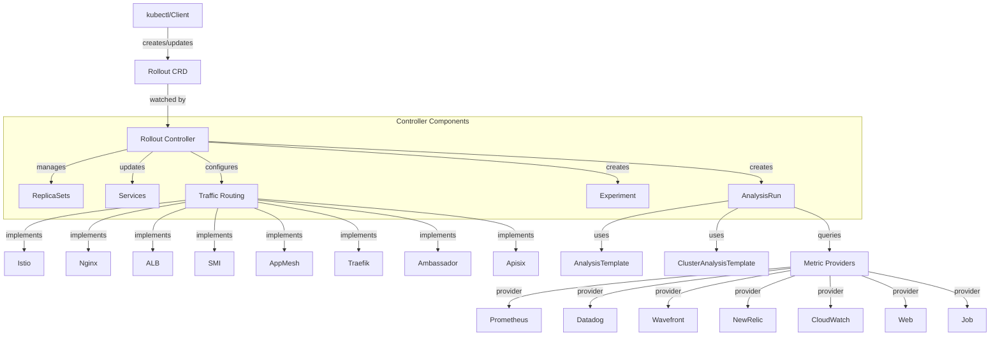
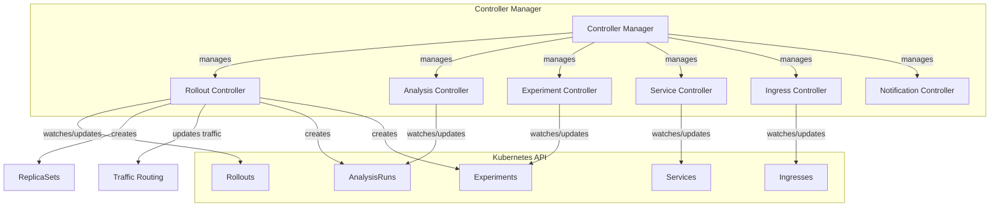
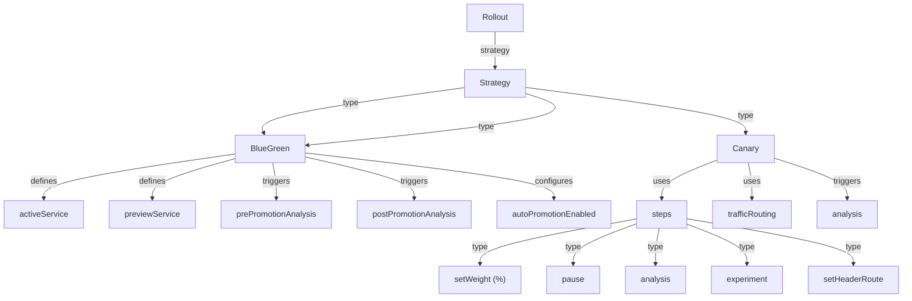
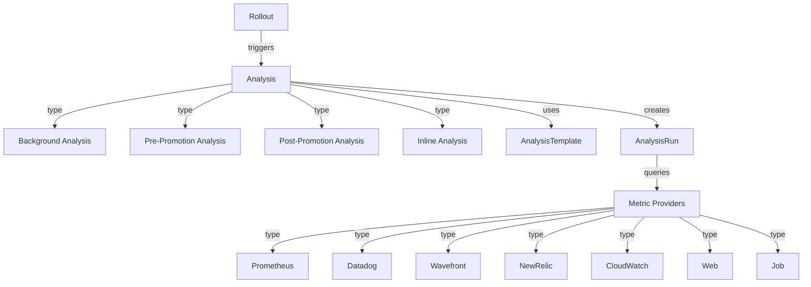

> Argo Rollout 为 Kubernetes 提供了企业级渐进式交付能力，支持蓝绿和金丝雀等高级部署策略，集成流量控制与自动化分析，显著提升应用发布的安全性与可靠性。

## 历史

[Argo Rollout](https://github.com/argoproj/argo-rollouts) 是 Argo 项目生态系统的一部分，由 Intuit 公司开发并于 2019 年开源。该项目同样加入了 CNCF，成为云原生计算基金会的一部分。

Argo Rollout 的诞生源于 Kubernetes 原生 Deployment 对象的 RollingUpdate 策略存在诸多局限性：

- 对部署速度控制有限
- 无法精确控制流量分配
- 依赖简单的就绪探针
- 缺乏外部指标验证能力
- 无法自动回滚

为了解决这些问题，特别是在大规模生产环境中的部署风险，Argo Rollout 被开发出来，提供更高级的部署策略和控制能力。

## 什么是 Argo Rollout？

Argo Rollout 是 Kubernetes 的渐进式交付控制器和自定义资源定义（CRD）集合，为 Kubernetes 应用提供高级部署能力。它通过蓝绿部署和金丝雀部署等复杂策略，扩展了标准 Kubernetes Deployment 资源的功能。

与仅支持基本滚动更新的标准 Kubernetes Deployment 不同，Argo Rollout 支持渐进式交付技术，具有细粒度的流量控制、自动化分析和回滚能力。

## 核心架构

Argo Rollout 遵循 Kubernetes 生态系统中常见的基于控制器的架构模式。下图展示了主要组件及其交互关系，便于理解整体系统设计。




{width=2782 height=1102}

Argo Rollout 的核心组成部分包括自定义资源定义（CRDs）、控制器、流量管理和分析系统，各组件协同实现渐进式交付。

## 控制器实现

Argo Rollout 控制器由多个子控制器组成，分别负责渐进式交付的不同方面。下图展示了控制器的整体结构与职责分工。




{width=2357 height=647}

控制器负责监控 Rollout 资源变化、管理 ReplicaSets、更新 Services、创建分析与实验对象，并与流量路由机制集成，实现渐进式流量转移。

## 部署策略

Argo Rollout 支持两种主要的部署策略：BlueGreen 和 Canary。下图展示了策略结构及关键配置项。




{width=2068 height=817}

### BlueGreen 部署

BlueGreen 部署通过并行部署新旧版本，实现零停机更新和即时回滚。新版本可通过预览服务进行测试，验证后流量切换至新版本，旧版本随后缩减并移除。

### Canary 部署

Canary 部署通过逐步增加新版本流量，监控性能和健康状况，确保安全发布。每个步骤可配置自动化验证，支持自动或手动中止部署，适合高流量和高稳定性要求场景。

## 分析系统

Argo Rollout 的分析系统自动化部署验证，支持多种指标提供商。下图展示了分析流程及关键组件。




{width=1939 height=817}

分析系统通过定义指标、查询外部数据、评估成功条件，实现自动提升或回滚。支持 Prometheus、Datadog 等主流监控平台。

## 支持的流量路由

Argo Rollout 可与多种流量路由器集成，实现细粒度流量分配。下表总结了各路由器的能力。



| 流量路由器   | 权重控制 | 基于头部的路由 | 镜像 |
| ------------ | -------- | -------------- | ---- |
| ALB          | ✓        | ✓              | ✗    |
| Ambassador   | ✓        | ✗              | ✗    |
| Apache APISIX| ✓        | ✓              | ✗    |
| Istio        | ✓        | ✓              | ✓    |
| Nginx        | ✓        | ✗              | ✗    |
| SMI          | ✓        | ✗              | ✗    |
| Traefik      | ✓        | ✗              | ✗    |



这种集成支持高级部署模式，如 A/B 测试和渐进式流量转移。

## 优势和使用场景

Argo Rollout 解决了标准 Kubernetes 部署的诸多限制，适用于多种生产场景。常见优势包括：

- 受控部署速度
- 流量整形与分配
- 高级指标验证
- 基于指标的自动提升与回滚
- 支持 A/B 测试与多版本并行

典型使用场景：

- 生产环境新版本功能测试
- 预部署验证与自动化分析
- 渐进式流量转移与监控
- 企业级多团队协作

## 基本配置

以下为 Argo Rollout 的基础安装与使用流程，适合初学者快速上手。

### 安装 Argo Rollout

```bash
# 创建命名空间
kubectl create namespace argo-rollouts

# 安装控制器
kubectl apply -n argo-rollouts -f https://github.com/argoproj/argo-rollouts/releases/latest/download/install.yaml

# 安装 kubectl 插件
kubectl krew install rollouts
```

### 创建第一个 Rollout

```yaml
apiVersion: argoproj.io/v1alpha1
kind: Rollout
metadata:
  name: rollouts-demo
spec:
  replicas: 5
  strategy:
    canary:
      steps:
      - setWeight: 20
      - pause: {}
      - setWeight: 40
      - pause: {duration: 10}
      - setWeight: 60
      - pause: {duration: 10}
      - setWeight: 80
      - pause: {duration: 10}
  selector:
    matchLabels:
      app: rollouts-demo
  template:
    metadata:
      labels:
        app: rollouts-demo
    spec:
      containers:
      - name: rollouts-demo
        image: argoproj/rollouts-demo:blue
        ports:
        - name: http
          containerPort: 8080
          protocol: TCP
---
apiVersion: v1
kind: Service
metadata:
  name: rollouts-demo
spec:
  ports:
  - port: 80
    targetPort: 8080
    protocol: TCP
    name: http
  selector:
    app: rollouts-demo
```

### 部署和更新

```bash
# 部署初始版本
kubectl apply -f rollout.yaml

# 更新镜像版本
kubectl argo rollouts set image rollouts-demo rollouts-demo=argoproj/rollouts-demo:yellow

# 查看部署状态
kubectl argo rollouts get rollout rollouts-demo --watch

# 手动提升部署
kubectl argo rollouts promote rollouts-demo
```

## 最佳实践

为保障安全性、可维护性和性能，建议遵循以下最佳实践。

### 应用兼容性检查

- 数据库兼容性：新版本需向后兼容
- 服务间通信：确保 API 兼容性
- 配置管理：避免硬编码配置

### 部署策略选择

- 金丝雀部署：适用于高流量、复杂应用、稳定性要求高场景
- 蓝绿部署：适用于快速回滚、数据库变更、基础设施升级

### 指标和分析

- 关键指标：错误率、响应时间、吞吐量、业务指标
- AnalysisTemplate 示例：

```yaml
apiVersion: argoproj.io/v1alpha1
kind: AnalysisTemplate
metadata:
  name: success-rate
spec:
  metrics:
  - name: success-rate
    interval: 5m
    successCondition: result[0] >= 0.95
    provider:
      prometheus:
        address: http://prometheus.example.com:9090
        query: |
          sum(irate(istio_requests_total{reporter="source",destination_service_name=~"{{args.service-name}}",response_code!~"5.*"}[5m])) /
          sum(irate(istio_requests_total{reporter="source",destination_service_name=~"{{args.service-name}}"}[5m]))
```

### 流量管理

- Ingress 控制器集成：NGINX、AWS ALB、Istio Gateway
- Service Mesh 集成：Istio、Linkerd、AWS App Mesh

### 回滚策略

- 自动回滚条件：指标未达标、手动干预、部署超时
- 回滚速度控制：渐进式或立即回滚

### 监控和告警

- 部署状态监控：Rollout 状态、ReplicaSet 变化、AnalysisRun 结果
- 告警配置：部署失败、回滚触发、部署超时

## 总结

Argo Rollout 为 Kubernetes 提供了强大的渐进式交付能力，弥补了原生 Deployment 的不足。其核心优势包括灵活部署策略、精确流量控制、基于指标的自动化决策和丰富集成生态。结合 ArgoCD，可实现完整的 GitOps + 渐进式交付流水线，满足现代化企业级应用发布需求。

无论是蓝绿部署、金丝雀发布还是 A/B 测试，Argo Rollout 都能为 Kubernetes 环境带来安全、可控、自动化的应用更新体验。
