> Argo CD 是 Kubernetes 生态中最重要的 GitOps 工具之一，通过声明式配置和自动化同步，实现了高效、可审计的持续交付流程，适用于多集群和多租户场景。

## 历史

[ArgoCD](https://github.com/argoproj/argo-cd) 由 Intuit 公司开发，于 2018 年开源发布，是 Argo 项目生态系统的一部分。该项目于 2019 年加入 CNCF（云原生计算基金会），并于 2020 年成为 CNCF 毕业项目。

ArgoCD 的诞生源于 Intuit 在大规模 Kubernetes 部署中遇到的挑战。传统的部署方式无法满足声明式配置和版本控制的需求，因此开发了 ArgoCD 来实现 GitOps 模式。

## 什么是 Argo CD？

Argo CD 遵循 GitOps 原则，其中应用定义、配置和环境是声明式的并进行版本控制。它持续监控运行中的应用，并将当前状态与 Git 中指定的期望目标状态进行比较，在检测到差异时自动或手动协调差异。

核心原则：

- 应用定义和配置是声明式的并进行版本控制
- 应用部署和生命周期管理是自动化的、可审计的且易于理解
- Git 仓库作为应用状态的单一事实来源

## 核心架构

Argo CD 采用微服务架构运行在 Kubernetes 上。下图展示了主要组件及其交互关系，有助于理解整体系统设计。



{width=2023 height=919}

## 核心组件

Argo CD 的核心组件各司其职，协同实现 GitOps 持续交付。

### API Server (argocd-server)

API Server 为 Web UI、CLI 和 CI/CD 系统提供 gRPC/REST API，是用户和外部系统的主要交互点。

关键职责：

- 处理来自 UI、CLI 和 CI/CD 系统的 API 请求
- 通过本地用户、SSO 或其他方法处理用户认证
- 实施 RBAC 策略
- 提供 Web UI 静态资源
- 管理 Application、Project 和 Repository 资源

API Server 的配置通过 `argocd-cmd-params-cm` ConfigMap 处理，包括认证设置、TLS 配置、Redis 连接等。



{width=1920 height=2676}

### Application Controller (argocd-application-controller)

Application Controller 持续监控应用并比较实际状态与期望目标状态，是核心控制器。

关键职责：

- 持续监控 Application 资源
- 比较集群中的实际状态与 Git 中的期望状态
- 协调差异（同步操作）
- 报告应用健康和状态
- 维护实际应用状态的缓存

控制器通过 ConfigMap 配置，包括协调时机、自愈设置、并行限制等。


{width=1920 height=1402}

### Repository Server (argocd-repo-server)

Repository Server 负责维护 Git 仓库的本地缓存并生成 Kubernetes manifests，支持多种配置管理工具。

关键职责：

- 维护 Git 仓库的本地缓存
- 从应用源生成 Kubernetes manifests
- 支持 Helm、Kustomize、Jsonnet 等工具
- 为其他组件提供 manifest 生成服务
- 与配置管理插件（CMPs）集成


{width=1920 height=1240}

### Redis

Redis 作为 Argo CD 的缓存和数据存储系统，用于缓存应用状态、仓库数据和其他临时信息，支持组件的可扩展性。

### Dex Server (argocd-dex-server)

Dex Server 是一个 OpenID Connect (OIDC) 提供商，与外部身份提供商集成，实现 Argo CD 的 SSO 认证。

关键职责：

- 与外部身份提供商集成（LDAP、SAML、OAuth）
- 提供基于 OIDC 的认证
- 支持单点登录（SSO）


{width=1920 height=1050}

## 附加组件

Argo CD 还提供了扩展功能，满足复杂场景需求。

### ApplicationSet Controller

ApplicationSet Controller 通过模板自动化创建 Application 资源，简化跨多个集群的应用管理。

关键能力：

- 从模板自动化创建 Application 资源
- 支持多种生成器（List、Cluster、Git、SCM Provider）



{width=1920 height=993}

### Notifications Controller

Notifications Controller 支持将应用事件通知发送到 Slack、电子邮件或 webhook 等外部系统，提升运维自动化能力。

## 资源类型

Argo CD 定义了多个自定义资源类型，支撑其核心功能。

### Application 资源

Application 资源是 Argo CD 的核心，表示已部署的应用实例，定义了应用 manifests 的来源及部署目标。

关键字段：

- `spec.source`：定义源仓库、路径和版本
- `spec.destination`：指定目标集群和命名空间
- `spec.syncPolicy`：控制自动同步行为
- `spec.project`：此应用所属的项目



{width=1920 height=4565}

### AppProject 资源

AppProject 资源用于应用逻辑分组，并定义项目中的资源约束，提升多租户和权限管理能力。

关键字段：

- `spec.sourceRepos`：允许的 Git 仓库
- `spec.destinations`：允许的部署目标
- `spec.clusterResourceWhitelist`：允许的集群范围资源
- `spec.namespaceResourceBlacklist`：拒绝的命名空间范围资源
- `spec.roles`：项目成员的 RBAC 角色

### ApplicationSet 资源

ApplicationSet 资源基于模板和生成器自动化创建 Application 资源，适用于大规模多集群场景。

关键字段：

- `spec.generators`：定义如何为模板生成参数
- `spec.template`：用于生成 Application 的应用模板


{width=1920 height=2558}

## GitOps 工作流

Argo CD 通过以下工作流实现 GitOps 模式，确保应用状态与 Git 仓库保持一致：

1. **提交变更**：开发者将应用 manifests/配置提交到 Git
2. **检测**：Argo CD 通过 webhook 或轮询检测变更
3. **Manifest 生成**：Argo CD 使用 Helm、Kustomize 等工具生成 Kubernetes manifests
4. **比较**：Argo CD 比较期望状态与集群实际状态
5. **协调**：如有差异，自动或手动同步到集群
6. **状态报告**：Argo CD 展示同步和健康状态

## 配置

Argo CD 主要通过 Kubernetes ConfigMaps 和 Secrets 配置，支持灵活定制：

- **argocd-cm**：通用配置
- **argocd-cmd-params-cm**：组件参数
- **argocd-rbac-cm**：RBAC 配置
- **argocd-secret**：敏感数据
- **argocd-ssh-known-hosts-cm**：SSH 主机
- **argocd-tls-certs-cm**：TLS 证书

这些配置资源允许自定义 Argo CD 行为，从认证到仓库连接均可灵活调整。

## CLI 安装和使用

Argo CD CLI 提供命令行交互，支持多平台安装。以下为常用安装与操作示例。

```bash
# Linux/macOS 安装
curl -sSL -o argocd-linux-amd64 https://github.com/argoproj/argo-cd/releases/latest/download/argocd-linux-amd64
sudo install -m 555 argocd-linux-amd64 /usr/local/bin/argocd
```

常见 CLI 操作包括：

- 登录：`argocd login <server>`
- 应用管理：`argocd app create/get/sync`
- 仓库和集群管理：`argocd repo add`，`argocd cluster add`

## 多集群部署

Argo CD 支持跨多个 Kubernetes 集群的应用管理，实现集中式运维和统一视图。

- 可管理本地集群和注册的外部集群
- 支持多团队、多租户场景
- 提升企业级应用交付效率

## 基本配置

以下为 Argo CD 的基础安装与访问流程，适合初学者快速上手。

### 安装 Argo CD

```bash
# 创建命名空间
kubectl create namespace argocd

# 安装 Argo CD
kubectl apply -n argocd -f https://raw.githubusercontent.com/argoproj/argo-cd/stable/manifests/install.yaml
```

### 访问 Argo CD

```bash
# 获取初始密码
kubectl get secret argocd-initial-admin-secret -n argocd -o jsonpath="{.data.password}" | base64 -d

# 端口转发访问 UI
kubectl port-forward svc/argocd-server -n argocd 8080:443

# 浏览器访问 https://localhost:8080
# 默认用户名：admin，密码如上获取
```

### 创建第一个应用

```bash
# 使用 CLI 创建应用
argocd app create guestbook \
  --repo https://github.com/argoproj/argocd-example-apps.git \
  --path guestbook \
  --dest-server https://kubernetes.default.svc \
  --dest-namespace default
```

## 使用场景

Argo CD 适用于多种场景，满足不同团队和企业需求。

### 1. GitOps 应用部署

ArgoCD 作为 GitOps 工具的核心，使应用配置与代码同步：

- **声明式配置**：应用状态完全由 Git 仓库定义
- **版本控制**：所有变更都有审计跟踪
- **自动化同步**：自动检测并应用配置变更

### 2. 多集群应用管理

适用于多 Kubernetes 集群环境，实现统一管理和策略控制。

```yaml
apiVersion: argoproj.io/v1alpha1
kind: Application
metadata:
  name: my-app
spec:
  destination:
    server: https://cluster1.example.com  # 目标集群
    namespace: production
  source:
    repoURL: https://github.com/my-org/my-app
    path: helm/
    targetRevision: HEAD
```

### 3. 集群 Add-ons 管理

基础设施团队可用 ArgoCD 管理集群级组件，如 Prometheus Operator、Istio、Cert-Manager、Ingress Controllers 等。

### 4. 自服务应用部署

在多租户集群中，开发团队可自助部署应用，受限于预定义命名空间和集群范围，提升协作效率。

### 5. 多集群应用管理

支持集中式应用生命周期管理，包括集群注册、统一视图、策略控制和灾难恢复。

## 最佳实践

为保障安全性、可维护性和性能，建议遵循以下最佳实践。

### 安全配置

- **RBAC 配置**：

```yaml
apiVersion: v1
kind: ConfigMap
metadata:
  name: argocd-rbac-cm
  namespace: argocd
data:
  policy.csv: |
    p, role:developer, applications, get, */*, allow
    p, role:developer, applications, sync, */*, allow
    g, alice@example.com, role:developer
```

- **外部身份提供商集成**：支持 LDAP、SAML、OAuth，实现单点登录。
- **证书管理**：配置 TLS 证书，启用 HTTPS。

### 应用组织

- **App of Apps 模式**：父应用管理多个子应用，实现批量操作。
- **项目隔离**：使用 AppProject 限制应用范围，控制目标集群和命名空间。

### 监控和告警

- **集成 Prometheus**：监控组件健康状态，设置告警规则。
- **审计日志**：启用详细审计日志，与 SIEM 系统集成。

### 性能优化

- **缓存配置**：调整 Git 仓库缓存时间，优化大规模应用管理。
- **资源限制**：为组件设置资源配额，监控资源使用。

## 总结

Argo CD 作为 Kubernetes GitOps 持续交付的核心工具，具备自动化、可审计、多租户支持和丰富生态等优势。其核心组件协同工作，覆盖从单应用到多集群的复杂场景。合理配置 RBAC、监控和自动化策略，可构建健壮的持续交付流水线，满足企业级应用管理需求。
