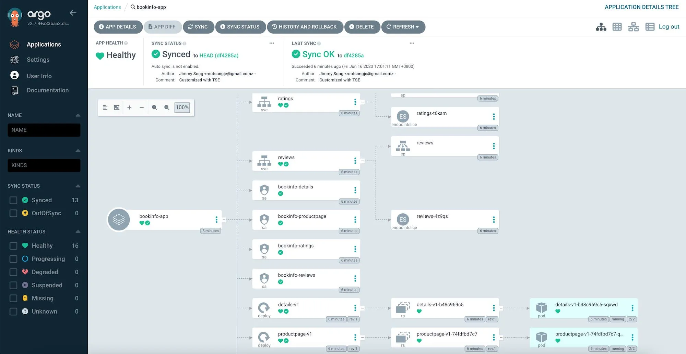

持续集成与交付，简称 CI/CD（Continous Integration/Continous Delivery），是一种软件开发实践，旨在通过自动化软件构建、测试和部署过程，提高应用程序的交付速度和质量。它涉及多个阶段，包括代码管理、构建、测试、部署和监控。CI/CD 可以帮助开发团队更快地迭代和交付新功能，同时减少故障和错误。

## 什么是持续集成与交付？

持续集成（Continuous Integration，CI）是指开发团队通过自动化将代码的集成过程与频率增加到了一个可持续的水平。在持续集成中，开发人员经常将代码提交到共享存储库，并使用自动化构建系统（如 Jenkins、Travis CI 等）对代码进行构建、测试和部署。这有助于尽早发现和解决潜在的问题，并确保代码的稳定性和质量。

持续交付（Continuous Delivery，CD）是在持续集成的基础上进一步扩展的概念。它强调在持续集成的基础上，通过自动化的部署流程，使软件随时处于可部署状态。持续交付的目标是实现在任何时候都能够轻松、可靠地将软件部署到生产环境中，以便快速响应需求变化或发布新功能。

CI/CD 的主要优势包括：

1. **快速反馈**：通过持续集成和自动化测试，可以及早发现和解决代码问题，从而加快反馈和修复的速度。
2. **自动化部署**：通过持续交付，可以将软件部署到生产环境中，减少手动操作和人为错误的风险。
3. **减少发布风险**：通过频繁的集成和测试，可以降低发布新功能或更新时的风险。
4. **加快交付速度**：通过自动化流程和减少手动干预，可以更快地交付新功能和修复。
5. **增加团队协作**：CI/CD 鼓励团队成员之间的频繁交流和协作，促进整个开发周期的透明度和合作。

## CI/CD 工具简介

在进行持续集成和持续交付时，有很多工具和框架可供选择。其中一些最常用的工具包括：

1. **ArgoCD**：ArgoCD 是一个开源的 GitOps 工具，用于持续交付和部署应用程序。它与 Git 仓库集成，通过监视代码仓库中的更改来自动部署应用程序。ArgoCD 提供了一个直观的用户界面和命令行工具，支持声明性的应用程序定义，以及应用程序的版本控制和回滚功能。
2. **Jenkins**：Jenkins 是一个功能强大且广泛使用的自动化 CI/CD 工具。它支持大量插件和集成，具有灵活的配置和可扩展性。
3. **GitLab CI/CD**：GitLab CI/CD 是与 GitLab 版本控制系统紧密集成的持续集成和持续交付工具。它提供了一个易于配置和使用的管道来自动构建、测试和部署应用程序。
4. **CircleCI**：CircleCI 是一种基于云的 CI/CD 平台，支持持续集成和持续交付。它提供了简单的配置和集成，适用于各种项目。
5. **Travis CI**：Travis CI 是一个针对开源项目的持续集成平台。它提供了易于使用的配置和集成，与 GitHub 紧密结合。
6. **Drone**：Drone 是一个轻量级的持续交付平台，它提供了易于配置的 YAML 文件来定义构建和部署流程。它支持与各种版本控制系统的集成。
7. **Bamboo**：Bamboo 是一个由 Atlassian 开发的 CI/CD 工具。它提供了强大的构建和部署功能，与其他 Atlassian 产品（如 Jira 和 Bitbucket）无缝集成。
8. **Google Cloud Build**：Google Cloud Build 是谷歌云平台提供的托管式持续集成和持续交付平台。它与 Google Cloud Platform 紧密集成，并且支持与 GitHub、Bitbucket 和 Cloud Source Repositories 等代码仓库的集成。Cloud Build 提供了强大的构建和部署功能，可以自动构建、测试和部署应用程序。
9. **AWS CodePipeline**：AWS CodePipeline 是亚马逊 Web 服务（AWS）提供的一种全托管的持续交付服务。它使你能够创建、管理和自动化应用程序的交付流程。CodePipeline 支持与 AWS 服务以及第三方工具的集成，提供了一个可视化的界面来定义和执行交付流程，包括构建、测试和部署。

有关更多 CI/CD 工具，请参考 [Awesome Cloud Native](https://jimmysong.io/awesome-cloud-native/#application-delivery)。

## ArgoCD

[ArgoCD](https://argo-cd.readthedocs.io/en/stable/) 是一个开源的 GitOps 工具，用于持续交付和部署应用程序。它与 Git 仓库集成，通过监视代码仓库中的更改来自动部署应用程序。ArgoCD 提供了一个直观的用户界面和命令行工具，支持声明性的应用程序定义，以及应用程序的版本控制和回滚功能。ArgoCD 是 CNCF（Cloud Native Computing Foundation）的一部分，因此选择它作为代表介绍 CI/CD 工具的功能和优势。

{width=2000 height=1034}

ArgoCD 的目标是通过基于 Git 仓库的声明性配置来自动化应用程序的部署和更新过程。以下是对 ArgoCD 的详细介绍：

特点和功能：

1. **GitOps 原则**：ArgoCD 遵循 GitOps 方法论，将 Git 作为单一的真实源，自动化应用程序部署和更新。它通过与 Git 仓库同步并监控代码仓库中的更改，自动应用这些更改来保持集群中的应用程序状态。
2. **声明性配置**：ArgoCD 使用 Kubernetes 风格的声明性 YAML 文件来定义应用程序的状态和期望配置。这使得管理和跟踪应用程序的配置变得更加简单和可靠。
3. **持续交付**：ArgoCD 提供了自动化的持续交付功能，可以将应用程序从代码仓库自动部署到 Kubernetes 集群。它支持多种部署策略，例如蓝绿部署和滚动升级，以确保应用程序的平滑发布和回滚。
4. **多环境支持**：ArgoCD 支持多个环境（如开发、测试和生产环境）的管理和部署。它可以根据不同的环境要求和策略来自动同步和部署应用程序。
5. **自动同步和健康检查**：ArgoCD 会持续监控应用程序的状态，并自动检测和同步配置更改。它还提供健康检查功能，可确保应用程序在部署过程中的可用性和正确性。
6. **可观测性和审计**：ArgoCD 提供了实时的应用程序状态和部署历史的可视化界面。它还支持审计日志和事件记录，以跟踪应用程序配置的变化和部署操作的历史。
7. **扩展性和插件**：ArgoCD 具有高度可扩展的架构，允许用户根据需要添加自定义插件和功能。它还支持与其他工具和平台的集成，例如 Prometheus、Grafana 和 Slack。

使用 ArgoCD，你可以实现基于 GitOps 的自动化应用程序交付和部署，提高开发团队的效率和可靠性。它广泛应用于云原生和容器化环境中，特别适用于 Kubernetes 平台上的应用程序管理。

### ArgoCD 快速入门

下面是 ArgoCD 的快速入门指南：

1. **安装 ArgoCD**：你可以按照 ArgoCD 的官方文档指引，在你的 Kubernetes 集群中安装 ArgoCD。安装过程包括创建命名空间、部署 ArgoCD 控制器和创建服务等。

2. **配置 Git 仓库**：在 ArgoCD 中，你需要将你的应用程序配置存储在一个 Git 仓库中，并与 ArgoCD 进行集成。确保你的 Git 仓库包含应用程序的声明性配置文件，例如 YAML 文件。

3. **创建应用程序**：使用 ArgoCD 的命令行工具或 Web 界面，创建一个应用程序对象。这个对象包括应用程序的名称、Git 仓库的 URL、分支/标签和路径等信息。这些信息指定了应用程序的源码和配置的位置。

4. **部署应用程序**：一旦应用程序对象创建完成，ArgoCD 将自动从 Git 仓库中获取应用程序的配置，并将其部署到指定的 Kubernetes 集群中。你可以监控 ArgoCD 控制台以查看部署的进度和状态。

5. **更新应用程序**：如果你的 Git 仓库中的应用程序配置发生变化，ArgoCD 将自动检测到并触发应用程序的更新。你可以选择手动触发更新或配置自动同步策略。

6. **监控和管理**：ArgoCD 提供了一套监控和管理工具，用于跟踪应用程序的状态和配置变化。你可以通过 ArgoCD 的 Web 界面或命令行工具查看应用程序的健康状态、部署历史和同步状态等信息。

这只是 ArgoCD 的快速入门指南，涵盖了基本的安装、配置和使用步骤。对于更详细的信息和高级功能，请参阅 [ArgoCD 的官方文档和示例](https://argo-cd.readthedocs.io/en/stable/)。

### Argo Rollouts

[Argo Rollouts](https://argoproj.github.io/rollouts/) 是一个 Kubernetes 原生的、用于渐进式交付和滚动升级的工具。它是 Argo 项目的一部分，旨在提供更强大和灵活的应用程序部署和升级功能。下面是关于 Argo Rollouts 的一些关键信息：

1. **渐进式交付和滚动升级**：Argo Rollouts 允许你通过渐进式交付和滚动升级的方式部署和更新应用程序。相比于传统的全量替换方式，渐进式交付可以减少对应用程序的影响，提供更平滑的部署和升级体验。

2. **自定义升级策略**：Argo Rollouts 提供了丰富的升级策略配置选项。你可以定义升级的最大不可用期限、并行度、暂停和恢复策略，以及自定义的健康检查和验证策略。

3. **高级部署和升级控制**：Argo Rollouts 具有灵活的部署和升级控制功能。你可以使用 Argo Rollouts 的自定义资源类型（Rollout、Experiment、Analysis）来定义和管理部署和升级的生命周期，包括版本选择、监控和回滚。

4. **自动回滚和版本历史**：如果出现问题，Argo Rollouts 具备自动回滚功能，可以将应用程序回滚到之前的稳定版本。它还提供了版本历史记录和回滚操作的可视化界面，方便你进行故障排查和恢复。

5. **可观测性和报告**：Argo Rollouts 提供了详细的部署和升级报告，用于监控和评估应用程序的状态和性能。它与 Kubernetes Dashboard 和 Prometheus 等工具集成，使你能够深入了解部署和升级的指标和日志。

Argo Rollouts 的目标是通过提供更强大和灵活的渐进式交付和滚动升级功能，帮助用户实现更稳定、可靠和可观测的应用程序部署和运行。它在云原生和容器化环境中广泛应用，并与其他 Argo 项目和工具（如 ArgoCD）集成，提供全面的 CI/CD 解决方案。
