> 从本地快速迭代到生产级持续交付，采用 GitOps、ArgoCD/Argo Rollouts 与可观察性最佳实践构建可靠的 Kubernetes 发布流程。

## 概览

本文基于行业实践，讲解一套面向生产的 Kubernetes 应用开发与部署流程，涵盖：

- 本地开发与快速迭代（k3d / kind / Skaffold / Tilt）
- 镜像构建与安全扫描（multi-stage、distroless、Trivy）
- CI/CD 与 GitOps（GitHub Actions / Tekton / ArgoCD）
- 渐进式交付（Argo Rollouts）
- 配置管理（Helm / Kustomize）
- 策略与合规（OPA/Gatekeeper、Kyverno）
- 可观测性与自动化回滚（Prometheus、Grafana、Alertmanager）

下图为推荐的端到端架构与数据流。



{width=2541 height=330}

## 示例应用简介

本文示例沿用原文的两个服务，便于示范微服务通信与部署实践：

- k8s-app-monitor-test：生成模拟监控指标的服务（REST API）
- k8s-app-monitor-agent：消费并展示监控数据的前端/后端服务

示例仍可用于本地和集群验证；后续配套清单将给出常用 YAML 与 Helm 示例。

## 本地开发与快速迭代

在本地优先进行快速迭代，建议使用轻量 Kubernetes（k3d / kind）或远程 dev-cluster，并结合 Skaffold 或 Tilt 实现代码到容器的快速循环。这样可以保持与生产相近的环境并显著缩短反馈时间。


{width=1920 height=128}

建议工具与理由：

- k3d / kind：快速创建本地 Kubernetes 集群，支持 CI 一致性
- Skaffold / Tilt：自动构建、推送、部署并支持端口转发与日志查看
- Dev containers：在 VS Code Remote / Codespaces 中保持一致开发环境

## 镜像构建与安全

镜像仍是交付单元，2025 年推荐实践：

- 使用 multi-stage 构建减小镜像体积
- 优选 Distroless 或 scratch 基础镜像
- 启用 BuildKit 与镜像内容信任（OCI Signature）
- 在 CI 中集成静态扫描（Trivy / Grype）和依赖扫描
- 为镜像打可追溯标签（Git SHA、构建时间、SBOM）

示例 GitHub Actions 构建与推送（仅示例，CI secret 与缓存按需配置）：

```yaml
name: Build and push image
on:
  push:
    branches: [ main ]

jobs:
  build:
    runs-on: ubuntu-latest
    steps:
      - uses: actions/checkout@v4
      - name: Set up QEMU
        uses: docker/setup-qemu-action@v2
      - name: Set up Docker Buildx
        uses: docker/setup-buildx-action@v2
      - name: Login to registry
        uses: docker/login-action@v3
        with:
          registry: ghcr.io
          username: ${{ github.actor }}
          password: ${{ secrets.GHCR_TOKEN }}
      - name: Build and push
        uses: docker/build-push-action@v5
        with:
          context: .
          push: true
          tags: ghcr.io/myorg/myapp:${{ github.sha }}
          outputs: type=registry
      - name: Scan image
        uses: aquasecurity/trivy-action@v1
        with:
          image-ref: ghcr.io/myorg/myapp:${{ github.sha }}
```

同时在 CI 中生成 SBOM（CycloneDX / SPDX），并把扫描结果发送到集中告警或 Issue 流程。

## 配置与清单管理

建议使用 Helm 或 Kustomize 管理 Kubernetes 配置，优先将环境差异抽象到 values / overlays：

- Helm：适合应用打包与参数化发布
- Kustomize：适合纯 YAML 叠加与变更
- Jsonnet：适合复杂模板化需求

示例目录结构（推荐）：

- ops/
  - base/ (shared manifests / kustomize base / helm chart)
  - overlays/
    - dev/
    - stage/
    - prod/

切忌直接在集群中做一次性更改；所有变更应通过 Git 提交并纳入审计。

## GitOps 与持续交付

2025 年主流模式是将 Git 作为单一事实来源（Single Source of Truth），并使用 ArgoCD / Flux 进行自动同步与审计。结合 Argo Rollouts 可实现金丝雀与蓝绿等渐进式交付。

整体 GitOps 流程示意：


{width=2019 height=239}

ArgoCD 优势：自动化同步、回滚、审计（历史记录）、多集群支持。实践中建议：

- 为每个环境使用独立 Git 分支或目录（GitOps 结构化）
- 将 ArgoCD Application 和 Project 进行权限隔离
- 把机密数据放到 SealedSecrets / SOPS / External Secrets 中

示例 Argo CD Application（values 存放在 Git）：

```yaml
apiVersion: argoproj.io/v1alpha1
kind: Application
metadata:
  name: monitor-app-prod
  namespace: argocd
spec:
  project: default
  source:
    repoURL: 'https://github.com/myorg/myrepo.git'
    targetRevision: HEAD
    path: ops/overlays/prod
  destination:
    server: 'https://kubernetes.default.svc'
    namespace: monitor
  syncPolicy:
    automated:
      prune: true
      selfHeal: true
```

## 渐进式交付（Argo Rollouts）

对于生产流量变更，建议使用 Argo Rollouts 或 service-mesh 原生功能做金丝雀 / 蓝绿发布，并结合指标分析（Prometheus）自动决策。Argo Rollouts 可与 Istio / NGINX / APISIX 等路由器集成。

示例 Canary 步骤（节选）：

```yaml
apiVersion: argoproj.io/v1alpha1
kind: Rollout
metadata:
  name: rollouts-demo
spec:
  replicas: 3
  strategy:
    canary:
      steps:
      - setWeight: 10
      - pause: {duration: 60}
      - setWeight: 50
      - pause: {duration: 120}
  selector:
    matchLabels:
      app: rollouts-demo
  template:
    metadata:
      labels:
        app: rollouts-demo
    spec:
      containers:
      - name: app
        image: ghcr.io/myorg/myapp:TAG
```

与 AnalysisTemplate 集成后，可在每个步骤基于错误率、延迟等指标自动中止或回滚。

## 策略、合规与安全

生产集群应启用策略引擎与 Admission 控制：

- Kyverno / OPA Gatekeeper：实现合规策略（镜像签名、禁止 root、资源限制等）
- Pod Security Standards 或者 Pod Security Admission：设置命名空间级安全策略
- NetworkPolicy：默认 deny，然后按需放行服务间流量
- 镜像策略：仅允许从受信任的 registry 和签名镜像部署

同时建议把安全门（Shift-left）前移至开发与 CI 阶段，例如依赖漏洞、许可证违规与容器漏洞都在 CI 阶段阻断。

## 可观测性与告警

可靠发布依赖完善可观测性：

- 指标：Prometheus + Grafana（定义 SLO / SLA）
- 日志：集中化（Loki / ELK）
- 跟踪：OpenTelemetry / Jaeger
- 告警：Alertmanager，结合 PagerDuty / Slack

示例监控回路：在 Canary 步骤中，Argo Rollouts 调用 AnalysisRun 查询 Prometheus 指标，若超阈值则中止并回滚。

## 部署示例流程（精简步骤）

1. 本地开发，使用 Skaffold 推送到 dev cluster 并验证。
2. 提交代码到 Git，触发 CI，构建镜像并推送到 OCI registry，同时产出 SBOM 并扫描。
3. CI 将构建产物与版本标签写入 manifests（或触发 PR 更新 Helm values）。
4. GitOps（ArgoCD）检测 Git 变更并同步到集群，触发 Argo Rollouts 做金丝雀发布。
5. 监控与 AnalysisRun 验证指标；异常则触发自动回滚并告警。

## 工具对比（简要）



| 功能         | 推荐工具（示例）                |
| ------------ | ------------------------------- |
| 本地集群     | k3d / kind                      |
| 开发循环     | Skaffold / Tilt                 |
| CI           | GitHub Actions / Tekton         |
| GitOps/CD    | ArgoCD / Flux                   |
| 渐进式交付   | Argo Rollouts                   |
| 镜像扫描     | Trivy / Grype                   |
| 策略引擎     | Kyverno / OPA Gatekeeper        |
| 可观测性     | Prometheus / Grafana / OTel     |



## 迁移与兼容性注意点

- 数据库变更需确保向后兼容，使用双写或迁移工作流避免中断。
- API 兼容性：采用版本化 API 路径或 sidecar 路由策略。
- 回滚策略：在设计回滚时考虑状态性服务与数据一致性。
- 测试：在 CI 中包含集成测试与端到端测试，尽量在与生产相近的环境运行。

## 总结

到 2025 年，Kubernetes 应用交付的核心原则是“可观测的渐进式交付”和“GitOps 为中心的自动化”。推荐采用本地快速迭代工具（k3d、Skaffold）、在 CI 中强化镜像与依赖扫描、使用 GitOps（ArgoCD）实现可审计部署，并用 Argo Rollouts 做渐进式发布与自动回滚。策略引擎（Kyverno / OPA）和完善的可观测性是保障可靠性的关键。

## 参考文献

1. [Argo CD - argoproj.io](https://argo-cd.readthedocs.io/)  
2. [Argo Rollouts - argoproj.io](https://argoproj.github.io/argo-rollouts/)  
3. [Skaffold - skaffold.dev](https://skaffold.dev/)  
4. [Trivy - aquasecurity.github.io/trivy/](https://aquasecurity.github.io/trivy/)  
5. [Kyverno - kyverno.io](https://kyverno.io/)  
6. [OpenTelemetry - opentelemetry.io](https://opentelemetry.io/)
