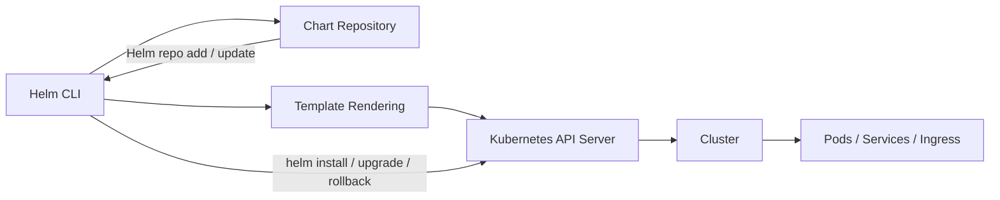
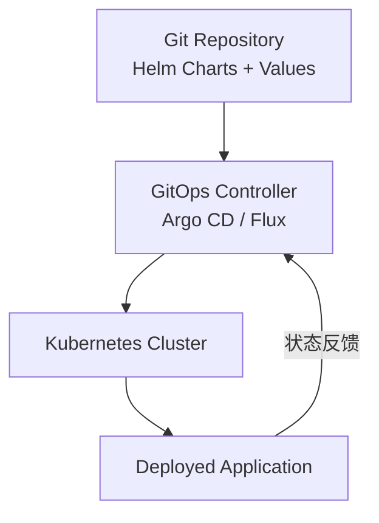

> 真正掌握 Helm，意味着你能用工程化思维驾驭 Kubernetes 应用的全生命周期，让复杂部署变得优雅可控。

[Helm](https://helm.sh/) 作为 Kubernetes 生态中最主流的包管理工具，极大简化了应用部署、升级与回滚流程。通过 Chart 模板化机制，开发者能够高效复用和分享可配置的应用包，实现声明式、自动化的集群管理。

## Helm 的历史与定位

Helm 最初由 Deis 公司于 2015 年发布，后捐赠给 CNCF，成为 Kubernetes 生态系统中最早孵化的项目之一。Helm 的出现主要解决了以下痛点：

- Kubernetes YAML 文件繁杂冗长，应用通常包含多个对象（如 Deployment、Service、Ingress 等）。
- 不同环境（dev/staging/prod）参数差异大，配置管理复杂。
- 缺乏统一的打包与版本管理机制，应用升级与回滚难度较高。

Helm 提供了如下核心能力：

- Chart 打包机制：将一组 Kubernetes 资源定义封装为 Chart。
- 模板渲染系统：支持参数化配置，灵活适配不同环境。
- Release 生命周期管理：记录部署历史，支持轻松回滚。

> Helm 3 版本移除了 Tiller（集群端服务），实现完全客户端化，提升了安全性与易用性。

## Helm 的架构与工作原理

Helm 主要由三部分组成：Helm CLI、Chart Repository 和 Kubernetes API Server。下图展示了 Helm 的工作流程：




{width=1920 height=368}

当执行 `helm install` 时，CLI 会从仓库下载 Chart，使用 values.yaml 参数进行模板渲染，并通过 Kubernetes API 创建资源对象。

## Helm 的基本概念

下表简要说明 Helm 的核心概念及其作用。



| 概念           | 说明                                 |
| -------------- | ------------------------------------ |
| Chart          | 应用包，包含模板、配置和元数据        |
| Release        | Chart 的一次部署实例                  |
| Values.yaml    | 用户配置文件，覆盖默认值              |
| Templates/     | 存放 Kubernetes YAML 模板             |
| Chart.yaml     | Chart 元信息（名称、版本、依赖等）    |
| Repository     | 存储和分发 Chart 的仓库               |



## Helm 基本命令示例

以下命令展示了 Helm 的常用操作流程。每条命令前建议先阅读官方文档，确保参数含义准确。

```bash
# 添加官方仓库
helm repo add bitnami https://charts.bitnami.com/bitnami
helm repo update

# 搜索应用
helm search repo mysql

# 安装应用
helm install mydb bitnami/mysql --set auth.rootPassword=secret123

# 查看安装状态
helm list

# 升级应用
helm upgrade mydb bitnami/mysql --set image.tag=8.4

# 回滚版本
helm rollback mydb 1

# 删除应用
helm uninstall mydb
```

## Helm Chart 结构示例

下方展示了一个典型 Helm Chart 的目录结构。建议每个 Chart 独立维护，便于版本管理与复用。

```text
mychart/
├── Chart.yaml
├── values.yaml
├── templates/
│   ├── deployment.yaml
│   ├── service.yaml
│   └── _helpers.tpl
└── charts/
```

其中 `_helpers.tpl` 文件可定义通用模板函数，供其他模板复用。

## Helm 模板渲染机制

Helm 使用 Go Template 语法，通过 `{{ }}` 表达式实现动态变量替换。如下示例展示了 ConfigMap 的模板写法：

```yaml
apiVersion: v1
kind: ConfigMap
metadata:
  name: {{ .Release.Name }}-config
data:
  app_env: {{ .Values.env }}
```

你可以使用如下命令在本地渲染并查看结果：

```bash
helm template mychart/ --values values.yaml
```

> `.Values` 代表来自 values.yaml 的配置，`.Release` 则是 Helm 内部的上下文对象。

## Helm 的最佳实践

在实际项目中，建议遵循以下 Helm 使用规范：

### 目录规范化

- 使用语义化版本号（如 1.0.0）。
- 每个 Chart 独立维护 Chart.yaml 和 values.yaml。

### 参数管理

- 避免在模板中硬编码参数。
- 通过 values.yaml 管理环境变量。
- 使用 `--set` 或 `--values` 覆盖默认配置。

### 安全与权限

- 避免使用 Helm 2 中的 Tiller。
- 使用 RBAC 控制 Helm 操作权限。
- 不在 Chart 中包含敏感数据（如密码、Token）。

### 自动化集成

- 使用 CI/CD（如 GitHub Actions、Argo CD）自动化发布。
- 与 GitOps 工作流结合，确保部署过程可追溯。

### 版本与依赖管理

- 使用 `helm dependency update` 管理子 Chart。
- 在 Chart.yaml 中声明依赖项。

## Helm 与 GitOps 的结合

Helm 常被集成到 GitOps 工具链（如 Argo CD、FluxCD）中，实现声明式部署。下图展示了 Helm 与 GitOps 的协作流程：




{width=1920 height=3420}

在该模式下，Helm 负责打包与模板化，GitOps 控制器负责同步与回滚，发布过程完全可追溯。

## 总结

Helm 是 Kubernetes 生态中不可或缺的应用管理工具，具备如下优势：

- 模板化与参数化能力，提升部署灵活性；
- 应用版本管理与回滚，保障集群稳定性；
- 丰富的 Chart 仓库体系，便于复用与分享；
- 与 GitOps 深度集成，实现声明式交付。

对开发者而言，熟练掌握 Helm 是从「会部署 YAML」到「懂得应用管理与发布」的重要跃迁。
