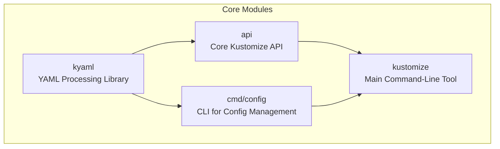
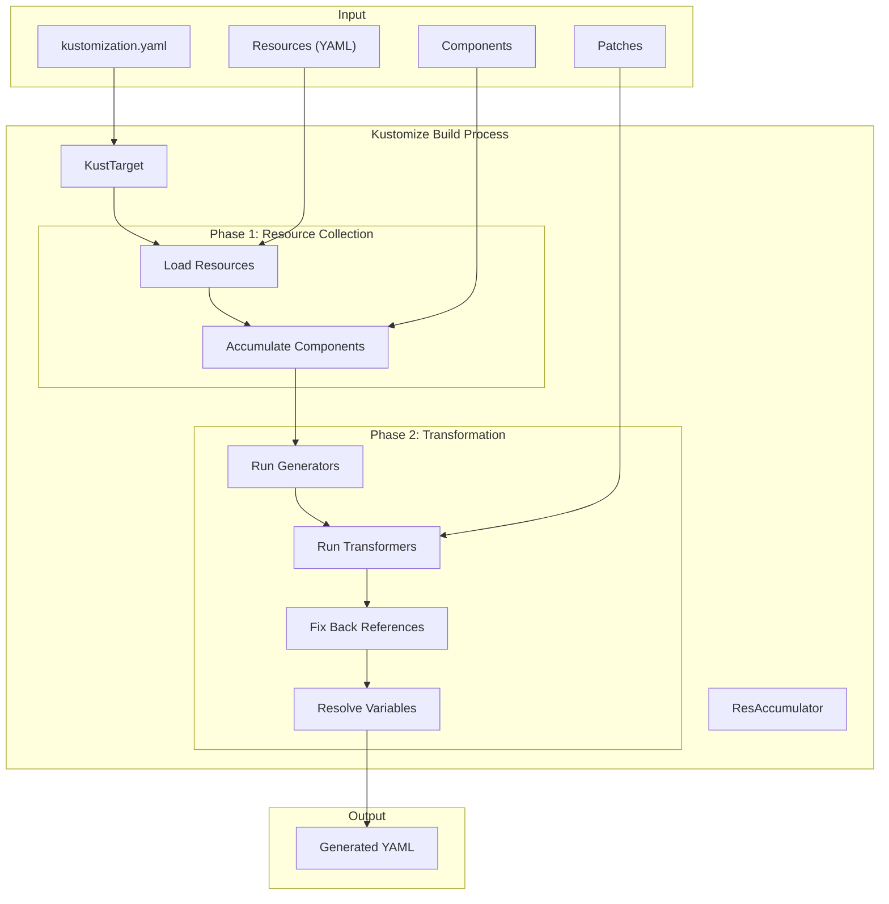
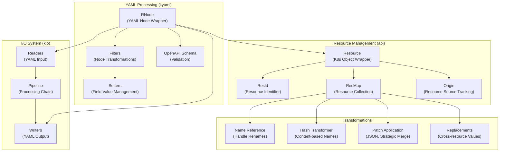
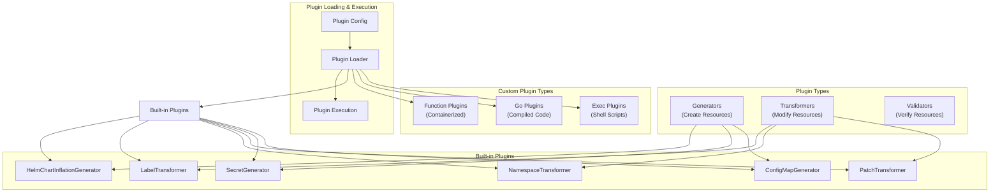

> Kustomize 是 Kubernetes 原生的声明式配置管理工具，支持多环境分层、配置复用与灵活定制，极大提升了集群配置的可维护性和一致性。本文系统梳理其架构、核心功能、实践用法与最佳实践。

## Kustomize 简介

[Kustomize](https://kustomize.io/) 是专为 Kubernetes 设计的声明式配置管理工具，允许用户通过分层和声明式方式定制和管理应用程序配置，无需直接修改原始清单文件。Kustomize 已集成到 kubectl，成为 Kubernetes 原生配置管理方案。

## 核心模块结构

Kustomize 由多个核心模块协同组成，支撑其灵活的配置管理能力。




{width=1920 height=596}

- **kyaml**：低级 YAML 处理库，提供解析、操作和输出 YAML 文档的基础能力
- **api**：核心业务逻辑，负责资源转换与生成
- **cmd/config**：基于 kyaml 的资源配置管理 CLI
- **kustomize**：主命令行工具，整合所有功能

## Kustomize 核心功能

Kustomize 提供多种声明式配置管理能力，适用于复杂的 Kubernetes 应用场景。

### 配置合并与分层管理

Kustomize 采用基础配置（base）和覆盖配置（overlay）的分层架构：

- **基础配置**：应用的通用资源定义
- **覆盖配置**：针对特定环境或需求的定制，支持修改、添加或删除基础内容

这种分层方式实现了配置继承与灵活定制，提升了管理效率。

### 声明式配置与复用

Kustomize 使用 YAML 格式的 `kustomization.yaml` 文件描述定制规则，支持：

- 资源引用与组合
- 名称前后缀统一管理
- 标签与注释批量添加
- 环境变量与配置映射替换
- 镜像标签动态修改

通过组件与补丁（patches），实现配置的复用与跨项目共享，降低维护成本。

### 多环境配置管理

Kustomize 天然支持多环境部署，可为开发、测试、生产等环境创建专属覆盖配置，实现一套基础配置适配多环境。

### 关键特性

- 无模板定制：无需模板语言即可修改清单
- 基于覆盖的配置：通过补丁实现变体
- 资源生成：自动生成 ConfigMaps、Secrets
- 资源转换：内置或自定义转换器
- 插件系统：支持多种插件扩展
- 变量替换：运行时数据注入

## 实践示例

以下示例展示如何用 Kustomize 管理名为 "webapp" 的应用配置。

### 基础配置结构

首先定义基础配置目录结构：

```text
base/
├── kustomization.yaml
├── deployment.yaml
├── service.yaml
└── configmap.yaml
```

**base/kustomization.yaml** 示例：

```yaml
apiVersion: kustomize.config.k8s.io/v1beta1
kind: Kustomization

resources:
- deployment.yaml
- service.yaml
- configmap.yaml

commonLabels:
  app: webapp
```

### 环境特定配置

为不同环境创建覆盖配置：

```text
overlays/
├── dev/
│   ├── kustomization.yaml
│   └── replica-patch.yaml
└── prod/
    ├── kustomization.yaml
    ├── replica-patch.yaml
    └── resource-limits.yaml
```

**overlays/dev/kustomization.yaml** 示例：

```yaml
apiVersion: kustomize.config.k8s.io/v1beta1
kind: Kustomization

namespace: webapp-dev

resources:
- ../../base

patchesStrategicMerge:
- replica-patch.yaml

images:
- name: webapp
  newTag: dev-latest
```

**overlays/prod/kustomization.yaml** 示例：

```yaml
apiVersion: kustomize.config.k8s.io/v1beta1
kind: Kustomization

namespace: webapp-prod

resources:
- ../../base

patchesStrategicMerge:
- replica-patch.yaml
- resource-limits.yaml

images:
- name: webapp
  newTag: v1.2.3

replicas:
- name: webapp-deployment
  count: 3
```

## 工作流与核心概念

Kustomize 遵循构建流程，将输入资源转换为定制输出。下图展示了其主要流程：




{width=1920 height=2690}

### 核心概念说明

- **Base**：原始未修改的通用配置
- **Overlays**：为特定环境定制的层
- **Resources**：Kubernetes YAML 对象
- **Generators**：如 ConfigMaps 生成器
- **Transformers**：如标签、命名等转换器
- **Kustomization File**：声明资源与定制规则
- **Components**：可重用的配置单元

## 资源处理与 YAML 操作

Kustomize 提供复杂的资源处理与 YAML 操作能力。下图展示其主要处理流程：




{width=2238 height=894}

主要组件说明：

- **YAML 处理 (kyaml)**：RNode 为核心数据结构，支持节点级操作
- **资源管理 (api)**：Resource/ResMap 组织资源集合
- **转换**：补丁、名称引用、哈希命名等
- **I/O 系统 (kio)**：YAML 输入输出与流水线处理

## 插件系统

Kustomize 支持多种插件类型，扩展资源生成与转换能力。




{width=3143 height=831}

插件类型包括：

- **Generators**：如 ConfigMapGenerator、SecretGenerator
- **Transformers**：如 PatchTransformer、NamespaceTransformer
- **Validators**：资源校验插件
- **实现方式**：内置、Exec（Shell）、Go、Function（容器化）

## 与 kubectl 集成使用

自 Kubernetes 1.14 起，Kustomize 已内置于 kubectl，提供原生配置管理能力。kubectl 内置 Kustomize 版本随 Kubernetes 版本变化。



| Kubectl 版本 | Kustomize 版本 |
| ------------ | -------------- |
| < v1.14      | n/a            |
| v1.14-v1.20  | v2.0.3         |
| v1.21        | v4.0.5         |
| v1.22        | v4.2.0         |
| v1.23        | v4.4.1         |
| v1.24        | v4.5.4         |
| v1.25        | v4.5.7         |
| v1.26        | v4.5.7         |
| v1.27        | v5.0.1         |
| v1.31        | v5.4.2         |



> 可通过 `kubectl version --client` 查看当前 kubectl 内置的 Kustomize 版本。

### 常用命令

- **直接应用配置**：

  ```bash
  kubectl apply -k overlays/dev
  ```

- **预览生成的清单**：

  ```bash
  kubectl kustomize overlays/prod
  ```

- **查看配置差异**：

  ```bash
  kubectl diff -k overlays/prod
  ```

- **删除应用的资源**：

  ```bash
  kubectl delete -k overlays/dev
  ```

### 高级功能

- **配置验证**：

  ```bash
  kubectl kustomize overlays/prod --enable-alpha-plugins
  kubectl kustomize overlays/prod | kubectl apply --dry-run=client -f -
  ```

- **CI/CD 集成**：

  ```bash
  kubectl kustomize overlays/prod > final-manifest.yaml
  kubectl apply -f final-manifest.yaml
  ```

## 使用示例

### 基本用法

一个简单的 kustomization 文件如下：

```yaml
apiVersion: kustomize.config.k8s.io/v1beta1
kind: Kustomization
resources:
  - deployment.yaml
  - service.yaml
labels:
- includeSelectors: true
  pairs:
    app: myapp
```

生成定制 YAML：

```bash
kustomize build /path/to/kustomization/directory
```

或使用 kubectl：

```bash
kubectl kustomize /path/to/kustomization/directory
kubectl apply -k /path/to/kustomization/directory
```

### 使用 Overlays

多环境配置目录结构示例：

```text
~/someApp/
├── base/
│   ├── deployment.yaml
│   ├── kustomization.yaml
│   └── service.yaml
└── overlays/
    ├── development/
    │   ├── cpu_count.yaml
    │   ├── kustomization.yaml
    │   └── replica_count.yaml
    └── production/
        ├── cpu_count.yaml
        ├── kustomization.yaml
        └── replica_count.yaml
```

构建特定环境覆盖：

```bash
kustomize build ~/someApp/overlays/production
```

## 最佳实践

- 目录结构规范，区分 base 与 overlays
- 配置文件纳入版本控制
- 部署前验证生成配置
- 复杂定制需补充说明文档
- 避免硬编码敏感信息

通过 Kustomize，可实现 Kubernetes 配置的标准化管理，提升可维护性与部署一致性。

## 总结

Kustomize 作为 Kubernetes 原生配置管理工具，凭借分层架构、声明式定制与强大插件系统，极大提升了集群配置的灵活性和可维护性。合理运用 Kustomize 能有效支撑多环境、多团队的高效协作与持续交付。

## 参考文献

1. [Kustomize 官方文档 - kustomize.io](https://kustomize.io/)
2. [Kubernetes 官方文档 - kubernetes.io](https://kubernetes.io/zh-cn/docs/tasks/manage-kubernetes-objects/kustomization/)
