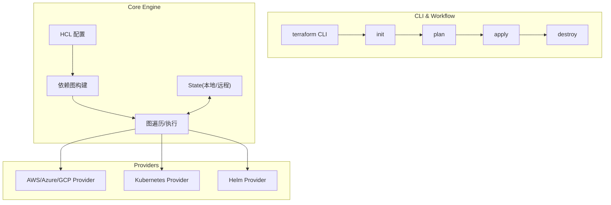
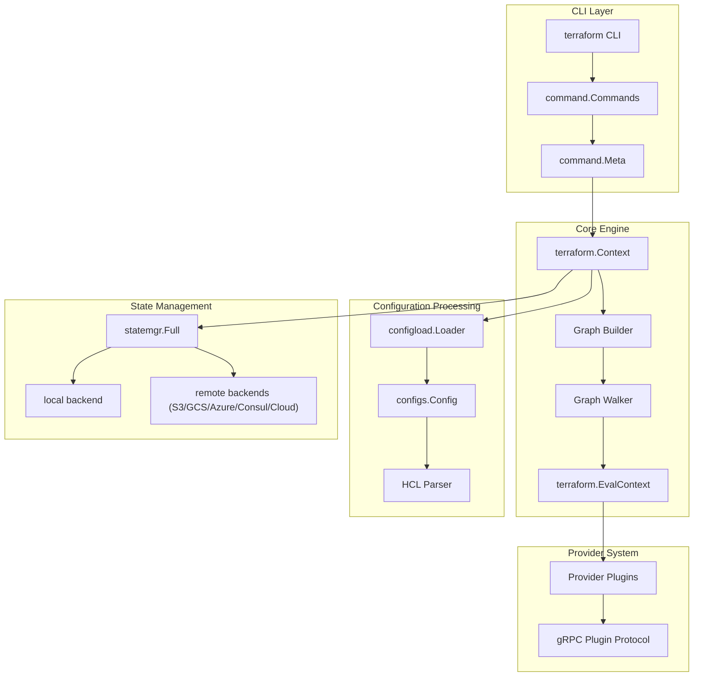
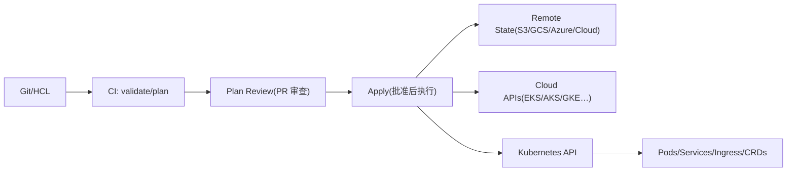
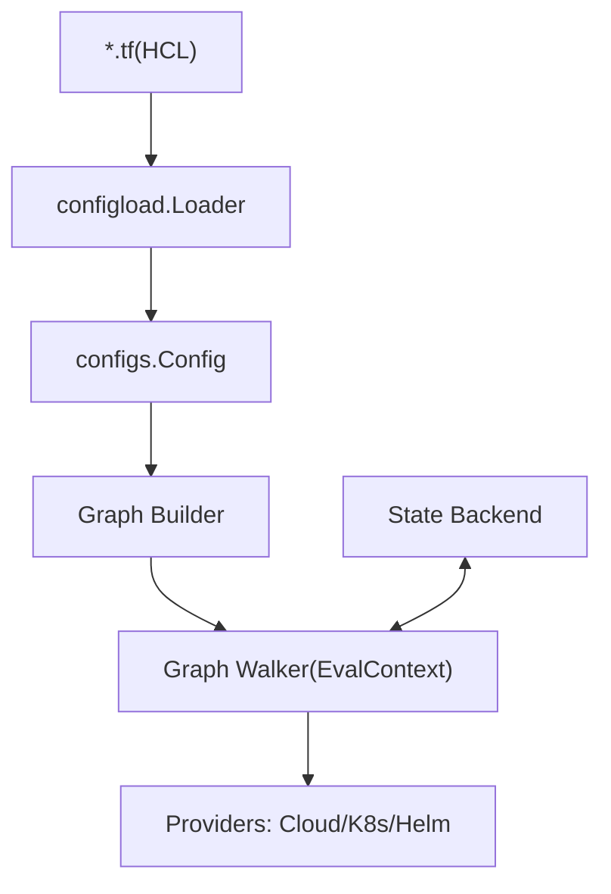
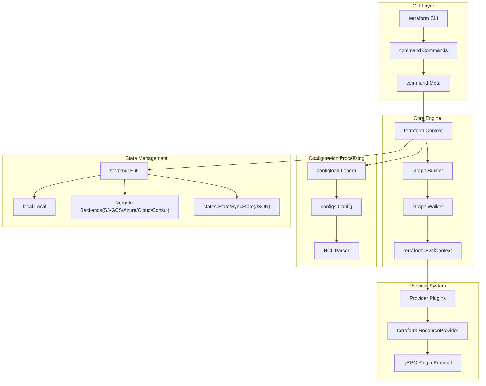

> Terraform 作为主流 IaC 工具，已成为 Kubernetes 集群与平台组件自动化管理的事实标准。通过声明式配置、状态管理和丰富 Provider 生态，实现从底座到应用的全生命周期基础设施即代码。

## Terraform 简介与核心价值

Terraform 通过声明式 HCL 配置描述基础设施，具备如下优势：

- **基础设施即代码（IaC）**：可版本化、审计、复用，提升协作效率。
- **执行计划（Plan）**：变更前可审查，降低误操作风险。
- **依赖图与并发**：自动分析资源依赖，提升执行效率与安全性。
- **状态管理**：所有资源状态统一记录，支持回滚与漂移检测。

对于 Kubernetes 用户，Terraform 的最大价值在于：**一套代码统一管理云上集群、平台组件与业务应用，且具备强大的状态追踪与审计能力**。

## 核心原理与架构

Terraform 的架构分为 CLI 工作流、核心引擎和 Provider 三大部分。下图展示了用户视角下的主流程。




{width=2091 height=860}

CLI 工作流包括 `init → plan → apply → destroy`，核心引擎将 HCL 配置解析为依赖图并有序执行，所有资源状态存储于 State，Provider 负责与各平台 API 交互。

进阶用户可参考下图理解内部模块关系，便于源码查阅与调优。




{width=1920 height=2606}

## Kubernetes 场景下的两大应用路径

在 Kubernetes 领域，Terraform 主要有两种典型应用路径：

### 路径 A：创建和管理 Kubernetes 集群

- 通过云 Provider（如 aws、azurerm、google）及官方/社区模块创建 EKS/AKS/GKE 等集群。
- 输出 kubeconfig/集群连接信息，供后续 K8s 与 Helm Provider 使用。

### 路径 B：在已有集群上管理平台与应用

- 使用 Kubernetes Provider 管理原生 K8s 资源（如 ConfigMap、Deployment、Ingress 等）。
- 使用 Helm Provider 管理 Helm Chart（平台组件、中间件等）。
- 实现平台与业务应用的统一代码管理和生命周期控制。

## 端到端 IaC 实践示例

推荐采用模块化分层结构，便于团队协作和职责清晰。

```text
live/
  prod/
    networking/     # VPC/VNet/Subnet/Route…
    cluster/        # EKS/AKS/GKE
    platform/       # Ingress/Nginx, Prometheus, CSI, CNI, cert-manager…
    apps/           # 业务应用 (Helm Charts & K8s 原生资源)
```

### 创建 EKS 集群（示例）

```hcl
# live/prod/cluster/main.tf
terraform {
  required_version = ">= 1.6.0"
  required_providers {
    aws = { source = "hashicorp/aws", version = "~> 5.0" }
  }
  backend "s3" {
    bucket = "iac-prod-tfstate"
    key    = "eks/terraform.tfstate"
    region = "ap-northeast-1"
    dynamodb_table = "iac-state-lock"
  }
}

provider "aws" {
  region = "ap-northeast-1"
}

module "vpc" {
  source  = "terraform-aws-modules/vpc/aws"
  version = "~> 5.0"
  name    = "prod"
  cidr    = "10.0.0.0/16"
  azs             = ["ap-northeast-1a","ap-northeast-1c"]
  public_subnets  = ["10.0.0.0/20","10.0.16.0/20"]
  private_subnets = ["10.0.32.0/20","10.0.48.0/20"]
}

module "eks" {
  source  = "terraform-aws-modules/eks/aws"
  version = "~> 20.0"
  cluster_name    = "prod-eks"
  cluster_version = "1.30"
  subnet_ids      = module.vpc.private_subnets
  vpc_id          = module.vpc.vpc_id

  eks_managed_node_groups = {
    default = {
      min_size     = 2
      max_size     = 6
      desired_size = 3
      instance_types = ["m6i.large"]
    }
  }
}

output "kubeconfig" {
  value     = module.eks.kubeconfig
  sensitive = true
}
```

### 连接集群并安装平台组件

```hcl
# live/prod/platform/providers.tf
terraform {
  required_providers {
    kubernetes = { source = "hashicorp/kubernetes", version = "~> 2.33" }
    helm       = { source = "hashicorp/helm",       version = "~> 2.13" }
  }
  backend "s3" {
    bucket = "iac-prod-tfstate"
    key    = "platform/terraform.tfstate"
    region = "ap-northeast-1"
    dynamodb_table = "iac-state-lock"
  }
}

data "terraform_remote_state" "cluster" {
  backend = "s3"
  config = {
    bucket = "iac-prod-tfstate"
    key    = "eks/terraform.tfstate"
    region = "ap-northeast-1"
  }
}

provider "kubernetes" {
  host                   = jsondecode(data.terraform_remote_state.cluster.outputs.kubeconfig).clusters[0].cluster.server
  cluster_ca_certificate = base64decode(jsondecode(data.terraform_remote_state.cluster.outputs.kubeconfig).clusters[0].cluster["certificate-authority-data"])
  token                  = jsondecode(data.terraform_remote_state.cluster.outputs.kubeconfig).users[0].user.token
}

provider "helm" {
  kubernetes {
    host                   = jsondecode(data.terraform_remote_state.cluster.outputs.kubeconfig).clusters[0].cluster.server
    cluster_ca_certificate = base64decode(jsondecode(data.terraform_remote_state.cluster.outputs.kubeconfig).clusters[0].cluster["certificate-authority-data"])
    token                  = jsondecode(data.terraform_remote_state.cluster.outputs.kubeconfig).users[0].user.token
  }
}
```

#### 安装 NGINX Ingress（Helm 示例）

```hcl
resource "helm_release" "ingress_nginx" {
  name       = "ingress-nginx"
  repository = "https://kubernetes.github.io/ingress-nginx"
  chart      = "ingress-nginx"
  namespace  = "ingress-nginx"
  create_namespace = true

  values = [
    yamlencode({
      controller = {
        replicaCount = 2
        service = { type = "LoadBalancer" }
      }
    })
  ]
}
```

#### 发布原生 K8s 资源（ConfigMap 示例）

```hcl
resource "kubernetes_config_map" "demo" {
  metadata {
    name      = "app-config"
    namespace = "default"
    labels = { app = "demo" }
  }
  data = {
    APP_ENV = "prod"
  }
}
```

## IaC 工作流与核心机制

下图展示了从代码到集群的 IaC 工作流。




{width=1920 height=406}

Terraform 的核心机制包括配置加载、依赖图构建、状态管理与 Provider 调用。




{width=1920 height=3706}

## Kubernetes 场景最佳实践

为保障生产环境的安全性、可维护性和协作效率，建议遵循以下最佳实践：

- **分层与模块化**：networking → cluster → platform → apps，独立 state，职责清晰。
- **远程状态与锁**：使用远程 state（S3/GCS/Azure/Consul/Cloud）并启用锁，防止并发冲突。
- **版本与输入管理**：锁定 Terraform/Provider/Module 版本，敏感信息用密钥管理。
- **所有权边界**：同一资源只由 Terraform 或外部系统（如 Argo CD、kubectl）之一管理。
- **CRDs 顺序**：先安装 CRD，再部署 CR，或由同一 Helm release 管理。
- **漂移检测与导入**：定期 plan 检查漂移，必要时使用 terraform import。
- **并发与依赖**：合理使用 depends_on、for_each、count，避免隐式依赖。
- **生产化 CI/CD**：PR 阶段执行 fmt、validate、tflint、plan，受控 runner 执行 apply。

## 与 Helm/Kustomize/GitOps 的关系

Terraform 与 Helm、Kustomize、GitOps 并非二选一，而是各有侧重、互为补充。下表对比各工具关注点与最佳实践。



| 维度     | Terraform                        | Helm             | Kustomize  | GitOps(Argo CD/Flux)                        |
|----------|----------------------------------|------------------|------------|---------------------------------------------|
| 关注点   | 跨云/集群/应用统一 IaC & 状态    | 应用打包与参数化 | 资源差异化 | 基于 Git 的声明式持续同步                   |
| State    | 有（tfstate）                    | 无               | 无         | 以 Git 为源，集群状态对齐 Git              |
| 最佳姿势 | 集群/平台基座/稳定业务           | 应用层快速分发   | 简洁变更   | 与 Terraform 互补，明确所有权边界           |



实际生产中，常见组合为：**Terraform 管理底座与平台组件，GitOps 管理上层应用**，或由 Terraform 统一管理 Helm release，关键是明确所有权边界。

## 常见问题与规避建议

- 控制器自动回填字段导致反复 diff：适度 ignore_changes（如 annotations/labels/managedFields）。
- CRDs 未就绪即应用 CR：通过 Helm wait/timeout 或流水线分步 apply。
- 禁止用 kubectl edit/apply 修改 Terraform 管理的对象。
- 生产环境必须配置远程 state 与锁。
- 固定 Provider/Module 版本，分支灰度升级。

## Terraform Core 系统视图（进阶）

下图便于深入理解 Terraform 内部原理与源码结构。




{width=1920 height=2153}

## 总结

Terraform 作为统一的 IaC 语言与引擎，既能管理云上底座（网络、集群），也能管理 Kubernetes 平台与应用（Helm/K8s Provider）。在 Kubernetes 场景下，推荐采用分层、模块化、远程状态、锁定版本、CI 审查与受控 apply 等最佳实践。与 Helm、Kustomize、GitOps 等工具应明确所有权边界，组合使用以发挥各自优势。落地重点包括所有权划分、CRDs 顺序、漂移检测、回填字段处理和生产化流水线建设。

## 参考文献

1. [Terraform 官方文档 - terraform.io](https://www.terraform.io/)
2. [Terraform AWS Modules - terraform-aws-modules.github.io](https://terraform-aws-modules.github.io/)
3. [Terraform Kubernetes Provider - registry.terraform.io](https://registry.terraform.io/providers/hashicorp/kubernetes/latest/docs)
4. [Argo CD 官方文档 - argoproj.github.io](https://argo-cd.readthedocs.io/)
5. [Helm 官方文档 - helm.sh](https://helm.sh/)
