本文总结了在 Kubernetes 中部署有状态应用的最佳实践，涵盖 StatefulSet 与 Operator 的选择、存储与网络设计、滚动升级、备份恢复等关键环节，并通过架构图和流程图直观展示核心流程，帮助技术团队实现高可用、易运维的有状态服务。

## 何时使用 StatefulSet，何时使用 Operator

在 Kubernetes 中部署有状态应用时，需根据实际需求选择合适的方案。以下内容介绍两种主流方式的适用场景及优势。

- 使用原生 StatefulSet：
  - 应用需要稳定的网络标识（stable DNS / hostname）和 per‑Pod 持久化存储。
  - 应用本身能通过启动脚本完成初始化（基于 hostname 的序号、配置生成等）。
  - 团队希望保持尽可能少的外部依赖，并能自己管理升级和备份流程。

- 使用 Operator（推荐大多数生产场景）：
  - 集群管理、备份/恢复、配置变更和安全升级需要自动化（例如 Kafka、Zookeeper、Etcd、Postgres 等）。
  - Operator 提供自定义资源、声明式运维、健康管理、自动伸缩/横向扩缩容规则以及更健壮的滚动更新策略。
  - 推荐：Kafka -> Strimzi / Confluent operator；Zookeeper -> Zookeeper operator；Postgres -> Zalando / CrunchyData operator。

## 核心概念与关键要点

在实际部署过程中，需关注以下核心概念与关键技术要点，以保障有状态应用的稳定性和可维护性。

- 稳定标识：Headless Service + StatefulSet 提供稳定 DNS（pod-0.svc、pod-1.svc）。
- 存储：使用 VolumeClaimTemplates 为每个 Pod 提供独立 PVC；首选支持拓扑感知与动态绑定的 StorageClass（volumeBindingMode: WaitForFirstConsumer）。
- 启动与探针：使用 startupProbe 处理长启动时间，readinessProbe 控制流量导入，livenessProbe 检测僵死进程；结合 readiness gates 避免流量短路。
- 更新策略：updateStrategy 使用 RollingUpdate，并配合 partition 实现分阶段升级；podManagementPolicy 根据一致性需求选 OrderedReady（会序列化创建/删除）或 Parallel。
- 优雅终止：设置 terminationGracePeriodSeconds 与 lifecycle.preStop 做应用级优雅下线（flush、leader 转移等）。
- PodDisruptionBudget（PDB）：与 rolling updates、节点维护策略配合，保证最小可用实例。
- 拓扑感知：使用 PodAntiAffinity / topologySpreadConstraints 与 StorageClass 的拓扑绑定，保证副本分布在不同可用区/节点池。
- 备份与快照：使用 CSI 快照（VolumeSnapshot）与定期备份（对象存储），并演练恢复流程。
- 安全与多租户：使用 PSP/PodSecurity（或 OPA Gatekeeper 策略）、NetworkPolicy、最小权限 SecurityContext、只读根文件系统等。



{width=1925 height=826}

## 推荐的部署流程（高层）

有状态应用的标准部署流程如下，建议团队严格遵循以提升系统可靠性和可维护性。

1. 选择方案：评估是否使用 Operator；若使用 Operator，优先部署并使用其 CR（自定义资源）。
2. 设计 StorageClass：确保支持 WaitForFirstConsumer、拓扑约束、快照与扩容能力。
3. 设计 Service：Headless Service 提供 DNS；单独配置面向外部的访问方式（Ingress/Gateway/LoadBalancer）。
4. 编写 StatefulSet：
   - 指定 podManagementPolicy、updateStrategy、volumeClaimTemplates。
   - 添加 startupProbe、readinessProbe、livenessProbe，以及 preStop 钩子。
   - 配置资源 requests/limits、affinity、topologySpreadConstraints、PDB。
5. 测试：启动、扩缩容、滚动升级、故障恢复、备份恢复演练。
6. 监控与告警：Exporter、Prometheus、AlertManager、日志聚合。
7. 持续演练：升级演练、灾难恢复（DR）流程验证。



{width=1920 height=6902}

## 精简示例：Headless Service + StatefulSet（最佳实践要素）

以下为通用模板示例，生产环境建议结合 Operator 或根据实际应用补充初始化脚本与优雅停机逻辑。

```yaml
# 注意：仅为示例，生产请根据实际镜像与 StorageClass 调整
apiVersion: v1
kind: Service
metadata:
  name: example-svc
  labels:
    app: example
spec:
  clusterIP: None           # Headless Service 提供稳定 DNS
  selector:
    app: example
  ports:
  - port: 9092
    name: app-port
---
apiVersion: apps/v1
kind: StatefulSet
metadata:
  name: example
spec:
  serviceName: example-svc
  replicas: 3
  podManagementPolicy: "OrderedReady"  # 严格顺序启动与删除（需要强一致性的应用）
  selector:
    matchLabels:
      app: example
  updateStrategy:
    type: RollingUpdate
    rollingUpdate:
      partition: 0   # 可通过变更 partition 实现分阶段滚动更新
  template:
    metadata:
      labels:
        app: example
    spec:
      terminationGracePeriodSeconds: 120
      # 优先将副本分散到不同节点/zone
      topologySpreadConstraints:
        - maxSkew: 1
          topologyKey: topology.kubernetes.io/zone
          whenUnsatisfiable: DoNotSchedule
          labelSelector:
            matchLabels:
              app: example
      affinity:
        podAntiAffinity:
          requiredDuringSchedulingIgnoredDuringExecution:
            - labelSelector:
                matchLabels:
                  app: example
              topologyKey: kubernetes.io/hostname
      containers:
        - name: app
          image: your-registry/example:stable-2025-01
          imagePullPolicy: IfNotPresent
          resources:
            requests:
              cpu: "500m"
              memory: "1Gi"
            limits:
              cpu: "1"
              memory: "2Gi"
          ports:
            - containerPort: 9092
              name: app
          env:
            - name: POD_NAME
              valueFrom:
                fieldRef:
                  fieldPath: metadata.name
          lifecycle:
            preStop:
              exec:
                command: ["/bin/sh", "-c", "your-graceful-shutdown.sh || sleep 30"]
          # 长启动应用使用 startupProbe，避免 readiness 在启动前就失败
          startupProbe:
            exec:
              command: ["/bin/sh", "-c", "check-startup.sh"]
            failureThreshold: 60
            periodSeconds: 10
          readinessProbe:
            exec:
              command: ["/bin/sh", "-c", "check-ready.sh"]
            initialDelaySeconds: 5
            periodSeconds: 10
          livenessProbe:
            exec:
              command: ["/bin/sh", "-c", "check-live.sh"]
            initialDelaySeconds: 60
            periodSeconds: 30
          volumeMounts:
            - name: data
              mountPath: /var/lib/example
      # 可选 initContainer：用于基于 hostname 生成配置
      initContainers:
        - name: init-config
          image: busybox
          command:
            - /bin/sh
            - -c
            - |
              HOST=$(hostname -s)
              # 从主机名解析 ordinal 并生成配置（示例）
              if echo "$HOST" | grep -q '\-'; then
                ORD=${HOST##*-}
                echo "ordinal=$ORD" > /tmp/ordinal
              fi
          volumeMounts:
            - name: data
              mountPath: /tmp
  volumeClaimTemplates:
    - metadata:
        name: data
      spec:
        accessModes: ["ReadWriteOnce"]
        storageClassName: fast-ssd   # 使用支持 WaitForFirstConsumer 的 StorageClass
        resources:
          requests:
            storage: 50Gi
```


{width=1920 height=760}

## 生产建议清单（要点速查）

在实际生产环境中，建议参考以下清单，确保有状态应用的高可用与可维护性。

- StorageClass：使用 WaitForFirstConsumer，确保 PV 与 Pod 拟调度拓扑一致。
- Operator：优先选择成熟 Operator 来管理复杂状态应用（Kafka、Zookeeper、Etcd、Postgres 等）。
- Probes：使用 startupProbe + readinessProbe + livenessProbe 组合，preStop 做优雅下线。
- 更新策略：使用 partitioned rolling update；在变更 partition 前测试变更流程。
- PDB：与业务可用性要求对应设置 minAvailable 或 maxUnavailable。
- 备份：CSI snapshot + 对象存储定期备份；确保恢复演练已验证。
- 性能与资源：为磁盘、IOPS、网络设置合理 request/limit，并用 QoS class 保障关键 Pod。
- 安全：运行非 root、只读根文件系统、最小权限的 ServiceAccount。
- 拓扑：使用 PodAntiAffinity + topologySpreadConstraints + 拓扑感知 StorageClass 以防单点故障。
- 日志与监控：部署 Exporter、Prometheus、AlertManager、日志聚合与可观测性面板。
- 测试：定期演练滚动升级、节点故障、PVC 恢复与跨 AZ 灾难恢复（DR）。

## 与历史实践的差异

近年来，Kubernetes 有状态应用的运维模式发生了显著变化，主要体现在以下方面：

- 更广泛采用 Operator 模式以减少人为错误与手动运维。
- StorageClass 必须支持拓扑感知与动态绑定以避免数据不在同一可用区的问题。
- 强制演练备份与恢复流程，CI/CD 中把迁移/升级流程作为验证的一部分。
- 使用 startupProbe 已成为处理慢启动有状态服务的常规手段。
- 资源管理与 QoS 策略在多租户环境中变得更关键。

## 总结

StatefulSet 作为 Kubernetes 提供稳定网络标识与 per‑Pod 存储的基础设施工具，依然适用于部分场景。但在大多数生产环境中，建议结合成熟的 Operator 使用，以获得更强的可用性、可观测性与自动化运维能力。设计时需从存储拓扑、探针与优雅停机、更新策略、备份恢复与演练等多个维度综合考虑，才能在真实生产环境中安全运行有状态服务。
