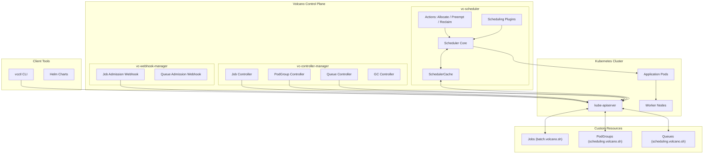
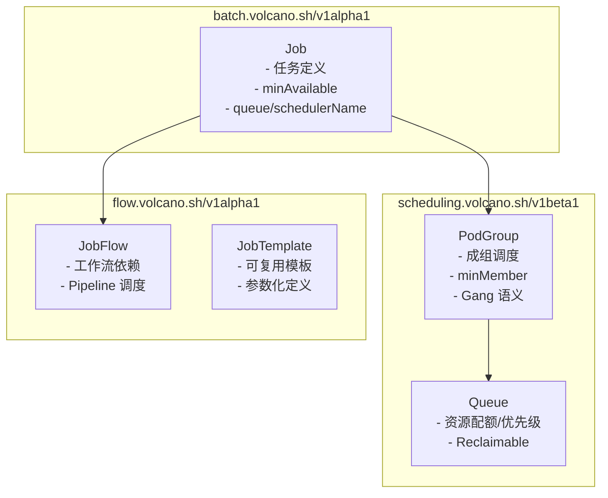
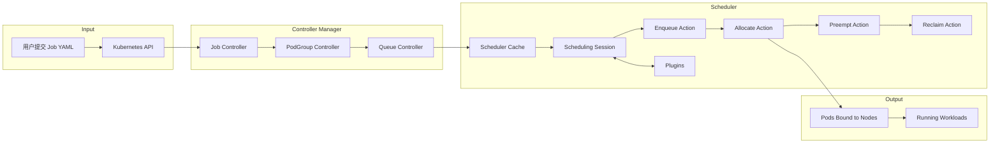
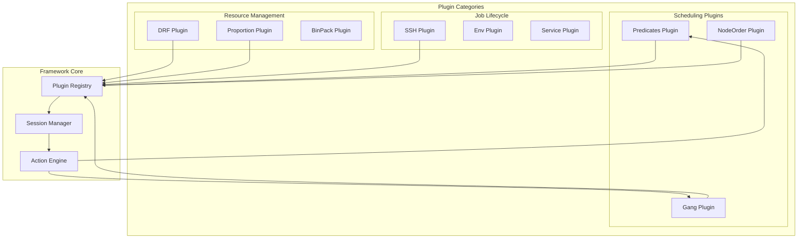

> Volcano 是 Kubernetes 生态中专为批处理和高性能计算（HPC）场景设计的调度器扩展，支持 Gang 调度、资源公平分配和多种插件机制，极大提升了集群在 AI、科研和大数据领域的调度能力。

## 项目背景与设计目标

Kubernetes 默认调度器主要面向服务型负载，存在以下局限：

- 每个 Pod 独立调度，缺乏任务组（JobGroup）概念；
- 不支持 Gang Scheduling（成组调度）和资源公平共享（Fair Share）。

Volcano 通过自定义资源（CRD）和可插拔调度插件，补齐了这些短板，目标是为 AI/ML 分布式训练、HPC 批处理、大数据计算和科研仿真等场景提供原生支持。

## 架构总览

Volcano 控制平面由多个组件构成，负责批量任务调度、资源分配与生命周期管理。下图展示了主要架构组件及其交互关系。




{width=3999 height=1239}



| 组件                  | 作用                                  |
|-----------------------|---------------------------------------|
| vc-scheduler          | 主调度器，负责 Pod 分配、抢占、回收等动作 |
| vc-controller-manager | 管理 CRD 生命周期（Job、Queue、PodGroup） |
| vc-webhook-manager    | Admission 校验与变更                  |
| vc-agent              | 节点级管理（部分版本可选）            |



## 自定义资源（CRD）模型

Volcano 通过自定义资源扩展了 Kubernetes 的原生对象模型。下图展示了各 CRD 之间的关系。




{width=1920 height=1875}



| 资源类型    | 功能说明                             |
|-------------|--------------------------------------|
| Job         | 定义批量任务、任务组、资源需求       |
| PodGroup    | 实现 Gang Scheduling，保证任务组原子调度 |
| Queue       | 定义资源配额与优先级                 |
| JobFlow     | 支持任务依赖与有向执行图（DAG）      |
| JobTemplate | 模板化任务定义，方便重用             |



## 调度流程与执行机制

Volcano 的调度流程分为多个阶段，确保批量任务高效分配和资源利用。下图展示了调度循环的主要流程。




{width=3662 height=521}

调度循环（Scheduling Cycle）包括：

- Enqueue：将待调度的 Job 加入队列
- Allocate：根据 Queue 配额分配资源
- Preempt：抢占低优先级任务
- Reclaim：回收闲置资源
- Bind：分配 Pod 至节点

## 插件体系（Plugin System）

Volcano 的插件系统高度可扩展，支持在调度周期多个阶段注入自定义逻辑。下图展示了插件分类及其与核心框架的关系。




{width=2599 height=1097}



| 插件         | 功能说明             |
|--------------|----------------------|
| Gang         | 实现任务组全量调度   |
| DRF          | 多资源公平共享       |
| Proportion   | 队列配额分配         |
| Predicates   | 节点资源匹配         |
| NodeOrder    | 节点优先级排序       |
| BinPack      | 紧密打包，提升利用率 |
| Overcommit   | 超卖调度             |
| Topology     | NUMA / 网络拓扑感知  |



## 安装与使用

Volcano 支持 Helm 和原生 YAML 安装方式。安装后会在 volcano-system 命名空间创建核心组件。

### 通过 Helm 安装

```bash
helm repo add volcano-sh https://volcano-sh.github.io/helm-charts
helm install volcano volcano-sh/volcano -n volcano-system --create-namespace
```

### 使用原生 YAML 安装

```bash
kubectl apply -f https://raw.githubusercontent.com/volcano-sh/volcano/master/installer/volcano-development.yaml
```

安装后主要组件包括：

- volcano-scheduler
- volcano-controllers
- volcano-admission

## 典型使用场景

Volcano 适用于多种批处理和高性能计算场景。下表列举了典型应用框架及其调度特性。



| 场景           | 框架                      | 调度特性                 |
|----------------|---------------------------|--------------------------|
| AI 训练        | TensorFlow、PyTorch、Ray  | Gang 调度 + GPU 绑定     |
| 大数据计算     | Spark、Flink              | 队列隔离 + Fair Share    |
| HPC 仿真       | MPI、Horovod              | NUMA 拓扑 + 低延迟通信   |
| Bioinformatics | Cromwell、KubeGene        | 工作流依赖调度           |
| ML Pipeline    | Kubeflow、Argo            | JobFlow + 模板复用       |



> 使用时，只需在 Pod 或 Job 中指定 `schedulerName: volcano`，即可启用 Volcano 调度。

## 与原生 Kubernetes 的区别

下表对比了 Volcano 与 kube-scheduler 的主要差异。



| 对比维度     | kube-scheduler | Volcano                      |
|--------------|----------------|------------------------------|
| 调度粒度     | Pod            | Job / PodGroup               |
| 资源公平性   | 基于优先级     | 支持 DRF、比例调度           |
| 调度策略     | 简单优先级     | Gang、Backfill、Preemption   |
| CRD 支持     | 无             | Job / Queue / PodGroup       |
| 插件扩展     | 有限           | 完整可插拔插件系统           |
| 应用场景     | 长期服务       | 批处理 / HPC / AI 训练       |



## 总结

Volcano 让 Kubernetes 从“服务编排平台”进化为“通用计算平台”，特别适用于分布式训练、资源公平调度、异构硬件感知和大规模批量作业管理。结合 Argo、Kubeflow、Ray 等生态系统，Volcano 使 Kubernetes 成为统一的高性能计算基础设施。

## 参考文献

1. [Volcano 官方文档 - volcano.sh](https://volcano.sh/)
2. [Kubernetes 官方文档 - kubernetes.io](https://kubernetes.io/)
3. [Volcano GitHub 仓库 - github.com](https://github.com/volcano-sh/volcano)
