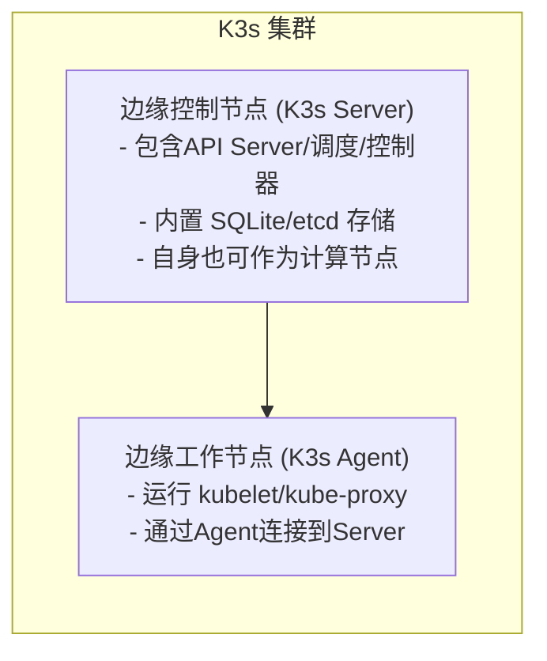
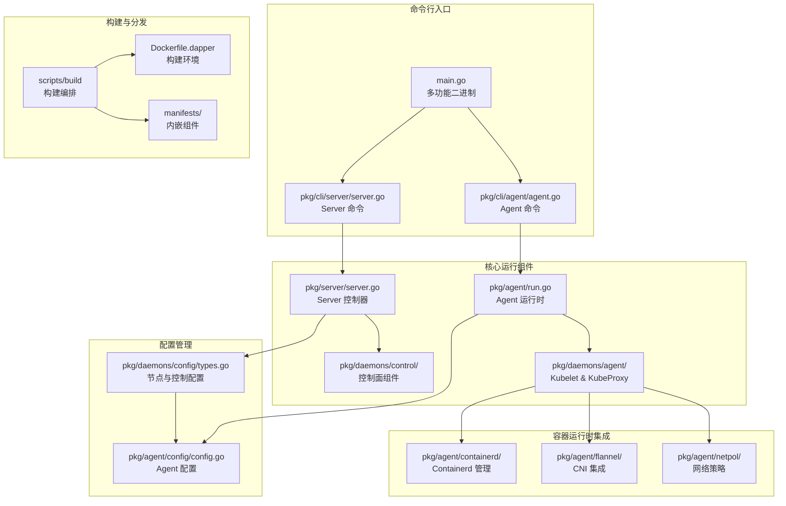
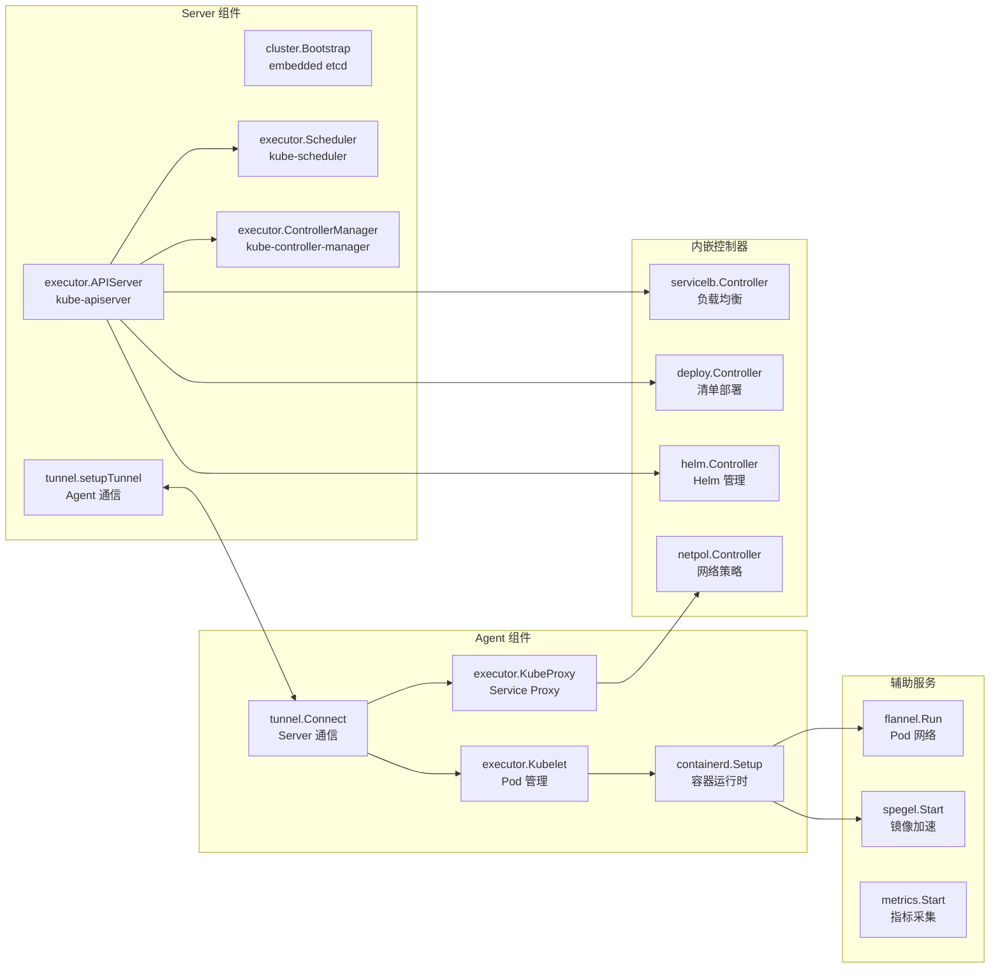
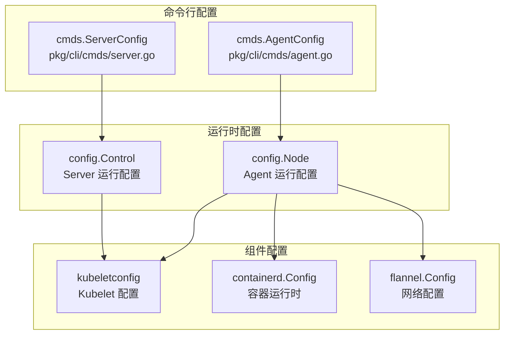

> 让 Kubernetes 变得轻盈灵活，是边缘计算普及的关键一步。

## 项目简介

[K3s](https://github.com/k3s-io/k3s) 是 Rancher Labs 开源的一个轻量级 Kubernetes 发行版（K3s, Lightweight Kubernetes Distribution），专为资源受限环境、边缘计算（Edge Computing）和物联网设备（IoT, Internet of Things）而设计。名字中的“K3s”取自“K8s”删去中间的 5 个字符，寓意对 Kubernetes 进行了裁剪优化（戏称为“五条减去”）。

K3s 于 2019 年 3 月发布，不久后成为首个加入 CNCF（Cloud Native Computing Foundation，云原生计算基金会）沙箱的 Kubernetes 发行版，目前已成长为全球用户量最大的轻量级 K8s 发行版之一。它完全兼容 Kubernetes API（通过 CNCF 认证），但对安装部署和运行时资源占用做了大幅简化，非常适合在边缘节点或小型设备上独立部署一个完整的 Kubernetes 集群。与强调云边协同的 KubeEdge、OpenYurt 不同，K3s 并不需要中心云控制平面，边缘节点自己就可以成为一个“小型集群”的控制主节点。它主要满足需要在单个边缘站点运行完整自治集群的需求，比如在农场、工厂分支等处独立运行 Kubernetes 服务。

## 高层架构与系统设计

K3s 采用 server-agent 架构，server 节点运行 Kubernetes 控制面组件，agent 节点运行 kubelet 和容器运行时。系统支持单节点（仅 server）、多 server 高可用（内嵌 etcd）、外部数据存储等多种模式。

下图展示了 K3s 的典型集群架构，帮助理解其在边缘场景下的部署方式：

{width=1920 height=2511}

K3s 的所有必要组件被打包为单个二进制文件，一个小于 100MB 的可执行文件即可启动一个 Kubernetes 集群，大幅降低部署复杂度和依赖。只需在一台节点上运行 `k3s server`，即可启动控制平面和轻量数据存储（默认 SQLite，也可选 etcd 或外部数据库），其它设备通过 `k3s agent` 加入集群。

## 系统源码与核心流程

K3s 的源码结构和组件交互流程如下图所示，有助于理解其轻量化实现原理：

{width=1920 height=1511}

## 组件交互与运行机制

下图展示了 K3s 各核心组件的交互流程，涵盖控制面、Agent、内嵌控制器和辅助服务：

{width=1920 height=1797}

## 二进制架构与配置流程

K3s 采用多功能二进制架构，单一可执行文件可根据调用方式充当不同组件。配置系统会合并命令行参数、环境变量和配置文件，生成 server 和 agent 的运行配置。

{width=1920 height=1661}

## 主要改进与组件特性

K3s 针对边缘和资源受限场景做了大量优化。下方列表对其关键改进和组件特性进行简要说明，帮助理解其轻量化设计思路。

- **轻量化内核**：K3s 去除了很多并非边缘必需的 Kubernetes 组件和插件。例如默认移除了内置的云供应商逻辑和不必要的存储驱动，将二进制大小压缩到约 50~100 MB，启动内存可低至 512MB。这使得在树莓派等小设备上也能顺畅运行 Kubernetes 集群。
- **内置必要插件**：为方便开箱即用，K3s 内置了一些常用的插件和功能，如 Containerd 容器运行时、Flannel CNI 网络插件（默认启用）、CoreDNS DNS 服务、Helm 简化工具、Traefik Ingress Controller（可选）等。用户不必额外安装这些基础组件，从而减少操作步骤，降低学习成本。
- **SQLite 数据库**：K3s 默认使用轻量级的 SQLite 数据库文件替代 etcd 作为集群数据存储。对于单节点或小型集群来说，SQLite 足够胜任且更易运维（不需要额外启动 etcd 服务）。在需要高可用时，K3s 也支持外接一个数据库（例如由多实例 etcd 或 MySQL/MariaDB 提供）作为存储后端。
- **简化安全配置**：K3s 自带了简化的启动程序，会自动生成和管理 TLS 证书、Kubeconfig 文件等复杂选项。用户执行安装脚本或二进制时，无需手动配置大量参数，即可得到一个可用的安全集群。
- **多架构支持**：K3s 原生支持 x86_64、ARM64、ARMv7 等处理器架构，并针对 ARM 平台进行了优化。这非常契合边缘场景下各种各样的硬件，满足在树莓派、物联网网关等 ARM 设备上运行 Kubernetes 的需求。
- **容易安装和升级**：Rancher 官方提供了一键安装脚本，用户只需执行一条命令即可在节点上安装 K3s。在升级方面，只需下载新版本二进制替换即可完成升级，过程相当简单。
- **多容器运行时支持**：K3s 支持 containerd（默认）、cri-dockerd 以及外部 CRI 实现，自动配置镜像仓库、快照和网络插件。
- **内嵌控制器**：如 ServiceLB（负载均衡）、Local Path Provisioner（本地存储）、Helm Controller（Helm Chart 部署）、Network Policy Controller（基于 Calico 的网络策略）等，开箱即用。
- **安全隧道通信**：Server 与 Agent 之间通过 WebSocket + 双向 TLS 实现安全通信，涵盖 API 请求、节点注册和证书分发。

## 适用场景

K3s 被广泛应用于需要独立小型 Kubernetes 集群的边缘和开发场景。下方举例说明其典型应用：

- 农业或工厂的边缘网关部署 K3s 来本地运行一系列应用（物联网数据采集、本地分析等），在网络隔离情况下仍可自主运作。
- 分支机构或零售店铺内部署 K3s 集群运行必要的服务（收银系统、本地缓存服务等），即使与总部断网也不影响店内业务。
- 科研与教育中，K3s 常用于在单机或实验板上搭建 Kubernetes 环境用于学习测试，因为其安装快、资源占用低。
- 在云端，K3s 也可用于 CI/CD 流水线中快速启动短生命周期的 Kubernetes 集群进行应用测试。

需要注意，K3s 本身不提供跨集群的统一控制能力，如果有大量分散的 K3s 边缘集群，通常需要借助上层的多集群管理工具（如 Rancher 或 KubeSphere 等）来集中管控。

## 关键特性

K3s 具备多项面向边缘和资源受限场景的核心能力，以下列表对其主要特性进行归纳：

- **超轻量 & 高性能**：K3s 以尽可能小的内存和 CPU 占用实现完整 Kubernetes，适合资源有限的边缘环境。其优化使得边缘部署 Kubernetes 的门槛大大降低，边缘设备上也能跑起成百个 Pod。
- **开箱即用**：K3s 默认打包了网络、存储、Ingress 等常用插件，部署简洁。用户无需繁琐配置，一条命令安装后即可获得一个功能完善的 Kubernetes 环境，对于现场无人值守部署也很有利。
- **标准兼容**：虽然轻量，但 K3s 并未偏离标准。它通过了 CNCF Kubernetes 一致性认证，支持标准 Kubernetes API 和 Kubectl/Helm 工具。这意味着对开发者来说，K3s 与普通 Kubernetes 使用体验几乎无差别，但运行成本更低。
- **适配边缘硬件**：内置对 ARM 等架构的支持优化，以及可选的 SQLite 存储，使其适配多种硬件形态和网络条件。无论是在高性能 x86 服务器还是微型 ARM 设备，都能稳定运行。
- **易于集成**：得益于单文件分发，K3s 易于嵌入到各类边缘方案中。例如很多物联网设备厂商将 K3s 预装于网关设备，实现即插即用的 Kubernetes 环境；也有第三方工具如 k3d 可以在桌面 Docker 环境中快速启动 K3s 用于测试。

## 总结

总之，K3s 通过极简的设计让“Kubernetes 无处不在（Kubernetes Everywhere）”成为可能。它为边缘计算提供了一个独立且自给自足的 Kubernetes 选择，与云端解耦，在需要时又可以与云原生生态（例如 Rancher 管理多集群）配合，构成灵活的边缘解决方案。
