> 云原生的力量，正在边缘与物联网场景全面释放。

## 项目简介

[KubeEdge](https://github.com/kubeedge/kubeedge) 是业界首个面向边缘场景、专为云边协同设计的云原生边缘计算框架。2018 年由华为开源，目前是 CNCF（Cloud Native Computing Foundation，云原生计算基金会）托管项目（2020 年晋级为孵化级别项目）。KubeEdge 在 Kubernetes 原生能力之上扩展了云端与边缘之间在应用、资源、数据和设备等方面的协同管理，实现了云、边、端的贯通管理。

KubeEdge 通过在云端增加 CloudCore 组件、边缘侧运行 EdgeCore，使云端的 Kubernetes 控制平面能够感知并管理远端的边缘节点和设备。它特别适合需要大规模设备管理、物联网（IoT, Internet of Things）数据处理的场景，通过将计算下沉到边缘来降低云端压力并提升实时性。

KubeEdge 已成为 CNCF 毕业级项目，拥有活跃的社区和丰富的生态。

## 架构总览

KubeEdge 采用云 - 边双组件架构，分别在云端和边缘节点运行不同的核心模块，实现云边协同、设备管理和应用编排。

下图展示了 KubeEdge 的核心组件及其交互关系，帮助理解整体架构设计。

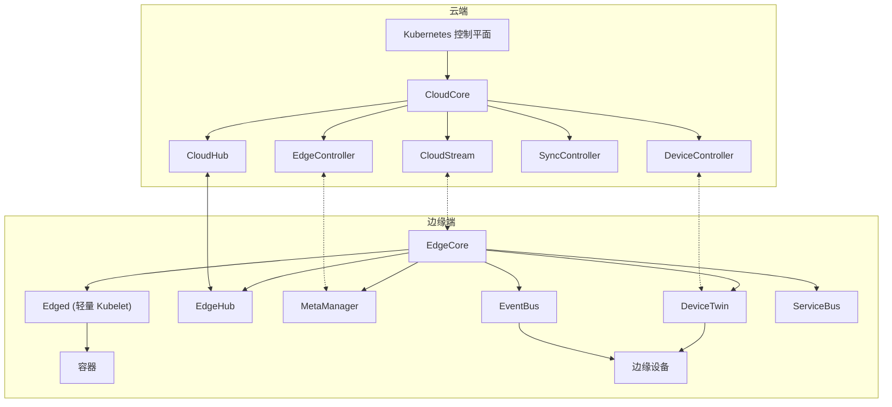

{width=1920 height=1150}

## 主要优势

下表总结了 KubeEdge 针对边缘计算场景的核心优势，便于快速了解其适用价值。



| 优势 | 说明 |
| --- | --- |
| Kubernetes 原生支持 | 通过标准 Kubernetes API 管理边缘应用与设备 |
| 云边可靠协同 | 保证云边网络不稳定时消息可靠传递 |
| 边缘自治 | 边缘节点可在离线或弱网下自主运行 |
| 设备管理 | 通过 CRD 实现边缘设备声明式管理 |
| 轻量级边缘代理 | EdgeCore 极度轻量，适配资源受限设备 |



## 云端核心组件

云端的 CloudCore 组件包含多个子模块，协同实现云边通信、资源同步和设备管理。下图展示了 CloudCore 内部模块的结构关系。

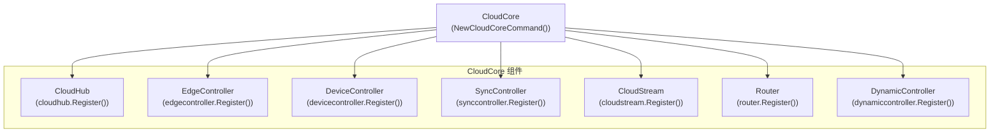

{width=2295 height=380}

- **CloudHub**：WebSocket 服务器，负责云边消息转发、连接管理和消息缓存。
- **EdgeController**：扩展控制器，管理边缘节点和 Pod 元数据，同步资源到边缘，处理状态上报。
- **DeviceController**：扩展控制器，管理设备元数据和状态，实现云边设备信息同步。
- **SyncController**：保障云边资源同步可靠，适应网络波动。
- **CloudStream**：支持远程容器 exec/logs 等流式操作。

## 边缘端核心组件

EdgeCore 作为边缘主代理，集成了多个模块，负责本地容器编排、设备管理和云边通信。下图展示了 EdgeCore 内部模块的结构关系。

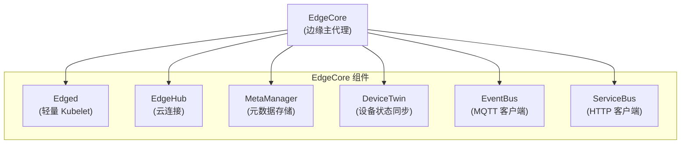

{width=1920 height=479}

- **EdgeHub**：WebSocket 客户端，负责与 CloudHub 通信，同步云端资源变更、上报边缘状态。
- **Edged**：轻量级 kubelet，管理本地容器应用，适配边缘环境。
- **MetaManager**：本地元数据缓存，支持离线运行和断网自治。
- **DeviceTwin**：设备状态管理与同步，提供本地查询接口。
- **EventBus**：MQTT 客户端，连接物联网消息总线，实现设备数据采集与转发。
- **ServiceBus**：HTTP 客户端，支持边缘与云端 HTTP 通信。

## 通信与消息机制

KubeEdge 云边及内部模块间通信基于 Beehive 消息框架，支持可靠消息投递和多种同步模式。下图展示了消息系统的整体结构。

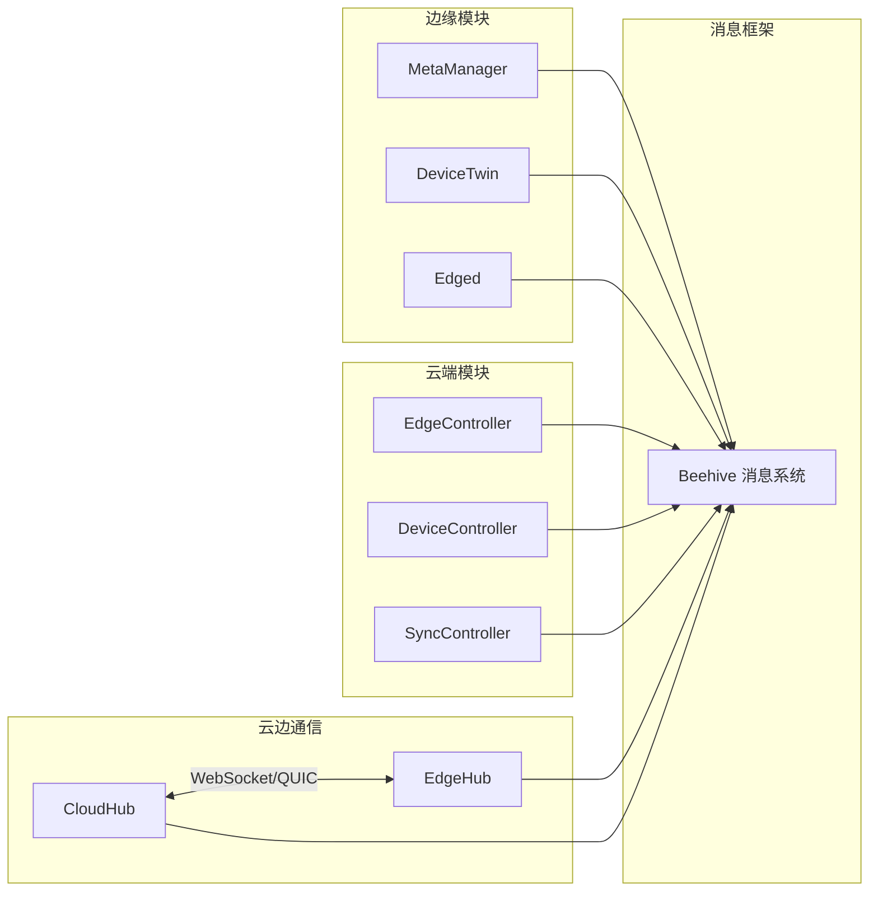

{width=1920 height=2011}

KubeEdge 支持 ACK/NO-ACK 两种消息确认模式，保障消息可靠送达。消息包含头部（ID、时间戳、版本）、路由（源、目标、操作、资源）和内容体。

## 资源同步流程

下图展示了云到边、边到云的资源同步与状态上报流程，帮助理解其数据流转机制。

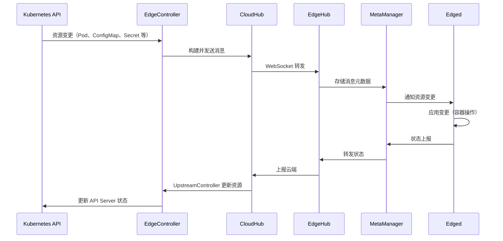

{width=1920 height=918}

## 设备管理框架

KubeEdge 提供原生的设备管理能力，支持通过 CRD（Custom Resource Definition，自定义资源定义）声明设备及模型，边缘侧通过 DeviceTwin、EventBus 与物理设备通信。下图展示了设备管理的整体流程。

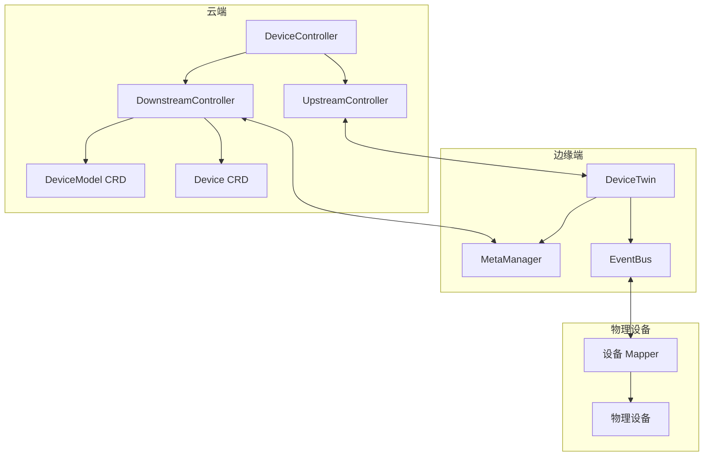

{width=1920 height=1699}

- 云端通过 Device CRD/DeviceModel CRD 定义设备
- 边缘 DeviceTwin 维护设备状态，EventBus 通过 MQTT 与设备通信
- Mapper 负责协议转换

## 管理工具 keadm

KubeEdge 提供 keadm 命令行工具，简化集群部署与节点管理。下图展示了 keadm 的主要功能模块。

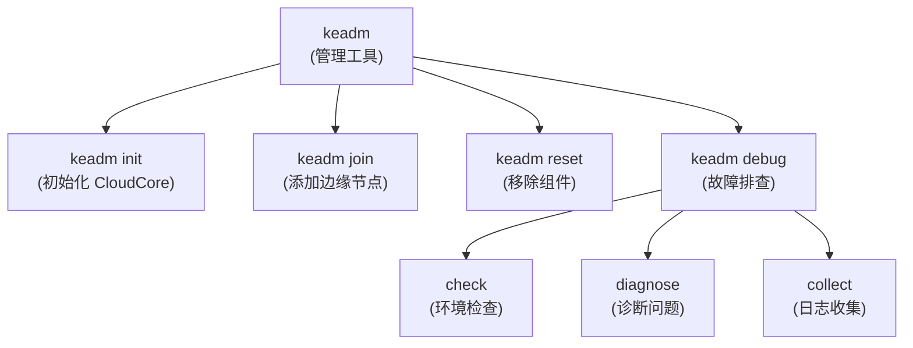

{width=1920 height=831}

## 兼容性与安全

KubeEdge 支持多版本 Kubernetes，兼容性矩阵如下，便于用户选择合适的版本组合。



| KubeEdge 版本 | K8s 1.25 | K8s 1.26 | K8s 1.27 | K8s 1.28 | K8s 1.29 | K8s 1.30 |
| --- | --- | --- | --- | --- | --- | --- |
| KubeEdge 1.16 | ✓ | ✓ | ✓ | \- | \- | \- |
| KubeEdge 1.17 | + | ✓ | ✓ | ✓ | \- | \- |
| KubeEdge 1.18 | + | + | ✓ | ✓ | ✓ | \- |
| KubeEdge 1.19 | + | + | ✓ | ✓ | ✓ | \- |
| KubeEdge 1.20 | + | + | + | ✓ | ✓ | ✓ |
| KubeEdge HEAD | + | + | + | ✓ | ✓ | ✓ |



- ✓: 完全兼容
- +: KubeEdge 有部分功能或 API 不被该 K8s 版本支持
- \-: 该 K8s 版本有 KubeEdge 不支持的特性

## 典型应用场景

KubeEdge 支持多种边缘计算与物联网场景，典型用例如下：

- 边缘 AI/ML：在边缘节点部署机器学习、图像识别等高阶应用。
- 本地数据处理：在数据产生地本地处理大规模数据，降低带宽消耗、提升响应。
- 数据隐私保护：敏感数据本地处理，无需上传云端。
- 离线运行：边缘节点断网时可持续运行。
- IoT 设备管理：通过 Kubernetes 原生方式统一管理边缘设备。

## 总结

KubeEdge 作为云原生边缘计算领域的代表性项目，极大拓展了 Kubernetes 在物联网和分布式边缘场景的应用边界。通过云边协同、边缘自治、设备管理等能力，KubeEdge 让开发者能够用熟悉的 Kubernetes 工具和理念，统一管理云、边、端的应用与设备，加速了云原生技术在边缘计算领域的落地与创新。
