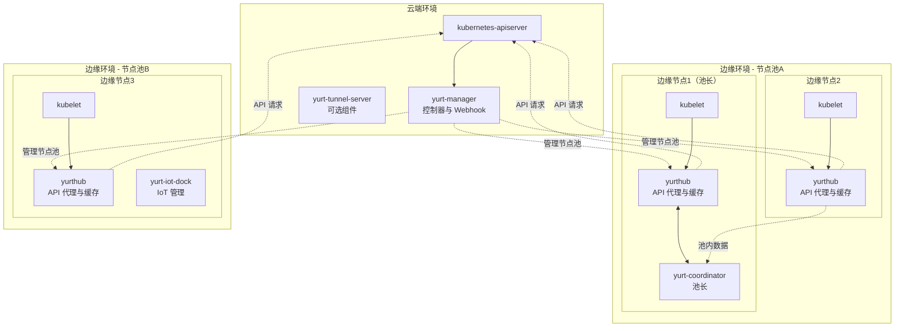
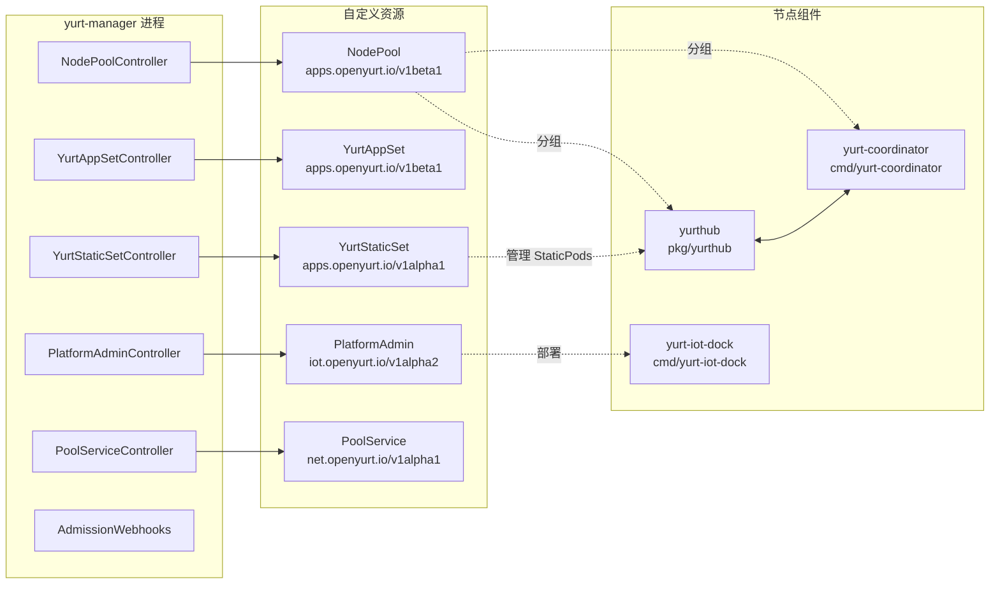
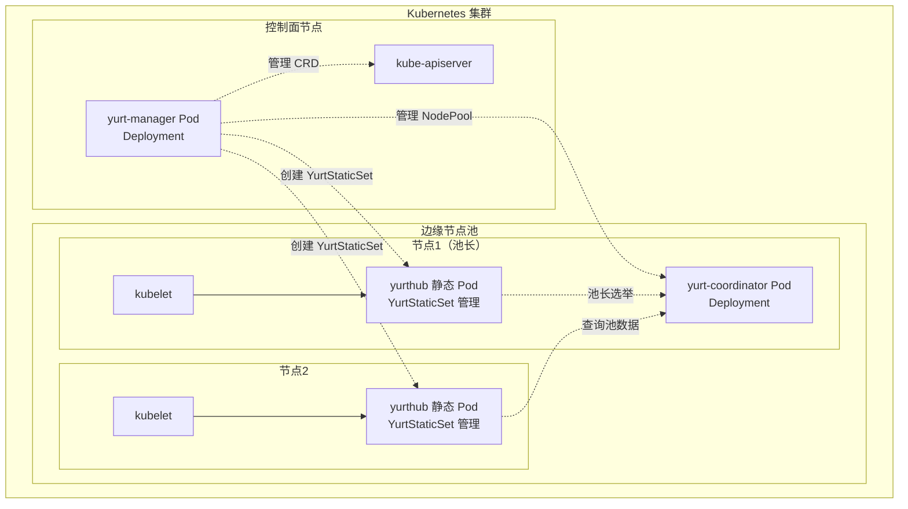

> 边缘计算的未来在于与云原生的深度融合，OpenYurt 以零侵入架构让这一切变得简单可行。

## 项目简介

[OpenYurt](https://github.com/openyurtio/openyurt) 是阿里巴巴云原生团队于 2020 年 5 月开源的边缘计算平台，目前已加入 CNCF（Cloud Native Computing Foundation，云原生计算基金会）沙箱项目。它号称业界首个**零侵入式**的云原生边缘平台，强调“**Kubernetes 零修改**”和“**云边端一体化**”设计理念。

OpenYurt 基于原生 Kubernetes（K8s, Kubernetes）架构，通过附加组件的方式赋予边缘能力，用户可以一键将现有 Kubernetes 集群转换为 OpenYurt 边缘集群，同样也能平滑回退。这种非侵入性使得 OpenYurt 可以紧跟上游 Kubernetes 版本演进，而无需像某些定制发行版那样重做适配。

OpenYurt 致力于提供从云到边再到端的统一基础设施，让用户以一致的方式管理海量分布在不同地域的边缘节点和设备。

OpenYurt 名称中的“Yurt”原意为蒙古包，寓意将分散的边缘节点像帐篷一样连接成一个整体的“游牧部落”。在架构上，OpenYurt 保留了标准 Kubernetes 的控制平面在云端、节点在边缘的模式：云端仍运行标准的 kube-apiserver、etcd、scheduler、controller-manager 等组件，边缘节点运行标准 kubelet 和 kube-proxy。

OpenYurt 通过增加一系列云边组件，使得边缘节点即使在网络不稳定时也能正常运行，并提供对边缘场景有用的增强能力。其关键设计包括边缘侧的 YurtHub 组件和云端的 YurtControllerManager（后改进为 Yurt-Manager）等。

## 系统架构总览

下图展示了 OpenYurt 的高层系统架构，体现了云端控制面与边缘节点池（NodePool，节点池）的协作关系：

{width=2158 height=1071}

如图所示，OpenYurt 采用典型的云 - 边架构，云端 Kubernetes 控制面统一管理多个物理分布的边缘节点池。每个边缘节点运行 `yurthub` 作为本地 API 代理与缓存，保障网络分区时的自治能力。

## 主要组件与核心关系

下图展示了 OpenYurt 中央控制器（yurt-manager）、自定义资源（CRD, Custom Resource Definition）及节点侧组件的关系。该图有助于理解控制器、CRD 以及节点功能模块之间的协作方式。

{width=1920 height=1141}

## 组件部署架构

下图说明了各核心组件在 Kubernetes 集群中的部署方式。通过该图可以直观了解控制面与边缘节点池的组件分布及其协作关系。

{width=1920 height=992}

## 主要组件功能表

下表总结了 OpenYurt 各核心组件的作用、部署方式及关键特性。通过该表可以快速了解各组件的定位和功能。



| 组件 | 主要作用 | 部署方式 | 关键特性 |
| --- | --- | --- | --- |
| **yurt-manager** | 中央控制器与 webhook 管理 | 云端（Deployment） | 节点池管理、应用编排、准入控制 |
| **yurthub** | 节点侧 API 代理与缓存 | 边缘（静态 Pod） | 请求代理、本地缓存、边缘自治 |
| **yurt-coordinator** | 池长选举与流量复用 | 边缘（Deployment） | 池长选举、池内数据共享 |
| **yurt-iot-dock** | IoT 设备管理 | 边缘（可选） | EdgeX 集成、设备生命周期管理 |



## 版本兼容性

下表展示了 OpenYurt 各版本与 Kubernetes 兼容性及主要特性，便于用户选择合适的版本进行部署。



| OpenYurt 版本 | 支持的 Kubernetes 版本 | 主要特性 |
| --- | --- | --- |
| v1.6.0（当前） | v1.30 及以下 | 增强边缘自治、流量复用、托管 K8s 支持 |
| v1.5.0 | v1.28 及以下 | NodeBucket 扩展性、YurtAppSet v1beta1 |
| v1.4.0 | v1.22 及以下 | HostNetwork 节点池、PlatformAdmin CRD |



## 关键特性与能力

OpenYurt 具备以下核心特性，支撑其在边缘计算领域的广泛应用：

- **边缘自治**：通过 `yurthub` 本地缓存，节点在云端失联时可继续运行，保障业务连续性。
- **节点池分组**：支持将边缘节点按地理或业务逻辑分组，实现区域感知的应用部署。
- **流量复用**：通过 `yurt-coordinator` 池长机制，池内数据共享，减少云边流量。
- **IoT 集成**：原生支持 EdgeX Foundry，通过 `yurt-iot-dock` 和 PlatformAdmin CRD 管理边缘设备。
- **服务拓扑**：支持基于节点池的服务发现与流量路由，实现本地流量闭环。
- **零侵入架构**：不修改 Kubernetes 核心，支持一键集成与回退，兼容性强。
- **社区与生态**：CNCF 沙箱项目，社区活跃，生态丰富。

## 典型应用场景

OpenYurt 适用于希望将现有 Kubernetes 集群扩展到边缘的用户，以及多场景融合的边缘计算需求。例如：

- 企业统一纳管分布在各地的边缘节点，断网时业务不中断。
- 运营商 MEC（Multi-access Edge Computing，多接入边缘计算）场景，边缘机房与中心云联动。
- 物联网、分布式云、制造、零售、医疗等行业的边缘节点统一管理与自治。

## 总结

OpenYurt 以零侵入、云边端一体化的架构理念，极大降低了 Kubernetes 在边缘场景的落地门槛。其边缘自治、节点池、流量闭环等特性，帮助企业和开发者高效管理分布式边缘节点，实现云原生能力的无缝延展。随着边缘计算需求的持续增长，OpenYurt 的开放生态和持续创新将为行业带来更多可能性。
