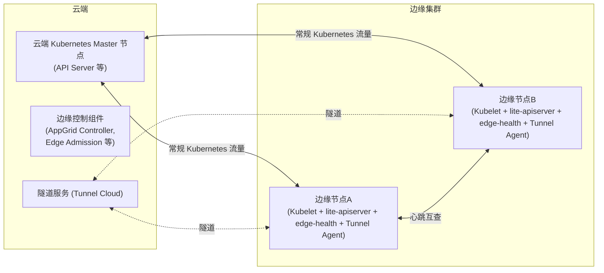
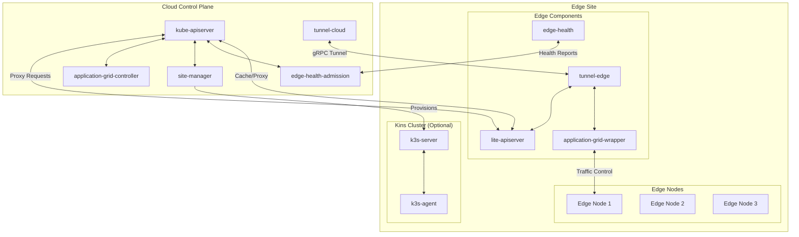
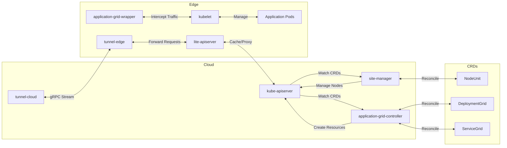
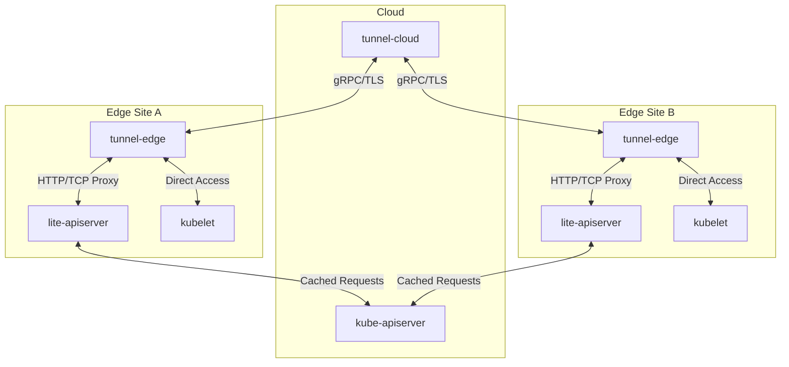
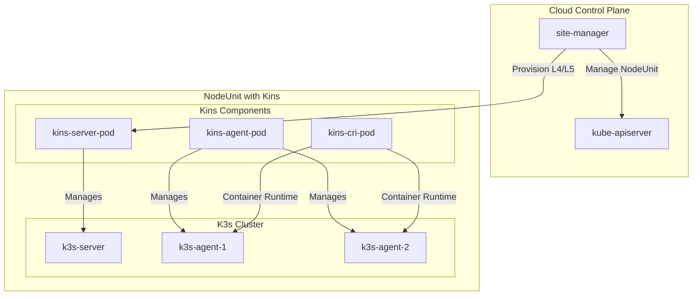

> 边缘计算的未来，是云边一体与自治能力的极致平衡。

## 项目简介

[SuperEdge](https://github.com/superedge/superedge) 是腾讯云联合 Intel、VMware 等于 2020 年推出的 Kubernetes（K8s, Kubernetes）原生边缘计算框架，同样以无侵入方式将 Kubernetes 容器编排能力扩展到边缘场景。相较于 OpenYurt 和 KubeEdge，SuperEdge 在具备云边协同和边缘自治基础能力之外，还引入了独有的分布式健康检查和服务访问控制等高级特性。这些特性旨在进一步降低云边网络不稳定对业务的影响，并方便在边缘集群内实现服务按地域发布和治理。SuperEdge 于 2020 年开源并捐赠给开放原子开源基金会，致力于打造一个单集群多区域的边缘云容器平台。目前 SuperEdge 已在腾讯云边缘计算产品中应用，并逐步在社区获得关注。

SuperEdge 通过非侵入式增强将标准 Kubernetes 集群扩展为 SuperEdge 集群，兼容所有 Kubernetes API 和资源。SuperEdge 采用云 - 边分离架构，支持多级边缘自治，适合大规模多站点边缘场景。

## 架构与核心组件

SuperEdge 整体架构延续了“中心云 + 若干边缘站点”的模式。与 OpenYurt 类似，云端保留完整的 Kubernetes Master 节点，并运行 SuperEdge 提供的控制组件；每个边缘节点作为 Kubernetes Worker 节点，额外运行 SuperEdge 的边缘代理组件。SuperEdge 支持单集群管理跨地域的节点，即一个 Kubernetes 集群可以包含分布在不同地域/网络环境中的节点，SuperEdge 提供机制保证这些节点在网络隔离情况下的稳定运行和服务协同。

下图展示了 SuperEdge 的架构示意，帮助理解其云边协同与分布式健康机制：

{width=1920 height=814}

SuperEdge 还实现了更细致的云 - 边 - 站点分层架构，支持多级自治和 Kins 边缘集群能力。下图展示了 Kins 方案的整体架构：

{width=2543 height=1032}

为了便于查阅，下面以表格形式列出 SuperEdge 的主要云端与边缘组件及其功能。



| 组件 | 目录 | 主要功能 |
| --- | --- | --- |
| `tunnel-cloud` | pkg/tunnel/cloud/ | 云端隧道服务，维护与边缘节点的持久连接 |
| `application-grid-controller` | pkg/application-grid-controller/ | 管理多站点分布式应用 |
| `edge-health-admission` | pkg/edge-health/admission/ | 分布式健康监控与准入 |
| `site-manager` | pkg/site-manager/ | 管理 NodeUnit/NodeGroup |
| `lite-apiserver` | pkg/lite-apiserver/ | 边缘自治轻量 API Server |
| `tunnel-edge` | pkg/tunnel/edge/ | 维护与云端隧道连接 |
| `application-grid-wrapper` | pkg/application-grid-wrapper/ | ServiceGroup 内流量控制 |
| `edge-health` | pkg/edge-health/ | 边缘节点健康监控 |



## 主要组件说明

SuperEdge 在云端和边缘节点均引入了多种创新组件。下方列表对各核心模块进行简要说明，帮助理解其分布式自治与服务治理能力。

- **lite-apiserver**：边缘自治的核心组件，部署在每个边缘节点上。它并不是完整的 apiserver，而是充当云端 kube-apiserver 的本地代理，维护了对边缘节点有关的部分请求的缓存。当边缘节点与云端通信正常时，lite-apiserver 将请求转发给真实的 kube-apiserver；一旦检测到云端不可达，对于特定的请求（如获取 Pod 配置）将直接返回缓存的数据给请求方（如 kubelet）。这样可以确保边缘节点在与云端断联期间，依旧能从本地获取必要的资源信息，不影响已经运行的 Pod。lite-apiserver 类似 OpenYurt 的 YurtHub，但运行机制有所不同，其名字体现出边缘侧提供一个“精简版”的 API Server 功能。
- **edge-health**：边缘分布式健康检查组件。传统 Kubernetes 由控制平面统一判断节点存活，边缘场景下云边网络的不稳定可能导致误判。edge-health 通过在每个边缘节点上运行探针，边缘节点之间相互通信进行健康探测和投票。具体而言，同一集群或同一分组内的节点两两检查对方状态，若某节点得到多数边缘邻居判定为存活，即使暂时与云端失去联系，云端也不会将其标记为 NotReady，从而避免不必要的 Pod 迁移。edge-health 还支持将大规模节点按站点分组，只在组内互检，以减少网络开销。这种分布式心跳机制极大增强了弱网环境下集群的稳定性，是 SuperEdge 独特的功能亮点之一。
- **ServiceGrid（服务分组）与 ApplicationGrid**：SuperEdge 提供了一套服务访问控制机制，允许用户在同一集群的不同边缘站点各自部署一组服务实例，并确保服务流量不跨站点，避免了服务跨地域访问。利用该特性可以极大地方便边缘集群服务的发布与治理。这是通过两个自定义资源 DeploymentGrid 和 ServiceGrid 实现的。Application-grid controller（云端控制器）会根据定义为每个站点创建对应的 Deployment 和 Service，对应的边缘节点只部署属于自己站点的 Pod。同时，ServiceGrid 控制器配合边缘侧的 Application-grid wrapper，实现服务 DNS 解析或流量路由仅在本地站点闭环。这有点类似于 Kubernetes 原生 Service 的 topology 属性或 Service Mesh 的区域路由，但 SuperEdge 将其作为开箱即用的特性提供，极大地方便了多站点边缘应用的分布式部署和就近访问。
- **TunnelCloud / TunnelEdge**：与 OpenYurt 类似，SuperEdge 包含云端的 tunnel-cloud 服务和边缘节点上的 tunnel-edge 客户端，通过自建隧道解决无公网 IP 环境下云边互通问题。Tunnel 支持 TCP、HTTP(S) 等协议，将云端对节点的操作（kubectl exec/logs 等）通过隧道转发到边缘节点的 kubelet 或容器。TunnelEdge 在边缘启动后会连向 TunnelCloud 注册，这样云就能通过 TunnelCloud 找到并通信各个边缘节点。
- **Edge Admission**：边缘准入组件，是云端的一个辅助控制器 edge-admission controller。它根据来自 edge-health 的健康报告，协助决定节点在 Kubernetes 集群中的状态（例如给长期不健康的节点打上污点 Taint）。换言之，edge-admission 将边缘侧的健康检查结果反馈到云端控制平面，保障 Kubernetes 的调度决策不受异常网络的干扰。
- **其他**：SuperEdge 还提供一键部署工具（改进自 kubeadm，实现边缘场景快速安装 Kubernetes 集群）、边缘节点自动化运维等功能。此外，由于 SuperEdge 保持对 Kubernetes 完全无侵入兼容，因此可以在其上部署任意原生的 Kubernetes 资源和工作负载，例如 Deployment、StatefulSet、DaemonSet 等。这一点保证了使用 SuperEdge 不会牺牲 Kubernetes 的功能完备性。

下图进一步说明组件间的分布与交互关系：

{width=2493 height=781}

## 主要特性

SuperEdge 具备多项面向边缘场景的核心能力，以下列表对其主要特性进行归纳：

- **非侵入 & Kubernetes-Native**：SuperEdge 不对 Kubernetes 做魔改，而是以插件形式部署。所有 Kubernetes 原生的功能和 API 对象都兼容，用户学习成本低。这也意味着 SuperEdge 紧跟 Kubernetes 版本演进极其容易，升级时只需确保 SuperEdge 组件兼容新版本即可，无需重构。
- **边缘自治增强**：除了本地缓存（lite-apiserver）保证断网不停服外，SuperEdge 引入边缘节点互相心跳机制，避免云端误判下线。只要边缘节点彼此联通，就算断了云连接也不影响节点状态判定，避免连锁反应（例如云端网络波动导致成百上千节点被误判驱逐）。这在大规模边缘部署中极为关键。
- **服务拓扑隔离**：SuperEdge 原生提供 ServiceGrid/DeploymentGrid 模型，实现同集群不同区域各自部署服务并流量不出区，避免了服务跨地域访问。利用该特性可以极大地方便边缘集群服务的发布与治理。用户无需额外组建多个集群或编写复杂调度策略，就能方便地把应用按站点分布部署，用户请求就近服务。这减少了跨区域流量，提升了服务响应速度和可靠性。
- **云边一体**：SuperEdge 支持单集群跨多云多边的场景，统一的 Kubernetes 控制平面降低了运维复杂度。同时通过 Tunnel 等保证云边连接，Edge Admission 结合 cloud 控制器让云对边缘状态了如指掌。对运维人员来说，可以在云端集中监控整个跨地域的边缘基础设施，而不必维护多套控制平面。
- **成熟度与生态**：SuperEdge 由腾讯云主导开发，已在腾讯云 Edge Computing 产品中验证过大规模商用，稳定性有保障。社区上也提供了丰富的文档、安装脚本和案例教程。由于其底层还是标准 Kubernetes，可配合的生态工具也很丰富——例如可以与 KubeSphere 等容器平台配合，为边缘提供可视化管理；结合 GitOps 工具实现对多边缘的统一应用分发等。

## 网络隧道与云边通信

SuperEdge 通过 tunnel-cloud 与 tunnel-edge 组件实现云边安全互通，支持 gRPC/TLS、HTTP/TCP 等协议。下图展示了云边通信的主要流程：

{width=1920 height=1168}

## 分布式应用与服务治理

SuperEdge 针对边缘场景下的分布式应用和服务治理，提供了如下机制：

- **DeploymentGrid**：支持跨 NodeUnit（节点单元）分发部署应用。
- **ServiceGrid**：实现站点内服务发现与隔离，保障服务流量不跨站点。
- **ServiceGroup**：进一步保障服务流量本地化，提升访问效率。

## 边缘节点组织

SuperEdge 通过以下资源对象实现边缘节点的灵活组织和批量管理：

- **NodeUnit**：同区域节点的逻辑分组，便于自治和健康检查。
- **NodeGroup**：对 NodeUnit 进行批量管理，提升运维效率。

## 边缘自治级别

SuperEdge 支持多级自治能力，适应不同场景下的边缘需求。下表总结了各级别的能力与实现方式：

| 级别 | 描述 | 实现方式 |
| --- | --- | --- |
| L3 | 基础自治，缓存关键资源 | lite-apiserver 缓存 |
| L4 | 单主 K3s 集群自治 | Kins 部署单主 K3s |
| L5 | 高可用 K3s 集群自治 | Kins 部署三主 K3s |

下图展示了 Kins 方案的架构细节：

{width=1920 height=1200}

## 适用场景

SuperEdge 特别适合大规模边缘站点统一管理的场景，比如运营商或大型互联网公司需要在全国各地部署边缘节点来提供就近服务。通过 SuperEdge，一个 Kubernetes 集群即可跨越多个区域，将各地边缘节点纳入统一编排，同时保证各区域的自治性和服务隔离。

例如，CDN（Content Delivery Network, 内容分发网络）厂商利用 SuperEdge 在不同城市部署缓存节点，并确保用户流量始终命中本地缓存而非跨城；又例如连锁企业在各门店部署边缘服务器作为一个整体集群，每个门店被视为一个节点分组，服务仅在店内互访，集中管理又不失灵活性。SuperEdge 的分布式健康检查让边缘集群对网络抖动更健壮，因此也适合网络质量不佳但需要高可用的场景，如海上平台、山地基站等。对于已经使用腾讯云容器服务的用户，SuperEdge 可以无缝对接，提供从云到边的一致管理体验。

## 安装与依赖

SuperEdge 基于 Go（Go Programming Language）1.17 开发，依赖 Kubernetes 1.22.3，支持 amd64/arm64 架构。推荐使用 edgeadm 工具一键安装。

主要依赖如下：

- Kubernetes client-go
- gRPC（Google Remote Procedure Call, 谷歌远程过程调用）
- controller-runtime（Kubernetes 控制器运行时库）

## 总结

综上，SuperEdge 通过创新的分布式架构和完善的云边协同机制，满足了在单一 Kubernetes 集群下管理多区域边缘的需求，在边缘计算开源项目中独树一帜。它与前述的 KubeEdge、OpenYurt、K3s 一起，构成当前 Kubernetes 边缘计算生态的核心力量，为不同场景下的边缘部署提供了多样化的解决方案。各项目各有侧重，用户可根据自身需求选择：需要极致轻量可选 K3s，需要物联网设备管理和边云协同可选 KubeEdge，已有 Kubernetes 集群希望零改造扩展边缘选 OpenYurt，而追求单集群多站点精细管理则可考虑 SuperEdge。在未来，随着边缘计算的快速发展，这些项目也将继续演进，为云原生技术在边缘侧的落地提供更强大的支持。
