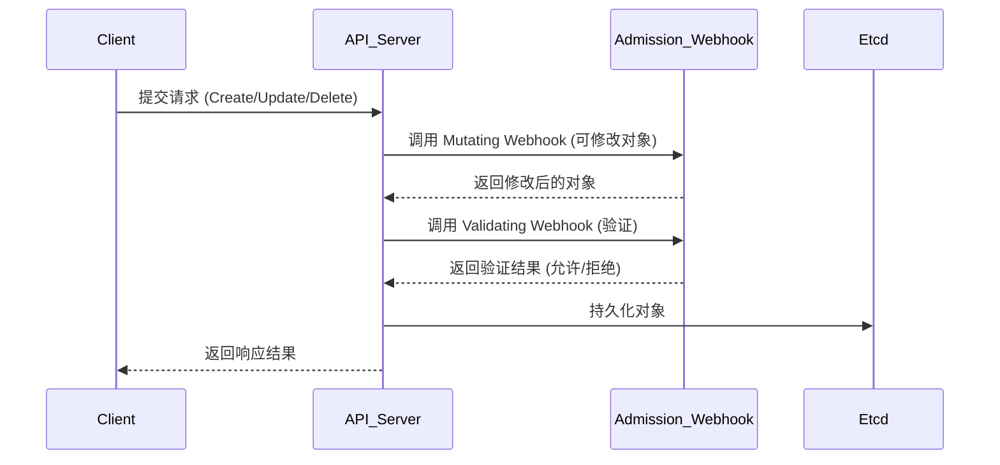
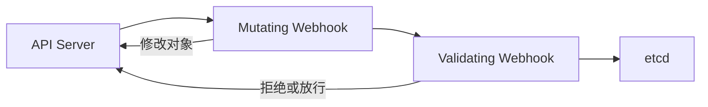

> 准入 Webhook（Admission Webhook）是 Kubernetes 最灵活的 API 扩展机制之一，支持在 API Server 请求处理链中插入自定义校验、变更和策略逻辑，实现安全、合规与自动化治理。

## 概述

准入 Webhook（Admission Webhook）是 Kubernetes API 扩展体系的重要组成部分。  
它允许开发者在 API Server 处理对象创建、修改、删除等请求的过程中插入自定义逻辑，常见用途包括：

- 动态校验（Validation）
- 默认值填充（Mutation）
- 安全策略检查
- 资源约束与审计扩展

通过 Webhook，Kubernetes 提供了“可插拔的策略控制能力”，而无需修改核心代码。

## Kubernetes API 请求生命周期

理解 Admission Webhook 前，需了解请求在 API Server 的完整处理流程。下图展示了请求生命周期及 Webhook 的作用位置。




{width=1920 height=889}

> Mutating Webhook 在验证之前执行，可用于注入默认字段或修改配置；Validating Webhook 仅用于验证，不能修改对象。

## Webhook 类型与执行顺序

Kubernetes 定义了两类 Webhook，分别用于不同的扩展场景。下表总结了两类 Webhook 的功能与典型用途。



| 类型                           | 功能           | 典型用途                     |
| ------------------------------ | -------------- | ---------------------------- |
| MutatingAdmissionWebhook       | 可修改对象内容 | 注入默认值、自动添加 Sidecar |
| ValidatingAdmissionWebhook     | 只读验证对象   | 安全策略校验、字段一致性检查 |



执行顺序如下：

1. 执行所有 MutatingAdmissionWebhook
2. 对对象重新校验
3. 执行所有 ValidatingAdmissionWebhook
4. 最终提交到 etcd

## Webhook 配置对象结构

Webhook 的配置由两种资源对象定义：

- `MutatingWebhookConfiguration`
- `ValidatingWebhookConfiguration`

下方为 Mutating Webhook 配置示例，并对主要字段进行说明。

```yaml
apiVersion: admissionregistration.k8s.io/v1
kind: MutatingWebhookConfiguration
metadata:
  name: pod-mutating-webhook
webhooks:
  - name: sidecar-injector.example.com
    admissionReviewVersions: ["v1"]
    sideEffects: None
    clientConfig:
      service:
        name: sidecar-webhook
        namespace: kube-system
        path: /mutate
      caBundle: <Base64-encoded-CA-cert>
    rules:
      - operations: ["CREATE"]
        apiGroups: [""]
        apiVersions: ["v1"]
        resources: ["pods"]
    namespaceSelector:
      matchLabels:
        sidecar-injection: enabled
```

表格说明：下表解释了 Webhook 配置的主要字段。



| 字段                      | 说明                                          |
| ------------------------- | --------------------------------------------- |
| clientConfig              | 指定 Webhook 服务的访问方式（Service 或 URL） |
| rules                     | 定义哪些资源和操作会触发 Webhook              |
| namespaceSelector         | 控制哪些命名空间会应用 Webhook                |
| admissionReviewVersions   | 与 API Server 通信的版本                      |
| sideEffects               | 声明 Webhook 是否会产生副作用                 |



## Webhook 服务实现示例

一个最小可运行的准入 Webhook 服务通常包含以下核心逻辑：

1. 接收 AdmissionReview 请求
2. 解码对象
3. 执行验证或修改
4. 返回 AdmissionResponse

下方为 Go 语言 Mutating Webhook 的核心实现示例。

```go
func handleMutate(w http.ResponseWriter, r *http.Request) {
    var review admissionv1.AdmissionReview
    if err := json.NewDecoder(r.Body).Decode(&review); err != nil {
        http.Error(w, err.Error(), http.StatusBadRequest)
        return
    }

    // 解码 Pod 对象
    var pod corev1.Pod
    json.Unmarshal(review.Request.Object.Raw, &pod)

    // 注入 sidecar 容器
    sidecar := corev1.Container{
        Name:  "sidecar-agent",
        Image: "busybox",
        Args:  []string{"sleep", "3600"},
    }
    pod.Spec.Containers = append(pod.Spec.Containers, sidecar)

    // 返回修改后的对象
    patchBytes, _ := json.Marshal([]map[string]interface{}{
        {"op": "add", "path": "/spec/containers/-", "value": sidecar},
    })

    review.Response = &admissionv1.AdmissionResponse{
        Allowed: true,
        UID:     review.Request.UID,
        Patch:   patchBytes,
        PatchType: func() *admissionv1.PatchType {
            pt := admissionv1.PatchTypeJSONPatch
            return &pt
        }(),
    }

    json.NewEncoder(w).Encode(review)
}
```

## TLS 与认证机制

Webhook 服务必须使用 HTTPS，并由 API Server 信任其 CA。推荐使用 cert-manager 自动生成证书。

```bash
kubectl apply -f cert-manager.yaml
```

证书配置示例：

```yaml
apiVersion: cert-manager.io/v1
kind: Certificate
metadata:
  name: sidecar-webhook-cert
spec:
  dnsNames:
  - sidecar-webhook.kube-system.svc
  secretName: sidecar-webhook-tls
  issuerRef:
    name: selfsigned-issuer
    kind: Issuer
```

## Webhook 与控制器的协同

Webhook 与 Controller/Operator 的区别与联系如下表所示。



| 对比维度 | Webhook                | Controller                 |
| -------- | ---------------------- | -------------------------- |
| 触发时机 | 请求进入 API Server 时 | 状态变更后异步执行         |
| 执行逻辑 | 实时、同步             | 持续、异步                 |
| 返回影响 | 决定请求是否被接受     | 调整资源状态以实现期望状态 |
| 典型用途 | 安全、策略、默认值注入 | 自动化、修复、调度逻辑     |



在复杂系统中，Webhook 通常与 Controller 搭配使用：

- Webhook 负责策略把关
- Controller 实现资源收敛

## 调试与测试

本地调试 Webhook 服务流程如下：

```bash
go run main.go --port=8443
kubectl port-forward svc/sidecar-webhook 8443:443
```

触发测试：

```bash
kubectl create -f pod-test.yaml
kubectl describe pod pod-test
```

查看日志确认是否被注入或拒绝。

## 常见场景与最佳实践

下方列举了典型场景及最佳实践建议。

- **Sidecar 注入器**（如 Istio、Linkerd）：自动在 Pod 中注入代理容器，实现服务网格无侵入部署。
- **安全策略控制**（如 Kyverno、OPA Gatekeeper）：通过 Webhook 拦截对象请求，验证其是否符合策略。
- **默认值与标签注入**：自动为资源添加标准标签或默认配置。

最佳实践：

- Webhook 应尽量快速、幂等、无副作用
- 使用独立命名空间与服务账户
- 避免循环调用（Webhook 调用自身资源）
- 结合缓存与限流机制，保证 API Server 性能
- 多 Webhook 顺序依赖需明确定义 `failurePolicy`

## failurePolicy 与超时控制

Webhook 失败时的处理策略如下表所示。



| 参数                    | 含义               | 建议               |
| ----------------------- | ------------------ | ------------------ |
| failurePolicy: Fail     | 拒绝请求（默认）   | 适合安全关键操作   |
| failurePolicy: Ignore   | 忽略错误，继续执行 | 适合非关键扩展功能 |



可通过 `timeoutSeconds` 限制 Webhook 最大响应时间（默认 10 秒）。

## 示意架构图

下图展示了 Webhook 在请求生命周期中的“前置守卫”作用。




{width=1920 height=275}

## 总结

Admission Webhook 是 Kubernetes 最灵活的 API 扩展机制之一。它允许开发者在集群请求路径上注入领域逻辑，实现策略治理、动态配置和安全审计。结合 CRD、Controller、Operator，可构建完整的“策略 + 自动化 + 编排”生态。

## 参考文献

1. [Admission Webhooks 官方文档 - kubernetes.io](https://kubernetes.io/docs/reference/access-authn-authz/admission-controllers/)
2. [ValidatingAdmissionWebhook 示例 - github.com](https://github.com/kubernetes/kubernetes/tree/master/test/images/validating-webhook)
3. [cert-manager 官方文档 - cert-manager.io](https://cert-manager.io/)
4. [Kyverno - kyverno.io](https://kyverno.io/)
5. [OPA Gatekeeper - open-policy-agent.github.io](https://open-policy-agent.github.io/gatekeeper/)
