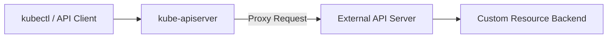

> Kubernetes 的 API 扩展机制是其成为云原生生态核心平台的关键。通过 API 聚合层（APIService）和自定义资源定义（CRD），开发者可以安全、灵活地扩展集群能力，满足多样化业务需求。

## 概述

Kubernetes 的一切皆资源（Everything is a Resource）。无论是 Pod、Service、Deployment，还是 Node、Namespace，它们都通过统一的 API 接口暴露出来。

更重要的是，Kubernetes 的 API 本身也是**可扩展的**。这意味着你可以定义新的资源类型、添加新的 API 路径，甚至将外部服务“接入”到 Kubernetes 的 API Server 体系中。

这种可扩展的 API 架构，使 Kubernetes 从一开始就被设计为一个**可编程的控制平面（Programmable Control Plane）**。

## API 扩展的两种方式

Kubernetes 支持两种扩展 API 的方式，适用于不同的业务场景和复杂度需求。



| 扩展方式 | 简介 | 适用场景 | 复杂度 |
|-----------|------|-----------|-----------|
| **API Aggregation Layer（APIService）** | 聚合外部 API Server | 独立系统服务、metrics-server |  高 |
| **CustomResourceDefinition（CRD）** | 定义自定义资源类型 | 绝大多数场景、Operator 模式 |  低 |



两者都属于 *API 扩展机制*（API Extension Mechanism），区别在于前者是“外部聚合”，后者是“内部扩展”。

## API 聚合层（APIService）

### 工作原理

API Aggregation Layer 是 Kubernetes 在 v1.7 引入的机制，允许你注册一个**独立运行的 API Server**，并通过主 API Server 的 `/apis` 路径对外统一暴露。




{width=1920 height=117}

当用户访问 `/apis/metrics.k8s.io/v1beta1` 时，主 API Server 会将请求**代理转发**给 `metrics-server` 服务。

### 优势与局限

下表总结了 APIService 的主要优缺点：



| 优点                     | 缺点           |
| ---------------------- | ------------ |
| 独立生命周期与权限              | 部署复杂，需要证书和代理 |
| 可聚合外部系统 API            | 性能略低于内置 API  |
| 支持完全自定义的 API Server 实现 | 开发门槛高、维护成本大  |



### 示例：Metrics Server

`metrics-server` 是最典型的 APIService 实现：

```bash
kubectl get apiservice | grep metrics
v1beta1.metrics.k8s.io   kube-system/metrics-server   True   1m
```

它通过注册 `APIService` 对象，将外部采集的资源指标（CPU/内存）聚合到 Kubernetes API 中，供 `kubectl top` 等命令调用。

## 自定义资源定义（CRD）

### 工作原理

CRD 是 Kubernetes 1.7 起正式支持的另一种扩展方式，通过在集群中定义新的资源类型（Custom Resource），你可以像操作原生对象一样创建、更新和删除自定义对象。

```yaml
apiVersion: apiextensions.k8s.io/v1
kind: CustomResourceDefinition
metadata:
  name: databases.example.com
spec:
  group: example.com
  names:
    kind: Database
    plural: databases
  scope: Namespaced
  versions:
    - name: v1
      served: true
      storage: true
      schema:
        openAPIV3Schema:
          type: object
          properties:
            spec:
              type: object
              properties:
                engine:
                  type: string
                version:
                  type: string
```

注册完成后，你就可以直接使用：

```bash
kubectl get databases
kubectl apply -f mydb.yaml
```

### CRD 的优势

- 无需独立 API Server
- 自动支持 RBAC、OpenAPI、kubectl
- 与 Controller / Operator 配合自然
- 被 Kubernetes 社区广泛采用

### CRD 的进阶功能

- **版本管理（Versioning）**：可定义多个版本（`v1alpha1`, `v1beta1`, `v1`）
- **Conversion Webhook**：实现多版本转换
- **Validation Schema**：通过 OpenAPI 校验字段合法性
- **Subresources**：支持 `/status`、`/scale` 等子资源路径

## APIService 与 CRD 的关系

在早期版本（1.7 ~ 1.10），CRD 功能尚不完善，许多系统（如 metrics-server、service-catalog）使用 APIService 架构。

但随着 CRD 的成熟，社区逐渐转向 CRD 方案。今天，除非需要“独立进程与独立生命周期”，几乎所有项目都使用 CRD。



| 对比维度  | APIService                      | CRD               |
| ----- | ------------------------------- | ----------------- |
| 实现方式  | 外部聚合                            | 内部扩展              |
| 独立性   | 独立进程                            | 内嵌 kube-apiserver |
| 部署复杂度 | 高                               | 低                 |
| 性能    | 中                               | 高                 |
| 使用场景  | metrics-server、service catalog | Operator、自定义控制器  |
| 推荐程度  | ⚠️ 仅限特殊场景                       | ✅ 主流方式            |



## 选择建议

- **首选 CRD**：如果你的目标是定义新的 Kubernetes 对象类型。
- **使用 APIService**：仅当你需要运行一个独立的 API Server，或对外暴露非 Kubernetes 原生逻辑时。

示例：

- Operator、控制器、自定义工作流 → 使用 **CRD**
- 监控、审计、外部系统聚合 → 使用 **APIService**

## Kubernetes API 的未来趋势

Kubernetes 的 API 扩展正在向以下方向演进：

- **CRD + Operator 模式** 成为事实标准
- **AI 原生资源类型**（如 InferenceJob、ModelDeployment）通过 CRD 定义
- **API 聚合层** 逐渐转向“网关化”（AI Gateway、Observability Gateway）
- **跨集群与多租户 API 聚合**（Multi-Cluster API Proxy）成为新方向

> Kubernetes 已从“可扩展的容器调度器”演化为“可扩展的云原生 API 平台”。

## 总结

Kubernetes 的强大之处不在于它内置了多少功能，而在于它提供了足够灵活的**扩展接口**。无论是 CRD、APIService，还是未来的 AI Native API Gateway，这些机制共同构成了 Kubernetes 的“第二语言” —— **可扩展 API 体系**。

## 参考文献

1. [Kubernetes 官方文档：Extending Kubernetes API - kubernetes.io](https://kubernetes.io/docs/concepts/extend-kubernetes/)
2. [CustomResourceDefinition API Reference - kubernetes.io](https://kubernetes.io/docs/reference/generated/kubernetes-api/v1.30/#customresourcedefinition-v1-apiextensions-k8s-io)
3. [Kubernetes Aggregation Layer - kubernetes.io](https://kubernetes.io/docs/concepts/extend-kubernetes/api-extension/apiserver-aggregation/)
4. [Operator SDK - sdk.operatorframework.io](https://sdk.operatorframework.io/)
5. [Kubebuilder - book.kubebuilder.io](https://book.kubebuilder.io/)
6. [Kubernetes API Server - kubernetes.io](https://kubernetes.io/docs/reference/generated/kubernetes-api/v1.30/#apiserver-v1-apiextensions-k8s-io)
7. [Kubernetes API Server - kubernetes.io](https://kubernetes.io/docs/reference/generated/kubernetes-api/v1.30/#apiserver-v1-apiextensions-k8s-io)
