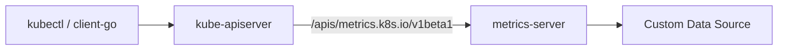
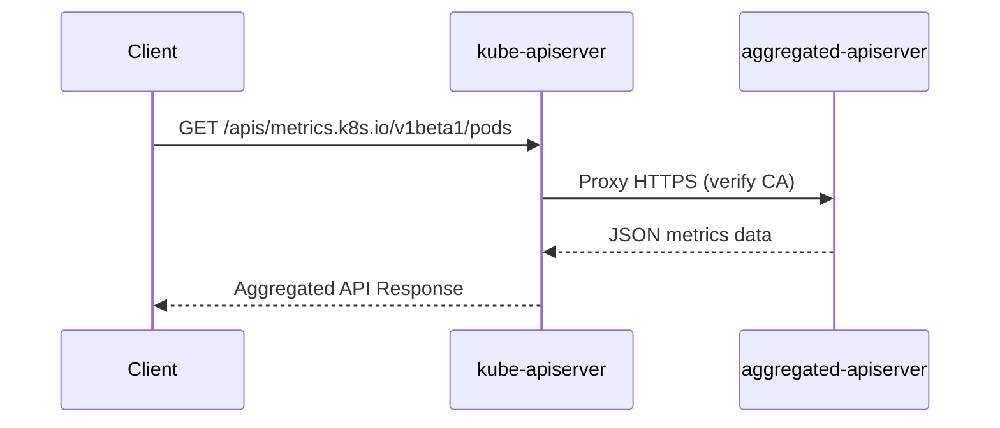

> APIService（API 聚合层）是 Kubernetes 早期的官方扩展机制，允许外部 API Server 注册到主 API Server，实现统一 API 入口和系统级能力扩展。本文梳理其架构原理、注册流程、典型场景与局限性，帮助理解其在现代云原生体系中的定位。

## 概述

在 Kubernetes 的可扩展体系中，**APIService（API 聚合层）** 是一种早期设计的扩展机制。  
它允许开发者通过注册独立运行的 API Server，将外部系统的 API 聚合到 Kubernetes 主 API Server 下的统一路径中。

这种机制通常被称为 **Aggregation Layer**，是 Kubernetes API Server 的一个“可插拔入口点”。

## 设计目标

API 聚合层的设计目标如下：

- **统一 API 入口**：所有原生与扩展 API 统一通过 `/apis` 前缀访问。
- **支持外部系统集成**：允许独立服务注册到 Kubernetes API。
- **保持核心稳定**：无需修改 kube-apiserver 源码即可扩展功能。

这让 Kubernetes 成为可扩展的控制平面，而不仅仅是编排器。

## 架构原理

API 聚合层由两个关键组件构成：

- **主 API Server（kube-apiserver）**：负责接收所有 API 请求。
- **扩展 API Server（aggregated apiserver）**：由用户或第三方实现，注册到主 API Server 下。

当请求到达主 API Server 时，如果路径匹配某个注册的 `APIService`，则会被代理转发到对应的扩展 API Server。




{width=1920 height=116}

## 注册机制

扩展 API Server 通过创建 `APIService` 对象注册到 Kubernetes：

```yaml
apiVersion: apiregistration.k8s.io/v1
kind: APIService
metadata:
  name: v1beta1.metrics.k8s.io
spec:
  service:
    name: metrics-server
    namespace: kube-system
  group: metrics.k8s.io
  version: v1beta1
  insecureSkipTLSVerify: false
  caBundle: <Base64-encoded-CA>
```

该对象描述了外部服务的访问地址（通常为 Kubernetes Service）及通信安全策略。主 API Server 会根据此配置将请求反向代理到扩展服务。

## 示例：Metrics Server

`metrics-server` 是典型的 APIService 实现，用于聚合节点与 Pod 的 CPU、内存指标。

部署完成后，可通过如下命令查看注册信息：

```bash
kubectl get apiservice | grep metrics
v1beta1.metrics.k8s.io   kube-system/metrics-server   True   25s
```

然后使用：

```bash
kubectl get --raw /apis/metrics.k8s.io/v1beta1/nodes
```

主 API Server 会将该请求代理至 metrics-server，实现统一访问入口。

## 证书与安全配置

聚合层涉及主从 API Server 之间的通信，必须通过 HTTPS 进行安全认证：

- **证书签发**：扩展 API Server 需由集群 CA 签发服务端证书。
- **CA 绑定**：`APIService` 对象中 `caBundle` 字段填入 CA 的 Base64 编码。
- **Service Endpoint**：主 API Server 通过 `spec.service` 字段找到扩展服务的 ClusterIP。
- **身份验证**：kube-apiserver 在反向代理前会验证目标服务的证书链。




{width=1920 height=840}

## 开发与部署流程

实现新的 APIService 通常包括以下步骤：

1. **实现扩展 API Server**  
   使用 `k8s.io/apiserver` 库编写支持 Kubernetes API 规范的独立服务。  
   参考：[sample-apiserver](https://github.com/kubernetes/sample-apiserver)

2. **部署 Service 与 Deployment**  
   将扩展 API Server 部署到集群，并通过 ClusterIP Service 暴露。

3. **注册 APIService 对象**  
   创建 `APIService` 资源，绑定 group/version 与对应服务。

4. **验证通信**  
   使用 `kubectl get --raw` 验证代理路径是否正常工作。

## 适用场景

APIService 适用于以下典型场景：

- 聚合外部数据源（如监控、日志、审计系统）
- 构建多租户 API 入口层
- 向 Kubernetes 注册系统级别管理 API
- 实现平台级自定义控制平面（如 Service Catalog）

不适用场景包括：

- 一般应用级别的 CRD
- Operator 模式（应使用 CRD）
- 需要与 Kubernetes 深度集成的控制循环逻辑

## 局限性与演进

虽然 APIService 是早期重要扩展机制，但随着 CRD 的成熟，它逐渐被边缘化。



| 局限性   | 说明                            |
| -------- | ----------------------------- |
| 部署复杂  | 涉及证书、反向代理与双向 TLS              |
| 性能较低  | 每次访问需额外代理跳转                   |
| 开发门槛高 | 必须遵循 Kubernetes API Server 架构 |
| 可替代性强 | CRD + Operator 方案覆盖大多数需求      |



目前社区主要将 APIService 用于系统组件，如 metrics-server、apiextensions-apiserver、kube-aggregator。

## 总结

APIService 是 Kubernetes 的早期扩展机制，代表了“聚合式 API 扩展”的设计理念，让 Kubernetes 成为统一 API 网关。但在实际生产中，APIService 更适合系统级组件，对于业务系统或 Operator 类应用，应优先选择 CRD 方式。

## 参考文献

1. [Kubernetes 官方文档：Aggregation Layer - kubernetes.io](https://kubernetes.io/docs/concepts/extend-kubernetes/api-extension/apiserver-aggregation/)
2. [APIService API Reference - kubernetes.io](https://kubernetes.io/docs/reference/generated/kubernetes-api/v1.30/#apiservice-v1-apiregistration-k8s-io)
3. [Kubernetes Sample API Server - github.com](https://github.com/kubernetes/sample-apiserver)
4. [Metrics Server - github.com](https://github.com/kubernetes-sigs/metrics-server)
