> 控制器（Controller）是 Kubernetes 自动化的核心，Operator 模式则让领域知识与控制循环深度融合，实现复杂系统的声明式管理。本文系统梳理控制器与 Operator 的原理、模式与最佳实践，助力云原生与 AI 场景下的自动化治理。

## 概述

Kubernetes 是一个声明式系统。用户只需定义期望状态（Desired State），系统会通过控制器（Controller）自动调整实际状态（Actual State）使之保持一致。

**控制器（Controller）** 是实现这种自动化的关键组件。几乎所有 Kubernetes 内置资源（Deployment、ReplicaSet、Job 等）都由相应控制器驱动。

在此基础上，社区提出了 **Operator 模式**，将特定领域的知识（如数据库、消息队列、AI 训练任务）封装为自定义控制器，从而实现自定义资源的全生命周期管理。

## 控制循环（Control Loop）机制

控制器遵循经典的 **控制循环（Control Loop）** 模式，也称为 **Reconcile Loop**。其基本流程如下：


{width=1920 height=745}

控制器持续监听资源对象的变更事件，通过不断地 **Reconcile（调谐）** 操作，使系统最终达到期望状态。

## Informer 与工作队列（Work Queue）

控制器并不直接轮询 API Server，而是通过 **Informer** 机制订阅资源事件。

下表简要说明控制器核心组件的作用。



| 组件         | 作用                                   |
| ------------ | -------------------------------------- |
| Informer     | 监听资源变更（Add/Update/Delete）并缓存对象 |
| WorkQueue    | 事件处理队列，用于异步处理资源变更            |
| Reconciler   | 核心逻辑，执行实际的业务操作                 |





{width=1920 height=474}

这种设计使控制器具有高性能与可伸缩性，同时避免了频繁访问 API Server。

## Reconcile 函数核心逻辑

Reconcile（调谐）是控制器的核心函数，用于对比“期望状态”和“实际状态”。

```go
// 伪代码示例：自定义 Database 控制器的 Reconcile 逻辑
func (r *DatabaseReconciler) Reconcile(ctx context.Context, req ctrl.Request) (ctrl.Result, error) {
    db := &examplev1.Database{}
    if err := r.Get(ctx, req.NamespacedName, db); err != nil {
        return ctrl.Result{}, client.IgnoreNotFound(err)
    }

    // 检查对应的 Deployment 是否存在
    deployment := &appsv1.Deployment{}
    err := r.Get(ctx, types.NamespacedName{Name: db.Name, Namespace: db.Namespace}, deployment)

    if errors.IsNotFound(err) {
        // 创建新的 Deployment
        newDep := constructDeployment(db)
        r.Create(ctx, newDep)
        return ctrl.Result{Requeue: true}, nil
    }

    // 检查状态是否一致
    if *deployment.Spec.Replicas != db.Spec.Replicas {
        deployment.Spec.Replicas = &db.Spec.Replicas
        r.Update(ctx, deployment)
    }

    // 更新 CR 的 Status
    db.Status.Ready = true
    r.Status().Update(ctx, db)

    return ctrl.Result{}, nil
}
```

这一逻辑本质上体现了 Kubernetes 的“自愈（self-healing）”思想：**如果状态不一致，则自动修复。**

## Operator 模式

**Operator 模式** 是对控制器思想的领域化封装。它将特定软件或系统的运维知识自动化，使 Kubernetes 能够管理更复杂的业务对象。

Operator 主要特征如下：

- 基于自定义资源（CRD）
- 拥有领域特定逻辑
- 控制整个生命周期（创建、扩缩容、备份、升级）
- 通常由 Go 语言实现



{width=1920 height=2536}

示例：`Database Operator` 通过 CRD 管理 MySQL 集群的创建、备份、恢复和伸缩。

## Operator 与传统控制器的区别

下表对比了原生控制器与 Operator 的主要区别。



| 对比项   | 原生控制器              | Operator                   |
| -------- | ---------------------- | -------------------------- |
| 目标对象 | 内置资源（如 Deployment） | 自定义资源（如 MySQLCluster）      |
| 开发复杂度 | 低（内置）              | 高（需自定义 CRD + 控制逻辑）         |
| 功能范围 | 调度与复制控制            | 应用全生命周期管理                  |
| 使用语言 | Kubernetes 原生      | 任意（常见为 Go）                 |
| 典型工具 | client-go          | Kubebuilder / Operator SDK |



## 工具链：Kubebuilder 与 Operator SDK

开发 Operator 时最常用的两种框架如下表所示。



| 工具               | 特点                         | 适用场景               |
| ---------------- | -------------------------- | ------------------ |
| Kubebuilder       | 官方维护、轻量级、Go 原生             | 快速构建单体 Operator    |
| Operator SDK      | Red Hat 维护，支持 Helm/Ansible | 企业级 Operator 管理与发布 |



它们都提供以下功能：

- 自动生成 CRD
- 管理控制循环逻辑
- 代码模板与测试框架
- 集成 controller-runtime

## AI 与 Operator 模式的结合

在 AI Native 场景中，Operator 模式正在被广泛采用，用于：

- 管理训练任务（TrainingJob Operator）
- 调度推理服务（InferenceJob Operator）
- 管理模型与数据生命周期
- 自动扩缩 GPU 资源

例如，`KubeRay` 项目使用 CRD 与 Operator 管理分布式 AI 任务，实现了与 Kubernetes 生态无缝集成的“AI 原生调度与控制”。

## 最佳实践

- 控制循环要具备幂等性，避免重复创建资源。
- 使用 Finalizer 实现自定义清理逻辑。
- 谨慎更新 Status，防止高频写入 etcd。
- 遵循 Kubernetes API 设计规范（字段命名、状态区分）。
- 明确错误重试策略，使用 `ctrl.Result{RequeueAfter: duration}` 控制重试间隔。
- 监控 Reconcile 性能指标，可通过 `controller-runtime/metrics` 导出。

## 总结

控制器是 Kubernetes 自动化的心脏，而 Operator 模式则让这颗心跳拥有“领域智慧”。通过将业务知识封装为控制逻辑，Kubernetes 能够像管理 Pod 一样管理任意系统。在云原生与 AI 原生时代，Operator 已成为连接“基础设施”与“智能应用”的关键中间层。

## 参考文献

1. [Kubernetes Controller Concepts - kubernetes.io](https://kubernetes.io/docs/concepts/architecture/controller/)
2. [Kubebuilder Book - book.kubebuilder.io](https://book.kubebuilder.io/)
3. [Operator SDK Documentation - sdk.operatorframework.io](https://sdk.operatorframework.io/)
4. [KubeRay Operator - ray.io](https://docs.ray.io/en/latest/cluster/kubernetes/index.html)
5. [Crossplane: Infrastructure as CRDs - crossplane.io](https://crossplane.io/)
