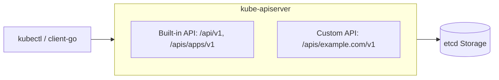
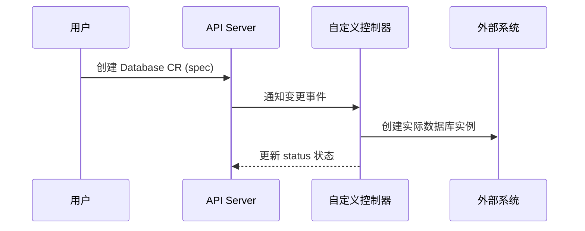

> CRD（CustomResourceDefinition，自定义资源定义）是 Kubernetes 最主流的 API 扩展机制。它让开发者无需修改核心代码，即可声明新资源类型，结合控制器实现领域自动化，是云原生生态的基石。

## 概述

**CustomResourceDefinition（CRD）** 是 Kubernetes 提供的一种“内部扩展”机制。通过它，用户可以在集群中注册新的资源类型，使 Kubernetes 原生支持这些对象的 CRUD 操作。

CRD 的出现，使得 Kubernetes 从一个固定功能的调度系统，演化为一个“可编程的控制平面（Programmable Control Plane）”。

## CRD 的工作原理

Kubernetes 的核心思想是“声明式 API”。当你创建一个 CRD 时，本质上是告诉 API Server：

> “请为我注册一个新的资源类型。”

API Server 会自动生成该类型的 REST 接口，并提供以下支持：

- CRUD（创建、查询、更新、删除）接口
- OpenAPI Schema 校验
- RBAC 权限管理
- kubectl 命令支持

整个过程不需要编写或部署额外的 API Server。




{width=1920 height=340}

## CRD 的定义结构

下方是一个典型的 CRD 对象示例：

```yaml
apiVersion: apiextensions.k8s.io/v1
kind: CustomResourceDefinition
metadata:
  name: databases.example.com
spec:
  group: example.com
  names:
    kind: Database
    plural: databases
    singular: database
    shortNames:
      - db
  scope: Namespaced
  versions:
    - name: v1
      served: true
      storage: true
      schema:
        openAPIV3Schema:
          type: object
          properties:
            spec:
              type: object
              required: ["engine", "version"]
              properties:
                engine:
                  type: string
                  enum: ["mysql", "postgres"]
                version:
                  type: string
```

下表解释了 CRD 主要字段的含义。



| 字段             | 含义                                               |
| -------------- | ------------------------------------------------ |
| `group`        | API 组名，例如 `example.com`                          |
| `names.kind`   | 资源类型名（首字母大写）                                     |
| `names.plural` | REST 路径中的复数形式，如 `/apis/example.com/v1/databases` |
| `scope`        | 作用域，`Namespaced` 或 `Cluster`                     |
| `versions`     | 支持的版本列表                                          |
| `schema`       | 用于验证的 OpenAPI v3 Schema                          |



注册完成后，可以直接使用：

```bash
kubectl get crd
kubectl get databases
kubectl apply -f mydb.yaml
```

## 自定义资源对象（Custom Resource）

CRD 定义的是“类型”，而自定义资源（CR）是“实例”。

例如：

```yaml
apiVersion: example.com/v1
kind: Database
metadata:
  name: user-db
spec:
  engine: mysql
  version: "8.0"
```

应用后，你就可以像操作 Pod 一样管理它：

```bash
kubectl get databases
kubectl describe database user-db
```

这就是 Kubernetes 的“声明式扩展”：**新增一种资源类型，而无需修改控制面。**

## CRD 与控制器（Controller）

CRD 通常与 **控制器（Controller）** 搭配使用。

CRD 负责定义“期望状态”，控制器负责**实现状态收敛**。




{width=1920 height=760}

这种模式被称为 **Operator 模式**，是构建云原生自动化系统的标准做法。

## Schema 与验证

CRD 使用 OpenAPI v3 Schema 来约束资源字段，保证集群中自定义资源的结构化一致性。

示例：

```yaml
schema:
  openAPIV3Schema:
    type: object
    properties:
      spec:
        type: object
        properties:
          replicas:
            type: integer
            minimum: 1
            maximum: 5
```

常用功能包括：

- `enum`：限定值范围
- `required`：指定必填字段
- `default`：设定默认值
- `nullable`：允许空值

## 版本管理与转换（Versioning & Conversion）

CRD 支持同时声明多个版本：

```yaml
versions:
  - name: v1alpha1
    served: true
    storage: false
  - name: v1
    served: true
    storage: true
```

通过 **Conversion Webhook**，可以在不同版本之间自动转换数据结构：

```yaml
conversion:
  strategy: Webhook
  webhook:
    clientConfig:
      service:
        name: crd-converter
        namespace: system
        path: /convert
```

这种机制允许开发者在升级 API 时保持向后兼容。

## 子资源（Subresources）

CRD 还可以声明子资源，用于支持 `/status` 和 `/scale` 路径：

```yaml
subresources:
  status: {}
  scale:
    specReplicasPath: .spec.replicas
    statusReplicasPath: .status.replicas
```

这样用户可以通过标准方式更新状态或伸缩资源：

```bash
kubectl scale database user-db --replicas=3
```

## 最佳实践

- **始终定义 Schema**：防止结构漂移。
- **启用版本管理**：方便后续 API 升级。
- **避免频繁写入 status**：降低 etcd 压力。
- **结合 Controller/Operator 使用**：让资源具备行为。
- **明确命名空间范围**：避免全局资源污染。

## 适用场景

CRD 适用于以下典型场景：

- 应用控制器（如 MySQL Operator、Kafka Operator）
- 平台级自动化资源（如 JobTemplate、Pipeline）
- AI 任务编排（如 InferenceJob、ModelDeployment）
- 观测与策略扩展（如 LogPolicy、AlertRule）

CRD 已成为几乎所有 Kubernetes 扩展项目的基础。

## 总结

CRD 是 Kubernetes 可扩展性的核心机制。通过简单的 YAML 定义，就能让集群支持新的资源类型。与控制器结合后，CRD 让开发者可以将领域知识转化为 Kubernetes 原生 API，从而实现“让一切皆可声明”的云原生编程模型。

## 参考文献

1. [CustomResourceDefinition 官方文档 - kubernetes.io](https://kubernetes.io/docs/tasks/extend-kubernetes/custom-resources/custom-resource-definitions/)
2. [Kubernetes API 设计指南 - github.com](https://github.com/kubernetes/community/blob/master/contributors/devel/sig-architecture/api-conventions.md)
3. [Kubebuilder Book: CRD 设计 - book.kubebuilder.io](https://book.kubebuilder.io/reference/generating-crd.html)
4. [Operator SDK - sdk.operatorframework.io](https://sdk.operatorframework.io/)
5. [Crossplane: Infrastructure as CRDs - crossplane.io](https://crossplane.io/)
