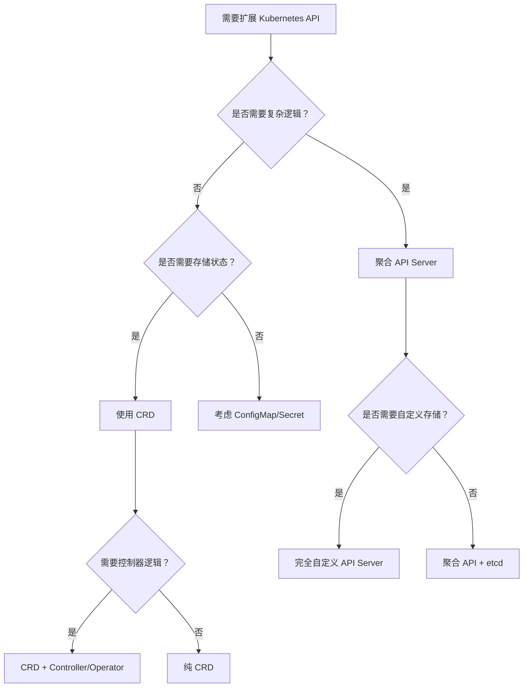

Kubernetes 提供了多种扩展 API 的方式，让开发者能够在不修改核心代码的情况下添加新的资源类型和功能。本文将全面介绍这些扩展方法，帮助您选择最适合的方案来满足特定需求。

## 扩展 API 的方式

向 Kubernetes API 中增加新类型，主要有以下几种方式：

### 1. 自定义资源定义（CRD）

**推荐指数：⭐⭐⭐⭐⭐**

CustomResourceDefinition (CRD) 是最简单、最常用的扩展方式，适用于大多数场景。

**优势：**

- 无需编写额外代码，声明式定义
- 自动获得 CRUD API 和存储支持
- 与 kubectl、客户端库完全兼容
- 支持 OpenAPI 规范和数据验证
- 内置版本控制和转换

**适用场景：**

- 配置管理
- 应用部署抽象
- Operator 模式实现
- 业务对象建模

### 2. 聚合 API Server

**推荐指数：⭐⭐⭐⭐**

通过 API 聚合层集成独立的 API Server，提供更强大的功能和灵活性。

**优势：**

- 完全自定义的 API 逻辑
- 支持自定义存储后端
- 可提供实时计算和动态数据
- 更好的性能控制

**适用场景：**

- 复杂的数据处理逻辑
- 实时监控和指标 API
- 需要特殊存储方案的场景
- 与外部系统深度集成

### 3. 修改 Kubernetes 源码

**推荐指数：⭐**

直接修改 Kubernetes 核心代码，一般不推荐。

**劣势：**

- 维护成本极高
- 升级困难
- 需要深度理解 Kubernetes 内部机制

## 自定义资源定义（CRD）详解

### 基础概念

自定义资源允许用户在 Kubernetes 集群中定义和使用自己的 API 对象类型。每个自定义资源都会像内置的 Pod、Service 等资源一样：

- 存储在 etcd 中
- 通过 Kubernetes API server 提供 RESTful API
- 支持 kubectl 命令操作
- 集成到 RBAC 权限系统

### 何时使用 CRD

在决定使用 CRD 之前，请考虑以下条件：

✅ **适合使用 CRD 的场景：**

- 你的 API 属于声明式的
- 想使用 kubectl 命令来管理
- 希望作为 Kubernetes 对象显示在 Dashboard 上
- 可以遵守 Kubernetes API 规则限制
- 可以接受 namespace 或 cluster 范围的限制
- 想复用 Kubernetes API 的公共功能（CRUD、watch、认证授权等）

❌ **不适合 CRD 的场景：**

- 需要复杂的计算逻辑
- 需要实时数据查询
- 需要自定义存储后端
- API 不是声明式的

### 创建 CRD

#### 1. 基础 CRD 定义

```yaml
apiVersion: apiextensions.k8s.io/v1
kind: CustomResourceDefinition
metadata:
  # 名称必须符合格式：<plural>.<group>
  name: crontabs.stable.example.com
spec:
  # REST API 使用的组名称：/apis/<group>/<version>
  group: stable.example.com
  # API 版本定义
  versions:
  - name: v1
    # 是否启用该版本
    served: true
    # 是否作为存储版本（有且仅有一个版本可设置为 true）
    storage: true
    schema:
      openAPIV3Schema:
        type: object
        properties:
          spec:
            type: object
            properties:
              cronSpec:
                type: string
                pattern: '^(\d+|\*)(/\d+)?(\s+(\d+|\*)(/\d+)?){4}$'
                description: "Cron 表达式"
              image:
                type: string
                minLength: 1
                description: "容器镜像"
              replicas:
                type: integer
                minimum: 1
                maximum: 100
                default: 1
                description: "副本数量"
          status:
            type: object
            properties:
              conditions:
                type: array
                items:
                  type: object
                  properties:
                    type:
                      type: string
                    status:
                      type: string
                    lastTransitionTime:
                      type: string
                      format: date-time
  # 资源范围：Namespaced 或 Cluster
  scope: Namespaced
  names:
    # URL 中使用的复数名称
    plural: crontabs
    # CLI 中使用的单数名称
    singular: crontab
    # 清单文件中使用的类型名称
    kind: CronTab
    # CLI 中使用的资源简称
    shortNames:
    - ct
    # 资源分类，便于批量操作
    categories:
    - all
    - batch
```

#### 2. 创建和验证 CRD

```bash
# 创建 CRD
kubectl apply -f crd-definition.yaml

# 验证 CRD 创建
kubectl get crd crontabs.stable.example.com

# 查看 API 资源
kubectl api-resources | grep crontab
```

### 高级特性

#### 1. 自定义打印列

自定义 `kubectl get` 输出格式：

```yaml
apiVersion: apiextensions.k8s.io/v1
kind: CustomResourceDefinition
metadata:
  name: crontabs.stable.example.com
spec:
  # ...existing code...
  versions:
  - name: v1
    served: true
    storage: true
    additionalPrinterColumns:
    - name: Spec
      type: string
      description: Cron 规范
      jsonPath: .spec.cronSpec
    - name: Replicas
      type: integer
      description: 副本数量
      jsonPath: .spec.replicas
    - name: Age
      type: date
      jsonPath: .metadata.creationTimestamp
    - name: Status
      type: string
      description: 状态
      jsonPath: .status.phase
      priority: 1  # 仅在 -o wide 时显示
    # ...existing code...
```

#### 2. 子资源支持

##### Status 子资源

启用 status 子资源，分离 spec 和 status 管理：

```yaml
apiVersion: apiextensions.k8s.io/v1
kind: CustomResourceDefinition
metadata:
  name: crontabs.stable.example.com
spec:
  # ...existing code...
  versions:
  - name: v1
    served: true
    storage: true
    subresources:
      status: {}
    # ...existing code...
```

##### Scale 子资源

支持 HPA 和 `kubectl scale` 命令：

```yaml
apiVersion: apiextensions.k8s.io/v1
kind: CustomResourceDefinition
metadata:
  name: crontabs.stable.example.com
spec:
  # ...existing code...
  versions:
  - name: v1
    served: true
    storage: true
    subresources:
      status: {}
      scale:
        specReplicasPath: .spec.replicas
        statusReplicasPath: .status.replicas
        labelSelectorPath: .status.labelSelector
    # ...existing code...
```

#### 3. Finalizer（终结器）

实现异步删除前置操作：

```yaml
apiVersion: stable.example.com/v1
kind: CronTab
metadata:
  name: my-cron-with-finalizer
  finalizers:
  - crontab.finalizers.stable.example.com/cleanup
spec:
  cronSpec: "*/5 * * * *"
  image: my-awesome-cron-image
```

### 管理自定义资源

#### 创建自定义资源实例

```yaml
apiVersion: stable.example.com/v1
kind: CronTab
metadata:
  name: my-new-cron-object
  namespace: default
spec:
  cronSpec: "*/5 * * * *"
  image: my-awesome-cron-image
  replicas: 3
```

#### 使用 kubectl 管理

```bash
# 创建资源
kubectl apply -f my-crontab.yaml

# 查看资源
kubectl get crontabs
kubectl get ct  # 使用简称

# 查看详细信息
kubectl describe crontab my-new-cron-object

# 扩容（如果启用了 scale 子资源）
kubectl scale --replicas=5 crontabs/my-new-cron-object

# 删除资源
kubectl delete crontab my-new-cron-object
```

## 聚合 API Server

### 架构概述

聚合 API Server 通过 API 聚合层（kube-aggregator）实现多个 API Server 的统一管理：


{width=800 height=600}

### 核心组件

#### kube-aggregator

聚合层的核心组件，负责：

- **API 注册管理**：通过 APIService 资源注册外部 API Server
- **请求路由**：根据 API 路径路由客户端请求
- **服务发现**：自动发现和监控 API Server 状态
- **证书管理**：处理 TLS 通信认证

#### 工作流程

1. **注册阶段**：外部 API Server 通过 APIService 向聚合层注册
2. **发现阶段**：聚合层验证并存储 API Server 元数据
3. **路由阶段**：客户端请求通过聚合层路由到对应的 API Server
4. **响应阶段**：聚合层将结果返回给客户端

### 配置聚合 API Server

#### 1. 启用聚合功能

现代 Kubernetes 集群（v1.7+）默认启用，可通过以下参数确认：

```bash
# kube-apiserver 启动参数
--enable-aggregator-routing=true
--proxy-client-cert-file=/path/to/aggregator-proxy.crt
--proxy-client-key-file=/path/to/aggregator-proxy.key
--requestheader-client-ca-file=/path/to/front-proxy-ca.crt
--requestheader-allowed-names=front-proxy-client
--requestheader-extra-headers-prefix=X-Remote-Extra-
--requestheader-group-headers=X-Remote-Group
--requestheader-username-headers=X-Remote-User
```

#### 2. 创建 APIService

```yaml
apiVersion: apiregistration.k8s.io/v1
kind: APIService
metadata:
  name: v1alpha1.custom.example.com
spec:
  group: custom.example.com
  version: v1alpha1
  # 指向自定义 API Server 的 Service
  service:
    name: custom-api-server
    namespace: custom-system
    port: 443
  # API 优先级设置
  groupPriorityMinimum: 100
  versionPriority: 15
  # 是否跳过 TLS 验证（生产环境不推荐）
  insecureSkipTLSVerify: false
  # CA Bundle for TLS verification
  caBundle: LS0tLS1CRUdJTi...  # base64 encoded CA certificate
```

#### 3. 部署自定义 API Server

```yaml
apiVersion: apps/v1
kind: Deployment
metadata:
  name: custom-api-server
  namespace: custom-system
spec:
  replicas: 2
  selector:
    matchLabels:
      app: custom-api-server
  template:
    metadata:
      labels:
        app: custom-api-server
    spec:
      containers:
      - name: api-server
        image: custom/api-server:latest
        ports:
        - containerPort: 8443
          name: webhook-api
        volumeMounts:
        - name: webhook-tls-certs
          mountPath: /etc/certs
          readOnly: true
        env:
        - name: TLS_CERT_FILE
          value: /etc/certs/tls.crt
        - name: TLS_PRIVATE_KEY_FILE
          value: /etc/certs/tls.key
      volumes:
      - name: webhook-tls-certs
        secret:
          secretName: api-server-certs
---
apiVersion: v1
kind: Service
metadata:
  name: custom-api-server
  namespace: custom-system
spec:
  selector:
    app: custom-api-server
  ports:
  - port: 443
    targetPort: webhook-api
    protocol: TCP
    name: webhook-api
```

### 开发自定义 API Server

#### 基础结构

```go
package main

import (
    "context"
    "fmt"
    "net/http"
    
    "k8s.io/apimachinery/pkg/runtime"
    "k8s.io/apimachinery/pkg/runtime/schema"
    "k8s.io/apiserver/pkg/registry/rest"
    genericapiserver "k8s.io/apiserver/pkg/server"
    "k8s.io/apiserver/pkg/server/options"
)

// 定义 API 组和版本
var (
    GroupName = "custom.example.com"
    GroupVersion = schema.GroupVersion{
        Group:   GroupName,
        Version: "v1alpha1",
    }
)

// 实现 REST Storage 接口
type CustomREST struct {
    // 存储实现
}

func (r *CustomREST) New() runtime.Object {
    return &Custom{}
}

func (r *CustomREST) Create(ctx context.Context, obj runtime.Object, createValidation rest.ValidateObjectFunc, options *metav1.CreateOptions) (runtime.Object, error) {
    // 创建逻辑
    return obj, nil
}

// 主函数
func main() {
    // 配置和启动 API Server
    recommendedOptions := options.NewRecommendedOptions("", nil)
    
    config := genericapiserver.NewRecommendedConfig(codecs)
    server, err := config.Complete().New("custom-api-server", genericapiserver.NewEmptyDelegate())
    if err != nil {
        panic(err)
    }
    
    // 注册 API 路由
    apiGroupInfo := genericapiserver.NewDefaultAPIGroupInfo(GroupName, Scheme, metav1.ParameterCodec, Codecs)
    apiGroupInfo.VersionedResourcesStorageMap[GroupVersion.Version] = map[string]rest.Storage{
        "customs": &CustomREST{},
    }
    
    server.InstallAPIGroup(&apiGroupInfo)
    
    // 启动服务器
    server.PrepareRun().Run(context.Background())
}
```

## 选择合适的扩展方式

### 决策流程



### 对比表格

| 特性 | CRD | 聚合 API Server | 修改源码 |
|------|-----|-----------------|----------|
| **实现难度** | ⭐ | ⭐⭐⭐ | ⭐⭐⭐⭐⭐ |
| **维护成本** | ⭐ | ⭐⭐⭐ | ⭐⭐⭐⭐⭐ |
| **功能灵活性** | ⭐⭐ | ⭐⭐⭐⭐⭐ | ⭐⭐⭐⭐⭐ |
| **性能** | ⭐⭐⭐ | ⭐⭐⭐⭐ | ⭐⭐⭐⭐⭐ |
| **存储自定义** | ❌ | ✅ | ✅ |
| **版本兼容性** | ✅ | ⭐⭐⭐ | ❌ |

## 最佳实践

### CRD 最佳实践

1. **版本管理**
   - 使用语义化版本号
   - 支持多版本并存和转换
   - 合理设置 storage 版本

2. **Schema 设计**
   - 提供详细的字段描述
   - 设置合理的默认值和约束
   - 使用适当的验证规则

3. **命名规范**
   - 使用有意义的资源名称
   - 遵循 Kubernetes 命名约定
   - 提供合适的短名称和分类

### 聚合 API Server 最佳实践

1. **安全性**
   - 正确配置 TLS 证书
   - 启用 RBAC 访问控制
   - 实现适当的认证授权

2. **可靠性**
   - 实现健康检查端点
   - 添加监控和告警
   - 设计优雅关闭机制

3. **性能优化**
   - 实现连接池和缓存
   - 设置合理的超时参数
   - 监控资源使用情况

### 通用最佳实践

1. **API 设计**
   - 遵循 RESTful 原则
   - 实现标准的 Kubernetes API 约定
   - 提供清晰的错误响应

2. **运维考虑**
   - 实现适当的 Finalizer 逻辑
   - 提供完整的状态管理
   - 支持备份和恢复

3. **文档和测试**
   - 提供详细的 API 文档
   - 编写完整的测试用例
   - 提供使用示例和最佳实践

## 总结

Kubernetes 提供了灵活多样的 API 扩展方式：

- **CRD** 适合大多数场景，简单易用，是首选方案
- **聚合 API Server** 适合需要复杂逻辑和自定义存储的场景
- **修改源码** 仅在极特殊情况下考虑

选择合适的扩展方式，遵循最佳实践，可以构建出既强大又易维护的 Kubernetes 扩展功能。

## 参考资料

- [Custom Resources - kubernetes.io](https://kubernetes.io/docs/concepts/extend-kubernetes/api-extension/custom-resources/)
- [Extend the Kubernetes API with CustomResourceDefinitions - kubernetes.io](https://kubernetes.io/docs/tasks/extend-kubernetes/custom-resources/custom-resource-definitions/)
- [API Aggregation - kubernetes.io](https://kubernetes.io/docs/concepts/extend-kubernetes/api-extension/apiserver-aggregation/)
- [Kubernetes Operators - kubernetes.io](https://kubernetes.io/docs/concepts/extend-kubernetes/operator/)
