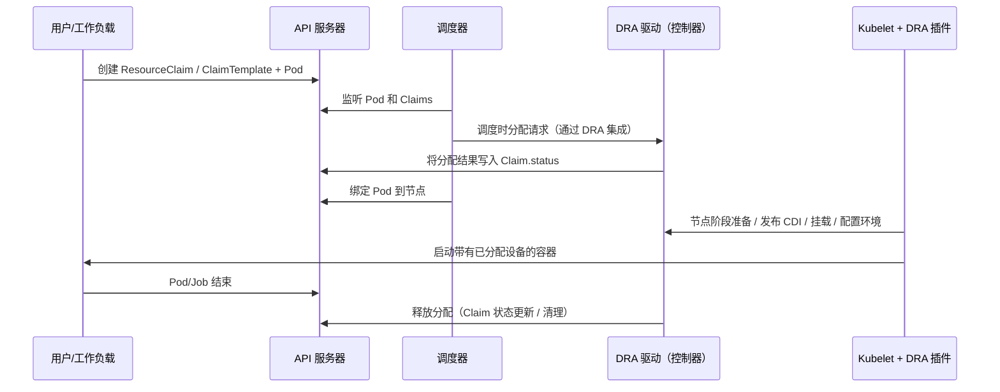

> 异构硬件的复杂性不应固化在 Kubernetes 核心，DRA 让设备分配变得灵活、可扩展，并为未来的算力治理奠定基础。

DRA（Dynamic Resource Allocation，动态资源分配）是 Kubernetes 面向“设备类资源”（如 GPU、FPGA、RDMA、加速卡、SmartNIC 等）的新一代分配模型。与传统的 *extended resources + device plugin* “按整数计数”方式相比，DRA 允许工作负载根据 **属性、容量与约束** 请求设备，并将“设备选择、分配与注入”的关键决策交由 DRA Driver 实现，从而获得更高的灵活性与可扩展性。


在 Kubernetes v1.34 版本中，DRA 已进入 stable 阶段并默认启用（实际分配设备仍需安装对应驱动）。


## 为什么需要 DRA

传统模型下，最常见的做法是为节点暴露一个类似 `vendor.com/gpu: 8` 的扩展资源，Pod 通过 `resources.limits` 申请整数个 GPU。但这种方式在工程实践中存在结构性瓶颈：

- **难以表达“按属性选择”**：例如必须指定某型号、算力、拓扑（如同 NUMA/PCIe Switch）、厂商或驱动版本。
- **难以表达“按容量切分/共享”**：如同一块 GPU 需按显存、MIG profile、时间片、带宽等维度切分。
- **设备选择逻辑难以标准化**：不同厂商/驱动对“可用设备”的定义各异，Kubernetes 不宜内置这些语义。
- **晚绑定与多阶段协商受限**：部分设备需在调度后、运行前进行最终分配与初始化（如生成 CDI 规范、准备 IOMMU/绑定、固件等）。

DRA 的核心价值在于：Kubernetes 负责调度框架与声明式 API，**设备语义由 Driver 承担**，从而避免将异构硬件的复杂性固化进 Kubernetes 核心。

## DRA 的核心对象与角色

DRA 引入（或强化）了一组围绕 `resource.k8s.io` API 的对象，用于串联“设备请求—设备可用性—分配结果”的全流程：

### DeviceClass：设备类型与选择规则（集群侧）

`DeviceClass` 描述一类可分配设备的“抽象入口”，包含如下要素：

- 由哪个 driver 管理（`spec.driverName`）
- 选择规则（selectors，可用 CEL 表达式过滤驱动发布的设备属性）
- 可选参数（parameters，用于将配置传递给 driver）

它更像“设备池/设备类”的入口，而非具体某块设备。

### ResourceClaim：一次具体的设备请求（命名空间内）

`ResourceClaim` 是工作负载侧实际“申请设备”的对象，表达如下内容：

- 需要哪类设备（通过 `DeviceClass`）
- 需要什么约束/容量（由 driver 理解）
- 分配结果（写入 `status`，由 driver/控制面完成）

一个 `ResourceClaim` 可被一个或多个 Pod 引用（取决于 driver 支持与 claim 设计目标）。

### ResourceClaimTemplate：声明式模板（按需创建 Claim）

如不希望手动创建 `ResourceClaim`，可用 `ResourceClaimTemplate` 作为模板，让 Kubernetes 在创建 Pod/Job 时自动生成对应 claim，实现“随 Pod 生命周期按需申请”。

### ResourceSlice：设备可用性发布（driver 侧）

DRA driver 通过 `ResourceSlice` 向集群发布其管理的设备清单与属性（如型号、拓扑、容量、可切分能力等）。调度与分配阶段会基于这些信息做决策。

## DRA 的工作流：从“声明”到“注入”

DRA 采用“声明式 + 多阶段协商”流程，整体工作流如下：




{width=1331 height=551}

流程要点包括：

- **调度阶段**：Scheduler 不仅需选节点，还需与 driver 协同确保“该节点上确实能满足 claim 的设备请求”。
- **节点阶段**：Kubelet 侧通过插件与 driver 协作完成“设备注入”（如生成 CDI 规范、挂载设备节点、配置环境变量、准备 runtime hooks 等）。
- **语义外置**：哪些属性可选、如何切分、是否支持共享、何时释放，均由 driver 实现负责。

## 工作负载如何使用 DRA：示例（Claim + Template + Pod/Job）

以下通过官方示例结构，演示关键写法（重点在字段位置与引用方式）。

### 创建 ResourceClaimTemplate（推荐：按需创建）

在实际应用中，通常推荐通过模板自动创建 claim。下面是一个 ResourceClaimTemplate 的 YAML 示例：

```yaml
apiVersion: resource.k8s.io/v1
kind: ResourceClaimTemplate
metadata:
  name: example-resource-claim-template
spec:
  spec:
    requests:
    - name: req-0
      deviceClassName: example-device-class
      selectors:
      - cel:
          expression: device.attributes["dra.example.com/numa"].value == "0"
      allocationMode: ExactCount
      count: 1
```

此处需注意：

- `requests[]` 可表达多个请求片段（如需 1 块 GPU + 1 张 RDMA NIC）。
- `selectors` 用于按设备属性筛选（示例用 CEL 表达 NUMA 亲和）。
- `allocationMode/count` 表达“数量”是最基础的方式；更复杂的“容量/切分”通常由 driver 的 parameters/attributes 实现。

### 创建 ResourceClaim（可复用：多个 Pod/容器共享同一 claim）

如需多个 Pod/容器共享同一 claim，可手动创建 ResourceClaim：

```yaml
apiVersion: resource.k8s.io/v1
kind: ResourceClaim
metadata:
  name: example-resource-claim
spec:
  devices:
    requests:
    - name: req-0
      deviceClassName: example-device-class
      selectors:
      - cel:
          expression: device.attributes["dra.example.com/numa"].value == "0"
      allocationMode: ExactCount
      count: 1
```

### 在 Pod/Job 中引用（核心：Pod 级 `resourceClaims` + 容器级 `resources.claims`）

下例展示了如何在 Job 中引用 claim。一个容器独占一个 claim，另两个容器共享同一个 claim：

```yaml
apiVersion: batch/v1
kind: Job
metadata:
  name: example-dra-job
spec:
  completions: 10
  parallelism: 2
  template:
    spec:
      restartPolicy: Never
      containers:
      - name: container0
        image: ubuntu:24.04
        command: ["sleep", "9999"]
        resources:
          claims:
          - name: separate-gpu-claim
      - name: container1
        image: ubuntu:24.04
        command: ["sleep", "9999"]
        resources:
          claims:
          - name: shared-gpu-claim
      - name: container2
        image: ubuntu:24.04
        command: ["sleep", "9999"]
        resources:
          claims:
          - name: shared-gpu-claim
      resourceClaims:
      - name: separate-gpu-claim
        resourceClaimTemplateName: example-resource-claim-template
      - name: shared-gpu-claim
        resourceClaimName: example-resource-claim
```

此结构有两个必须遵循的约束：

- **Pod 级别**：用 `spec.resourceClaims[]` 声明“该 Pod 需要哪些 claim（以及 claim 来源：template 还是已存在的 claim）”。
- **容器级别**：用 `container.resources.claims[]` 声明“该容器消费 Pod 的哪一个 claim（通过 name 引用）”。

## 集群侧需要做什么：启用与安装驱动

虽然 DRA 在 v1.34 已 stable 并默认启用，但集群要真正支持设备分配，还需完成以下准备：

- 安装 DRA driver（通常包含 controller + kubelet plugin，以及必要的 RBAC、DaemonSet/Deployment 等）
- driver 发布 `ResourceSlice`（让集群获知有哪些设备及其属性）
- 集群管理员创建 `DeviceClass`（或由 driver/运维流程创建），为工作负载提供稳定的“入口类型”

[官方教程](https://kubernetes.io/docs/concepts/scheduling-eviction/dynamic-resource-allocation/)提供了示例 driver 的安装方式，采用 DaemonSet 在每个节点部署 kubelet plugin。生产环境 driver 通常还会补充健康检查、节点能力探测与更完善的安全边界设计。

## 与 device plugin / extended resources 的关系

DRA 并非简单“替代 device plugin”，更准确地说，它为设备类资源提供了更通用的分配抽象，并将设备语义标准化为 API + driver 行为。

为兼容既有生态，Kubernetes 也支持将 DRA 与 extended resources 关联（如在 `DeviceClass` 中指定扩展资源名，使仍使用 `vendor.com/gpu` 的工作负载可逐步迁移到 DRA 模型）。

## 什么时候应该优先使用 DRA

优先考虑 DRA 的场景通常具备以下特征：

- 设备选择需满足属性/拓扑/容量等复杂约束
- 需要设备共享或切分（如显存、MIG profile、time-slicing 等）
- 需多设备协同（如 GPU + RDMA + NVMe 等）且约束复杂
- 希望将设备策略从 Kubernetes 核心外置到厂商/平台侧（driver），并在不同集群复用同一套语义

对于 AI 推理/训练等场景，DRA 的长期意义在于：它让“算力资源”从整数配额走向“可描述、可协商、可治理”的资源模型，为后续的 GPU 虚拟化、配额/队列系统、拓扑感知调度与成本模型提供坚实的 API 基础。

## 总结

DRA 为 Kubernetes 设备类资源管理带来了更高的灵活性和可扩展性。通过声明式 API 与 driver 解耦，DRA 支持按属性、容量、拓扑等多维度请求和分配设备，满足异构硬件和 AI 场景下的复杂需求。随着 DRA 进入 stable 并逐步完善，未来的算力治理与资源调度将更加智能和可控。
