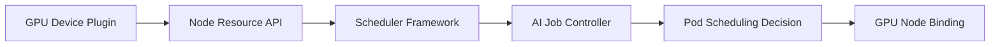
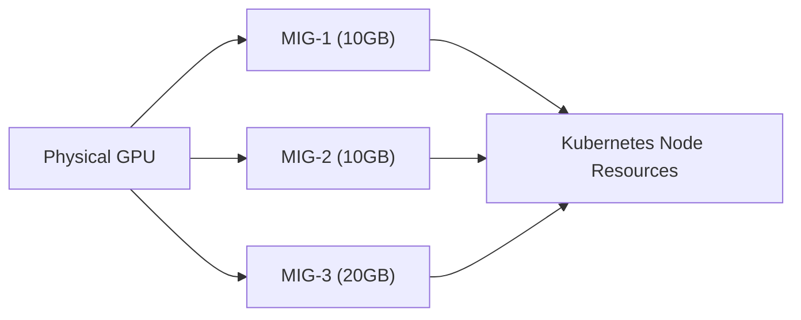
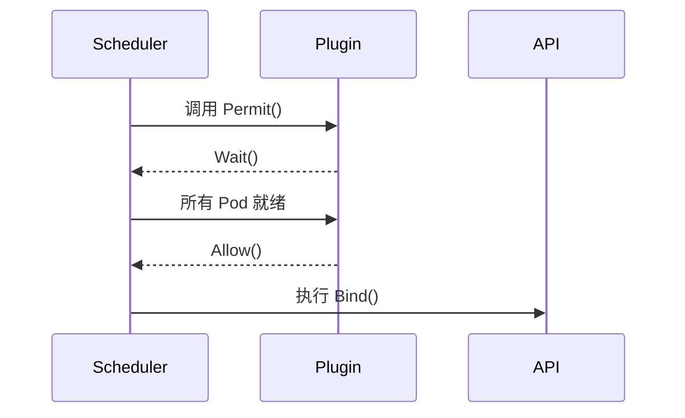
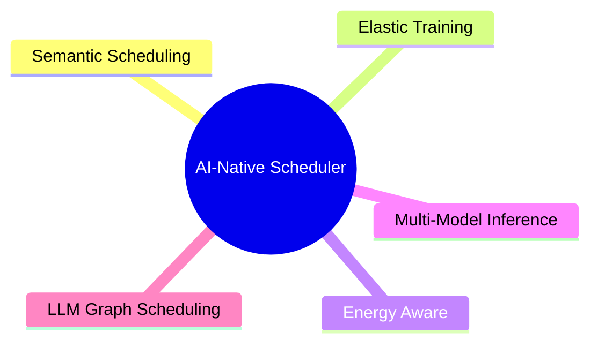

> GPU 与 AI 调度是 Kubernetes 可扩展性哲学在 AI-Native 时代的直接延伸，推动云原生基础设施向智能化进化。

在传统 Kubernetes 集群中，调度器主要关注 CPU、内存等通用资源。但在 AI 原生（AI-Native）时代，GPU、NPU、TPU 等异构加速资源成为核心瓶颈。这要求调度器具备更高的“语义理解能力”——不仅知道资源数量，还要理解拓扑结构、显存大小、任务类型与训练依赖。

Kubernetes 社区通过多种机制支持 GPU 与 AI 作业调度，主要包括：

- 设备插件（Device Plugin）
- 扩展调度框架（Scheduler Framework）
- AI 作业控制器（Volcano, Kueue, KubeRay 等）
- 调度插件（Score, Permit, Bind 等）

## GPU 调度的核心组件

下图展示了 GPU 调度的主要流程和组件关系，有助于理解各环节的协同作用。




{width=1920 height=82}

- **Device Plugin**：向 kubelet 报告 GPU 资源
- **Scheduler Framework**：执行 GPU 感知的过滤与打分
- **AI Job Controller**：定义任务依赖与同步调度
- **Pod Binding**：最终在 GPU 节点上启动容器

## GPU 设备插件（Device Plugin）

NVIDIA 提供的官方 GPU 插件为 Kubernetes 提供 `nvidia.com/gpu` 资源。通过如下命令部署插件：

```bash
kubectl apply -f https://raw.githubusercontent.com/NVIDIA/k8s-device-plugin/v0.15.0/nvidia-device-plugin.yml
```

可以通过以下命令查看节点 GPU 信息：

```bash
kubectl describe node node01 | grep nvidia.com/gpu
```

示例输出：

```text
Capacity:
  nvidia.com/gpu: 4
Allocatable:
  nvidia.com/gpu: 4
```

在 Pod 中声明 GPU 资源：

```yaml
apiVersion: v1
kind: Pod
metadata:
  name: gpu-job
spec:
  containers:
    - name: trainer
      image: nvcr.io/nvidia/pytorch:23.10
      resources:
        limits:
          nvidia.com/gpu: 2
```

## 基于 Scheduler Framework 的 GPU 感知调度

GPU 调度涉及多维度资源匹配，传统调度器仅通过资源数量判断节点是否可用，而 GPU 场景下更复杂。下表总结了常见调度维度及插件类型。



| 调度维度       | 示例                        | 插件类型               |
| ---------- | ------------------------- | ------------------ |
| GPU 型号匹配   | A100 vs V100              | Filter Plugin      |
| 显存容量       | 40GB vs 80GB              | Score Plugin       |
| NUMA 拓扑    | CPU-GPU 亲和性               | PreFilter + Filter |
| MIG 切分     | 多任务共享 GPU                 | Reserve + Bind     |
| 多 Pod 同步调度 | Elastic Job / Barrier Job | Permit Plugin      |



## GPU 优先调度插件示例（Score Plugin）

下面是一个简单的 GPU 优先调度插件，根据节点的 GPU 数量打分。该插件可用于提升 GPU 资源利用率。

```go
package gpupriority

import (
    "context"
    v1 "k8s.io/api/core/v1"
    "k8s.io/kubernetes/pkg/scheduler/framework"
)

type GPUPriority struct{}

var _ framework.ScorePlugin = &GPUPriority{}

func (p *GPUPriority) Name() string { return "GPUPriority" }

func (p *GPUPriority) Score(ctx context.Context, state *framework.CycleState, pod *v1.Pod, nodeName string) (int64, *framework.Status) {
    node, _ := getNode(nodeName)
    gpuCount := node.Status.Capacity["nvidia.com/gpu"]
    return int64(gpuCount.Value()), framework.NewStatus(framework.Success, "")
}

func (p *GPUPriority) ScoreExtensions() framework.ScoreExtensions { return nil }
```

在 `KubeSchedulerConfiguration` 中启用：

```yaml
plugins:
  score:
    enabled:
      - name: GPUPriority
```

实际系统中可结合 GPU 监控指标（如 DCGM Exporter）实现基于显存利用率或功耗感知的动态调度。

## GPU 多任务共享（MIG / vGPU）

在 GPU 资源稀缺的场景下，一个物理 GPU 可被分割为多个逻辑 GPU（如 NVIDIA A100 的 MIG）。下图展示了 MIG 分区的资源暴露流程。




{width=1920 height=831}

MIG 模式下，每个 GPU 分区在 Kubernetes 中暴露为独立资源：

```text
nvidia.com/mig-1g.10gb: 3
nvidia.com/mig-2g.20gb: 1
```

Scheduler Framework 可以扩展插件：

- Filter Plugin：过滤 GPU 类型不匹配的节点
- Score Plugin：优先显存更匹配的节点
- Reserve Plugin：提前锁定 MIG 分区，避免竞争

## AI 训练作业与同步调度（Permit Plugin）

AI 训练任务常常由多个并行 Pod 组成（如 Parameter Server / Worker）。要求它们“要么一起运行，要么等待资源充足再一起启动”，这时就需要 Permit Plugin 实现同步调度。

下图展示了同步调度的流程：




{width=1920 height=1184}

示例插件逻辑如下：

```go
func (p *BarrierPlugin) Permit(ctx context.Context, state *framework.CycleState, pod *v1.Pod, nodeName string) (*framework.Status, time.Duration) {
    if !allPodsReady(pod.Labels["job-id"]) {
        return framework.NewStatus(framework.Wait, ""), time.Second * 10
    }
    return framework.NewStatus(framework.Success, "")
}
```

## 与 AI 作业控制器的协同：KubeRay / Volcano / Kueue

不同 AI 作业控制器在调度机制和应用场景上各具特色。下表对主流控制器进行对比。



| 控制器         | 调度机制                                  | 特色           |
| ----------- | ------------------------------------- | ------------ |
| KubeRay     | Scheduler Framework + Ray Operator    | 分布式推理与弹性训练   |
| Volcano     | 独立调度器 + 队列 + Job                      | HPC/AI 批处理任务 |
| Kueue       | Queue + Admission 控制                  | 多租户与资源公平共享   |



这些控制器都基于 Kubernetes 调度扩展机制，实现了 AI 原生调度逻辑：

- Volcano 用于批处理与并行作业
- Kueue 实现了 Job admission control
- KubeRay 适配 Ray 集群生命周期（用于 LLM 推理与分布式训练）

## 调度策略设计参考

针对不同目标，调度插件类型和策略也有所不同。下表总结了常见调度目标与对应策略。



| 目标       | 插件类型           | 策略                  |
| -------- | -------------- | ------------------- |
| GPU 负载均衡 | Score          | 依据 GPU 利用率动态打分      |
| MIG 匹配   | Filter + Score | 匹配显存分区大小            |
| 延迟容忍     | QueueSort      | 优先级与资源等待权衡          |
| 多任务同步    | Permit         | Job Barrier 同步执行    |
| AI 推理优化  | Bind           | 按 NUMA + GPU 拓扑绑定容器 |



## 实践：在 KubeRay 中启用 GPU 感知调度

以下 YAML 示例展示了如何在 KubeRay 集群中启用 GPU 感知调度，确保 worker 分配在 GPU 节点并同步启动。

```yaml
apiVersion: ray.io/v1
kind: RayCluster
metadata:
  name: ray-gpu
spec:
  headGroupSpec:
    rayStartParams:
      num-gpus: 1
  workerGroupSpecs:
    - replicas: 3
      rayStartParams:
        num-gpus: 1
      template:
        spec:
          schedulerName: custom-scheduler
          containers:
            - name: ray-worker
              image: rayproject/ray:latest
              resources:
                limits:
                  nvidia.com/gpu: 1
```

结合 GPUPriority 与 Permit 插件，可确保 worker 分配在 GPU 节点并同步启动。

## 未来趋势：AI-Native Scheduler

AI 原生调度的未来方向包括资源语义化、动态调度、能耗感知、多模型并行与 LLM-Aware Scheduling。下图展示了 AI-Native Scheduler 的主要发展方向。




{width=1920 height=1029}

## 总结

本文系统梳理了 Kubernetes 在 GPU 与 AI 原生场景下的调度机制，包括设备插件、调度框架、作业控制器与调度插件的协同。通过 Scheduler Framework + 自定义插件 + AI 作业控制器，可以构建理解 AI 任务语义、感知异构资源、具备智能决策能力的调度系统。这是从 Cloud-Native 向 AI-Native Infrastructure 进化的关键一步。

## 参考文献

- [Kubernetes GPU Scheduling Guide - nvidia.com](https://docs.nvidia.com/datacenter/cloud-native/kubernetes/index.html)
- [Kubernetes Scheduler Plugins - github.com](https://github.com/kubernetes-sigs/scheduler-plugins)
- [Volcano Scheduler Architecture - volcano.sh](https://volcano.sh/)
- [Kueue Documentation - kueue.sigs.k8s.io](https://kueue.sigs.k8s.io/)
- [KubeRay Documentation - docs.ray.io](https://docs.ray.io/en/latest/cluster/kubernetes.html)
- [AI-Native Scheduling Paper, USENIX 2025 - usenix.org](https://www.usenix.org)
