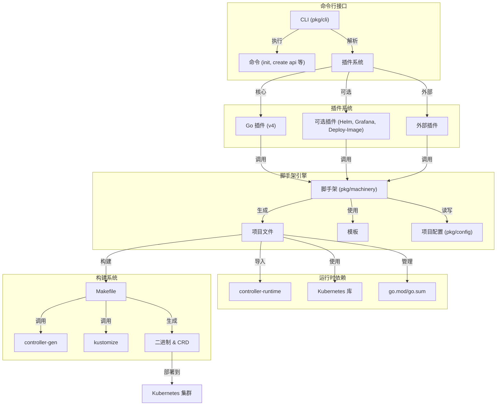
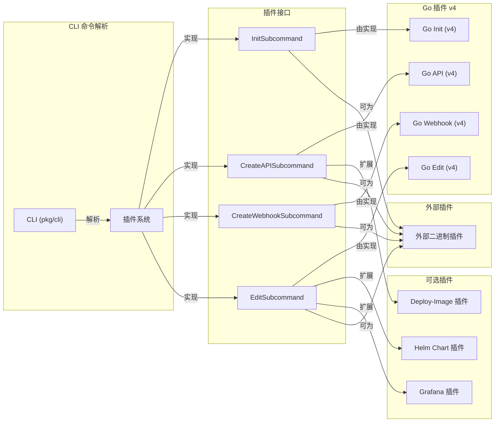
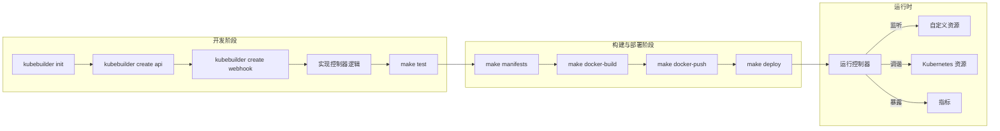
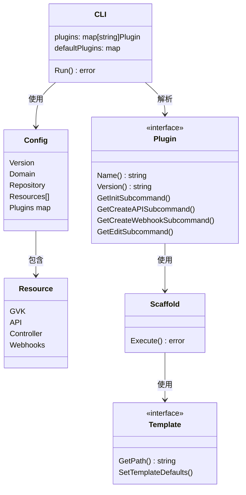
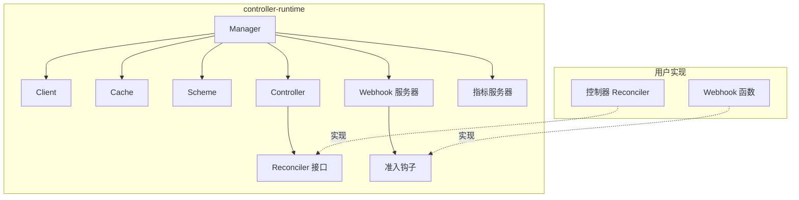
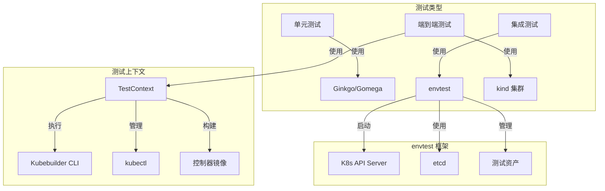
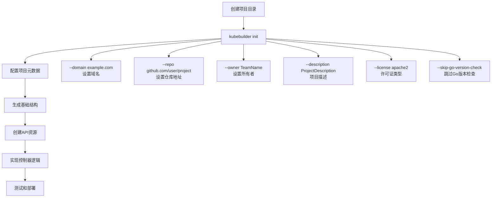

Kubebuilder 是 Kubernetes 官方推荐的 Operator 开发框架，具备现代化架构和丰富工具链，能够帮助开发者高效构建、测试和部署自定义 API 及控制器。本文将系统介绍 Kubebuilder 的核心概念、设计原则、工作流程及最佳实践，助力你快速上手并应用于生产环境。

## 概述

Kubebuilder 是一个基于 CRD 的现代化 Kubernetes API 构建框架，适用于开发 Operator、Controller 及 Webhook。其 v4.9.0 版本在性能和开发体验方面有显著提升。

### 框架简介与目标

Kubebuilder 是一个用于通过自定义资源定义（CRD）构建 Kubernetes API 的框架。它为开发者提供了一套工具和库，简化了 Operator 和 Controller 的开发流程，减少了样板代码，并遵循 Kubernetes API 的最佳实践。

类似于 Ruby on Rails 或 SpringBoot 等 Web 开发框架，Kubebuilder 通过抽象和标准化实现模式，提升了 Go 语言下 Kubernetes API 的开发效率和一致性。Kubebuilder 基于 [controller-runtime](https://github.com/kubernetes-sigs/controller-runtime) 和 [controller-tools](https://github.com/kubernetes-sigs/controller-tools) 库，负责与 Kubernetes 的底层交互。

### 系统架构与核心组件

下图展示了 Kubebuilder 的系统架构及其主要组件：




{width=1920 height=1982}

### 插件系统机制

Kubebuilder 的插件系统是其可扩展性的核心。插件实现了 CLI 命令所需的各种接口，支持核心功能和可选扩展：




{width=1920 height=1574}

Go v4 插件实现了完整的 `plugin.Full` 接口，支持项目初始化、新建 API 资源、新建 Webhook 及编辑资源。可选插件则针对镜像部署、Helm Chart 管理等场景扩展功能。

### 开发流程

Kubebuilder 提供了结构化的开发流程，便于构建高质量的 Controller：




{width=3459 height=459}

典型流程包括：

1. 项目初始化（kubebuilder init）
2. 创建 API（kubebuilder create api）
3. 安装 CRD（make install）
4. 本地运行控制器（make run）

### 项目结构说明

下表为 Kubebuilder 项目的标准目录结构及说明：



| 目录/文件 | 作用 |
| --- | --- |
| Dockerfile | 容器镜像定义 |
| Makefile | 构建规则与目标 |
| PROJECT | 项目配置元数据 |
| api/ | API 资源定义 |
| cmd/ | 主入口及管理器设置 |
| config/ | Kubernetes YAML 清单 |
| config/crd/ | 自定义资源定义 |
| config/rbac/ | RBAC 权限配置 |
| config/manager/ | 控制器管理器部署 |
| internal/controller/ | 控制器实现 |
| hack/ | 开发脚本与样板 |



该结构遵循 Kubernetes 控制器开发规范，实现 API 类型与控制器逻辑分离。

### 核心对象模型

下图展示了 Kubebuilder 的关键对象关系：




{width=1920 height=4217}

### 控制器运行时机制

Kubebuilder 项目基于 controller-runtime 库，核心组件如下：




{width=1945 height=623}

Manager 是核心，负责：

- 管理控制器
- 提供共享 client、cache、scheme
- 管理 webhook 服务器
- 暴露监控指标

控制器实现 Reconciler 接口，实现资源期望状态与实际状态的调谐。

### 监控指标与可观测性

Kubebuilder 项目通过 controller-runtime 默认支持如下指标，可集成 Prometheus：



| 指标名称 | 类型 | 说明 |
| --- | --- | --- |
| `controller_runtime_reconcile_total` | Counter | 每个控制器的调谐总次数 |
| `controller_runtime_reconcile_errors_total` | Counter | 调谐错误总次数 |
| `controller_runtime_reconcile_time_seconds` | Histogram | 每次调谐耗时 |
| `controller_runtime_max_concurrent_reconciles` | Gauge | 最大并发调谐数 |
| `controller_runtime_active_workers` | Gauge | 当前活跃 worker 数 |
| `workqueue_depth` | Gauge | 工作队列深度 |
| `workqueue_adds_total` | Counter | 工作队列处理的总添加数 |



默认暴露在 8443 端口，可通过 ServiceMonitor 集成 Prometheus。

### 测试体系

Kubebuilder 提供完善的测试能力：




{width=1920 height=774}

- 单元测试：针对函数逻辑
- 集成测试：使用 envtest 启动 API Server
- 端到端测试：使用真实 kind 集群

## 快速开始

本节将介绍如何使用 Kubebuilder v4.9.0 初始化项目并实现核心功能。

### 项目初始化

下图为 Kubebuilder 项目初始化流程：




{width=2146 height=1085}

创建项目：

```bash
mkdir guestbook-operator && cd guestbook-operator

kubebuilder init \
  --domain example.com \
  --repo github.com/example/guestbook-operator \
  --owner "Example Team" \
  --description "A sample Guestbook operator" \
  --license apache2 \
  --skip-go-version-check \
  --plugins go/v4
```

创建 API 资源：

```bash
kubebuilder create api \
  --group webapp \
  --version v1 \
  --kind Guestbook \
  --resource \
  --controller \
  --namespaced \
  --make=false

make generate
make manifests
```

项目结构如下：

```text
.
├── Dockerfile.multiarch
├── Makefile
├── PROJECT
├── api/
│   └── v1/
│       ├── guestbook_types.go
│       ├── zz_generated.conversion.go
│       ├── zz_generated.deepcopy.go
│       └── zz_generated.defaults.go
├── bin/
├── config/
│   ├── crd/
│   ├── default/
│   ├── manager/
│   ├── prometheus/
│   ├── rbac/
│   ├── samples/
│   └── webhook/
├── hack/
├── internal/
│   └── controller/
│       └── guestbook_controller.go
├── cmd/
│   └── main.go
├── test/
│   ├── e2e/
│   └── integration/
├── Dockerfile
└── go.work
```

### 定义 CRD 结构

编辑 `api/v1/guestbook_types.go`，示例代码如下：

```go
// GuestbookSpec 定义期望状态
type GuestbookSpec struct {
    // Name 是留言簿的显示名称
    // +kubebuilder:validation:Required
    // +kubebuilder:validation:MinLength=1
    // +kubebuilder:validation:MaxLength=64
    // +kubebuilder:validation:Pattern="^[a-zA-Z0-9]([a-zA-Z0-9\\-]*[a-zA-Z0-9])?$"
    Name string `json:"name"`

    // Message 是可选的欢迎消息
    // +kubebuilder:validation:Optional
    // +kubebuilder:validation:MaxLength=512
    Message string `json:"message,omitempty"`

    // Replicas 指定副本数量
    // +kubebuilder:validation:Minimum=1
    // +kubebuilder:validation:Maximum=100
    // +kubebuilder:default=1
    Replicas int32 `json:"replicas,omitempty"`

    // Resources 定义资源需求
    // +kubebuilder:validation:Optional
    Resources corev1.ResourceRequirements `json:"resources,omitempty"`

    // ConfigMapName 指定使用的配置映射
    // +kubebuilder:validation:Optional
    // +kubebuilder:validation:Pattern="^[a-z0-9]([-a-z0-9]*[a-z0-9])?$"
    ConfigMapName string `json:"configMapName,omitempty"`
}

// GuestbookStatus 定义观察到的状态
type GuestbookStatus struct {
    // Phase 表示当前阶段
    // +kubebuilder:validation:Optional
    // +kubebuilder:validation:Enum=Pending;Running;Failed;Scaling
    Phase string `json:"phase,omitempty"`

    // ReadyReplicas 表示就绪的副本数
    // +kubebuilder:validation:Optional
    ReadyReplicas int32 `json:"readyReplicas,omitempty"`

    // ObservedGeneration 是最后观察到的生成版本
    // +kubebuilder:validation:Optional
    ObservedGeneration int64 `json:"observedGeneration,omitempty"`

    // Conditions 表示详细的状态条件
    // +kubebuilder:validation:Optional
    Conditions []metav1.Condition `json:"conditions,omitempty"`

    // LastUpdateTime 是最后更新时间
    // +kubebuilder:validation:Optional
    LastUpdateTime metav1.Time `json:"lastUpdateTime,omitempty"`
}

// Guestbook 是 Guestbook API 的 Schema
// +kubebuilder:object:root=true
// +kubebuilder:resource:categories=guestbook,shortName=gb
// +kubebuilder:subresource:status
// +kubebuilder:subresource:scale:specpath=.spec.replicas,statuspath=.status.readyReplicas,selectorpath=.status.selector
// +kubebuilder:printcolumn:name="Phase",type="string",JSONPath=".status.phase",description="Current phase"
// +kubebuilder:printcolumn:name="Ready",type="integer",JSONPath=".status.readyReplicas",description="Number of ready replicas"
// +kubebuilder:printcolumn:name="Age",type="date",JSONPath=".metadata.creationTimestamp",description="Age of the resource"
// +kubebuilder:storageversion
type Guestbook struct {
    metav1.TypeMeta   `json:",inline"`
    metav1.ObjectMeta `json:"metadata,omitempty"`

    Spec   GuestbookSpec   `json:"spec,omitempty"`
    Status GuestbookStatus `json:"status,omitempty"`
}

// +kubebuilder:object:root=true

// GuestbookList 包含 Guestbook 列表
type GuestbookList struct {
    metav1.TypeMeta `json:",inline"`
    metav1.ListMeta `json:"metadata,omitempty"`
    Items           []Guestbook `json:"items"`
}
```

### 实现 Controller 逻辑

编辑 `internal/controller/guestbook_controller.go`，核心逻辑如下：

```go
func (r *GuestbookReconciler) Reconcile(ctx context.Context, req ctrl.Request) (ctrl.Result, error) {
  log := log.FromContext(ctx)

  // 获取 Guestbook 实例
  var guestbook webappv1.Guestbook
  if err := r.Get(ctx, req.NamespacedName, &guestbook); err != nil {
    if apierrors.IsNotFound(err) {
      log.Info("Guestbook resource not found, probably deleted")
      return ctrl.Result{}, nil
    }
    log.Error(err, "Failed to get Guestbook")
    return ctrl.Result{}, err
  }

  log.Info("Reconciling Guestbook", "name", guestbook.Name, "namespace", guestbook.Namespace)

  // 更新状态
  guestbook.Status.Phase = "Running"
  guestbook.Status.ReadyReplicas = guestbook.Spec.Replicas

  if err := r.Status().Update(ctx, &guestbook); err != nil {
    log.Error(err, "Failed to update Guestbook status")
    return ctrl.Result{}, err
  }

  return ctrl.Result{RequeueAfter: time.Minute * 5}, nil
}

// SetupWithManager 设置 Controller
func (r *GuestbookReconciler) SetupWithManager(mgr ctrl.Manager) error {
  return ctrl.NewControllerManagedBy(mgr).
    For(&webappv1.Guestbook{}).
    Complete(r)
}
```

### 测试和部署

安装 CRD：

```bash
make install
```

本地运行 Controller：

```bash
make run
```

创建测试资源，编辑 `config/samples/webapp_v1_guestbook.yaml`：

```yaml
apiVersion: webapp.example.com/v1
kind: Guestbook
metadata:
  name: guestbook-sample
  namespace: default
spec:
  name: "Hello Kubebuilder"
  message: "Welcome to Kubebuilder!"
  replicas: 3
```

应用资源：

```bash
kubectl apply -f config/samples/webapp_v1_guestbook.yaml
```

查看结果：

```bash
kubectl get crd
kubectl get guestbooks
kubectl describe guestbook guestbook-sample
```

部署到集群：

```bash
make docker-build docker-push IMG=your-registry/guestbook-operator:latest
make deploy IMG=your-registry/guestbook-operator:latest
```

## 高级特性

### Webhook

添加验证和变更 Webhook：

```bash
kubebuilder create webhook --group webapp --version v1 --kind Guestbook --defaulting --programmatic-validation
```

### 多版本支持

创建多版本 API：

```bash
kubebuilder create api --group webapp --version v2 --kind Guestbook
```

### 性能优化

在 `main.go` 中配置 Controller 选项：

```go
if err = (&controller.GuestbookReconciler{
  Client: mgr.GetClient(),
  Scheme: mgr.GetScheme(),
}).SetupWithManager(mgr, controller.GuestbookReconcilerOptions{
  MaxConcurrentReconciles: 2,
}); err != nil {
  setupLog.Error(err, "unable to create controller", "controller", "Guestbook")
  os.Exit(1)
}
```

## 最佳实践

### 错误处理

```go
if apierrors.IsNotFound(err) {
  return ctrl.Result{}, nil
}
if apierrors.IsConflict(err) {
  return ctrl.Result{RequeueAfter: time.Second * 5}, nil
}
```

### 状态管理

```go
meta.SetStatusCondition(&guestbook.Status.Conditions, metav1.Condition{
  Type:    "Ready",
  Status:  metav1.ConditionTrue,
  Reason:  "GuestbookReady",
  Message: "Guestbook is ready",
})
```

### 日志记录

```go
log.Info("Reconciling resource", 
  "guestbook", guestbook.Name,
  "namespace", guestbook.Namespace,
  "generation", guestbook.Generation)
```

### 测试

```go
var _ = Describe("Guestbook Controller", func() {
  Context("When creating a Guestbook", func() {
    It("Should update the status", func() {
      // 测试逻辑
    })
  })
})
```

## 故障排查

常见问题及调试技巧：

- CRD 安装失败，可通过如下命令排查：

  ```bash
  kubectl get crd | grep guestbook
  kubectl describe crd guestbooks.webapp.example.com
  ```

- Controller 启动失败：

  ```bash
  kubectl logs -n system deployment/controller-manager
  ```

- 权限问题，需检查 RBAC 配置，确保 ServiceAccount 权限充足。

调试建议：

- 增加日志级别：

  ```bash
  make run ARGS="--zap-log-level=debug"
  ```

- 查看事件：

  ```bash
  kubectl get events --sort-by=.metadata.creationTimestamp
  ```

## 总结

Kubebuilder 提供了完整的 Kubernetes Operator 开发体验，从项目初始化到生产部署。通过本文，你已掌握：

- Kubebuilder 的核心概念与工作流程
- CRD 的创建与定义方法
- Controller 业务逻辑实现
- Operator 的测试与部署流程
- 最佳实践与故障排查技巧

建议进一步探索 Webhook、多版本支持、性能优化等高级特性，提升 Operator 开发能力。

## 参考资料

1. [Kubebuilder 官方文档 - book.kubebuilder.io](https://book.kubebuilder.io/)
2. [Kubernetes API 扩展 - kubernetes.io](https://kubernetes.io/docs/concepts/extend-kubernetes/api-extension/)
3. [Controller Runtime - github.com](https://github.com/kubernetes-sigs/controller-runtime)
4. [Operator Pattern - kubernetes.io](https://kubernetes.io/docs/concepts/extend-kubernetes/operator/)
5. [Kind 快速开始 - kind.sigs.k8s.io](https://kind.sigs.k8s.io/docs/user/quick-start/)
