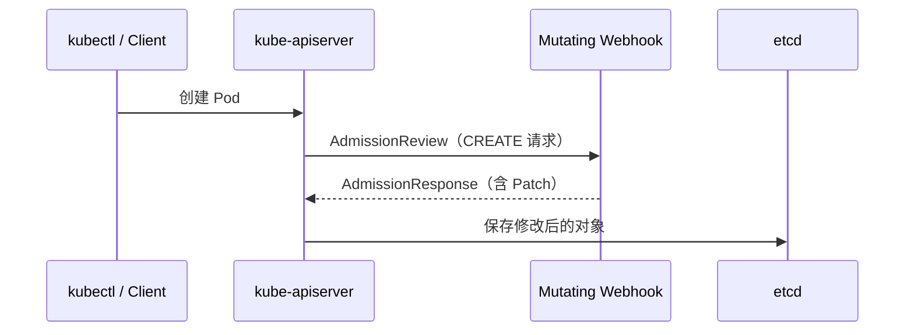
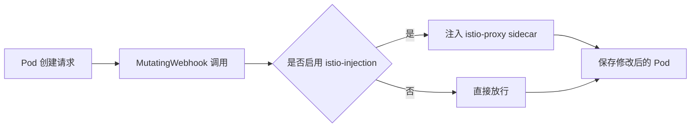

> Mutating Webhook 让 Kubernetes 集群具备“动态变更”能力，无需修改核心代码即可实现自动注入、资源规范统一等高级功能，是云原生架构可扩展性的典范。

## Mutating Webhook 扩展：自动注入与资源修改控制

在 Kubernetes 的 API 请求生命周期中，**准入控制器**（Admission Controller）是一个重要的扩展点。  
其中，**MutatingAdmissionWebhook**（变更型 Webhook）是最灵活的机制之一，允许开发者在对象被保存进 etcd 之前，对其进行自动修改（mutate）。

常见应用场景包括：

- 自动注入 sidecar（如 Istio、Linkerd）；
- 自动添加默认标签、注解或字段；
- 动态设置容器资源限制；
- 在多租户或策略控制系统中统一配置 Pod 规范。

这些能力极大提升了集群的自动化和规范化水平。

## 工作原理

Mutating Webhook 在 Kubernetes API Server 中的执行顺序如下。下图展示了请求流程：



下图为流程示意图：


{width=1920 height=705}

流程说明：

- Webhook 服务通过 HTTPS 提供 `/mutate` 接口；
- API Server 将待创建对象封装成 AdmissionReview；
- Webhook 返回 `AdmissionResponse`，其中包含 JSON Patch；
- API Server 应用该 Patch 后再将资源保存。

这种机制保证了资源在落盘前即可被自动修改，满足多样化的业务需求。

## 示例：为 Pod 自动添加 Label

下面通过一个实际案例，演示如何使用 Mutating Webhook 自动为 Pod 添加标签。

### 编写 Webhook 服务（Python 版示例）

以下代码实现了一个简单的 Webhook 服务，自动为新建 Pod 添加标签 `mutated-by=webhook`。

```python
from flask import Flask, request, jsonify
import json

app = Flask(__name__)

@app.route("/mutate", methods=["POST"])
def mutate():
    review = request.get_json()
    uid = review["request"]["uid"]

    patch = [
        {
            "op": "add",
            "path": "/metadata/labels/mutated-by",
            "value": "webhook"
        }
    ]

    response = {
        "apiVersion": "admission.k8s.io/v1",
        "kind": "AdmissionReview",
        "response": {
            "uid": uid,
            "allowed": True,
            "patchType": "JSONPatch",
            "patch": json.dumps(patch).encode("utf-8").decode("latin1")
        }
    }
    return jsonify(response)

if __name__ == "__main__":
    app.run(host="0.0.0.0", port=443, ssl_context=("tls.crt", "tls.key"))
```

该服务返回一个 JSON Patch，指示 API Server 添加标签。

### 创建 MutatingWebhookConfiguration

要让 Webhook 生效，需要配置 MutatingWebhookConfiguration 资源。如下所示：

```yaml
apiVersion: admissionregistration.k8s.io/v1
kind: MutatingWebhookConfiguration
metadata:
  name: pod-labeler-webhook
webhooks:
  - name: pod-labeler.example.com
    sideEffects: None
    admissionReviewVersions: ["v1"]
    clientConfig:
      service:
        name: pod-labeler
        namespace: default
        path: /mutate
      caBundle: <BASE64_ENCODED_CA>
    rules:
      - operations: ["CREATE"]
        apiGroups: [""]
        apiVersions: ["v1"]
        resources: ["pods"]
```

配置要点：

- `operations` 指定在创建时触发；
- `caBundle` 用于验证 webhook 服务证书；
- `sideEffects: None` 表示调用无副作用；
- `path` 指定 webhook 服务端点路径。

### 验证效果

创建 Pod 后，可以通过如下命令验证标签是否自动添加：

```bash
kubectl run test --image=nginx
kubectl get pod test -o json | jq '.metadata.labels'
```

输出示例：

```json
{
  "mutated-by": "webhook",
  "run": "test"
}
```

## 实际案例：Istio Sidecar 自动注入

Istio 的自动注入机制正是通过 Mutating Webhook 实现的。  
当你在命名空间中启用标签：

```bash
kubectl label namespace default istio-injection=enabled
```

Istio 的 Webhook 会在 Pod 创建时被触发，并将 `istio-proxy` 容器自动注入到 Pod Spec 中。  
其核心逻辑是根据命名空间标签和 Pod 注解来判断是否注入。

下图展示了 Istio Sidecar 自动注入的决策流程：



下图为流程示意图：


{width=1920 height=297}

这种自动注入机制极大简化了服务网格的部署和运维。

## 调试与故障排查

在实际使用 Mutating Webhook 时，常见问题及排查建议如下。

下表总结了常见现象、可能原因及排查建议：



| 现象                   | 可能原因                       | 排查建议                       |
| ---------------------- | ------------------------------ | ------------------------------ |
| Webhook 无响应         | 服务未暴露 HTTPS 或证书错误    | 检查 `caBundle` 与 `tls.crt`   |
| Pod 创建卡在 `Pending` | Webhook 超时                   | 设置 `timeoutSeconds`          |
| Patch 无效             | Patch 路径错误或 JSON 编码问题 | 检查返回的 patch 是否为 Base64 |
| 无法连接 Webhook       | ClusterIP 或 DNS 配置错误      | 检查 Service 名称与 Namespace  |



合理配置 Webhook 服务和 Kubernetes 资源，可有效避免上述问题。

## 最佳实践

为了保证 Mutating Webhook 的稳定性和安全性，建议遵循以下最佳实践：

- Webhook 服务必须使用 HTTPS；
- 确保 `caBundle` 与 webhook 服务证书匹配；
- 设置合理的超时时间（如 5s）；
- 对请求体大小与 Patch 操作进行限制；
- 实现幂等逻辑（避免重复注入）；
- 建议部署副本并使用 `Deployment` + `Service` + `PodDisruptionBudget`。

这些措施有助于提升系统的可靠性和可维护性。

## 延伸阅读

以下资源有助于深入理解 Mutating Webhook 机制及相关应用：

- [Kubernetes 官方文档：Dynamic Admission Control - kubernetes.io](https://kubernetes.io/docs/reference/access-authn-authz/extensible-admission-controllers/)
- [Istio Sidecar Injection Mechanism - istio.io](https://istio.io/latest/docs/setup/additional-setup/sidecar-injection/)
- [Admission Webhook Example (官方示例) - github.com](https://github.com/kubernetes/examples/tree/master/staging/admission-webhook)
- [JSON Patch Specification (RFC 6902) - ietf.org](https://datatracker.ietf.org/doc/html/rfc6902)

## 总结

Mutating Webhook 赋予 Kubernetes 集群强大的动态变更能力，无需修改核心代码即可实现自动注入、资源规范统一等高级功能。  
无论是 Istio 的 Sidecar 注入，还是企业内部的资源规范统一，Mutating Webhook 都是实现集群可扩展性和自动化的关键机制，充分体现了 Kubernetes“可扩展而不修改（Extensible Without Forking）”的设计哲学。
