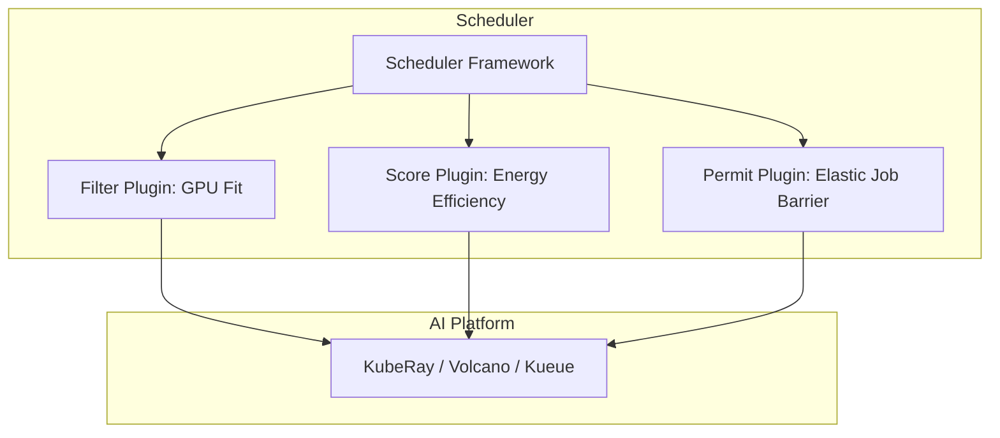

> Scheduler Framework 让 Kubernetes 调度器具备“可编程化”与“模块化”能力，支持 AI、GPU 等复杂场景下的智能调度，是云原生基础设施演进的关键。

## 调度架构与 Framework 扩展

Kubernetes 调度器（**kube-scheduler**，Kubernetes Scheduler）是集群中负责 **决定 Pod 运行在哪个节点上** 的关键组件。  
它的职责是：在考虑资源、约束与策略的前提下，为每个未绑定节点的 Pod 选择最合适的节点。

随着集群场景日益复杂（如 GPU 调度、AI 训练作业、多租户、公平调度），Kubernetes 官方在 v1.16 引入了 **Scheduler Framework**（调度框架），  
它将原本“内置逻辑”抽象为一系列插件接口，使得调度逻辑可以像 CRD 或 Webhook 一样被**动态扩展**。

## 调度器架构概览

Kubernetes 调度过程主要分为两个阶段：

1. **调度（Scheduling Cycle）**：选择最优节点；
2. **绑定（Binding Cycle）**：将 Pod 绑定到节点。

调度器通过一系列可插拔的阶段性插件（Plugins）完成决策。

调度器的流程可以概括为以下几个阶段：

1. **Pod 入队**：所有待调度的 Pod 首先进入调度队列，等待分配节点。
2. **调度循环（Scheduling Cycle）**：调度器开始为每个 Pod 选择合适的节点。
3. **预过滤（PreFilter）**：对 Pod 进行预检查，判断是否具备调度条件。
4. **过滤（Filter）**：根据资源约束、亲和性、污点等条件筛选出可用节点。
5. **后过滤（PostFilter）**：如果没有可用节点，执行回退或补偿逻辑。
6. **打分（Score）**：对剩余节点进行评分，决定优先级。
7. **分数归一化（NormalizeScore）**：统一节点分数范围，便于比较。
8. **资源保留（Reserve）**：在绑定前锁定节点资源，防止竞争冲突。
9. **准许（Permit）**：如有需要，等待外部系统确认或延迟绑定。
10. **绑定（Bind）**：将 Pod 绑定到最终选定的节点上。
11. **后置处理（PostBind）**：绑定完成后执行通知、审计等后续操作。
12. **Pod 绑定完成**：Pod 正式分配到节点，调度流程结束。

每个阶段都可以通过插件进行扩展，实现灵活的调度策略和自定义逻辑。

> 调度器的设计遵循“可组合（Composable）”思想：每个阶段都可以由插件实现或替换。

## 工作流程详解

调度器的核心流程包括以下几个阶段：

1. **调度队列（Scheduling Queue）**  
   所有待调度 Pod 会被放入优先队列（Priority Queue）中；
2. **过滤（Filter Plugins）**  
   按资源约束、亲和性、污点等条件筛掉不合适节点；
3. **打分（Score Plugins）**  
   对剩余节点进行评分（如 CPU 空闲量、拓扑分布、延迟）；
4. **绑定（Bind Plugins）**  
   选择得分最高的节点并执行绑定；
5. **异步事件（Pre/Post Bind）**  
   在绑定前后触发额外逻辑（如日志、监控、外部接口回调）。

每个阶段都可以通过插件进行扩展，实现自定义调度策略。

## Scheduler Framework 简介

Scheduler Framework 将原本单体的调度器逻辑模块化，定义了一组 **扩展点（Extension Points）**。  
开发者可以在这些扩展点上注册插件，实现自定义调度策略。

下表总结了各扩展点的作用：



| 扩展点              | 阶段   | 作用               |
| ---------------- | ---- | ---------------- |
| `QueueSort`      | 调度队列 | 控制 Pod 出队顺序      |
| `PreFilter`      | 过滤前  | 预检查 Pod 是否具备调度条件 |
| `Filter`         | 过滤   | 决定哪些节点可行         |
| `PostFilter`     | 过滤后  | 无可行节点时的回退策略      |
| `Score`          | 打分   | 对节点打分决定优先级       |
| `NormalizeScore` | 归一化  | 统一分数范围           |
| `Reserve`        | 保留资源 | 在真正绑定前锁定资源       |
| `Permit`         | 准许   | 等待外部确认或延迟绑定      |
| `Bind`           | 绑定   | 执行绑定动作           |
| `PostBind`       | 绑定后  | 执行后置处理（通知、审计等）   |



## 示例：简单自定义调度插件

下面是一个 Go 语言编写的简化版 **自定义 Filter 插件** 示例，  
用于拒绝调度到名为 `"gpu-node"` 的节点上：

```go
package main

import (
    "context"
    "fmt"
    "k8s.io/kubernetes/pkg/scheduler/framework"
)

type AvoidGPUPlugin struct{}

func (pl *AvoidGPUPlugin) Name() string {
    return "AvoidGPUPlugin"
}

func (pl *AvoidGPUPlugin) Filter(
    ctx context.Context, state *framework.CycleState,
    pod *v1.Pod, nodeInfo *framework.NodeInfo,
) *framework.Status {
    if nodeInfo.Node().Name == "gpu-node" {
        return framework.NewStatus(framework.Unschedulable, "Avoid scheduling on GPU nodes")
    }
    return framework.NewStatus(framework.Success, "")
}

var _ framework.FilterPlugin = &AvoidGPUPlugin{}
```

注册插件（通过配置文件）：

```yaml
apiVersion: kubescheduler.config.k8s.io/v1
kind: KubeSchedulerConfiguration
profiles:
  - schedulerName: default-scheduler
    plugins:
      filter:
        enabled:
          - name: AvoidGPUPlugin
    pluginConfig:
      - name: AvoidGPUPlugin
        args: {}
```

该插件可用于实现自定义调度策略，满足特定业务需求。

## 插件的生命周期与运行模式

Scheduler Framework 插件可以通过三种方式运行：



| 模式                           | 说明                   | 典型应用        |
| ---------------------------- | -------------------- | ----------- |
| 内置插件（In-tree）              | 直接编译进调度器二进制          | 官方默认策略      |
| 外部插件（Out-of-tree）          | 独立进程，通过 KEP-785 动态注册 | GPU、AI 调度扩展 |
| 调度配置文件（Scheduler Profile） | 通过 YAML 指定启用哪些插件     | 多租户、策略切换    |



合理选择插件运行模式，有助于提升调度器的灵活性和可维护性。

## 典型应用场景

在实际生产环境中，Scheduler Framework 支持多种调度扩展场景：



| 场景                         | 插件类型               | 示例           |
| -------------------------- | ------------------ | ------------ |
| GPU 节点优先调度             | Score Plugin       | 依据 GPU 空闲量打分 |
| AI 训练作业绑定策略            | Permit Plugin      | 等待主从任务同时可调度  |
| 分区调度 / 拓扑感知            | PreFilter + Filter | 过滤掉不在拓扑域内的节点 |
| 延迟调度（Delay Scheduling） | QueueSort + Permit | 提高资源利用率      |
| 自定义亲和策略                | Score              | 依据业务权重选择节点   |



这些场景充分体现了调度器的可扩展性和灵活性。

## Scheduler Framework 与 AI 原生调度

在 AI 场景下，调度器常常需要考虑：

- GPU 类型、显存、拓扑；
- 节点能耗与性能平衡；
- 多任务共享 GPU（MIG / vGPU）；
- Job 级别资源对齐（Elastic Training）；
- 网络延迟与带宽。

因此，越来越多的 AI 平台（如 **KubeRay、Volcano、Kueue**）都基于 Scheduler Framework 构建自己的自定义调度器。

下图展示了 AI 原生调度的插件协作关系：




{width=1920 height=1127}

这些插件协同工作，实现了面向 AI 任务的智能调度。

## 最佳实践与建议

为了提升调度器的可维护性和扩展性，建议遵循以下最佳实践：

- 使用 Scheduler Framework 替代自定义调度器 fork；
- 避免直接修改 kube-scheduler 源码；
- 插件逻辑应保持幂等与轻量；
- 使用 `--config` 启用多个调度 profile；
- 对复杂逻辑（如 AI Job）可结合 `Permit` 与外部控制器协作。

这些建议有助于构建高效、可扩展的调度系统。

## 延伸阅读

以下资源有助于深入理解 Scheduler Framework 及相关应用：

- [Kubernetes 官方文档：Scheduler Framework - kubernetes.io](https://kubernetes.io/docs/concepts/scheduling-eviction/scheduler-extensions/)
- [KEP-785: Scheduler Plugin Framework - github.com](https://github.com/kubernetes/enhancements/tree/master/keps/sig-scheduling/785-scheduler-framework)
- [Volcano Scheduler - volcano.sh](https://volcano.sh/)
- [Kueue: Kubernetes Native Job Queueing - kueue.sigs.k8s.io](https://kueue.sigs.k8s.io/)
- [KubeRay: Ray on Kubernetes - github.com](https://github.com/ray-project/kuberay)

## 总结

Scheduler Framework 让 Kubernetes 调度系统实现了真正的“可编程化”与“模块化”，  
不仅能处理传统工作负载，还能面向 AI 原生场景进行灵活扩展，成为支撑下一代智能计算基础设施的核心模块。
