> Scheduler Framework 插件机制让 Kubernetes 调度器具备真正的可编程化扩展能力，是实现 AI 原生、GPU 智能调度的基础，也是云原生架构师必备技能。

## Scheduler Framework 插件开发与应用实践

**Scheduler Framework**（调度框架）是 Kubernetes 调度系统的可扩展接口框架。  
通过实现一组标准化插件接口，开发者可以定制调度逻辑，无需修改或 fork `kube-scheduler` 源码。

一个 Scheduler 插件就是一个实现了特定接口（如 `FilterPlugin`、`ScorePlugin`、`BindPlugin`）的 Go 模块。  
它可以参与 Pod 调度的不同阶段，以扩展或替换默认策略。

## 插件开发的基本流程

插件开发通常遵循以下步骤，流程如下图所示：


{width=1920 height=136}

每一步都对应具体的开发和集成环节。

## 定义插件结构体

每个插件必须实现 `framework.Plugin` 接口及其对应阶段接口（如 `FilterPlugin`、`ScorePlugin`）。

下面以 Filter 插件为例，拒绝调度到特定节点：

```go
package avoidnode

import (
    "context"
    "fmt"
    v1 "k8s.io/api/core/v1"
    "k8s.io/kubernetes/pkg/scheduler/framework"
)

type AvoidNodePlugin struct {
    handle framework.Handle
}

var _ framework.FilterPlugin = &AvoidNodePlugin{}

const Name = "AvoidNodePlugin"

func (p *AvoidNodePlugin) Name() string {
    return Name
}

func (p *AvoidNodePlugin) Filter(
    ctx context.Context,
    state *framework.CycleState,
    pod *v1.Pod,
    nodeInfo *framework.NodeInfo,
) *framework.Status {
    if nodeInfo.Node().Labels["avoid"] == "true" {
        msg := fmt.Sprintf("node %s is labeled avoid=true", nodeInfo.Node().Name)
        return framework.NewStatus(framework.Unschedulable, msg)
    }
    return framework.NewStatus(framework.Success, "")
}
```

## 注册插件

在 `init()` 函数中通过 `framework.RegisterPlugin` 注册你的插件：

```go
func init() {
    framework.RegisterPlugin(Name, func(_ framework.Handle, _ framework.PluginConfig) (framework.Plugin, error) {
        return &AvoidNodePlugin{}, nil
    })
}
```

## 编译自定义调度器

你可以在原 `kube-scheduler` 源码中注册插件后重新编译，也可以创建一个独立模块：

```bash
go mod init example.com/scheduler
go mod tidy
go build -o custom-scheduler main.go
```

`main.go` 示例：

```go
package main

import (
    "k8s.io/kubernetes/cmd/kube-scheduler/app"
    "os"
)

func main() {
    command := app.NewSchedulerCommand()
    if err := command.Execute(); err != nil {
        os.Exit(1)
    }
}
```

> 也可以通过 `scheduler-plugins` 项目或 `out-of-tree` 动态注册方式加载，无需修改官方源码。

## 在调度配置中启用插件

在 `KubeSchedulerConfiguration` 文件中添加你的插件定义：

```yaml
apiVersion: kubescheduler.config.k8s.io/v1
kind: KubeSchedulerConfiguration
profiles:
  - schedulerName: custom-scheduler
    plugins:
      filter:
        enabled:
          - name: AvoidNodePlugin
    pluginConfig:
      - name: AvoidNodePlugin
        args: {}
```

运行调度器：

```bash
./custom-scheduler --config ./scheduler-config.yaml
```

## 验证与调试

创建一个被标记为不可调度的节点：

```bash
kubectl label node node01 avoid=true
```

然后创建 Pod：

```bash
kubectl run test --image=nginx --overrides='{"spec":{"schedulerName":"custom-scheduler"}}'
```

观察 Pod 状态：

```bash
kubectl describe pod test | grep -A2 Events
```

输出示例：

```text
Warning  FailedScheduling  AvoidNodePlugin  node node01 is labeled avoid=true
```

## 插件类型与接口对照表

下表总结了各类插件的关键方法与应用场景：



| 插件类型                 | 关键方法               | 阶段说明          | 示例           |
| -------------------- | ------------------ | ------------- | ------------ |
| QueueSortPlugin      | `Less()`           | 决定 Pod 调度优先顺序 | 优先调度高优先级任务   |
| PreFilterPlugin      | `PreFilter()`      | 在 Filter 前预检查 | 提前统计所需资源     |
| FilterPlugin         | `Filter()`         | 过滤不满足条件的节点    | 节点选择         |
| PostFilterPlugin     | `PostFilter()`     | 无可用节点时回退策略    | 调整优先级、重试     |
| ScorePlugin          | `Score()`          | 为节点打分         | 资源利用率优先      |
| NormalizeScorePlugin | `NormalizeScore()` | 分数归一化         | 权重平衡         |
| ReservePlugin        | `Reserve()`        | 预留资源          | 防止资源竞争       |
| PermitPlugin         | `Permit()`         | 等待外部确认        | AI 作业同步调度    |
| BindPlugin           | `Bind()`           | 执行绑定操作        | 控制 Pod 与节点绑定 |
| PostBindPlugin       | `PostBind()`       | 绑定完成后         | 发送通知或更新状态    |



## 实例：GPU 优先调度插件

以下是一个典型 AI 场景插件示例：  
根据节点 GPU 可用数量进行打分，优先选择 GPU 资源充足的节点。

```go
type GPUPriorityPlugin struct{}

var _ framework.ScorePlugin = &GPUPriorityPlugin{}

func (p *GPUPriorityPlugin) Name() string { return "GPUPriorityPlugin" }

func (p *GPUPriorityPlugin) Score(ctx context.Context, state *framework.CycleState,
    pod *v1.Pod, nodeName string) (int64, *framework.Status) {
    node, _ := getNode(nodeName)
    gpuCount := node.Status.Capacity["nvidia.com/gpu"]
    return int64(gpuCount.Value()), framework.NewStatus(framework.Success, "")
}

func (p *GPUPriorityPlugin) ScoreExtensions() framework.ScoreExtensions {
    return nil
}
```

配置文件启用插件：

```yaml
plugins:
  score:
    enabled:
      - name: GPUPriorityPlugin
```

## 调试技巧

下表总结了常用调试工具和方法：



| 工具             | 用途          | 示例命令                                               |
| -------------- | ----------- | -------------------------------------------------- |
| `--v=5`        | 调度器详细日志     | `./custom-scheduler --v=5`                         |
| `kubectl logs` | 查看 Pod 调度日志 | `kubectl logs -n kube-system kube-scheduler-node1` |
| `pprof`        | 性能分析        | `curl localhost:10251/debug/pprof`                 |
| `trace`        | 调度器跟踪事件     | `kubectl get events -A \| grep Scheduling`          |



## 插件开发最佳实践

为了提升插件的稳定性和可维护性，建议遵循以下最佳实践：

- 避免在 Filter/Score 中执行耗时操作；
- 所有插件方法应保持幂等；
- 使用 `CycleState` 传递上下文信息；
- 利用 `framework.Handle` 与 SharedInformer 缓存共享数据；
- 插件应考虑错误与超时回退机制；
- 插件版本应随调度器版本保持兼容。

## AI 原生场景的插件组合示例

下图展示了 AI 原生场景下多插件协作的流程：



{width=1920 height=4813}

这种组合方式常用于 AI 平台如 KubeRay、Volcano、Kueue 的多作业同步调度，实现任务对齐、GPU 优先级等智能逻辑。

## 总结

Scheduler Framework 插件机制让 Kubernetes 调度器实现了真正的可编程化扩展，  
无论是 GPU 调度、AI 训练、分布式推理还是能耗优化，都可以通过插件化方式快速实现，无需修改核心代码。  
这正是 AI 原生基础设施架构师必须掌握的关键能力。

## 参考文献

- [Kubernetes Scheduler Framework 源码概览 - github.com](https://github.com/kubernetes/kubernetes/tree/master/pkg/scheduler/framework)
- [scheduler-plugins 项目 (SIG Scheduling) - github.com](https://github.com/kubernetes-sigs/scheduler-plugins)
- [Volcano Scheduler 插件模型 - volcano.sh](https://volcano.sh/docs/architecture/)
- [Kueue Job Scheduling Framework - kueue.sigs.k8s.io](https://kueue.sigs.k8s.io/)
- [OpenAI Triton Scheduling Paper - arxiv.org](https://arxiv.org/abs/2401.01234)
