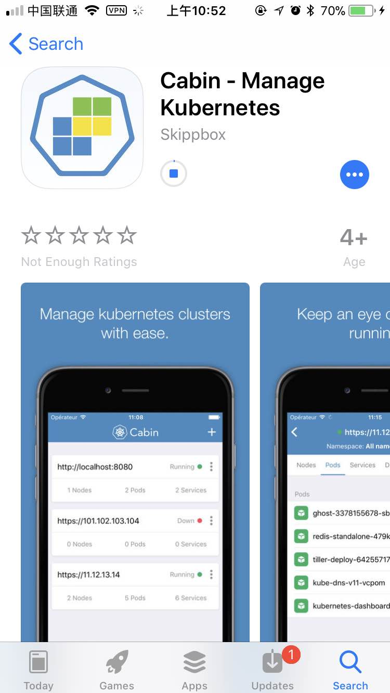
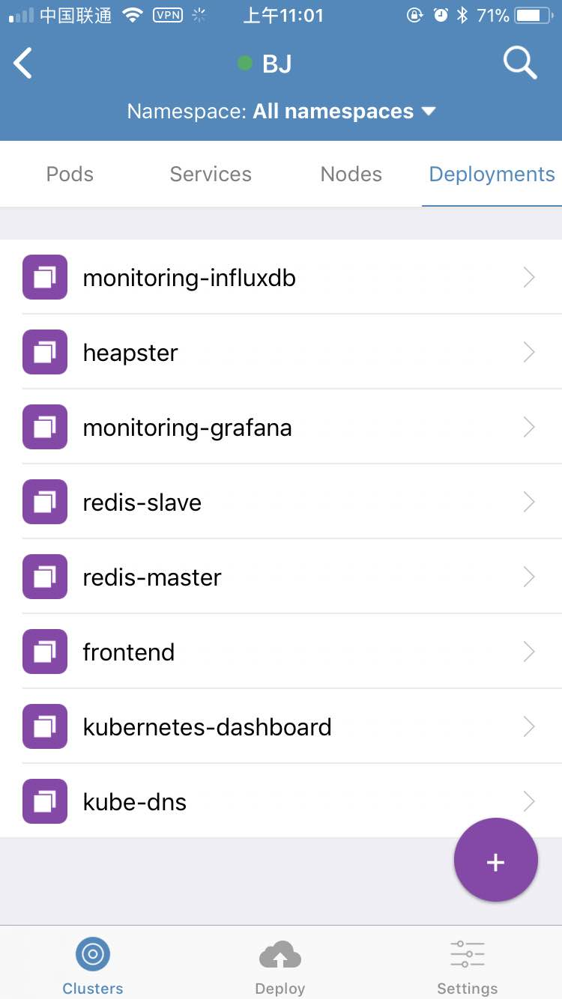

# Cabin - Kubernetes手机客户端

cabin是由[bitnami](https://bitnami.com/)开源的手机管理Kubernetes集群的客户端，目前提供iOS和安卓版本，代码开源在GitHub上：<https://bitnami.com/>

为了方便移动办公，可以使用Cabin这个kuberntes手机客户端，可以链接GKE和任何Kubernetes集群，可以使用以下三种认证方式：

- 证书
- token
- kubeconfig文件

所有功能跟kubernetes dashboard相同，还可以支持使用Helm chart部署应用，可以配置自定义的chart仓库地址。

iPhone用户可以在App Store中搜索**Cabin**即可找到。

可以很方便的在手机上操作自己的kubernetes集群，还可以登录到容器中操作，只要是kubernetes API支持的功能，都可以在该移动客户端上实现。

更多详细信息请参考：https://github.com/bitnami/cabin
