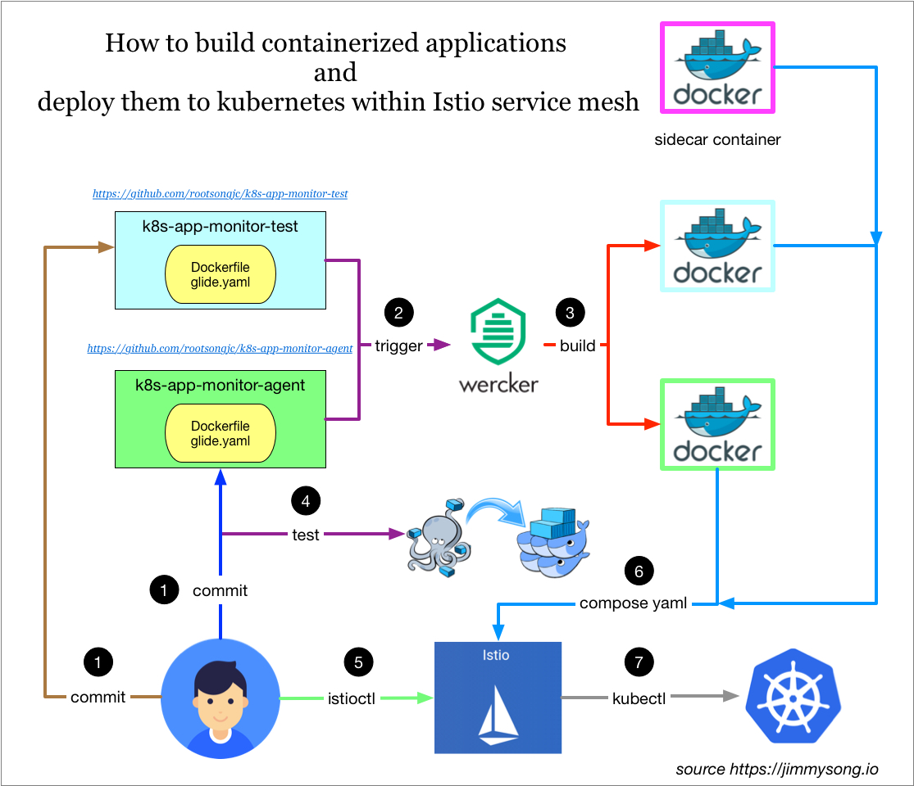
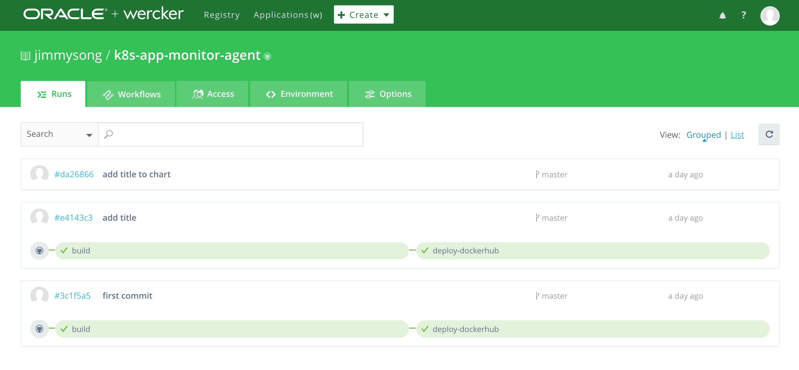
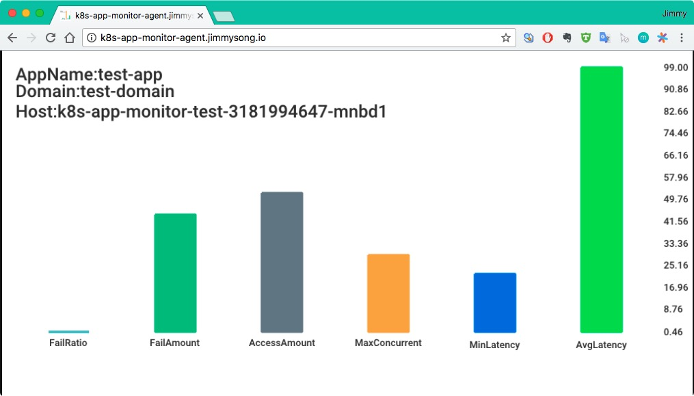
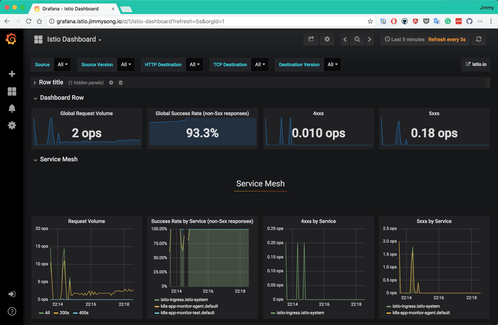
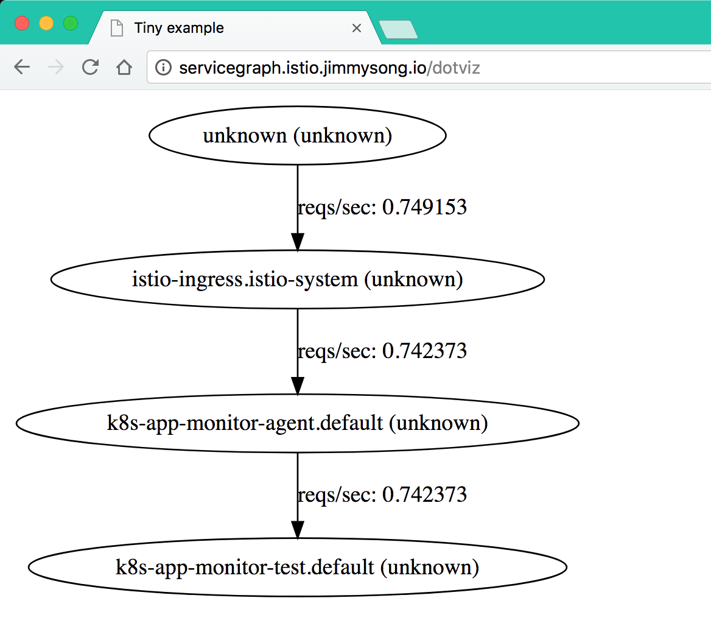
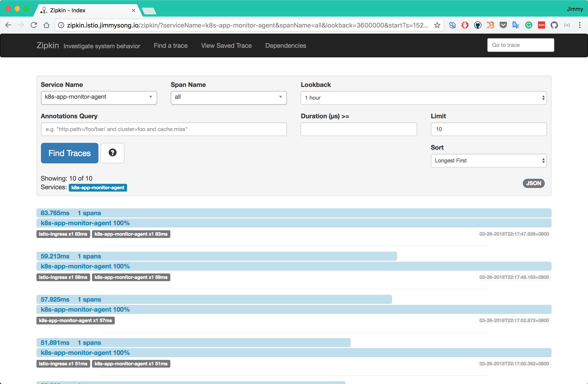

# 适用于kubernetes的应用开发部署流程

本文讲解了如何开发容器化应用，并使用Wercker持续集成工具构建docker镜像上传到docker镜像仓库中，然后在本地使用*docker-compose*测试后，再使用`kompose`自动生成kubernetes的yaml文件，再将注入Envoy sidecar容器，集成Istio service mesh中的详细过程。

整个过程如下图所示。



为了讲解详细流程，我特意写了用Go语言开发的示例程序放在GitHub中，模拟监控流程：

- [k8s-app-monitor-test](https://github.com/rootsongjc/k8s-app-monitor-test)：生成模拟的监控数据，在接收到http请求返回json格式的metrics信息
- [K8s-app-monitor-agent](https://github.com/rootsongjc/k8s-app-monitor-agent)：获取监控metrics信息并绘图，访问该服务将获得监控图表

API文档见[k8s-app-monitor-test](https://github.com/rootsongjc/k8s-app-monitor-test)中的`api.html`文件，该文档在API blueprint中定义，使用[aglio](https://github.com/danielgtaylor/aglio)生成，打开后如图所示：


## 关于服务发现

`K8s-app-monitor-agent`服务需要访问`k8s-app-monitor-test`服务，这就涉及到服务发现的问题，我们在代码中直接写死了要访问的服务的内网DNS地址（kubedns中的地址，即`k8s-app-monitor-test.default.svc.cluster.local`）。

我们知道Kubernetes在启动Pod的时候为容器注入环境变量，这些环境变量在所有的 namespace 中共享（环境变量是不断追加的，新启动的Pod中将拥有老的Pod中所有的环境变量，而老的Pod中的环境变量不变）。但是既然使用这些环境变量就已经可以访问到对应的service，那么获取应用的地址信息，究竟是使用变量呢？还是直接使用DNS解析来发现？

答案是使用DNS，详细说明见[Kubernetes中的服务发现与Docker容器间的环境变量传递源码探究](https://jimmysong.io/posts/exploring-kubernetes-env-with-docker/)。

## 持续集成

因为我使用wercker自动构建，构建完成后自动打包成docker镜像并上传到docker hub中（需要现在docker hub中创建repo）。

构建流程见：https://app.wercker.com/jimmysong/k8s-app-monitor-agent/



生成了如下两个docker镜像：

- jimmysong/k8s-app-monitor-test:9c935dd
- jimmysong/k8s-app-monitor-agent:234d51c

## 测试

在将服务发布到线上之前，我们可以先使用*docker-compose*在本地测试一下，这两个应用的`docker-compose.yaml`文件如下：

```yaml
version: '2'
services:
  k8s-app-monitor-agent:
    image: jimmysong/k8s-app-monitor-agent:234d51c
    container_name: monitor-agent
    depends_on:
      - k8s-app-monitor-test
    ports:
      - 8888:8888
    environment:
      - SERVICE_NAME=k8s-app-monitor-test
  k8s-app-monitor-test:
    image: jimmysong/k8s-app-monitor-test:9c935dd
    container_name: monitor-test
    ports:
      - 3000:3000
```

执行下面的命令运行测试。

```bash
docker-compose up
```

在浏览器中访问<http://localhost:8888/k8s-app-monitor-test>就可以看到监控页面。

## 发布

所有的kubernetes应用启动所用的yaml配置文件都保存在那两个GitHub仓库的`manifest.yaml`文件中。也可以使用[kompose](https://github.com/kubernetes/kompose)这个工具，可以将*docker-compose*的YAML文件转换成kubernetes规格的YAML文件。

分别在两个GitHub目录下执行`kubectl create -f manifest.yaml`即可启动服务。也可以直接在*k8s-app-monitor-agent*代码库的`k8s`目录下执行`kubectl apply -f kompose `。

在以上YAML文件中有包含了Ingress配置，是为了将*k8s-app-monitor-agent*服务暴露给集群外部访问。

**方式一**

服务启动后需要更新ingress配置，在[ingress.yaml](../manifests/traefik-ingress/ingress.yaml)文件中增加以下几行：

```yaml
  - host: k8s-app-monitor-agent.jimmysong.io
    http:
      paths:
      - path: /k8s-app-monitor-agent
        backend:
          serviceName: k8s-app-monitor-agent
          servicePort: 8888
```

保存后，然后执行`kubectl replace -f ingress.yaml`即可刷新ingress。

修改本机的`/etc/hosts`文件，在其中加入以下一行：

```ini
172.20.0.119 k8s-app-monitor-agent.jimmysong.io
```

当然你也可以将该域名加入到内网的DNS中，为了简单起见我使用hosts。

**方式二**

或者不修改已有的Ingress，而是为该队外暴露的服务单独创建一个Ingress，如下：

```yaml
apiVersion: extensions/v1beta1
kind: Ingress
metadata:
  name: k8s-app-monitor-agent-ingress
  annotations:
    kubernetes.io/ingress.class: "treafik"
spec:
  rules:
  - host: k8s-app-monitor-agent.jimmysong.io
    http:
      paths:
      - path: /
        backend:
          serviceName: k8s-app-monitor-agent
          servicePort: 8888
```

详见[边缘节点配置](../practice/edge-node-configuration.md)。

## 集成Istio service mesh

上一步中我们生成了kubernetes可读取的应用的YAML配置文件，我们可以将所有的YAML配置和并到同一个YAML文件中假如文件名为`k8s-app-monitor-istio-all-in-one.yaml`，如果要将其集成到Istio service mesh，只需要执行下面的命令。

```bash
kubectl apply -n default -f <(istioctl kube-inject -f k8s-app-monitor-istio-all-in-one.yaml)
```

这样就会在每个Pod中注入一个sidecar容器。

## 验证

如果您使用的是Traefik ingress来暴露的服务，那么在浏览器中访问<http://k8s-app-monitor-agent.jimmysong.io/k8s-app-monitor-agent>，可以看到如下的画面，每次刷新页面将看到新的柱状图。



使用[kubernetes-vagrant-centos-cluster](https://github.com/rootsongjc/kubernetes-vagrant-centos-cluster)来部署的kubernetes集群，该应用集成了Istio service mesh后可以通过<http://172.17.8.101:32000/k8s-app-monitor-agent>来访问。

在对*k8s-app-monitor-agent*服务进行了N此访问之后，再访问<http://grafana.istio.jimmysong.io>可以看到Service Mesh的监控信息。



访问<http://servicegraph.istio.jimmysong.io/dotviz>可以看到服务的依赖和QPS信息。



访问<http://zipkin.istio.jimmysong.io>可以选择查看`k8s-app-monitor-agent`应用的追踪信息。



至此从代码提交到上线到Kubernetes集群上并集成Istio service mesh的过程就全部完成了。