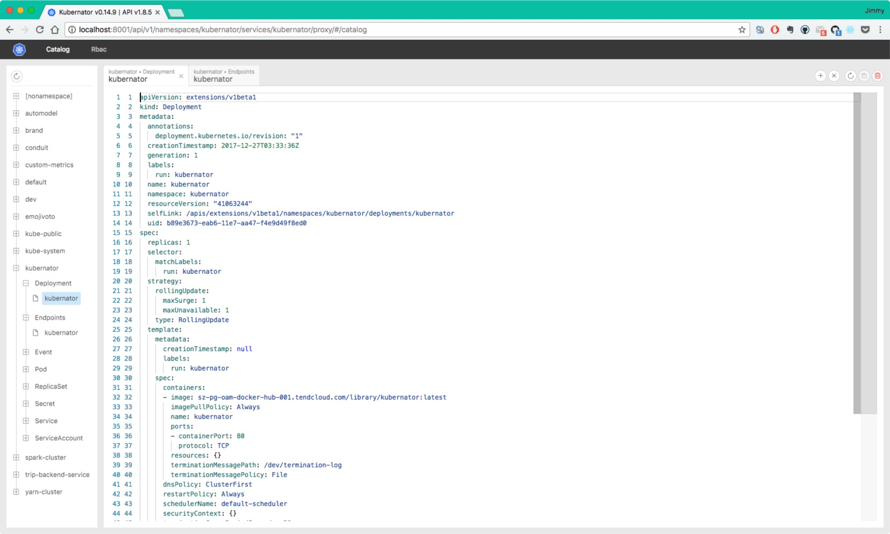
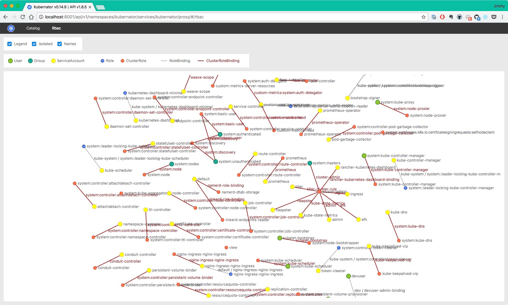

# Kubernator - 更底层的Kubernetes UI

[Kubernator](https://github.com/smpio/kubernator)相较于[Kubernetes Dashboard](https://github.com/smpio/kubernator)来说，是一个更底层的Kubernetes UI，Dashboard操作的都是Kubernetes的底层对象，而Kubernator是直接操作Kubernetes各个对象的YAML文件。

Kubernator提供了一种基于目录树和关系拓扑图的方式来管理Kubernetes的对象的方法，用户可以在Web上像通过GitHub的网页版一样操作Kubernetes的对象，执行修改、拷贝等操作，详细的使用方式见<https://github.com/smpio/kubernator>。

## 安装Kubernator

Kubernator的安装十分简单，可以直接使用`kubectl`命令来运行，它不依赖任何其它组件。

```bash
kubectl create ns kubernator
kubectl -n kubernator run --image=smpio/kubernator --port=80 kubernator
kubectl -n kubernator expose deploy kubernator
kubectl proxy
```

然后就可以通过<http://localhost:8001/api/v1/namespaces/kubernator/services/kubernator/proxy/>来访问了。

Catalog页面可以看到Kubernetes中资源对象的树形结构，还可以在该页面中对资源对象的配置进行更改和操作。



Rbac页面可以看到集群中RBAC关系及结构。



