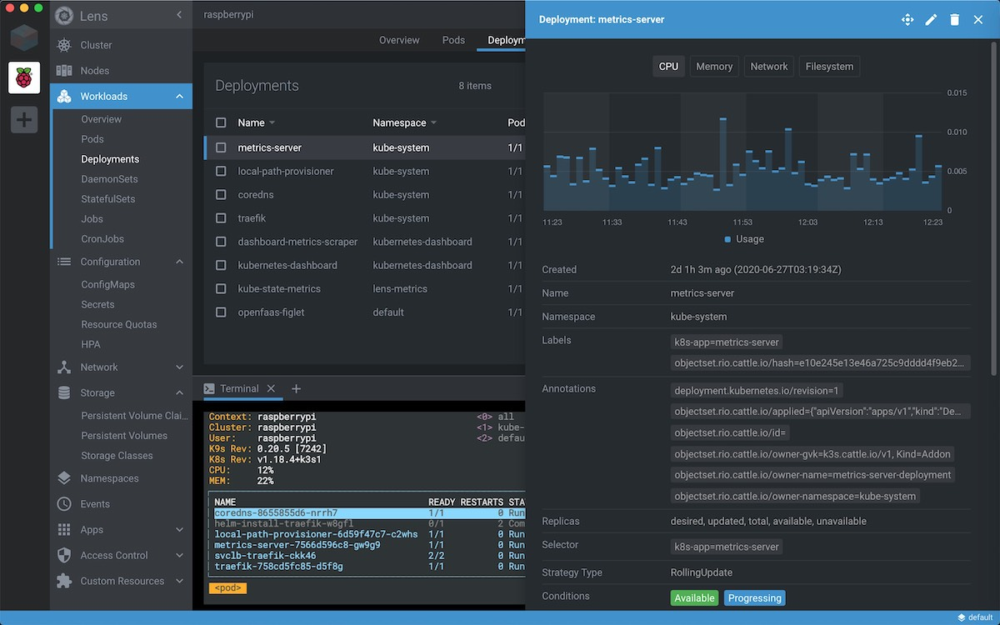

# Lens - Kubernetes IDE/桌面客户端

[Lens](https://k8slens.dev/) 是一款开源的 Kubenretes IDE，也可以作为桌面客户端，官方网站 <https://k8slens.dev>，具有以下特性：

- 完全开源，GitHub 地址 <https://github.com/lensapp/lens>
- 实时展示集群状态
- 内置 Prometheus 监控
- 多集群，多个 namespace 管理
- 原生 Kubernetes 支持
- 支持使用 chart 安装应用
- 使用 kubeconfig 登陆认证
- 支持多平台，Windows、Mac、Linux
- Visual Studio Code 友好的风格设计

Lens 界面图下图所示。

## 参考

- [Lens, Kubernetes IDE - k8slens.dev](https://k8slens.dev/)