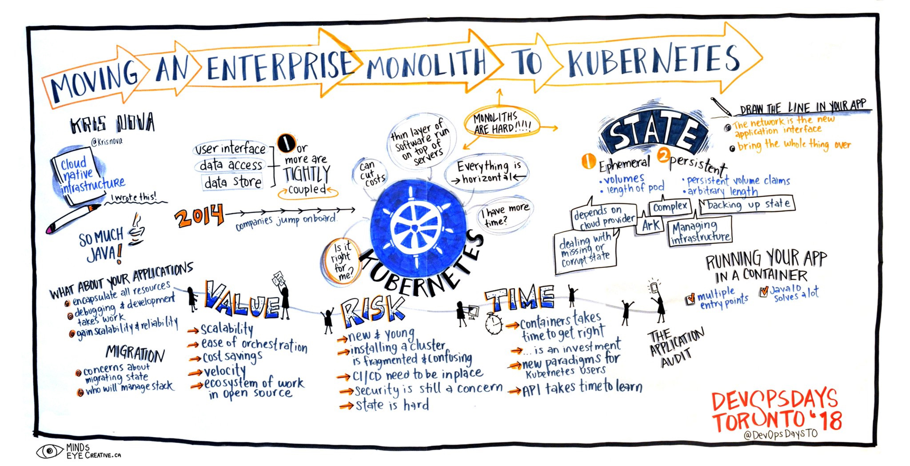
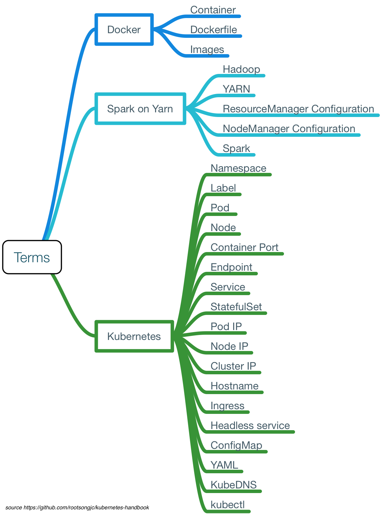
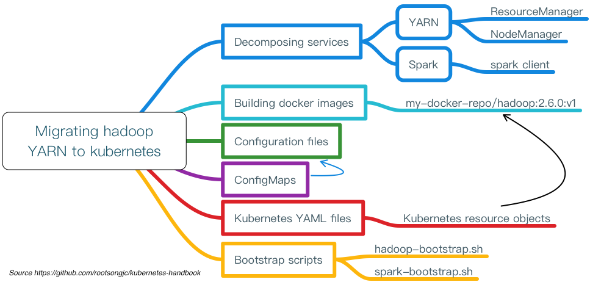

# 迁移传统应用到Kubernetes步骤详解——以Hadoop YARN为例

本文档不是说明如何在 kubernetes 中开发和部署应用程序，如果您想要直接开发应用程序在 kubernetes 中运行可以参考 [适用于kubernetes的应用开发部署流程](deploy-applications-in-kubernetes.md)。

本文旨在说明如何将已有的应用程序尤其是传统的分布式应用程序迁移到 kubernetes 中。如果该类应用程序符合云原生应用规范（如12因素法则）的话，那么迁移会比较顺利，否则会遇到一些麻烦甚至是阻碍。具体请参考 [迁移至云原生应用架构](https://github.com/rootsongjc/migrating-to-cloud-native-application-architectures)。

下图是将单体应用迁移到云原生的步骤。



接下来我们将以 Spark on YARN with kubernetes 为例来说明，该例子足够复杂也很有典型性，了解了这个例子可以帮助大家将自己的应用迁移到 kubernetes 集群上去，代码和配置文件可以在 [这里](https://github.com/rootsongjc/kube-yarn) 找到（本文中加入 Spark 的配置，代码中并没有包含，读者可以自己配置）。

下图即整个架构的示意图，代码和详细配置文件请参考 [kube-yarn](https://github.com/rootsongjc/kube-yarn)（不包含 ingress、spark 配置），所有的进程管理和容器扩容直接使用 Makefile。


**注意： 该例子仅用来说明具体的步骤划分和复杂性，在生产环境应用还有待验证，请谨慎使用。**

## 术语

对于为曾接触过 kubernetes 或对云平台的技术细节不太了解的人来说，如何将应用迁移到 kubernetes 中可能是个头疼的问题，在行动之前有必要先了解整个过程中需要用到哪些概念和术语，有助于大家在行动中达成共识。

过程中可能用到的概念和术语初步整理如下：



为了讲解整改过程和具体细节，我们所有操作都是通过命令手动完成，不使用自动化工具。当您充分了解到其中的细节后可以通过自动化工具来优化该过程，以使其更加自动和高效，同时减少因为人为操作失误导致的迁移失败。

## 迁移应用



整个迁移过程分为如下几个步骤：

1. **将原有应用拆解为服务**

   我们不是一上来就开始做镜像，写配置，而是应该先梳理下要迁移的应用中有哪些可以作为服务运行，哪些是变的，哪些是不变的部分。

   服务划分的原则是最小可变原则，这个同样适用于镜像制作，将服务中不变的部分编译到同一个镜像中。

   对于像 Spark on YARN 这样复杂的应用，可以将其划分为三大类服务：

   - ResourceManager
   - NodeManager
   - Spark client

2. **制作镜像**

   根据拆解出来的服务，我们需要制作两个镜像：

   - Hadoop
   - Spark (From hadoop docker image)

   因为我们运行的是 Spark on YARN，因此 Spark 依赖与 Hadoop 镜像，我们在 Spark 的基础上包装了一个 web service 作为服务启动。

   镜像制作过程中不需要在 Dockerfile 中指定 Entrypoint 和 CMD，这些都是在 kubernetes 的 YAML 文件中指定的。

   Hadoop YARN 的 Dockerfile 参考如下配置。

   ```docker
   FROM my-docker-repo/jdk:7u80

   # Add native libs
   ARG HADOOP_VERSION=2.6.0-cdh5.5.2
   ## Prefer to download from server not use local storage
   ADD hadoop-${HADOOP_VERSION}.tar.gz /usr/local
   ADD ./lib/* /usr/local/hadoop-${HADOOP_VERSION}/lib/native/
   ADD ./jars/* /usr/local/hadoop-${HADOOP_VERSION}/share/hadoop/yarn/
   ENV HADOOP_PREFIX=/usr/local/hadoop \
       HADOOP_COMMON_HOME=/usr/local/hadoop \
       HADOOP_HDFS_HOME=/usr/local/hadoop \
       HADOOP_MAPRED_HOME=/usr/local/hadoop \
       HADOOP_YARN_HOME=/usr/local/hadoop \
       HADOOP_CONF_DIR=/usr/local/hadoop/etc/hadoop \
       YARN_CONF_DIR=/usr/local/hadoop/etc/hadoop \
       PATH=${PATH}:/usr/local/hadoop/bin

   RUN \
     cd /usr/local && ln -s ./hadoop-${HADOOP_VERSION} hadoop && \
     rm -f ${HADOOP_PREFIX}/logs/*

   WORKDIR $HADOOP_PREFIX

   # Hdfs ports
   EXPOSE 50010 50020 50070 50075 50090 8020 9000
   # Mapred ports
   EXPOSE 19888
   #Yarn ports
   EXPOSE 8030 8031 8032 8033 8040 8042 8088
   #Other ports
   EXPOSE 49707 2122
   ```

3. **准备应用的配置文件**

   因为我们只制作了一个 Hadoop 的镜像，而需要启动两个服务，这就要求在服务启动的时候必须加载不同的配置文件，现在我们只需要准备两个服务中需要同时用的的配置的部分。

   YARN 依赖的配置在 `artifacts` 目录下，包含以下文件：

   ```
   bootstrap.sh
   capacity-scheduler.xml
   container-executor.cfg
   core-site.xml
   hadoop-env.sh
   hdfs-site.xml
   log4j.properties
   mapred-site.xml
   nodemanager_exclude.txt
   slaves
   start-yarn-nm.sh
   start-yarn-rm.sh
   yarn-env.sh
   yarn-site.xml
   ```

   其中作为 bootstrap 启动脚本的 `bootstrap.sh` 也包含在该目录下，该脚本的如何编写请见下文。

4. **Kubernetes YAML 文件**

   根据业务的特性选择最适合的 kubernetes 的资源对象来运行，因为在 YARN 中 NodeManager 需要使用主机名向 ResourceManger 注册，因此需要沿用 YARN 原有的服务发现方式，使用 headless service 和 StatefulSet 资源。更多资料请参考  [StatefulSet](../concepts/statefulset.md)。

   所有的 Kubernetes YAML 配置文件存储在 `manifest` 目录下，包括如下配置：

   - yarn-cluster 的 namespace 配置
   - Spark、ResourceManager、NodeManager 的 headless service 和 StatefulSet 配置
   - 需要暴露到 kubernetes 集群外部的 ingress 配置（ResourceManager 的 Web）

   ```
   kube-yarn-ingress.yaml
   spark-statefulset.yaml
   yarn-cluster-namespace.yaml
   yarn-nm-statefulset.yaml
   yarn-rm-statefulset.yaml
   ```

5. **Bootstrap 脚本**

   Bootstrap 脚本的作用是在启动时根据 Pod 的环境变量、主机名或其他可以区分不同 Pod 和将启动角色的变量来修改配置文件和启动服务应用。

   该脚本同时将原来 YARN 的日志使用 stdout 输出，便于使用 `kubectl logs` 查看日志或其他日志收集工具进行日志收集。

   启动脚本 `bootstrap.sh`  跟 Hadoop 的配置文件同时保存在 `artifacts` 目录下。

   该脚本根据 Pod 的主机名，决定如何修改 Hadoop 的配置文件和启动何种服务。`bootstrap.sh` 文件的部分代码如下：

   ```bash
   if [[ "${HOSTNAME}" =~ "yarn-nm" ]]; then
     sed -i '/<\/configuration>/d' $HADOOP_PREFIX/etc/hadoop/yarn-site.xml
     cat >> $HADOOP_PREFIX/etc/hadoop/yarn-site.xml <<- EOM
     <property>
       <name>yarn.nodemanager.resource.memory-mb</name>
       <value>${MY_MEM_LIMIT:-2048}</value>
     </property>

     <property>
       <name>yarn.nodemanager.resource.cpu-vcores</name>
       <value>${MY_CPU_LIMIT:-2}</value>
     </property>
   EOM
     echo '</configuration>' >> $HADOOP_PREFIX/etc/hadoop/yarn-site.xml
     cp ${CONFIG_DIR}/start-yarn-nm.sh $HADOOP_PREFIX/sbin/
     cd $HADOOP_PREFIX/sbin
     chmod +x start-yarn-nm.sh
     ./start-yarn-nm.sh
   fi

   if [[ $1 == "-d" ]]; then
     until find ${HADOOP_PREFIX}/logs -mmin -1 | egrep -q '.*'; echo "`date`: Waiting for logs..." ; do sleep 2 ; done
     tail -F ${HADOOP_PREFIX}/logs/* &
     while true; do sleep 1000; done
   fi
   ```

   从这部分中代码中可以看到，如果 Pod 的主机名中包含 `yarn-nm` 字段则向 `yarn-site.xml` 配置文件中增加如下内容：

   ```xml
     <property>
       <name>yarn.nodemanager.resource.memory-mb</name>
       <value>${MY_MEM_LIMIT:-2048}</value>
     </property>

     <property>
       <name>yarn.nodemanager.resource.cpu-vcores</name>
       <value>${MY_CPU_LIMIT:-2}</value>
     </property>
   ```

   其中 `MY_MEM_LIMIT` 和 `MY_CPU_LIMIT` 是 kubernetes YAML 中定义的环境变量，该环境变量又是引用的 Resource limit。

   所有的配置准备完成后，执行 `start-yarn-nm.sh` 脚本启动 NodeManager。

   如果 kubernetes YAML 中的 container CMD args 中包含 `-d` 则在后台运行 NodeManger 并 tail 输出 NodeManager 的日志到标准输出。

6. **ConfigMaps**

   将 Hadoop 的配置文件和 bootstrap 脚本作为 ConfigMap 资源保存，用作 Pod 启动时挂载的 volume。

   ```bash
   kubectl create configmap hadoop-config \
   	  --from-file=artifacts/hadoop/bootstrap.sh \
   	  --from-file=artifacts/hadoop/start-yarn-rm.sh \
   	  --from-file=artifacts/hadoop/start-yarn-nm.sh \
   	  --from-file=artifacts/hadoop/slaves \
   	  --from-file=artifacts/hadoop/core-site.xml \
   	  --from-file=artifacts/hadoop/hdfs-site.xml \
   	  --from-file=artifacts/hadoop/mapred-site.xml \
   	  --from-file=artifacts/hadoop/yarn-site.xml \
   	  --from-file=artifacts/hadoop/capacity-scheduler.xml \
   	  --from-file=artifacts/hadoop/container-executor.cfg \
   	  --from-file=artifacts/hadoop/hadoop-env.sh \
   	  --from-file=artifacts/hadoop/log4j.properties \
   	  --from-file=artifacts/hadoop/nodemanager_exclude.txt \
   	  --from-file=artifacts/hadoop/yarn-env.sh
   kubectl  create configmap spark-config \
   	  --from-file=artifacts/spark/spark-bootstrap.sh \
   	  --from-file=artifacts/spark/spark-env.sh \
   	  --from-file=artifacts/spark/spark-defaults.conf
   ```

所有的配置完成后，可以可以使用 kubectl 命令来启动和管理集群了，我们编写了 Makefile，您可以直接使用该 Makefile 封装的命令实现部分的自动化。