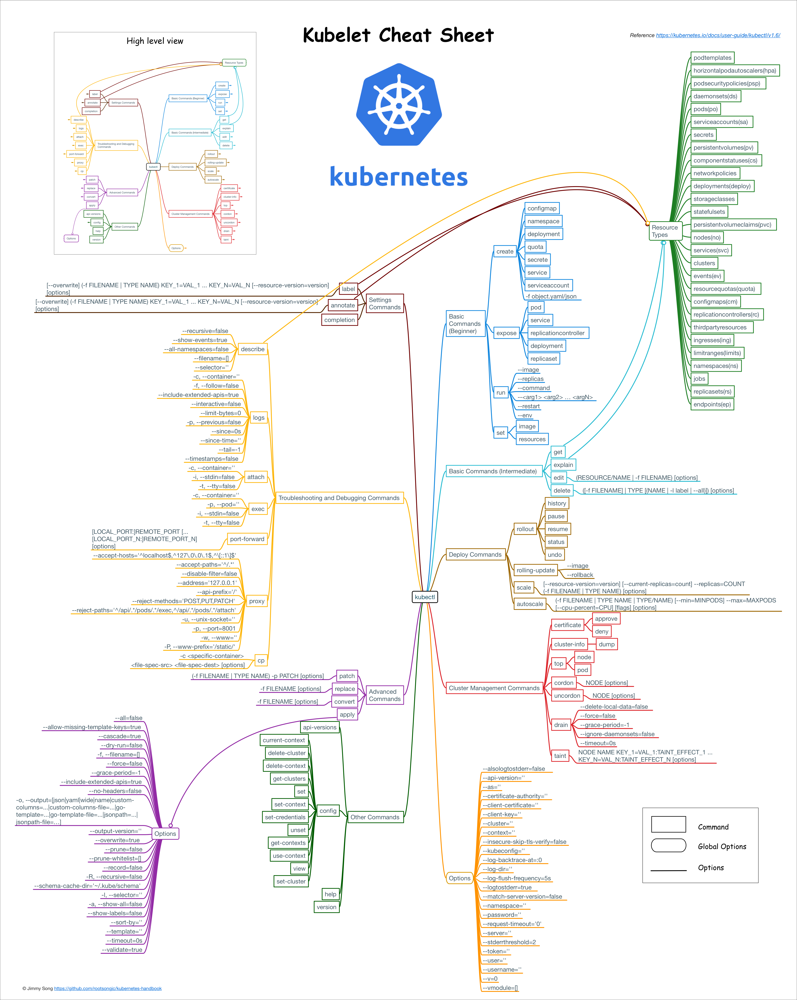
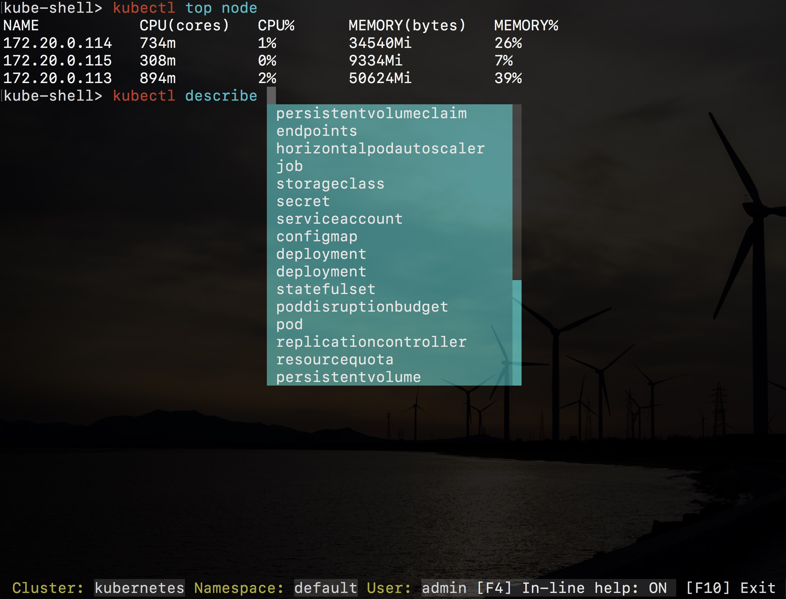

# Kubctl命令概览

Kubernetes提供的kubectl命令是与集群交互最直接的方式，v1.6版本的kubectl命令参考图如下：



Kubectl的子命令主要分为8个类别：

- 基础命令（初学者都会使用的）
- 基础命令（中级）
- 部署命令
- 集群管理命令
- 故障排查和调试命令
- 高级命令
- 设置命令
- 其他命令

熟悉这些命令有助于大家来操作和管理kubernetes集群。

## kube-shell

开源项目[kube-shell](https://github.com/cloudnativelabs/kube-shell)可以为kubectl提供自动的命令提示和补全，使用起来特别方便，推荐给大家。

Kube-shell有以下特性：

- 命令提示，给出命令的使用说明
- 自动补全，列出可选命令并可以通过tab键自动补全，支持模糊搜索
- 高亮
- 使用tab键可以列出可选的对象
- vim模式

**Mac下安装**

```bash
pip install kube-shell --user -U
```

