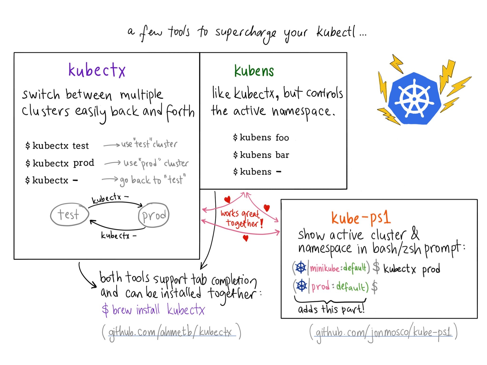
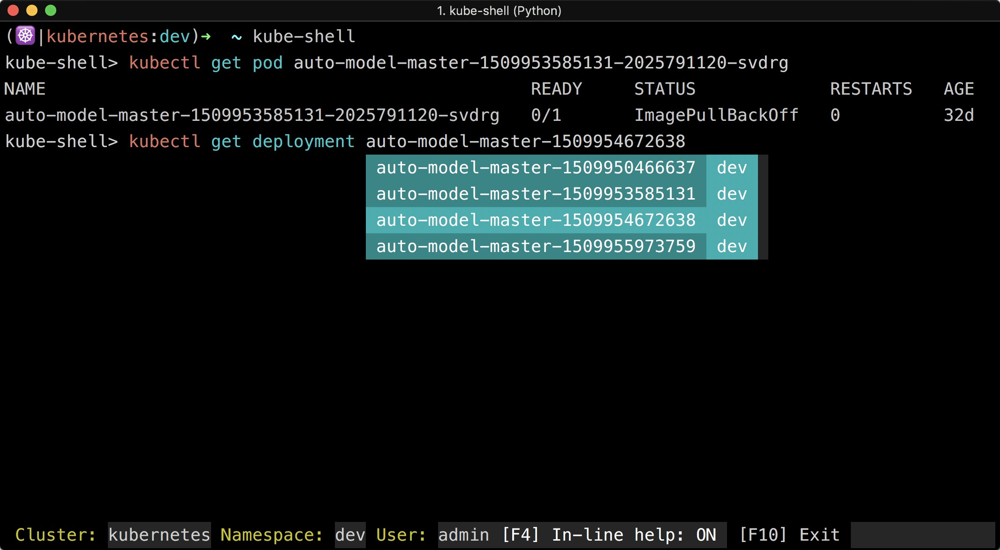

# Kubectl 命令概览

Kubernetes 提供的 kubectl 命令是与集群交互最直接的方式，v1.6 版本的 kubectl 命令参考图如下：


Kubectl 的子命令主要分为 8 个类别：

- 基础命令（初学者都会使用的）
- 基础命令（中级）
- 部署命令
- 集群管理命令
- 故障排查和调试命令
- 高级命令
- 设置命令
- 其他命令

熟悉这些命令有助于大家来操作和管理 kubernetes 集群。

## 命令行提示

为了使用 kubectl 命令更加高效，我们可以选择安装一下开源软件来增加操作 kubectl 命令的快捷方式，同时为 kubectl 命令增加命令提示。



- [kubectx](https://github.com/ahmetb/kubectx)：用于切换 Kubernetes context
- [kube-ps1](https://github.com/jonmosco/kube-ps1)：为命令行终端增加`$PROMPT`字段
- [kube-shell](https://github.com/cloudnativelabs/kube-shell)：交互式带命令提示的 kubectl 终端

全部配置完成后的 kubectl 终端如下图所示：



kube-shell

开源项目 [kube-shell](https://github.com/cloudnativelabs/kube-shell) 可以为 kubectl 提供自动的命令提示和补全，使用起来特别方便，推荐给大家。

Kube-shell 有以下特性：

- 命令提示，给出命令的使用说明
- 自动补全，列出可选命令并可以通过 tab 键自动补全，支持模糊搜索
- 高亮
- 使用 tab 键可以列出可选的对象
- vim 模式

**Mac 下安装**

```bash
pip install kube-shell --user -U
```


## kubectl 的身份认证

Kubernetes 中存在三种安全认证方式：

- **CA 证书**：API server 与其它几个组件之间都是通过这种方式认证的
- **HTTP base**：即在 API server 的启动参数中指定的 `--token-auth-file=/etc/kubernetes/token.csv` 文件中明文的用户、组、密码和 UID 配置
- **bearer token**：HTTP 请求中 `header` 中传递的 `Autorization:Bearer token`，这个 token 通常保存在创建角色跟 `serviceaccount` 绑定的时候生成的 secret 中。

kubectl 通过读取 `kubeconfig` 文件中的配置信息在向 API server 发送请求的时候同时传递认证信息，同时支持 CA 证书和 bearer token 的认证方式，请参考[使用 kubeconfig 文件配置跨集群认证](../guide/authenticate-across-clusters-kubeconfig.md)。

## 终端下 kubectl 命令自动补全

建议使用 [oh-my-zsh](http://ohmyz.sh/)，增加对 kubectl 命令自动补全支持。

修改 `~/.zshrc` 文件，增加如下两行：

```bash
plugins=(kubectl)
source <(kubectl completion zsh)
```

保存后重启终端即可生效。

## 参考

- [Install and Set Up kubectl - kubernetes.io](https://kubernetes.io/docs/tasks/tools/install-kubectl/#using-zsh)
