> CNI（容器网络接口）为容器网络提供了标准化的接口和插件机制，极大地简化了容器编排平台的网络管理与扩展，是云原生网络生态的基础。

## 概述

[容器网络接口（Container Network Interface，CNI）](https://github.com/containernetworking/cni) 是 CNCF 旗下的重要项目，提供了一套标准化的容器网络配置规范和库。CNI 专注于容器创建时的网络资源分配和容器删除时的网络资源释放，为容器编排平台提供了统一的网络管理接口。

本节将系统介绍 CNI 的核心组成、架构设计、关键概念、实现细节及其在生态系统中的应用。

## 什么是 CNI？

CNI 由三大核心组成部分构成：

- **规范**：定义容器运行时与网络插件之间的协议，包括网络配置格式、插件执行协议和结果类型。
- **库**：为应用集成 CNI 功能提供实现，主要 Go 语言库为 `libcni`。
- **插件**：实现 CNI 规范的程序，用于配置容器网络。

CNI 设计只关注网络设置、连接和资源清理，便于实现和与各种容器运行时集成。

## 核心架构

CNI 架构设计简洁，容器运行时可直接实现 CNI 规范或通过 `libcni` 库调用插件，完成容器网络配置。


{width=1920 height=3071}

CNI 仓库同时提供规范和辅助代码，方便运行时和插件开发者实现。

### 关键组件及关系

下图展示了 CNI 关键组件之间的关系：


{width=1920 height=2785}

## 关键概念

CNI 的核心概念包括网络配置、操作类型、插件执行流程和插件类型。

### 网络配置

CNI 使用 JSON 格式的网络配置，定义网络参数和插件设置。以下为示例配置：

```json
{
  "cniVersion": "1.1.0",
  "name": "example-network",
  "plugins": [
    {
      "type": "bridge",
      "bridge": "cni0",
      "ipam": {
        "type": "host-local",
        "subnet": "10.22.0.0/16"
      }
    }
  ]
}
```

网络配置由 CNI 运行时处理，并传递给各插件。

### CNI 操作类型

CNI 规范要求插件实现如下操作：



| 操作      | 目的                   | 必需环境变量 |
|-----------|------------------------|-------------|
| ADD       | 添加容器到网络         | CNI_COMMAND, CNI_CONTAINERID, CNI_NETNS, CNI_IFNAME |
| DEL       | 从网络移除容器         | CNI_COMMAND, CNI_CONTAINERID, CNI_IFNAME |
| CHECK     | 验证网络设置           | CNI_COMMAND, CNI_CONTAINERID, CNI_NETNS, CNI_IFNAME |
| GC        | 清理过期资源           | CNI_COMMAND, CNI_PATH |
| VERSION   | 查询插件版本信息       | CNI_COMMAND |
| STATUS    | 检查插件就绪状态       | -           |



容器运行时通过环境变量和标准输入/输出调用插件操作。

### 插件执行流程

下图展示了 CNI 操作的典型流程，包括 IP 地址管理插件的委托调用：


{width=1920 height=1682}

### 插件类型

CNI 插件主要分为以下几类：

- **接口插件**：在容器内创建和配置网络接口（如 bridge、macvlan）。
- **链式插件**：对已有接口进行修改或扩展功能（如 portmap、bandwidth）。
- **IPAM 插件**：负责 IP 地址分配和管理，通常由接口插件委托调用。
- **Meta 插件**：顺序调用多个插件（如 flannel、multus）。

## 实现细节

CNI 的实现细节主要体现在 `libcni` 库和插件返回的结构化结果类型。

### libcni 库

`libcni` 提供 Go API，供容器运行时与 CNI 插件交互，主要负责：

- 加载和解析网络配置
- 按需设置环境变量并执行插件
- 处理和缓存插件结果

核心接口如下：

```go
type CNI interface {
    AddNetworkList(net *NetworkConfigList, rt *RuntimeConf) (types.Result, error)
    DelNetworkList(net *NetworkConfigList, rt *RuntimeConf) error
    CheckNetworkList(net *NetworkConfigList, rt *RuntimeConf) error
    // 其他方法...
}
```

### 结果类型

CNI 操作返回结构化结果，定义于 `pkg/types`，主要类型包括：

- `Result`：插件执行结果接口
- `DNS`：DNS 配置信息
- `Route`：路由信息
- `Error`：标准化错误报告

下图为主要类型关系：



{width=1920 height=1733}

## 生态系统与应用

CNI 已被众多容器运行时和编排平台采用，包括：

- Kubernetes
- OpenShift
- Cloud Foundry
- Apache Mesos
- Amazon ECS
- Singularity

主流网络方案均实现了 CNI 插件，如：

- Calico
- Cilium
- Weave
- OVN-Kubernetes
- AWS VPC CNI
- Azure CNI

广泛的生态应用证明了 CNI 在容器网络标准化方面的成功。

## 设计原则与规范

CNI 的设计遵循以下核心原则：

### 生命周期管理

- **网络命名空间**：容器运行时必须在调用插件前为容器创建独立的网络命名空间。
- **网络确定**：运行时需确定容器所属网络及相应的插件执行顺序。
- **配置格式**：采用 JSON 格式存储网络配置，包含必需字段如 `name`、`type` 等。

### 执行顺序

- **添加操作**：按配置顺序依次执行插件。
- **删除操作**：按添加操作的相反顺序执行插件。
- **幂等性**：DELETE 操作必须支持多次调用。

### 并发控制

- **容器隔离**：同一容器不允许并行操作。
- **容器间并行**：不同容器可以并行处理。
- **唯一标识**：每个容器通过 ContainerID 唯一标识。

## CNI 插件实现

CNI 插件的实现需满足如下要求：

- 必须为可执行文件，支持容器管理系统调用。
- 负责将网络接口插入容器网络命名空间。
- 在主机上执行必要的网络配置。
- 通过 IPAM 插件分配 IP 地址和配置路由。

## IP 地址管理（IPAM）

为了解耦 IP 管理策略与 CNI 插件类型，CNI 引入了 IPAM（IP Address Management）插件：

- **职责分离**：CNI 插件专注网络接口管理，IPAM 插件专注 IP 分配。
- **灵活配置**：支持多种 IP 管理方案（DHCP、静态分配等）。
- **标准接口**：IPAM 插件遵循与 CNI 插件相同的调用约定。

IPAM 插件通过以下方式工作：

- 接收与 CNI 插件相同的环境变量。
- 通过 stdin 接收网络配置。
- 返回 IP/子网、网关和路由信息。
- 可执行文件位于 `CNI_PATH` 指定的路径中。

## 常用插件生态

以下表格列举了常用 CNI 主插件、IPAM 插件和 Meta 插件，并简要说明其功能。



| 插件名称      | 功能描述                       |
|--------------|-------------------------------|
| **bridge**   | 创建 Linux 网桥，连接主机和容器 |
| **ipvlan**   | 创建 IPvlan 接口，支持 L2/L3 模式 |
| **macvlan**  | 创建 MACvlan 接口，分配独立 MAC 地址 |
| **ptp**      | 创建点对点 veth 对连接           |
| **host-device** | 将主机设备移入容器网络命名空间 |
| **vlan**     | 创建 VLAN 子接口                |





| 插件名称      | 功能描述                       |
|--------------|-------------------------------|
| **host-local** | 本地静态 IP 地址池管理         |
| **dhcp**     | 通过 DHCP 协议动态分配 IP       |
| **static**   | 静态 IP 地址分配               |





| 插件名称      | 功能描述                       |
|--------------|-------------------------------|
| **portmap**  | 基于 iptables 的端口映射        |
| **bandwidth**| 网络带宽限制                   |
| **firewall** | 基于 iptables 的防火墙规则      |
| **tuning**   | 网络接口参数调优               |



## 配置示例

下面分别给出基本网桥配置和链式插件配置的 JSON 示例，并附简要说明。

### 基本网桥配置

该配置为容器分配一个 bridge 网络，并通过 host-local IPAM 插件分配 IP 地址。

```json
{
  "cniVersion": "1.0.0",
  "name": "mynet",
  "type": "bridge",
  "bridge": "mynet0",
  "isDefaultGateway": true,
  "forceAddress": false,
  "ipMasq": true,
  "hairpinMode": true,
  "ipam": {
    "type": "host-local",
    "subnet": "10.10.0.0/16"
  }
}
```

### 链式插件配置

该配置通过 plugins 字段串联多个插件，实现更复杂的网络功能。

```json
{
  "cniVersion": "1.0.0",
  "name": "mynet",
  "plugins": [
    {
      "type": "bridge",
      "bridge": "mynet0",
      "ipam": {
        "type": "host-local",
        "subnet": "10.10.0.0/16"
      }
    },
    {
      "type": "portmap",
      "capabilities": {"portMappings": true}
    }
  ]
}
```

## 最佳实践

CNI 插件的选择和故障排查是实际运维中的重点，建议如下：

### 插件选择

- **生产环境**：推荐使用成熟的网络方案如 Calico、Flannel、Cilium。
- **开发测试**：可使用简单的 bridge + host-local 组合。
- **高性能需求**：考虑使用 SR-IOV 或 DPDK 相关插件。

### 故障排查

- **日志检查**：查看 kubelet 和 CNI 插件日志。
- **网络验证**：使用 `cni` 命令行工具测试配置。
- **网络连通性**：检查路由表和 iptables 规则。

## 总结

CNI 作为容器网络的事实标准，极大地推动了云原生网络生态的发展。其模块化、标准化的设计理念，使得容器网络方案具备高度的可扩展性和可插拔性。理解 CNI 的架构和实现，有助于深入掌握 Kubernetes 等平台的网络原理，并为实际生产环境中的网络方案选型和故障排查提供坚实基础。

## 参考文献

1. [CNI 官方规范 - github.com](https://github.com/containernetworking/cni/blob/main/SPEC.md)
2. [CNI 插件仓库 - github.com](https://github.com/containernetworking/plugins)
3. [CNI 扩展约定 - github.com](https://github.com/containernetworking/cni/blob/main/CONVENTIONS.md)
4. [CNCF CNI 项目主页 - cni.dev](https://www.cni.dev/)
