本节解释容器运行时接口（CRI），阐述其作为 Kubernetes 与容器运行时之间抽象层的作用，以及其定义的核心服务。

## 总览

容器运行时接口（CRI）是一个插件接口，使 kubelet 能够在无需重新编译 Kubernetes 组件的情况下，支持多种容器运行时。CRI 由 Protocol Buffer 定义和 gRPC API 组成，规定了 Kubernetes 与容器运行时实现之间的契约。

CRI **不是**通用的容器运行时 API，它专为 kubelet 与运行时通信以及节点级故障排查工具（如 `crictl`）设计。API 设计以 Kubernetes 为中心，可能包含 kubelet 所需的调用顺序或参数假设。

## CRI 解决的问题

在 CRI 出现之前，集成新的容器运行时需要修改和重新编译 kubelet 代码。这种紧耦合导致：

- 难以支持多种容器运行时实现
- 难以尝试新运行时技术
- 运行时厂商难以独立开发
- Kubernetes 代码库中需维护运行时相关代码

CRI 引入了抽象层，将编排（kubelet）与容器生命周期管理（运行时实现）分离。



{width=1920 height=509}

抽象层允许运行时实现独立演进，同时为 kubelet 保持稳定接口。

## CRI 服务架构

CRI 定义了两个主要的 gRPC 服务，各自职责如下：

### RuntimeService

`RuntimeService` 管理 Pod 沙箱和容器的完整生命周期。Pod 沙箱是 Kubernetes Pod 的运行时表示，提供容器共享的环境（如网络、IPC 等）。

### ImageService

`ImageService` 独立处理所有镜像相关操作，允许运行时分别使用不同后端存储镜像和运行容器。


{width=1920 height=962}

RuntimeService 与 ImageService 的分离为运行时管理镜像和容器提供了灵活性。

## 技术基础

CRI 基于两项核心技术：

- Protocol Buffers
- gRPC

### Protocol Buffers

CRI API 使用 Protocol Buffer v3 语法定义，见 [pkg/apis/runtime/v1/api.proto](https://github.com/kubernetes/cri-api/blob/65157e11/pkg/apis/runtime/v1/api.proto)。其优势包括：

- 语言无关的接口定义
- 高效的二进制序列化
- 向前/向后兼容性
- 多语言自动代码生成

### gRPC

CRI 采用 gRPC 作为 RPC 框架，具备：

- 基于 HTTP/2 的传输
- 双向流（如 `GetContainerEvents`）
- Protocol Buffer 强类型
- 内置认证与加密支持

gRPC 服务定义见 [api.proto](https://github.com/kubernetes/cri-api/blob/65157e11/pkg/apis/runtime/v1/api.proto)。



{width=1920 height=1487}

## 关键概念

### Pod 沙箱

Pod 沙箱是 Kubernetes Pod 的运行时表示，提供容器共享的执行环境，包括：

- 网络命名空间与 IP 地址
- IPC 命名空间
- PID 命名空间配置
- 用户命名空间映射（用户隔离）
- Pod 级资源约束

`RunPodSandbox` RPC 创建并启动 Pod 沙箱，确保其就绪后才能在其中创建容器。

### 容器生命周期

容器在 Pod 沙箱内创建，生命周期如下：

1. **创建**：`CreateContainer` 在沙箱内分配容器资源
2. **启动**：`StartContainer` 启动容器
3. **停止**：`StopContainer` 优雅停止容器（带超时）
4. **删除**：`RemoveContainer` 删除容器并释放资源

所有生命周期操作均为幂等，例如对已停止容器调用 `StopContainer` 也会返回成功。

### 版本协商

CRI 通过 `Version` RPC 支持版本协商，返回：

- `version`：CRI API 版本（如 "v1"）
- `runtime_name`：容器运行时名称（如 "containerd"）
- `runtime_version`：运行时实现版本
- `runtime_api_version`：运行时支持的 CRI API 版本

kubelet 可据此校验与运行时的兼容性。

## 预期应用场景

CRI 专为以下两类场景设计：

### 1. kubelet 集成

CRI 的主要消费者是 kubelet，使用该 API 实现：

- 管理 Pod 沙箱和容器生命周期
- 收集资源使用统计
- 在运行容器内执行命令
- 流式获取容器日志
- 端口转发调试

kubelet 期望特定的调用模式，并可能根据操作顺序优化。

### 2. 节点级故障排查

`crictl` 命令行工具通过 CRI 实现节点级调试与排查：

- 检查运行中的容器和 Pod 沙箱
- 执行调试命令
- 手动拉取镜像
- 查看容器日志
- 检查运行时状态

CRI **不适用于**：

- Kubernetes 之外的通用容器管理
- 直接应用级集成
- 构建替代编排系统

## 主流 CRI 实现

### 生产级容器运行时

| 运行时 | 维护者 | 特点 | 使用场景 |
|--------|--------|------|----------|
| **containerd** | CNCF | 轻量级、高性能、生产就绪 | 云原生环境、生产部署 |
| **CRI-O** | Red Hat/CNCF | 专为 Kubernetes 设计、OCI 兼容 | OpenShift、企业环境 |

### 安全增强型运行时

虽然以下运行时不直接实现 CRI 接口，但通过适配器可以与 Kubernetes 集成：

- **[Kata Containers](https://katacontainers.io/)**：基于轻量级虚拟机的容器运行时，提供硬件级隔离
- **[gVisor](https://gvisor.dev/)**：用户空间内核的容器沙箱，提供系统调用级别的隔离

### 集成方式

以下示例展示了如何通过 RuntimeClass 集成 Kata Containers 等安全增强型运行时：

```yaml
# 通过 RuntimeClass 使用不同的容器运行时
apiVersion: node.k8s.io/v1
kind: RuntimeClass
metadata:
    name: kata-containers
handler: kata
---
apiVersion: v1
kind: Pod
metadata:
    name: secure-pod
spec:
    runtimeClassName: kata-containers
    containers:
    - name: app
        image: nginx
```

## 最佳实践

### 选择容器运行时的考虑因素

1. **性能要求**：containerd 通常提供更好的性能
2. **安全需求**：高安全要求场景考虑 Kata Containers 或 gVisor
3. **生态兼容性**：CRI-O 与 OpenShift 生态集成更好
4. **维护成本**：考虑团队的技术栈和维护能力

### 监控和故障排查

在日常运维和故障排查中，建议结合 `crictl` 工具对容器运行时进行监控和诊断。常见操作包括：

- **查看运行时信息**：快速了解当前 CRI 运行时的详细状态
- **列出容器**：获取所有正在运行的容器列表
- **查看容器日志**：排查应用异常或启动失败原因
- **容器内执行命令**：进入容器内部进行实时调试

以下为常用 `crictl` 命令示例：

```bash
# 查看 CRI 运行时状态
crictl info

# 列出容器
crictl ps

# 查看容器日志
crictl logs <container-id>

# 执行容器命令
crictl exec -it <container-id> /bin/bash
```

## 总结

| **方面** | **详情** |
| --- | --- |
| **目的** | kubelet 插件接口，支持多种容器运行时 |
| **技术** | Protocol Buffers v3 + gRPC |
| **服务** | RuntimeService（40+ 方法）、ImageService（5 方法） |
| **消费者** | kubelet、crictl |
| **实现者** | containerd、CRI-O 及其他容器运行时 |
| **设计理念** | 以 Kubernetes 为中心，非通用接口 |
| **定义位置** | [api.proto](https://github.com/kubernetes/cri-api/blob/65157e11/pkg/apis/runtime/v1/api.proto) |

CRI 让 Kubernetes 生态支持多样化容器运行时实现，同时为 kubelet 保持稳定接口。这一架构决策使容器运行时技术能独立于 Kubernetes 编排逻辑持续演进。

## 参考资料

- [Container Runtime Interface (CRI) - Kubernetes 官方文档](https://kubernetes.io/docs/concepts/architecture/cri/)
- [containerd 官方文档](https://containerd.io/)
- [CRI-O 官方文档](https://cri-o.io/)
- [gVisor 官方文档](https://gvisor.dev/docs/)
