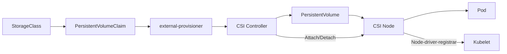

> CSI（Container Storage Interface）为 Kubernetes 提供了统一、标准化的存储扩展能力，是现代云原生存储生态的基础。

## 什么是 CSI

容器存储接口（Container Storage Interface，CSI）是一个行业标准接口规范，旨在统一容器编排系统（Container Orchestration，CO）与存储系统之间的交互方式。通过 CSI，存储供应商可以开发一次驱动程序，即可在多个容器编排平台上使用，无需为每个平台单独开发。

CSI 在 Kubernetes 中作为 out-of-tree 插件实现，这意味着存储驱动程序与 Kubernetes 核心代码分离，可以独立开发、测试和部署。

## CSI 发展历程



| 版本           | 里程碑说明                |
| -------------- | ------------------------ |
| v1.9           | Alpha 特性引入            |
| v1.10          | 升级为 Beta 特性          |
| v1.13          | 正式 GA（General Availability） |
| v1.14+         | CSI 成为存储插件标准方式   |



## CSI 架构

CSI 驱动程序通常包含以下组件：

### Controller 组件

- **CSI Controller**：负责卷的生命周期管理（创建、删除、扩容等）
- **External-provisioner**：监听 PVC 事件，触发卷的创建和删除
- **External-attacher**：处理卷的挂载和卸载操作
- **External-resizer**：处理卷的扩容操作

### Node 组件

- **CSI Node**：在每个节点上运行，负责卷的挂载到具体路径
- **Node-driver-registrar**：向 kubelet 注册 CSI 驱动程序

下图展示了 CSI 架构的核心组件及其交互关系：




{width=2004 height=218}

## CSI 持久化卷字段

CSI 持久化卷支持以下关键字段：



| 字段名           | 说明                                 |
|------------------|--------------------------------------|
| driver           | 指定 CSI 驱动程序名称（必填，≤63 字符） |
| volumeHandle     | 卷唯一标识，由 CreateVolume 返回      |
| readOnly         | 是否只读模式（可选，默认 false）      |
| fsType           | 文件系统类型（可选）                  |
| volumeAttributes | 传递给驱动程序的额外参数              |



## 使用 CSI

Kubernetes 支持动态和静态两种卷配置方式，适应不同业务场景。

### 动态配置

通过 StorageClass 实现卷的动态创建。以下 YAML 示例展示了 StorageClass 和 PVC 的配置方法：

```yaml
apiVersion: storage.k8s.io/v1
kind: StorageClass
metadata:
  name: fast-ssd-storage
provisioner: csi.example.com
parameters:
  type: ssd
  replication: "3"
  fsType: ext4
allowVolumeExpansion: true
reclaimPolicy: Delete
```

创建 PVC 触发动态配置：

```yaml
apiVersion: v1
kind: PersistentVolumeClaim
metadata:
  name: app-storage-claim
spec:
  accessModes:
  - ReadWriteOnce
  resources:
    requests:
      storage: 10Gi
  storageClassName: fast-ssd-storage
```

### 静态配置

手动创建 PV 来使用已存在的卷。以下 YAML 示例展示了静态 PV 的配置：

```yaml
apiVersion: v1
kind: PersistentVolume
metadata:
  name: existing-volume-pv
spec:
  capacity:
    storage: 10Gi
  volumeMode: Filesystem
  accessModes:
  - ReadWriteOnce
  persistentVolumeReclaimPolicy: Retain
  csi:
    driver: csi.example.com
    volumeHandle: existing-volume-id
    readOnly: false
    fsType: ext4
    volumeAttributes:
      storage.kubernetes.io/csiProvisionerIdentity: csi.example.com
```

### Pod 中使用 CSI 卷

以下 YAML 展示了 Pod 通过 PVC 挂载 CSI 卷的方式：

```yaml
apiVersion: v1
kind: Pod
metadata:
  name: app-pod
spec:
  containers:
  - name: app-container
    image: nginx:1.20
    volumeMounts:
    - name: app-storage
      mountPath: /data
  volumes:
  - name: app-storage
    persistentVolumeClaim:
      claimName: app-storage-claim
```

## 开发 CSI 驱动程序

### 实现 CSI 接口

CSI 驱动程序需实现以下三个主要接口：

- **Identity Service**：提供驱动程序身份信息
- **Controller Service**：管理卷的生命周期
- **Node Service**：处理节点级别的卷操作

### 推荐的 Sidecar 容器

Kubernetes 社区提供了多种 sidecar 容器，简化 CSI 驱动开发和运维：



| Sidecar 容器           | 功能描述                 |
|-----------------------|--------------------------|
| external-provisioner  | 监听 PVC 事件            |
| external-attacher     | 监听 VolumeAttachment 事件|
| external-resizer      | 处理 PVC 扩容请求        |
| external-snapshotter  | 管理卷快照功能           |
| node-driver-registrar | 向 kubelet 注册 CSI 驱动  |
| livenessprobe         | 监控 CSI 驱动健康状态    |



### 部署最佳实践

- **使用 DaemonSet 部署 Node 组件**：确保每个节点都有 CSI Node 服务
- **使用 StatefulSet 或 Deployment 部署 Controller 组件**：通常只需 1~3 个副本
- **配置适当的 RBAC 权限**：确保 sidecar 容器有权限操作 Kubernetes 资源
- **实现健康检查**：使用 liveness/readiness 探针保障服务可用性

## CSI 功能特性

CSI 支持丰富的存储功能，满足多样化业务需求。

### 卷快照

CSI 支持卷快照功能，允许用户创建卷的时间点副本。以下 YAML 示例展示了 VolumeSnapshot 的用法：

```yaml
apiVersion: snapshot.storage.k8s.io/v1
kind: VolumeSnapshot
metadata:
  name: my-snapshot
spec:
  volumeSnapshotClassName: csi-snapclass
  source:
    persistentVolumeClaimName: app-storage-claim
```

### 卷克隆

支持从现有 PVC 克隆新卷：

```yaml
apiVersion: v1
kind: PersistentVolumeClaim
metadata:
  name: cloned-pvc
spec:
  dataSource:
    name: app-storage-claim
    kind: PersistentVolumeClaim
  accessModes:
  - ReadWriteOnce
  resources:
    requests:
      storage: 10Gi
```

### 卷扩容

支持在线扩容已挂载的卷：

```yaml
# 修改 PVC 的存储请求大小
spec:
  resources:
    requests:
      storage: 20Gi  # 从 10Gi 扩容到 20Gi
```

## 故障排查

CSI 相关问题可通过以下方式排查：

### 常见问题

- **驱动程序注册失败**：检查 node-driver-registrar 日志
- **卷挂载失败**：查看 CSI driver 和 kubelet 日志
- **动态配置失败**：检查 external-provisioner 和 StorageClass 配置

### 调试命令

以下命令有助于定位和排查 CSI 相关问题：

```bash
# 查看 CSI 驱动程序状态
kubectl get csidrivers

# 查看 CSI 节点信息
kubectl get csinodes

# 查看卷挂载状态
kubectl get volumeattachments

# 查看存储类
kubectl get storageclass
```

## 总结

CSI 作为 Kubernetes 存储扩展的标准接口，极大提升了存储生态的可扩展性和兼容性。通过合理设计和部署 CSI 驱动，结合社区 Sidecar 工具，可实现高效、稳定的云原生存储解决方案。

## 参考文献

- [CSI 规范文档 - github.com](https://github.com/container-storage-interface/spec)
- [Kubernetes CSI 文档 - kubernetes-csi.github.io](https://kubernetes-csi.github.io/docs/)
- [CSI Sidecar 容器 - github.com](https://github.com/kubernetes-csi)
- [CSI 驱动程序示例 - github.com](https://github.com/kubernetes-csi/drivers)
