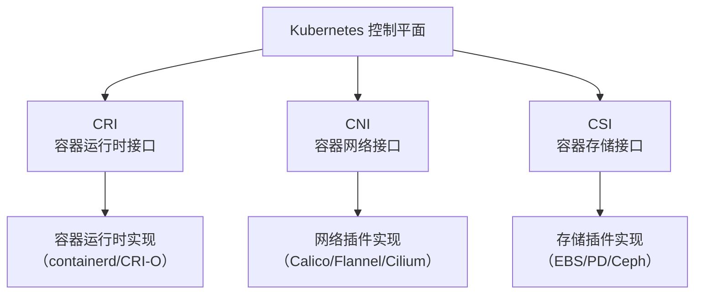

> Kubernetes 通过标准化的开放接口（CRI、CNI、CSI），实现了计算、网络和存储资源的解耦与可扩展，推动了云原生生态的繁荣。

## 核心开放接口概览

Kubernetes 提供了三个核心开放接口，分别管理分布式系统中最基础的资源类型。下表总结了各接口的功能、作用及主流实现：



| 接口名称 | 全称                  | 主要功能         | 作用说明                   | 常见实现                          |
|----------|----------------------|------------------|----------------------------|------------------------------------|
| CRI      | 容器运行时接口        | 计算资源管理     | 标准化容器运行时交互        | containerd、CRI-O、Docker Engine   |
| CNI      | 容器网络接口          | 网络资源管理     | 统一容器网络配置与管理      | Flannel、Calico、Cilium、Weave Net |
| CSI      | 容器存储接口          | 存储资源管理     | 标准化存储卷生命周期管理    | AWS EBS、GCE PD、Azure Disk、Ceph  |



### 容器运行时接口（CRI）

- **功能**：提供计算资源管理
- **作用**：标准化容器运行时的交互方式
- **常见实现**：containerd、CRI-O、Docker Engine

### 容器网络接口（CNI）

- **功能**：提供网络资源管理
- **作用**：统一容器网络配置和管理
- **常见实现**：Flannel、Calico、Cilium、Weave Net

### 容器存储接口（CSI）

- **功能**：提供存储资源管理
- **作用**：标准化存储卷的生命周期管理
- **常见实现**：AWS EBS、GCE PD、Azure Disk、Ceph

## 插件化架构优势

Kubernetes 的插件化架构设计带来了如下优势：

- **解耦合**：各组件职责明确，便于独立开发和维护。
- **可扩展**：支持多种实现方案，满足不同场景需求。
- **标准化**：统一接口规范，降低集成复杂度。
- **生态丰富**：促进云原生生态系统的繁荣发展。

## 开放接口协作关系图

下图展示了 Kubernetes 通过 CRI、CNI、CSI 三大接口将计算、网络、存储资源有机结合，形成完整的分布式应用运行平台：

{width=1920 height=985}

## 总结

Kubernetes 通过 CRI、CNI、CSI 等开放接口实现了计算、网络、存储三大核心资源的解耦与标准化，极大提升了平台的可扩展性和生态兼容性。插件化架构为云原生基础设施的演进和创新提供了坚实基础。

## 参考文献

- [Kubernetes CRI 设计文档 - kubernetes.io](https://kubernetes.io/zh/docs/concepts/architecture/cri/)
- [Kubernetes CNI 设计文档 - kubernetes.io](https://kubernetes.io/zh/docs/concepts/extend-kubernetes/compute-storage-net/network-plugins/)
- [Kubernetes CSI 设计文档 - kubernetes.io](https://kubernetes.io/zh/docs/concepts/storage/volumes/#csi)
