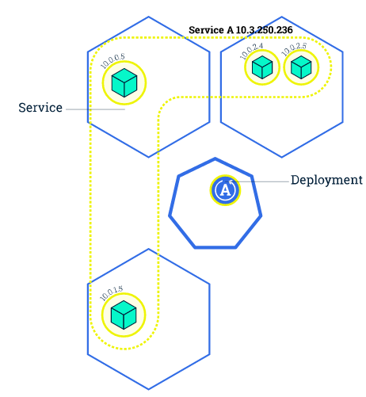
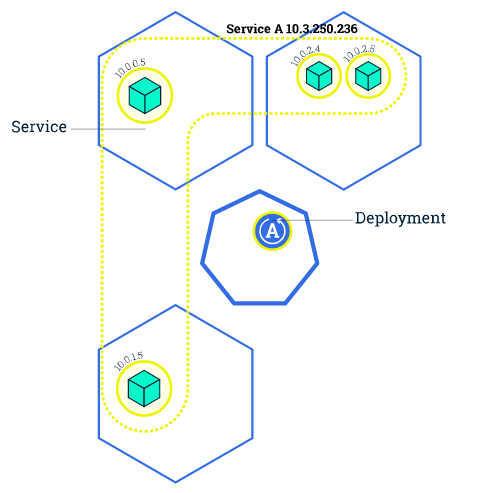
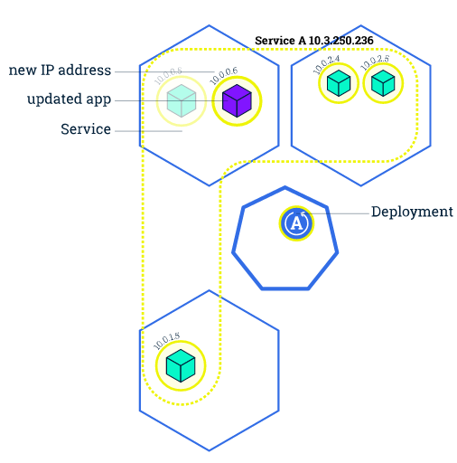
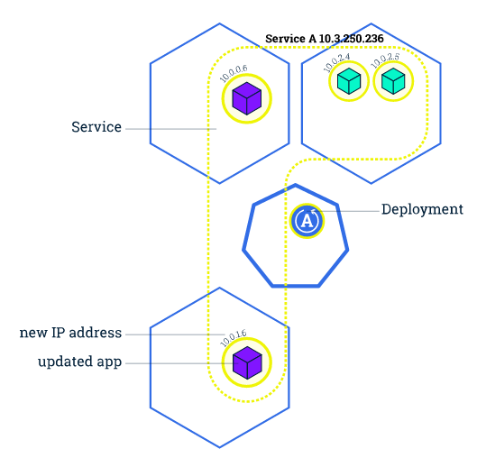
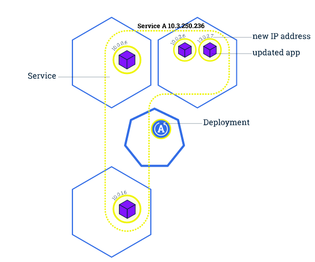

# Kubernetes 201

## 扩展应用

通过修改Deployment中副本的数量（replicas），可以动态扩展或收缩应用：



这些自动扩展的容器会自动加入到service中，而收缩回收的容器也会自动从service中删除。

```sh
$ kubectl scale --replicas=3 deployment/nginx-app
$ kubectl get deploy
NAME        DESIRED   CURRENT   UP-TO-DATE   AVAILABLE   AGE
nginx-app   3         3         3            3           10m
```

## 滚动升级

滚动升级（Rolling Update）通过逐个容器替代升级的方式来实现无中断的服务升级：

```
kubectl rolling-update frontend-v1 frontend-v2 --image=image:v2
```








在滚动升级的过程中，如果发现了失败或者配置错误，还可以随时会滚回来：

```
kubectl rolling-update frontend-v1 frontend-v2 --rollback
```

需要注意的是，rolling-update只针对ReplicationController，不能直接用在deployment上。Deployment可以在spec中设置更新策略为RollingUpdate（默认就是RollingUpdate）：

```yaml
  spec:
    replicas: 3
    selector:
      matchLabels:
        run: nginx-app
    strategy:
      rollingUpdate:
        maxSurge: 1
        maxUnavailable: 1
      type: RollingUpdate
```

而更新应用的话，就可以直接用`kubectl set`命令：

```sh
kubectl set image deployment/nginx-app nginx-app=nginx:1.9.1
```

滚动升级的过程可以用`rollout`命令查看:

```sh
$ kubectl rollout status deployment/nginx-app
Waiting for rollout to finish: 2 out of 3 new replicas have been updated...
Waiting for rollout to finish: 2 of 3 updated replicas are available...
Waiting for rollout to finish: 2 of 3 updated replicas are available...
Waiting for rollout to finish: 2 of 3 updated replicas are available...
Waiting for rollout to finish: 2 of 3 updated replicas are available...
Waiting for rollout to finish: 2 of 3 updated replicas are available...
deployment "nginx-app" successfully rolled out
```

Deployment同样支持回滚：

```sh
$ kubectl rollout history deployment/nginx-app
deployments "nginx-app"
REVISION	CHANGE-CAUSE
1		<none>
2		<none>

$ kubernetes kubectl rollout undo deployment/nginx-app
deployment "nginx-app" rolled back
```

