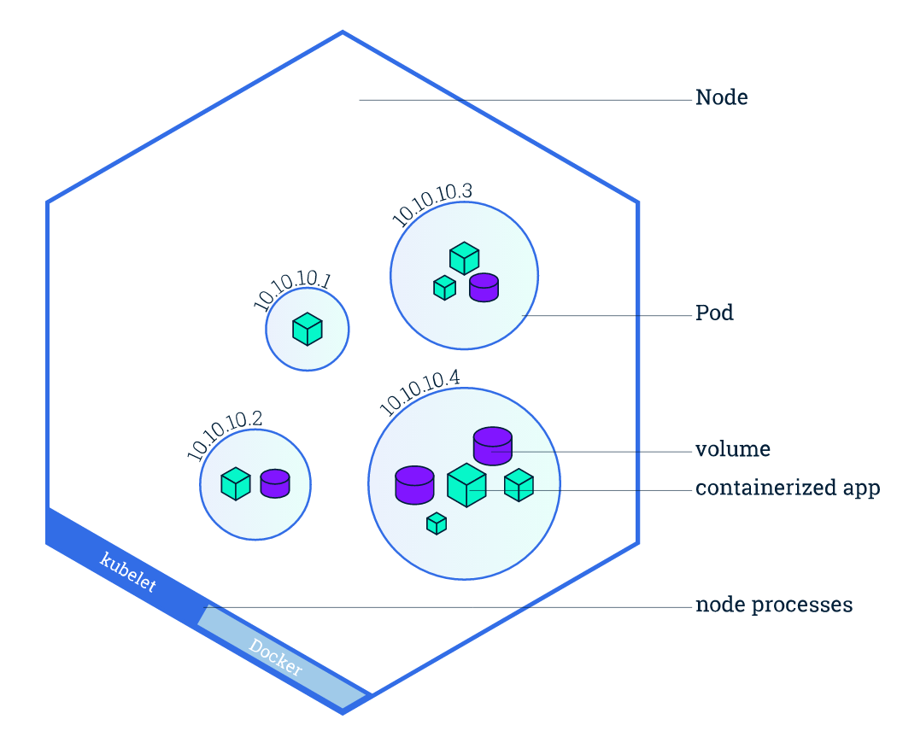
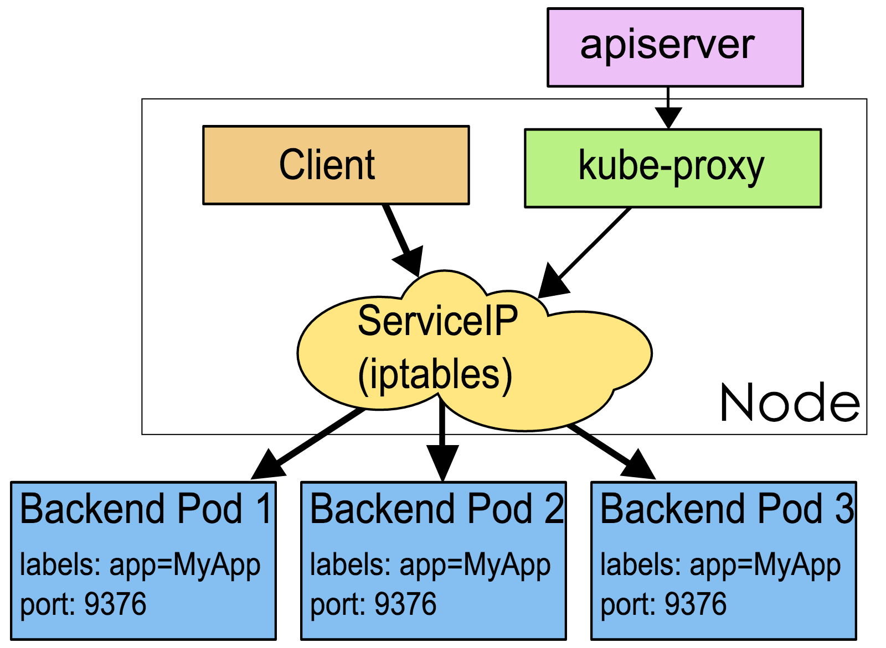

# Kubernetes核心概念

## Pod

Pod是一组紧密关联的容器集合，它们共享Volume和network namespace，是Kubernetes调度的基本单位。Pod的设计理念是支持多个容器在一个Pod中共享网络和文件系统，可以通过进程间通信和文件共享这种简单高效的方式组合完成服务。

## Node

Node是Pod真正运行的主机，可以物理机，也可以是虚拟机。为了管理Pod，每个Node节点上至少要运行container runtime（比如docker或者rkt）、`kubelet`和`kube-proxy`服务。

## Service

Service是应用服务的抽象，通过labels为应用提供负载均衡和服务发现。Service对外暴露一个统一的访问接口，外部服务不需要了解后端容器的运行。

## Label

Label是识别Kubernetes对象的标签，以key/value的方式附加到对象上。Label不提供唯一性，并且实际上经常是很多对象（如Pods）都使用相同的label来标志具体的应用。

Label定义好后其他对象可以使用Label Selector来选择一组相同label的对象（比如ReplicaSet和Service用label来选择一组Pod）。Label Selector支持以下几种方式：

- 等式，如`app=nginx`和`env!=production`
- 集合，如`env in (production, qa)`
- 多个label（它们之间是AND关系），如`app=nginx,env=test`

## Annotations

Annotations是key/value形式附加于对象的注解。不同于Labels用于标志和选择对象，Annotations则是用来记录一些附加信息，以便于外部工具进行查找。

## Namespace

Namespace是对一组资源和对象的抽象集合，比如可以用来将系统内部的对象划分为不同的项目组或用户组。常见的pods, services, replication controllers和deployments等都是属于某一个namespace的（默认是default），而node, persistentVolumes等则不属于任何namespace。

