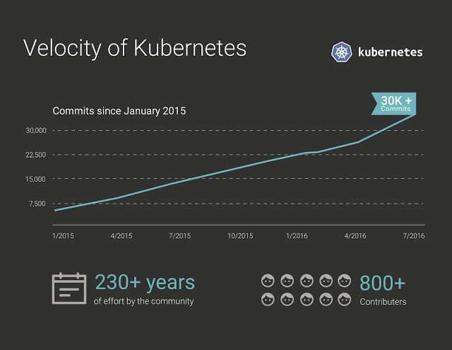

# Kubernetes简介

Kubernetes是谷歌开源的容器集群管理系统，是Google多年大规模容器管理技术Borg的开源版本，主要功能包括：

- 基于容器的应用部署、维护和滚动升级
- 负载均衡和服务发现
- 跨机器和跨地区的集群调度
- 自动伸缩
- 无状态服务和有状态服务
- 广泛的Volume支持
- 插件机制保证扩展性

Kubernetes发展非常迅速，已经成为容器编排领域的领导者。

## Kubernetes架构

