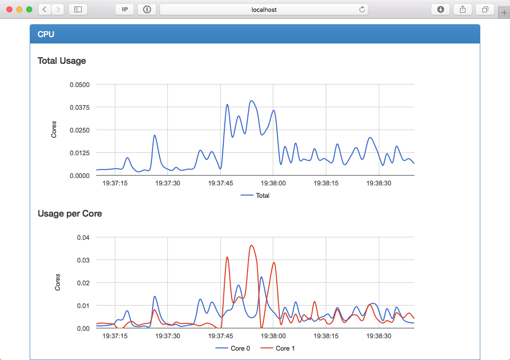
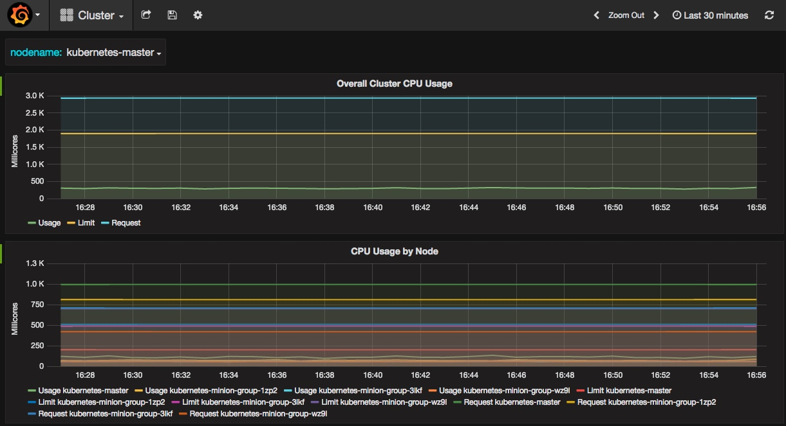
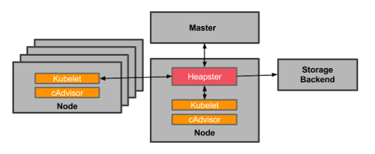

# Kubernetes监控

## cAdvisor

[cAdvisor](https://github.com/google/cadvisor)是一个来自Google的容器监控工具，也是kubelet内置的容器资源收集工具。它会自动收集本机容器CPU、内存、网络和文件系统的资源占用情况，并对外提供cAdvisor原生的API（默认端口为`--cadvisor-port=4194`）。



## InfluxDB和Grafana

[InfluxDB](https://www.influxdata.com/time-series-platform/influxdb/)是一个开源分布式时序、事件和指标数据库；而[Grafana](http://grafana.org/)则是InfluxDB的dashboard，提供了强大的图表展示功能。



## Heapster

前面提到的cAdvisor只提供了单机的容器资源占用情况，而[Heapster](https://github.com/kubernetes/heapster)则提供了整个集群的资源监控，并支持持久化数据存储到InfluxDB、Google Cloud Monitoring或者[其他的存储后端](https://github.com/kubernetes/heapster)。

Heapster从kubelet提供的API采集节点和容器的资源占用：



另外，Heapster的`/metrics` API提供了Prometheus格式的数据。

### 部署Heapster、InfluxDB和Grafana

在Kubernetes部署成功后，dashboard、DNS和监控的服务也会默认部署好，比如通过`cluster/kube-up.sh`部署的集群默认会开启以下服务：

```sh
$ kubectl cluster-info
Kubernetes master is running at https://kubernetes-master
Heapster is running at https://kubernetes-master/api/v1/proxy/namespaces/kube-system/services/heapster
KubeDNS is running at https://kubernetes-master/api/v1/proxy/namespaces/kube-system/services/kube-dns
kubernetes-dashboard is running at https://kubernetes-master/api/v1/proxy/namespaces/kube-system/services/kubernetes-dashboard
Grafana is running at https://kubernetes-master/api/v1/proxy/namespaces/kube-system/services/monitoring-grafana
InfluxDB is running at https://kubernetes-master/api/v1/proxy/namespaces/kube-system/services/monitoring-influxdb
```

如果这些服务没有自动部署的话，可以根据[cluster/addons](https://github.com/kubernetes/kubernetes/tree/master/cluster/addons)来添加需要的服务。

## Prometheus

[Prometheus](https://prometheus.io)是另外一个监控和时间序列数据库，并且还提供了告警的功能。他提供了强大的查询语言和HTTP接口，也支持将数据导出到Grafana中展示。

使用Prometheus监控Kubernetes需要配置好数据源，一个简单的示例是[prometheus.yml](prometheus.txt)：

```
kubectl create -f http://feisky.xyz/kubernetes/monitor/prometheus.txt
```


## 其他容器监控系统

- [Sysdig](http://blog.kubernetes.io/2015/11/monitoring-Kubernetes-with-Sysdig.html)
- CoScale
- Datadog
- Sematext


