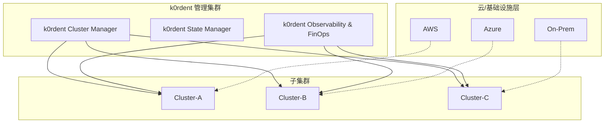
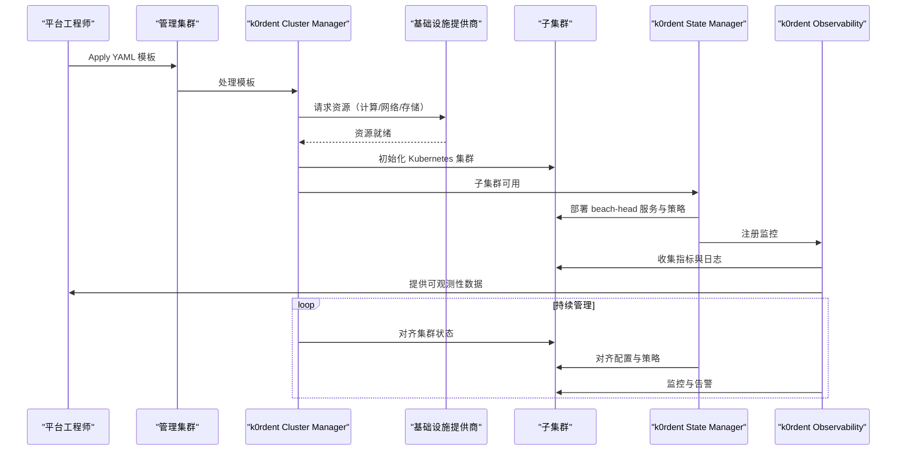

> 平台工程的未来在于统一的超级控制平面，k0rdent 正在重塑多集群 Kubernetes 管理的范式。

## 项目简介与目的

[k0rdent](https://github.com/k0rdent/k0rdent) 是 Mirantis 推出的开源“超级控制平面”（Super Control Plane）实现，旨在为企业级平台工程（Platform Engineering）提供一个统一的多集群控制平面。与传统的单集群运维工具不同，k0rdent 更侧重于平台化能力：通过声明式模板、策略引擎与集中化观测来实现跨集群的统一治理与自动化运维。

k0rdent 的主要目标和能力包括：

- 使用 Cluster API 为多集群生命周期管理提供统一契约（声明式 YAML）
- 自动化集群的创建、升级、回滚与销毁流程
- 提供平台层的策略与模板能力（Golden Path / Platform Templates）
- 集中式的可观测性与 FinOps 支持，便于跨集群监控与成本优化

## k0rdent 核心组件

k0rdent 的架构由多个模块组成，每个模块对应一个平台职责。下表对各核心组件及其功能进行了总结，便于理解其分工：



| 组件 | 功能说明 |
|------|-----------|
| KCM (k0rdent Cluster Manager) | 管理集群的创建、升级、配置、扩容与销毁，基于 Cluster API 实现。负责与基础设施提供商交互以实际创建云/裸金属资源，并驱动子集群的 bootstrap 流程。 |
| KSM (k0rdent State Manager) | 管理集群中关键状态与策略（如 beach‑head services、策略模板、集群级别配置），负责将平台模板与策略下发到各子集群并确保配置一致性。 |
| KOF (k0rdent Observability & FinOps) | 提供跨集群的监控、事件、日志与成本分析能力，支持统一的指标采集、告警与成本可视化面板。 |



补充说明：KSM 在实践中常与 Project Sveltos 等策略/策略下发工具配合使用；KOF 可集成 Prometheus/Grafana、Loki、以及成本分析系统以提供完整的观测与 FinOps 功能。

这些模块共同组成了一个分层的“超级控制平面”，可对多云、多集群环境进行集中式治理。

## k0rdent 架构概览

下图展示了 k0rdent 在多集群体系中的位置与组件关系，有助于理解其整体架构设计：

{width=1920 height=512}

实现视角：管理集群（Management Cluster）是控制平面的核心，运行 KCM、KSM、KOF 等控制器。用户通过 GitOps（如 ArgoCD）或 kubectl 将声明式模板应用到管理集群，随后 KCM 与 Cluster API 协同调用云/基础设施 API 完成子集群的创建与配置。

## k0rdent 工作机制

k0rdent 遵循声明式管理模式（Declarative Management），其工作流程如下：

1. 定义目标状态（YAML）：通过 Cluster API CRDs 定义集群模板、网络配置、资源策略等。
2. 应用到管理集群：管理集群中的控制器（KCM、KSM）会解析配置并调用基础设施提供商 API。
3. 自动化执行与对齐：k0rdent 负责协调各子集群的状态，确保实际状态与期望状态一致。
4. 统一观测与优化：通过 KOF 模块收集指标、日志与成本信息，实现闭环治理。

为了更直观地理解 k0rdent 的自动化流程，下面给出一个简略的序列图：

{width=1920 height=963}

该流程体现了 k0rdent 的声明式、自动化和闭环治理特性。

## k0rdent 与其他多集群方案对比

为了帮助读者理解 k0rdent 的定位，下面的表格对比了主流多集群方案的核心差异：



| 维度     | k0rdent                  | Karmada             | Volcano             |
| -------- | ------------------------ | ------------------- | ------------------- |
| 定位     | 平台工程控制平面         | 多集群调度与联邦    | 批处理任务调度      |
| 管理层级 | 多集群生命周期管理       | 多集群工作负载分发  | 单集群 Pod 调度     |
| 技术基础 | Cluster API + 声明式架构 | 原生 Kubernetes API | Scheduler Framework |
| 适用场景 | IDP 构建、混合云治理     | 多云部署、策略同步  | AI/HPC 批量任务调度 |



简而言之，Karmada 是“多集群联邦控制面”，Volcano 是“高性能调度器”，而 k0rdent 则是更上层的“超级控制平面”，帮助构建平台工程化的多集群系统。

## k0rdent 典型应用场景

k0rdent 适用于多种企业级和创新型场景。以下列表总结了其主要应用方向，并为每个场景提供简要说明：

- 企业级多集群管理：集中治理多个区域、业务线或环境（Dev/Prod）的集群。
- 混合云统一平台：在公有云、私有云和边缘环境中实现一致的管理体验。
- Internal Developer Platform（IDP）建设：为开发者提供统一的自助式平台入口。
- AI/ML 基础设施编排：与 Volcano、vLLM 等组件集成，管理计算资源与推理集群。

## 实施架构

为了帮助理解 k0rdent 的分层实现方式，下面简要介绍各层职责：

- 管理层（Management Cluster）：运行控制器、GitOps 服务与平台管理 API。
- Provider 层：Cluster API providers（如 CAPA/CAPZ 等）负责与云厂商/裸金属交互。
- 子集群（Managed Clusters）：真正运行业务负载的 Kubernetes 集群。
- 平台服务层：beach‑head 服务（ingress、istio/mesh）、监控/日志、认证、以及 FinOps 组件。

该分层的关键点在于“控制平面与执行平面分离”，管理集群负责控制与下发，具体的资源创建与运行由 provider 与子集群承担，从而实现跨环境的一致性与可复现性。

## 关键特性与收益

下表总结了 k0rdent 的主要特性及其带来的收益：



| 特性 | 收益 |
| --- | --- |
| 声明式配置（Cluster API） | 配置可版本化、易回滚，便于 GitOps 流程 |
| 平台级模板与策略 | 快速复制平台能力，缩短平台交付时间 |
| 集中式观测与 FinOps | 多集群统一可视化，便于资源与成本优化 |
| 可扩展 Provider 架构 | 支持多云及裸金属，提升跨环境一致性 |



## 总结

k0rdent 代表了 Kubernetes 多集群管理的新阶段：从单纯的集群编排，向平台工程层的“超级控制平面”演进。通过将 Cluster API、平台模板、策略管理与集中观测结合，k0rdent 帮助组织构建可复用、可治理、可观测的多集群平台，实现跨环境的一致性治理与自动化运维。

实践建议：在引入 k0rdent 时，先梳理平台的 Golden Path、模板与策略边界，优先在非生产环境做端到端演练，并将观测/成本数据接入 KOF 层进行持续优化。

## 参考文献

- [k0rdent 官方文档 - docs.k0rdent.io](https://docs.k0rdent.io/latest/guide-to-quickstarts/)
- [Introducing k0rdent — CNCF Blog - cncf.io](https://www.cncf.io/blog/2025/02/24/introducing-k0rdent-design-deploy-and-manage-kubernetes-based-idps/)
- [Project Sveltos - github.com](https://github.com/projectsveltos/sveltos)
- [Cluster API 官方站点 - cluster-api.sigs.k8s.io](https://cluster-api.sigs.k8s.io/)
