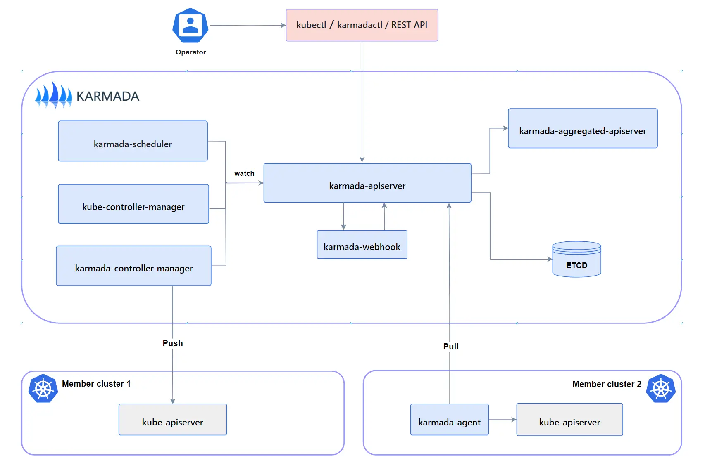

Karmada 是一个 Kubernetes 管理系统，使您能够在多个 Kubernetes 集群和云中运行云原生应用程序，而无需更改应用程序。通过使用 Kubernetes 原生 API 并提供先进的调度功能，Karmada 实现了真正的开放式、多云 Kubernetes。



`Karmada` 是由“Kubernetes”和“Armada”组合而来的。`Armada` 这个词在英语中意味着“舰队”，通常指的是由许多船只组成的大型水面作战力量。在这里，它象征着多个集群的集合，每个集群如同一个强大的船只，共同组成了一个强大的“舰队”（正如 Karmada 的图标是一个舰队一样），协同工作，提高效率和资源利用率。



关于 Karmada 的更多内容，请访问 [Karmada 文档](https://karmada.io/zh/docs/)。

## Karmada 组件概述

下图展示的是 Karmada 中的各个组件及其关系。

以下是 Karmada 的主要组件概述以及每个组件的功能说明：

- **karmada-apiserver**：扩展了 Kubernetes API 的 Karmada API 服务器，作为 Karmada 控制平面的前端，使 Karmada 能够简单集成 Kubernetes 生态系统，并允许使用`kubectl`操作 Karmada。

- **karmada-aggregated-apiserver**：利用 Kubernetes API 聚合层技术的聚合 API 服务器，提供集群 API 和相关子资源，支持通过 karmada-apiserver 访问成员集群。

- **kube-controller-manager**：包含多个控制器的 kube-controller-manager，Karmada 继承了一些来自 Kubernetes 的控制器，以保持用户体验和行为的一致性。

- **karmada-controller-manager**：运行多个自定义控制器进程的管理器，这些控制器监视 Karmada 对象并与下层集群的 API 服务器交互，创建常规的 Kubernetes 资源。

- **karmada-scheduler**：负责将 k8s 原生 API 资源对象（包括 CRD 资源）调度到成员集群，根据约束和可用资源确定有效的集群放置。

- **karmada-webhook**：是 HTTP 回调，处理 Karmada/Kubernetes API 请求的 webhook，可以定义为验证 webhook 和突变 webhook，用于执行自定义策略和修改对象。

- **etcd**：作为 Karmada/Kubernetes API 对象的后端存储，提供一致且高可用的键值存储。

- **karmada-agent**：在 Pull 模式下部署在每个成员集群上的代理，负责将特定集群注册到 Karmada 控制平面并同步清单和状态。

- **karmada-scheduler-estimator**：运行一个精确的集群调度估算器，为调度器提供更精确的集群资源信息。

- **karmada-descheduler**：定期检测所有副本，并根据成员集群中实例状态的变化触发重新调度。

- **karmada-search**：启动一个聚合服务器，提供全局搜索和多云环境中的资源代理等功能。

- **karmadactl**：Karmada 提供的命令行工具，用于与 Karmada 控制平面通信，执行诸如集群加入/退出等操作。

- **kubectl karmada**：以 kubectl 插件的形式提供功能，其实现与`karmadactl`完全相同。

## 集群注册概述

Karmada 允许用户将多个集群注册到 Karmada 控制平面，以便进行统一管理和调度。集群注册的过程涉及到在 Karmada 控制平面和目标集群之间建立连接。

Karmada 的集群注册，包括了`Push`模式和`Pull`模式：

- **Push 模式**：Karmada 控制平面直接访问成员集群的`kube-apiserver`以获取集群状态和部署清单。
- **Pull 模式**：控制平面不直接访问成员集群，而是通过一个叫做`karmada-agent`的额外组件来委派任务。

### 注册集群 - Push 模式

- 使用`kubectl-karmada`命令行工具通过`join`命令注册集群，通过`unjoin`命令取消注册。
- 注册和取消注册时，需要指定 Karmada 的`kubeconfig`文件和成员集群的`kubeconfig`。
- 可以通过`--cluster-context`标志自定义集群上下文。

### 注册集群 - Pull 模式

- 使用`karmadactl register`命令以 Pull 模式注册成员集群。
- 注册过程中需要在 Karmada 控制平面创建引导令牌，并在成员集群执行注册命令。
- 成员集群注册后，`karmada-agent`将在其启动阶段自动完成集群的注册。

### 集群标识符

- 每个在 Karmada 注册的集群都会被表示为一个`Cluster`对象，对象的名称 (`.metadata.name`) 是注册时使用的名称。
- 在注册过程中，每个集群都会被分配一个`.spec.id`中的`独特标识符`，这主要用于技术上区分每个集群，防止同一个集群被多次以不同的名称注册。
