> Karmada 让多集群治理变得像单集群一样简单，实现了真正意义上的“云原生舰队”统一调度与管理。



`Karmada` 是由 "Kubernetes" 和 "Armada" 组合而来的。`Armada` 在英语中意味着"舰队"，通常指由许多船只组成的大型水面作战力量。在这里，它象征着多个集群的集合，每个集群如同一艘强大的战舰，共同组成了一个强大的"舰队"，协同工作以提高效率和资源利用率。



更多关于 Karmada 的详细信息，请访问 [Karmada 官方文档](https://karmada.io/zh/docs/)。

## 架构概览

Karmada 系统由一个控制平面（Control Plane）和多个成员集群（Member Cluster）组成。控制平面各组件协同工作，将资源分发到成员集群，并收集其状态。



{width=3158 height=1200}

## 主要特性

Karmada 具备以下核心特性，适用于多云和大规模多集群场景：

- **K8s 原生 API 兼容**：单集群到多集群零变更升级。
- **开箱即用**：内置多活、容灾、异地等策略。
- **避免厂商锁定**：支持多云集成。
- **集中管理**：集群位置无关的统一管理。
- **丰富调度策略**：集群亲和、再平衡、多维高可用。
- **开放中立**：CNCF 治理，产业广泛参与。

## 主要组件

- **karmada-apiserver**：Karmada 的核心 API 服务器，扩展自 Kubernetes API Server，作为所有操作的入口。
- **karmada-controller-manager**：包含多个控制器，负责 Karmada 资源的生命周期管理，包括集群控制器、策略控制器、绑定控制器、执行控制器、状态控制器等。
- **karmada-scheduler**：根据策略、约束和集群状态，为资源做分布决策，决定哪些成员集群接收哪些资源。
- **karmada-webhook**：通过准入 webhook 验证和变更 Karmada 资源。
- **karmada-descheduler**：当有更优部署方案时，优化工作负载分布，进行资源驱逐和重新调度。
- **karmada-scheduler-estimator**：为调度器提供资源用量估算，辅助调度决策。
- **karmadactl**：命令行工具，用于集群注册/注销、资源管理等操作。

## 资源传播流程

Karmada 的核心能力是根据策略将资源从控制平面传播到成员集群。流程如下：


{width=1920 height=1525}

简要步骤说明：

1. 用户创建资源模板（如 Deployment、Service 等）和传播策略。
2. 控制器检测资源与策略的匹配，生成 ResourceBinding/ClusterResourceBinding 对象。
3. 调度器根据策略约束和集群状态，决定目标集群并更新绑定对象。
4. 绑定控制器为每个目标集群创建 Work 对象。
5. 执行控制器根据 Work 对象将资源下发到成员集群。
6. 状态控制器收集成员集群的资源状态并聚合到绑定对象。
7. 若资源有依赖，依赖分发器检测并创建附加绑定对象。

## 资源关系

下图展示了 Karmada 各类自定义资源（CRD）之间的关系：



{width=1920 height=722}

## 同步模式

Karmada 支持两种资源同步模式：

### Push 模式

- 控制平面直接推送资源到成员集群，需具备 API 访问权限。
- 实时性高，适合网络连通性好的场景。

### Pull 模式

- 通过成员集群内的 karmada-agent 拉取资源，适合防火墙/NAT 后的集群。
- 成员集群主动与控制平面建立连接并同步资源。

## 核心概念

### 资源模板

Karmada 以标准 Kubernetes 资源定义为模板（如 Deployment、Service、ConfigMap 等），无需修改即可用于多集群传播。

### 传播策略

- **PropagationPolicy**：命名空间级策略，适用于命名空间资源。
- **ClusterPropagationPolicy**：集群级策略，适用于命名空间和集群级资源。

策略内容包括资源选择器、目标集群约束、调度策略（副本分布/复制）、依赖传播、故障转移等。

### 覆盖策略

- **OverridePolicy**：命名空间级覆盖。
- **ClusterOverridePolicy**：集群级覆盖。

用于为特定集群定制资源（如镜像仓库、存储类型、资源规格等）。

### 资源绑定

- **ResourceBinding**：命名空间资源的绑定对象。
- **ClusterResourceBinding**：集群级资源的绑定对象。

记录原始资源、目标集群、副本数、调度结果和聚合状态。

## Work 对象详解：控制面与成员集群之间的契约

在理解 Karmada 的多集群调度机制时，最核心的概念之一就是 **Work 对象（Work CRD）**。

### 一句话定义

> **Work 对象** 是 Karmada 控制平面中由执行控制器（Execution Controller）创建的中间层资源，用于描述“要同步到某个成员集群的 Kubernetes 资源清单”。

它本身不运行在成员集群中，而是控制平面与成员集群之间的“契约对象（contract object）”。

### Work 在整体流程中的位置



{width=1920 height=8627}
`

> 由此可见，**Work 并非业务资源本身，而是分发“任务描述”**。

### Work 对象示例

当用户在控制平面中创建一个 `nginx` Deployment 并定义传播策略分发到两个集群（`member1`、`member2`）时，Karmada 会在控制平面中为每个目标集群生成一个 Work 对象：

```yaml
apiVersion: work.karmada.io/v1alpha1
kind: Work
metadata:
  name: nginx-default-member1
  namespace: karmada-es-member1   # 命名空间代表目标集群
spec:
  workload:
    manifests:
      - apiVersion: apps/v1
        kind: Deployment
        metadata:
          name: nginx
          namespace: default
        spec:
          replicas: 1
          selector:
            matchLabels:
              app: nginx
          template:
            metadata:
              labels:
                app: nginx
            spec:
              containers:
                - name: nginx
                  image: nginx:latest
                  ports:
                    - containerPort: 80
```

字段解释：

- **`spec.workload.manifests`**：定义要下发的资源清单；
- **`metadata.namespace`**：标识目标集群（如 `karmada-es-member1`）；
- **`status.conditions`**：存储该集群中资源的执行状态。

### 同步与执行机制

下表说明了 Work 对象的同步与执行流程：



| 阶段       | 说明                                                      |
| ---------- | --------------------------------------------------------- |
| 1️⃣ 创建   | 控制平面根据调度结果为每个目标集群生成一个 Work。           |
| 2️⃣ 监听   | `karmada-agent` 监控对应命名空间（如 `karmada-es-member1`）的 Work。 |
| 3️⃣ 下发   | agent 将 Work 中的 `manifests` apply 到本地集群。          |
| 4️⃣ 状态上报 | agent 回传资源状态（副本数、可用性等）。                   |
| 5️⃣ 聚合   | 控制平面汇总状态到 ResourceBinding，形成全局视图。         |



### 概念对比表

下表对比了 Karmada 多集群调度中的关键对象：



| 概念                      | 所在位置 | 作用          | 是否运行在成员集群 |
| ----------------------- | ---- | ----------- | --------- |
| Deployment / Service    | 用户层  | 定义业务资源模板    | ❌         |
| PropagationPolicy       | 控制平面 | 定义资源传播策略    | ❌         |
| ResourceBinding         | 控制平面 | 绑定资源与目标集群   | ❌         |
| **Work**                | 控制平面 | 下发资源清单到目标集群 | ❌         |
| **Pod / Deployment 副本** | 成员集群 | 实际运行的业务资源   | ✅         |



### 查看命令示例

```bash
# 查看所有 Work 对象
kubectl get work -A --context karmada-apiserver

# 查看某个 Work 内容
kubectl get work nginx-default-member1 -n karmada-es-member1 -o yaml

# 在成员集群中验证实际部署
kubectl get deployment nginx -n default --context member1
```

### 小结

- **Work 是控制面发出的“部署任务”**，由 `karmada-agent` 执行；
- **成员集群只看到下发后的资源，不感知上层 Binding 逻辑**；
- **Work + agent 构成了 Karmada 的跨集群同步机制**；
- **状态从成员集群回传到控制平面，实现全局一致性观测**。

## 调度系统

Karmada 调度器基于插件框架，参考 Kubernetes 调度器，主要流程如下：


{width=1920 height=1133}

调度流程：

1. 过滤不合适的集群
2. 对可用集群打分
3. 按分数选择最佳集群
4. 若为分片调度，分配副本数

状态收集：

- 集群状态控制器监控成员集群健康与可用性。
- Work 状态控制器收集各集群资源部署状态。
- 所有状态聚合到 ResourceBinding/ClusterResourceBinding，统一展示全局资源状态。

## 实战示例：在多集群中部署一个应用

本节通过一个 Nginx 应用的多集群部署示例，帮助理解 Karmada 的声明式多集群调度与资源传播流程。

### 目标

我们希望将一个 Nginx 应用同时部署到多个集群中：

- **控制平面集群**：`karmada-host`
- **成员集群**：`member1`、`member2`
- **预期效果**：应用会根据策略自动传播至两个集群，并在其中各运行一个副本。

### 关键对象与工作流

下图展示了 Karmada 多集群部署的主要流程：


{width=1920 height=853}

> 该流程清晰地展示了「模板 → 策略 → 调度 → 传播 → 状态汇聚」的完整生命周期。

### 示例 YAML

#### 应用模板（nginx-deployment.yaml）

```yaml
apiVersion: apps/v1
kind: Deployment
metadata:
  name: nginx
  namespace: default
spec:
  replicas: 1
  selector:
    matchLabels:
      app: nginx
  template:
    metadata:
      labels:
        app: nginx
    spec:
      containers:
      - name: nginx
        image: nginx:latest
        ports:
        - containerPort: 80
```

> 与普通 Kubernetes Deployment 完全一致，无需修改。

#### 传播策略（propagation-policy.yaml）

```yaml
apiVersion: policy.karmada.io/v1alpha1
kind: PropagationPolicy
metadata:
  name: nginx-propagation
  namespace: default
spec:
  resourceSelectors:
    - apiVersion: apps/v1
      kind: Deployment
      name: nginx
  placement:
    clusterAffinity:
      clusterNames:
        - member1
        - member2
```

> 该策略定义了“哪些资源”需要被传播，以及“传播到哪些集群”。

#### 应用部署流程

```bash
# 1. 创建应用模板
kubectl --context karmada-apiserver apply -f nginx-deployment.yaml

# 2. 创建传播策略
kubectl --context karmada-apiserver apply -f propagation-policy.yaml

# 3. 查看资源绑定结果
kubectl --context karmada-apiserver get resourcebinding -n default

# 4. 验证 Work 下发到成员集群
kubectl --context member1 get deployment nginx -n default
kubectl --context member2 get deployment nginx -n default
```

执行后，Karmada 将在每个目标集群中自动创建对应的 Deployment，副本状态会同步回控制平面。

### 状态同步与全局可见性

部署完成后，控制平面会聚合每个成员集群的运行状态。

```bash
kubectl --context karmada-apiserver get work -A
kubectl --context karmada-apiserver get resourcebinding -n default -o yaml
```

输出中可看到每个集群的资源同步状态与副本数。例如：

```yaml
status:
  aggregatedStatus:
  - clusterName: member1
    applied: true
    availableReplicas: 1
  - clusterName: member2
    applied: true
    availableReplicas: 1
```

### 核心机制回顾（Pipeline 概览）

下图总结了 Karmada 多集群调度与资源传播的核心机制：



{width=1920 height=6882}

> ✅ 这就是 Karmada 的核心能力：**声明式多集群资源传播与调度闭环。**

### 小结

通过上面的流程可以看到：

- Karmada 无需修改应用模板；
- 通过 **PropagationPolicy** 声明即可跨集群自动分发；
- 具备统一的状态聚合与多集群视角；
- 兼容 GitOps、CI/CD 流水线，可与 ArgoCD、Flux 等协同使用。

> 在多云或混合云场景下，Karmada 可作为「多集群控制平面」的核心基础设施，实现真正意义上的 *Kubernetes Federation 3.0*。

## 总结

Karmada 为多 Kubernetes 集群资源管理提供了完整方案，继承并扩展了 Federation 思想，具备更强大的调度、覆盖和状态聚合能力。通过兼容 Kubernetes API，组织可无缝实现多集群治理，极大提升云原生基础设施的灵活性与可扩展性。

## 参考资料

- [Karmada 官方文档 - karmada.io](https://karmada.io/zh/docs/)
- [Karmada GitHub 仓库](https://github.com/karmada-io/karmada)
- [Karmada 官方文档 - Resource Propagating](https://karmada.io/zh/docs/userguide/scheduling/resource-propagating/)
