> 多集群（Multi-Cluster）管理是 Kubernetes 生态持续演进的核心方向。本文系统梳理了多集群架构与 API 的十年演进脉络，帮助读者理解主流治理模式与未来趋势。

## Kubernetes 多集群架构的演进阶段

下图展示了 Kubernetes 多集群管理的主要演进阶段：

{width=1920 height=761}

## Federation 与 KubeFed：早期的联邦控制平面

Kubernetes 最早在 1.5 版本引入 Federation v1，希望通过一个上层控制平面对多个集群进行统一管理。它允许在联邦控制平面中创建 `FederatedDeployment`、`FederatedService` 等对象，从而在多个集群中自动同步资源。

然而该方案存在如下问题：

- 依赖集中式控制面，可扩展性与可用性有限。
- 网络与安全模型复杂。
- 生态集成度低，难以和现有工具共存。

随后社区推出了 Federation v2（KubeFed），通过 CRD + Controller 的方式重写了联邦逻辑。但依旧没有在主线 Kubernetes 中进入 GA，逐渐被更灵活的方案取代。

## Multicluster Services API：跨集群服务发现的尝试

2020 年，SIG-Multicluster 提出了 [KEP-1645: Multi-Cluster Services API](https://github.com/kubernetes/enhancements/tree/master/keps/sig-multicluster/1645-multi-cluster-services-api)，旨在统一跨集群的服务发现与负载均衡标准。

### 核心设计思路

- **Namespace Sameness**：跨集群同名命名空间视为逻辑相同。
- **ServiceExport / ServiceImport**：通过声明式导入导出服务。
- **EndpointSlice 聚合**：跨集群同步服务端点，实现统一 DNS。
- **ClusterSet**：定义一组互信的集群集合。

MCS API 一度被认为是“官方多集群服务发现标准”，但在 2023 年后，SIG-Multicluster 已不再活跃维护。仓库 [kubernetes-sigs/mcs-api](https://github.com/kubernetes-sigs/mcs-api) 的最后活跃提交停留在 2023 年底，状态为“Frozen / Beta”。

#### 主要原因

- 过于依赖同构集群与固定网络。
- 缺乏对混合云、Service Mesh 的兼容性。
- 实际落地主要由 Karmada / OCM 等项目自行实现。

## 控制平面联邦化：Karmada、OCM 与 Fleet

2022 年后，社区与企业厂商转向控制平面联邦化（Control Plane Federation）模型。代表项目包括：

- **Karmada**（华为主导）：CNCF Sandbox 项目，支持 Push/Pull 注册模式。
- **Open Cluster Management (OCM)**（Red Hat）：聚焦策略治理与 Observability。
- **Rancher Fleet**：以 GitOps 为核心的多集群声明式交付。
- **Anthos / Azure Arc / Alibaba ACK One**：云厂商的托管式方案。

{width=1920 height=1502}

这些项目普遍采用以下核心理念：

- **统一控制面**：一个全局控制平面注册与管理多个成员集群。
- **声明式同步**：资源同步基于 CRD 与 Controller。
- **策略驱动调度**：ClusterPlacement、PropagationPolicy 等统一调度。
- **混合云兼容**：支持云上与边缘、私有集群混合接入。
- **服务网格兼容**：支持 Istio、Cilium 等服务网格的跨集群部署。
- **GitOps 融合**：支持 Argo CD / Flux 等 GitOps 工具的集成。
- **流量管理**：支持流量分发、负载均衡、故障转移等。

这些方案在生产实践中逐步取代了早期 Federation 的概念。

## Gateway API 时代：跨集群流量与服务治理的新标准

Kubernetes 官方的 SIG-Network 在 2024 年提出 Multi-Cluster Gateway API，这是目前社区公认的新一代跨集群服务发现与流量治理标准。

其核心思想为：

> 不再定义“跨集群服务”，而是以 Gateway + Route 的方式实现跨集群访问控制与流量转发。

### 优势

- 完全兼容 Gateway API 标准。
- 支持跨集群 Service、Failover、Route。
- 适配 Service Mesh、Cilium、Istio 等实现。
- 更易于与云厂商 Ingress / LB 融合。

### 官方规范

- [Gateway API Multi-Cluster Extension](https://gateway-api.sigs.k8s.io/concepts/multicluster/)
- [Kubernetes Enhancement Proposal #2642](https://github.com/kubernetes/enhancements/pull/2642)

## 当前主流方向（2025）

Kubernetes 多集群管理已进入“生态整合阶段”，目前主流方向包括：

表格说明：下表对比了当前主流多集群治理方向及其代表项目。



| 类别                   | 核心代表                      | 特点                   |
| ---------------------- | ----------------------------- | ---------------------- |
| API 标准化             | Multi-Cluster Gateway API      | 官方演进路线，流量与服务治理一体化 |
| 控制面治理             | Karmada / OCM / Fleet         | 策略控制、调度与统一 API |
| Service Mesh 跨集群    | Istio / Cilium / Linkerd       | 基于 L7 服务发现、零信任流量 |
| GitOps 联邦            | Argo CD / Flux                | 无集中控制面，靠 Git 声明式同步 |
| AI/Edge 融合架构       | KubeEdge / HAMi / Volcano     | 为 AI 原生工作负载扩展调度与算力联邦 |



下图展示了多集群治理的主要技术方向：

{width=1920 height=297}

这些模式正在融合形成新的趋势：

> 「Policy 中心化 + Data Plane 去中心化」的多集群治理架构。

## 小结：从 Federation 到 Gateway 的十年演进

多集群技术的演进，是 Kubernetes 社区从“集中控制”走向“分布式自治”的过程。

下表梳理了多集群架构的主要阶段、代表项目与现状。



| 阶段         | 代表项目                      | 核心理念                  | 现状           |
| ------------ | ----------------------------- | ------------------------- | -------------- |
| Federation   | Federation v1/v2              | 集中式控制面               | 已废弃         |
| 标准化探索   | MCS API                       | 服务层统一标准             | 已冻结         |
| 控制平面治理 | Karmada / OCM / Fleet         | 策略统一、调度中心         | 主流实践       |
| 网络层融合   | Multi-Cluster Gateway API      | Gateway + Route 跨集群流量 | 官方推荐方向   |



## 推荐阅读

- [Karmada 官方文档 - karmada.io](https://karmada.io/zh/docs/)
- [Gateway API Multi-Cluster - gateway-api.sigs.k8s.io](https://gateway-api.sigs.k8s.io/concepts/multicluster/)
- [Open Cluster Management - open-cluster-management.io](https://open-cluster-management.io/)
- [Cilium Cluster Mesh - docs.cilium.io](https://docs.cilium.io/en/stable/network/clustermesh/)
- [Istio Multi-Cluster Deployment - istio.io](https://istio.io/latest/docs/setup/install/multicluster/)

## 思考与展望

随着 AI 原生（AI-Native）工作负载兴起，多集群架构正从“资源调度”扩展到“算力编排”与“智能代理自治”层面。

未来可能出现的趋势包括：

- 与 AI Gateway / Model Control Plane (MCP) 融合的跨集群推理调度。
- 面向边缘 AI 与 GPU 集群的多租户算力虚拟化。
- 使用开放策略代理（OPA）+ Policy Engine 实现全局治理。

多集群管理，不再只是控制 Kubernetes 的集群，而是在控制整个分布式智能计算平面。

## 总结

Kubernetes 多集群管理架构与 API 的演进，体现了社区从集中式联邦到分布式自治的技术路线转变。当前，Gateway API、控制面联邦化、Service Mesh 跨集群、GitOps 联邦与 AI-Native 架构等多种模式正在融合，推动云原生基础设施向更高层次的智能化和自治演进。

## 参考文献

1. [KEP-1645: Multi-Cluster Services API - github.com](https://github.com/kubernetes/enhancements/tree/master/keps/sig-multicluster/1645-multi-cluster-services-api)
2. [kubernetes-sigs/mcs-api - github.com](https://github.com/kubernetes-sigs/mcs-api)
3. [Gateway API Multi-Cluster Extension - gateway-api.sigs.k8s.io](https://gateway-api.sigs.k8s.io/concepts/multicluster/)
4. [Karmada 官方文档 - karmada.io](https://karmada.io/zh/docs/)
5. [Open Cluster Management - open-cluster-management.io](https://open-cluster-management.io/)
6. [Cilium Cluster Mesh - docs.cilium.io](https://docs.cilium.io/en/stable/network/clustermesh/)
7. [Istio Multi-Cluster Deployment - istio.io](https://istio.io/latest/docs/setup/install/multicluster/)
