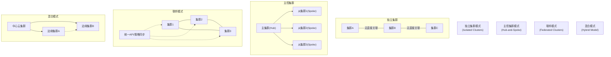

> 多集群管理已成为 Kubernetes 生态的重要发展方向。通过合理的多集群架构，企业能够提升系统的高可用性、隔离性与弹性，满足多云、合规和边缘计算等多样化需求。

## 为什么需要多集群

Kubernetes 最初设计用于管理单个集群内的容器化工作负载。然而，实际企业场景中，出于多种业务和技术动因，通常会选择部署多个集群。常见动因包括：

- **高可用性（High Availability）**：消除单点故障。当一个集群故障时，其他集群可继续对外服务，提升整体业务连续性。
- **隔离性（Isolation）**：将开发、测试、生产环境完全隔离，或在不同业务单元、客户之间进行资源隔离，增强安全性与管理灵活性。
- **扩展性（Scalability）**：突破单集群节点数与资源上限，更好地支持大规模工作负载。
- **合规与数据主权（Compliance & Sovereignty）**：在不同国家或地区独立部署，以满足数据安全与法规要求。
- **多云与混合云（Multi-Cloud / Hybrid Cloud）**：跨多个云厂商或本地数据中心部署，避免供应商锁定，提升灵活性。
- **边缘计算（Edge Computing）**：在靠近用户或设备侧运行轻量集群，实现低延迟响应，适应新兴的边缘场景。

这些目标共同推动了多集群架构的兴起与标准化发展。

## 多集群管理的挑战

多集群环境下的管理远比单集群复杂。主要挑战包括：

1. **网络与连通性**  
   各集群可能分布于不同 VPC、云厂商或地理区域，跨集群的服务通信、DNS 解析与流量调度是首要难题。
2. **身份与访问控制**  
   如何在多个集群间实现统一的身份认证（Authentication）与权限管理（Authorization），兼顾安全与灵活性。
3. **配置一致性与策略下发**  
   确保集群配置、命名规范、资源配额、网络策略等保持一致，是多集群治理的关键。
4. **应用部署与生命周期管理**  
   应用如何在多个集群中声明式部署、同步、升级与回滚，保证一致性与高效性。
5. **可观测性与故障诊断**  
   需要统一的监控、日志与追踪体系，实现跨集群的可观测性与健康检查。
6. **成本与资源优化**  
   多集群增加了资源分散、冗余与运营开销，需通过策略化调度与集中管理降低成本。

## 多集群架构模式

不同组织会根据业务需求采用不同的多集群架构模式。以下是几种典型模式及其适用场景：

{width=4694 height=459}

### 独立集群模式（Isolated Clusters）

每个集群独立运行、独立管理，适用于环境隔离、业务边界清晰的场景。  
优点是简单、安全，缺点是缺乏集中控制与资源共享能力。

### 主控集群模式（Hub-and-Spoke）

一个主集群（Hub）负责集中管理和调度多个从集群（Spoke），通过控制面统一治理。  
该模式常用于集中式企业 IT 管理场景，便于策略统一和资源分发。

### 联邦模式（Federated Clusters）

多个集群在逻辑上组成一个统一的联邦，通过标准化 API 共享配置与资源。  
此模式强调一致性与协作性，但实现和运维复杂度较高，适合对一致性要求极高的场景。

### 混合模式（Hybrid Model）

结合独立、主从、联邦等多种模式的优点，根据地域、云厂商或业务域灵活组合。  
这是当前主流企业的实践模式，例如跨云部署、中心 - 边缘协同架构。

## 多集群管理的核心能力

无论采用哪种架构模式，一个完善的多集群管理体系通常应具备以下核心能力：

- **集群注册与生命周期管理**：支持动态加入、删除、升级与健康检查，保障集群的可用性与可维护性。
- **集中身份认证与授权**：统一用户与服务账户体系，简化权限管理。
- **策略治理（Policy Management）**：集中分发安全、网络、资源、合规策略，提升治理效率。
- **应用分发与一致性控制**：基于声明式模型（如 GitOps）在多个集群间保持应用同步。
- **跨集群网络与服务发现**：实现跨集群流量负载均衡、DNS、服务路由，提升服务可用性。
- **可观测性与审计**：集中监控、日志聚合、告警与事件追踪，便于故障定位与合规审计。

## 多集群的实现思路

多集群管理的核心思想可以分为三层，每一层都承担着不同的职责：

1. **基础设施层（Infrastructure Layer）**  
   解决集群间的连接与通信，例如使用专线、VPN、Overlay 或基于 eBPF 的网络方案，确保网络互通与安全。
2. **控制平面层（Control Plane Layer）**  
   实现多集群资源注册、同步与策略控制。此层通常通过集中式控制平面或联邦 API 实现，统一管理各集群状态。
3. **应用与工作负载层（Workload Layer）**  
   使用 GitOps、Service Mesh、统一服务目录等方式，在多个集群间分发与运行应用，实现业务层面的高效协作。

## 当前的技术趋势（2024–2025）

近年来，多集群管理技术持续演进，主要趋势包括：

- **服务网格跨集群化**  
  Service Mesh（如 Istio、Linkerd、Cilium Service Mesh）正在成为多集群服务发现与流量治理的重要基础。
- **轻量级联邦与自治控制**  
  传统的 Kubernetes Federation 已演化为更灵活的资源同步与分布机制，如基于 Controller 的声明式模型。
- **GitOps 一体化治理**  
  GitOps 工具（如 Argo CD、Flux）开始支持多集群配置与应用交付的集中控制，实现基础设施与应用双层自动化。
- **边缘与中心协同（Cloud-Edge Coordination）**  
  随着边缘计算的发展，多集群架构正向“中心云 + 边缘节点”的分层治理模式演进。
- **统一可观测性与策略化安全**  
  通过集中观测平台（如 OpenTelemetry + Prometheus + Loki）以及 OPA / Kyverno 策略框架，实现跨集群的治理与合规。

## 总结

多集群管理是 Kubernetes 生态持续演进的核心方向之一。从最初的单集群实验，到如今覆盖多云、边缘与全球部署的复杂场景，多集群架构的目标不再只是“部署多个集群”，而是通过一致的控制面、网络与策略模型，实现跨集群的 **可治理性（Governance）**、**可观测性（Observability）** 与 **弹性（Resilience）**。
