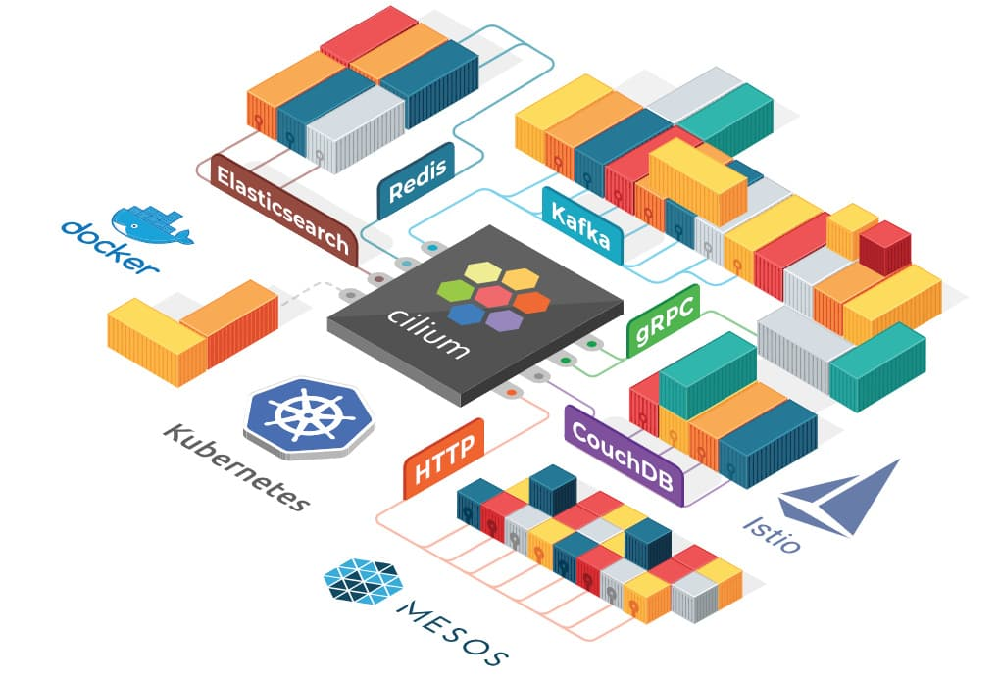
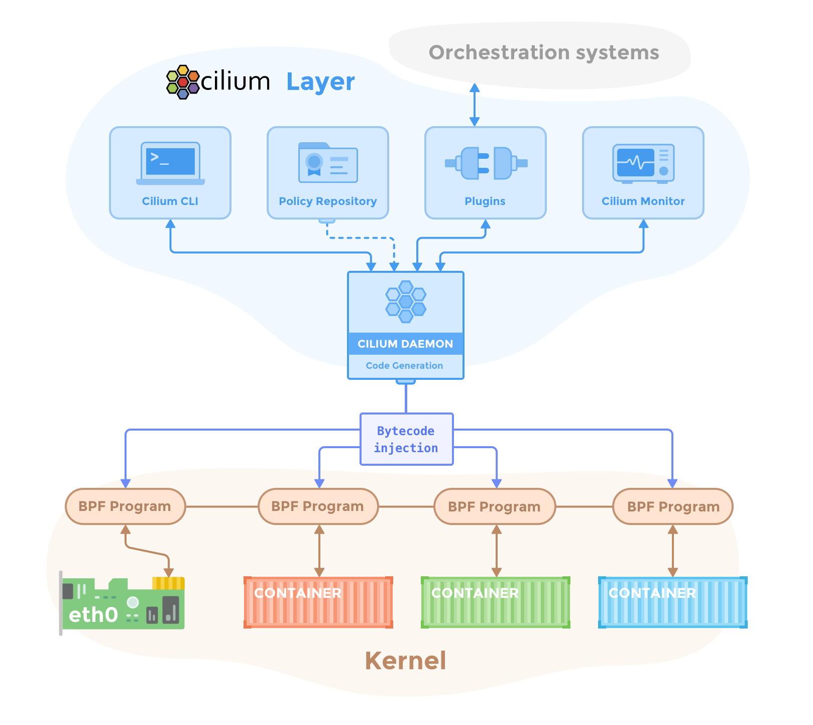

Cilium 是一款开源软件，也是 CNCF 的孵化项目，目前[已有公司](https://isovalent.com/)提供商业化支持，还有基于 Cilium 实现的服务网格解决方案。最初它仅是作为一个 Kubernetes 网络组件。Cilium 在 1.7 版本后[推出并开源了 Hubble](https://cilium.io/blog/2019/11/19/announcing-hubble)，它是专门为网络可视化设计，能够利用 Cilium 提供的 eBPF 数据路径，获得对 Kubernetes 应用和服务的网络流量的深度可视性。这些网络流量信息可以对接 Hubble CLI、UI 工具，可以通过交互式的方式快速进行问题诊断。除了 Hubble 自身的监控工具，还可以对接主流的云原生监控体系——Prometheus 和 Grafana，实现可扩展的监控策略。



本节将带你了解什么是 Cilium 及选择它的原因。

## Cilium 是什么？

Cilium 为基于 Kubernetes 的 Linux 容器管理平台上部署的服务，透明地提供服务间的网络和 API 连接及安全。

Cilium 底层是基于 Linux 内核的新技术 eBPF，可以在 Linux 系统中动态注入强大的安全性、可视性和网络控制逻辑。Cilium 基于 eBPF 提供了多集群路由、替代 kube-proxy 实现负载均衡、透明加密以及网络和服务安全等诸多功能。除了提供传统的网络安全之外，eBPF 的灵活性还支持应用协议和 DNS 请求/响应安全。同时，Cilium 与 Envoy 紧密集成，提供了基于 Go 的扩展框架。因为 eBPF 运行在 Linux 内核中，所以应用所有 Cilium 功能，无需对应用程序代码或容器配置进行任何更改。

基于微服务的应用程序分为小型独立服务，这些服务使用 **HTTP**、**gRPC**、**Kafka** 等轻量级协议通过 API 相互通信。但是，现有的 Linux 网络安全机制（例如 iptables）仅在网络和传输层（即 IP 地址和端口）上运行，并且缺乏对微服务层的可视性。

Cilium 为 Linux 容器框架（如 [**Docker**](https://www.docker.com/) 和 [**Kubernetes）**](https://kubernetes.io/) 带来了 API 感知网络安全过滤。使用名为 **eBPF** 的新 Linux 内核技术，Cilium 提供了一种基于容器 / 容器标识定义和实施网络层和应用层安全策略的简单而有效的方法。

**注**：Cilium 中文意思是“纤毛“，它十分细小而又无处不在。

> ## eBPF
>
> **扩展的柏克莱封包过滤器**（extented Berkeley Packet Filter，缩写 eBPF），是 [类 Unix](https://zh.wikipedia.org/wiki/%E7%B1%BBUnix) 系统上 [数据链路层](https://zh.wikipedia.org/wiki/%E6%95%B0%E6%8D%AE%E9%93%BE%E8%B7%AF%E5%B1%82) 的一种原始接口，提供原始链路层 [封包](https://zh.wikipedia.org/wiki/%E5%B0%81%E5%8C%85) 的收发，除此之外，如果网卡驱动支持 [洪泛](https://zh.wikipedia.org/wiki/%E6%B4%AA%E6%B3%9B) 模式，那么它可以让网卡处于此种模式，这样可以收到 [网络](https://zh.wikipedia.org/wiki/%E7%BD%91%E7%BB%9C) 上的所有包，不管他们的目的地是不是所在 [主机](https://zh.wikipedia.org/wiki/%E4%B8%BB%E6%A9%9F)。参考 [维基百科](https://zh.wikipedia.org/wiki/BPF) 及[BPF、eBPF、XDP 和 Bpfilter 的区别](https://www.netronome.com/blog/bpf-ebpf-xdp-and-bpfilter-what-are-these-things-and-what-do-they-mean-enterprise/)。

## Hubble 是什么？

Hubble 是一个完全分布式的网络和安全可观测性平台。它建立在 Cilium 和 eBPF 之上，以完全透明的方式实现对服务的通信和行为以及网络基础设施的深度可视性（visibility）。

通过建立在 Cilium 之上，Hubble 可以利用 eBPF 实现可视性。依靠 eBPF，所有的可视性都是可编程的，并允许采用一种动态方法，最大限度地减少开销，同时按照用户的要求提供深入和详细的可视性。Hubble 的创建和专门设计是为了最好地利用 eBPF 的能力。

## 特性

以下是 Cilium 的特性。

**基于身份的安全性**

Cilium 可视性和安全策略基于容器编排系统的标识（例如，Kubernetes 中的 Label）。在编写安全策略、审计和故障排查时，再也不用担心网络子网或容器 IP 地址了。

**卓越的性能**

eBPF 利用 Linux 底层的强大能力，通过提供 Linux 内核的沙盒可编程性来实现数据路径，从而提供卓越的性能。

**API 协议可视性 + 安全性**

传统防火墙仅根据 IP 地址和端口等网络标头查看和过滤数据包。Cilium 也可以这样做，但也可以理解并过滤单个 HTTP、gRPC 和 Kafka 请求，这些请求将微服务拼接在一起。

**专为扩展而设计**

Cilium 是为扩展而设计的，在部署新 pod 时不需要节点间交互，并且通过高度可扩展的键值存储进行所有协调。

## 为什么选择 Cilium 和 Hubble？

现代数据中心应用程序的开发已经转向面向服务的体系结构（SOA），通常称为微服务，其中大型应用程序被分成小型独立服务，这些服务使用 HTTP 等轻量级协议通过 API 相互通信。微服务应用程序往往是高度动态的，作为持续交付的一部分部署的滚动更新期间单个容器启动或销毁，应用程序扩展 / 缩小以适应负载变化。

这种向高度动态的微服务的转变过程，给确保微服务之间的连接方面提出了挑战和机遇。传统的 Linux 网络安全方法（例如 iptables）过滤 IP 地址和 TCP/UDP 端口，但 IP 地址经常在动态微服务环境中流失。容器的高度不稳定的生命周期导致这些方法难以与应用程序并排扩展，因为负载均衡表和访问控制列表要不断更新，可能增长成包含数十万条规则。出于安全目的，协议端口（例如，用于 HTTP 流量的 TCP 端口 80）不能再用于区分应用流量，因为该端口用于跨服务的各种消息。

另一个挑战是提供准确的可视性，因为传统系统使用 IP 地址作为主要识别工具，其在微服务架构中的寿命可能才仅仅几秒钟，被大大缩短。

利用 Linux eBPF，Cilium 保留了透明地插入安全可视性 + 强制执行的能力，但这种方式基于服务 /pod/ 容器标识（与传统系统中的 IP 地址识别相反），并且可以根据应用层进行过滤（例如 HTTP）。因此，通过将安全性与寻址分离，Cilium 不仅可以在高度动态的环境中应用安全策略，而且除了提供传统的第 3 层和第 4 层分割之外，还可以通过在 HTTP 层运行来提供更强的安全隔离。 

eBPF 的使用使得 Cilium 能够以高度可扩展的方式实现以上功能，即使对于大规模环境也不例外。

## 功能概述

### 透明的保护 API

能够保护现代应用程序协议，如 REST/HTTP、gRPC 和 Kafka。传统防火墙在第 3 层和第 4 层运行，在特定端口上运行的协议要么完全受信任，要么完全被阻止。Cilium 提供了过滤各个应用程序协议请求的功能，例如：

- 允许所有带有方法 `GET` 和路径 `/public/.*` 的 HTTP 请求。拒绝所有其他请求。
- 允许 `service1` 在 Kafka topic 上生成 `topic1`，`service2` 消费 `topic1`。拒绝所有其他 Kafka 消息。
- 要求 HTTP 标头 `X-Token: [0-9]+` 出现在所有 REST 调用中。

详情请参考 [7 层协议](http://docs.cilium.io/en/stable/policy/#layer-7)。

### 基于身份来保护服务间通信

现代分布式应用程序依赖于诸如容器之类的技术来促进敏捷性并按需扩展。这将导致在短时间内启动大量应用容器。典型的容器防火墙通过过滤源 IP 地址和目标端口来保护工作负载。这就要求不论在集群中的哪个位置启动容器时都要操作所有服务器上的防火墙。

为了避免受到规模限制，Cilium 为共享相同安全策略的应用程序容器组分配安全标识。然后，该标识与应用程序容器发出的所有网络数据包相关联，从而允许验证接收节点处的身份。使用键值存储执行安全身份管理。

### 安全访问外部服务

基于标签的安全性是集群内部访问控制的首选工具。为了保护对外部服务的访问，支持入口（ingress）和出口（egress）的传统基于 CIDR 的安全策略。这允许限制对应用程序容器的访问以及对特定 IP 范围的访问。

### 简单网络

一个简单的扁平第 3 层网络能够跨越多个集群连接所有应用程序容器。使用主机范围分配器可以简化 IP 分配。这意味着每个主机可以在主机之间没有任何协调的情况下分配 IP。

支持以下多节点网络模型：

- **Overlay**：基于封装的虚拟网络产生所有主机。目前 VXLAN 和 Geneve 已经完成，但可以启用 Linux 支持的所有封装格式。

  何时使用此模式：此模式具有最小的基础架构和集成要求。它几乎适用于任何网络基础架构，唯一的要求是主机之间可以通过 IP 连接。

- **本机路由**：使用 Linux 主机的常规路由表。网络必须能够路由应用程序容器的 IP 地址。

  何时使用此模式：此模式适用于高级用户，需要了解底层网络基础结构。此模式适用于：

  - 本地 IPv6 网络
  - 与云网络路由器配合使用
  - 如果您已经在运行路由守护进程

### 负载均衡

应用程序容器和外部服务之间的流量的分布式负载均衡。负载均衡使用 eBPF 实现，允许几乎无限的规模，并且如果未在源主机上执行负载均衡操作，则支持直接服务器返回（DSR）。 

**注意**：负载均衡需要启用连接跟踪。这是默认值。

### 监控和故障排除

可视性和故障排查是任何分布式系统运行的基础。虽然我们喜欢用 `tcpdump` 和 `ping`，它们很好用，但我们努力为故障排除提供更好的工具。包括以下工具：

- 使用元数据进行事件监控：当数据包被丢弃时，该工具不仅仅报告数据包的源 IP 和目标 IP，该工具还提供发送方和接收方的完整标签信息等。
- 策略决策跟踪：为什么丢弃数据包或拒绝请求。策略跟踪框架允许跟踪运行工作负载和基于任意标签定义的策略决策过程。
- 通过 Prometheus 导出指标：通过 Prometheus 导出关键指标，以便与现有仪表板集成。

### 集成

- 网络插件集成：[CNI](https://github.com/containernetworking/cni)、[libnetwork](https://github.com/docker/libnetwork)
- 容器运行时：[containerd](https://github.com/containerd/containerd)
- Kubernetes：[NetworkPolicy](https://kubernetes.io/docs/concepts/services-networking/network-policies/)、[Label](https://kubernetes.io/docs/concepts/overview/working-with-objects/labels/)、[Ingress](https://kubernetes.io/docs/concepts/services-networking/ingress/)、[Service](https://kubernetes.io/docs/concepts/services-networking/service/)
- 日志记录：syslog、[fluentd](http://www.fluentd.org/)

## 概念

Cilium 要求 Linux kernel 版本在 4.8.0 以上，Cilium 官方建议 kernel 版本至少在 4.9.17 以上，高版本的 Ubuntu 发行版中 Linux 内核版本一般在 4.12 以上，如使用 CentOS7 需要升级内核才能运行 Cilium。

KV 存储数据库用存储以下状态：

- 策略身份，Label 列表 <=> 服务身份标识
- 全局的服务 ID，与 VIP 相关联（可选）
- 封装的 VTEP（Vxlan Tunnel End Point）映射（可选）

为了简单起见，Cilium 一般跟容器编排调度器使用同一个 KV 存储数据库，例如在 Kubernetes 中使用 etcd 存储。

## 组成

下图是 Cilium 的组件示意图，Cilium 是位于 Linux kernel 与容器编排系统的中间层。向上可以为容器配置网络，向下可以向 Linux 内核生成 BPF 程序来控制容器的安全性和转发行为。



管理员通过 Cilium CLI 配置策略信息，这些策略信息将存储在 KV 数据库里，Cilium 使用插件（如 CNI）与容器编排调度系统交互，来实现容器间的联网和容器分配 IP 地址分配，同时 Cilium 还可以获得容器的各种元数据和流量信息，提供监控 API。

**Cilium Agent**

Cilium Agent 作为守护进程运行在每个节点上，与容器运行时如 Docker，和容器编排系统交互如 Kubernetes。通常是使用插件的形式（如 Docker plugin）或遵从容器编排标准定义的网络接口（如 [CNI](https://jimmysong.io/kubernetes-handbook/concepts/cni.html)）。

Cilium Agent 的功能有：

- 暴露 API 给运维和安全团队，可以配置容器间的通信策略。还可以通过这些 API 获取网络监控数据。
- 收集容器的元数据，例如 Pod 的 Label，可用于 Cilium 安全策略里的 Endpoint 识别，这个跟 Kubernetes 中的 service 里的 Endpoint 类似。
- 与容器管理平台的网络插件交互，实现 IPAM 的功能，用于给容器分配 IP 地址，该功能与 [flannel](https://jimmysong.io/kubernetes-handbook/concepts/flannel.html)、[calico](https://jimmysong.io/kubernetes-handbook/concepts/calico.html) 网络插件类似。
- 将其有关容器标识和地址的知识与已配置的安全性和可视性策略相结合，生成高效的 BPF 程序，用于控制容器的网络转发和安全行为。
- 使用 clang/LLVM 将 BPF 程序编译为字节码，在容器的虚拟以太网设备中的所有数据包上执行，并将它们传递给 Linux 内核。

## 命令行工具

Cilium 提供了管理命令行管理工具，可以与 Cilium Agent API 交互。`cilium` 命令使用方式如下。

```bash
Usage:
  cilium [command]

Available Commands:
  bpf                      直接访问本地 BPF map
  cleanup                  重置 agent 状态
  completion               bash 自动补全
  config                   Cilium 配置选项
  debuginfo                从 agent 请求可用的调试信息
  endpoint                 管理 endpoint
  identity                 管理安全身份
  kvstore                  直接访问 kvstore
  map                      访问 BPF map
  monitor                  显示 BPF 程序事件
  node                     管理集群节点
  policy                   管理安全策略
  prefilter                管理 XDP CIDR filter
  service                  管理 service & loadbalancer
  status                   显示 daemon 的状态
  version                  打印版本信息
```

详细使用情况请参考 [Cilium Command Cheatsheet](https://cilium.readthedocs.io/en/stable/cheatsheet/)。

## 策略控制示例

使用 docker-compose 安装测试，需要先用 vagrant 启动虚拟机，使用的是 Ubuntu-17.10 的 vagrant box。在下面的示例中，Cilium 是使用 docker network plugin 的方式部署的。Cilium 的一项主要功能——为容器创建网络，使用 `docker inspect` 来查询使用 Cilium 网络的容器配置，可以看到 Cilium 创建的容器网络示例如下。

```json
            "Networks": {
                "cilium-net": {
                    "IPAMConfig": null,
                    "Links": null,
                    "Aliases": [
                        "a08e52d13a38"
                    ],
                    "NetworkID": "c4cc3ac444f3c494beb1355e4a9c4bc474d9a84288ceb2030513e8406cdf4e9b",
                    "EndpointID": "2e3e4486525c20fc516d0a9d1c52f84edf9a000f3068803780e23b4c6a1ca3ed",
                    "Gateway": "",
                    "IPAddress": "10.15.125.240",
                    "IPPrefixLen": 32,
                    "IPv6Gateway": "f00d::a0f:0:0:1",
                    "GlobalIPv6Address": "f00d::a0f:0:0:ed50",
                    "GlobalIPv6PrefixLen": 128,
                    "MacAddress": "",
                    "DriverOpts": null
                }
            }
```

- **NetworkID**：每个网络平面的唯一标识
- **EndpointID**：每个容器/Pod 的在网络中的唯一标识

在 docker-compose 安装方式的[快速开始指南](https://cilium.readthedocs.io/en/stable/gettingstarted/docker/)中，演示了如何使用 Label 来选择容器，从而限制两个容器（应用）之间的流量访问权限的。

策略使用 JSON 格式配置，例如[官方示例](https://cilium.readthedocs.io/en/stable/gettingstarted/docker/)使用 Cilium 直接在 L3/L4 层管理容器间访问策略的方式。例如下面的策略配置具有 `id=app2` 标签的容器可以使用 TCP 协议、80 端口访问具有标签 `id=app1` 标签的容器。

```json
[{
    "labels": [{"key": "name", "value": "l3-rule"}],
    "endpointSelector": {"matchLabels":{"id":"app1"}},
    "ingress": [{
        "fromEndpoints": [
            {"matchLabels":{"id":"app2"}}
        ],
        "toPorts": [{
                "ports": [{"port": "80", "protocol": "TCP"}]
        }]
    }]
}]
```

将该配置保存成 JSON 文件，在使用 `cilium policy import` 命令即可应用到 Cilium 网络中。


如图所示，此时 `id` 标签为其他值的容器就无法访问 `id=app1` 容器，策略配置中的 `toPorts` 中还可以配置 HTTP `method` 和 `path`，实现更细粒度的访问策略控制。

## 参考

- [Cilium 官方网站 - cilium.io](https://cilium.io)
- [网络层拦截可选项 - zhihu.com](https://zhuanlan.zhihu.com/p/25672552)
- [BPF, eBPF, XDP and Bpfilter… What are These Things and What do They Mean for the Enterprise? - netronome.com](https://www.netronome.com/blog/bpf-ebpf-xdp-and-bpfilter-what-are-these-things-and-what-do-they-mean-enterprise/)
- [Cilium Concepts - docs.cilium.io](https://docs.cilium.io/en/stable/concepts/)
- [Getting Started Guides - docs.cilium.io](https://docs.cilium.io/en/v1.11/gettingstarted/#getting-started-guides)