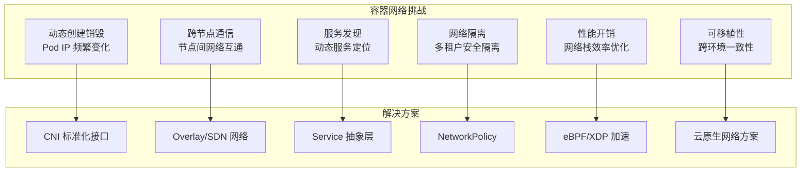
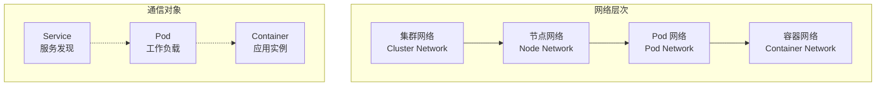
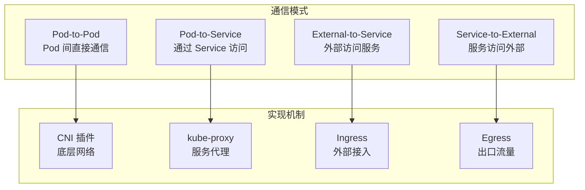
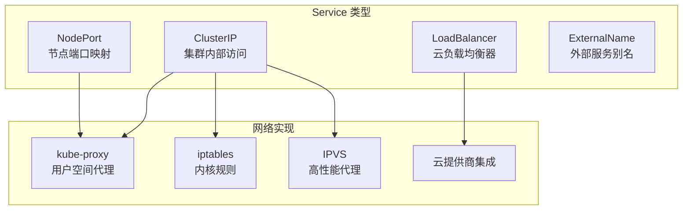
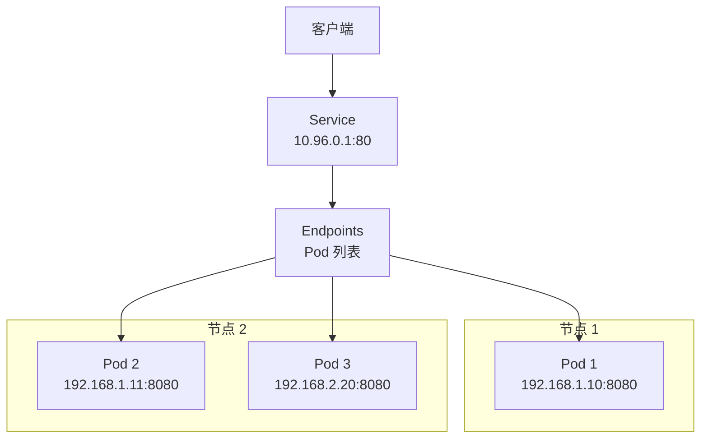
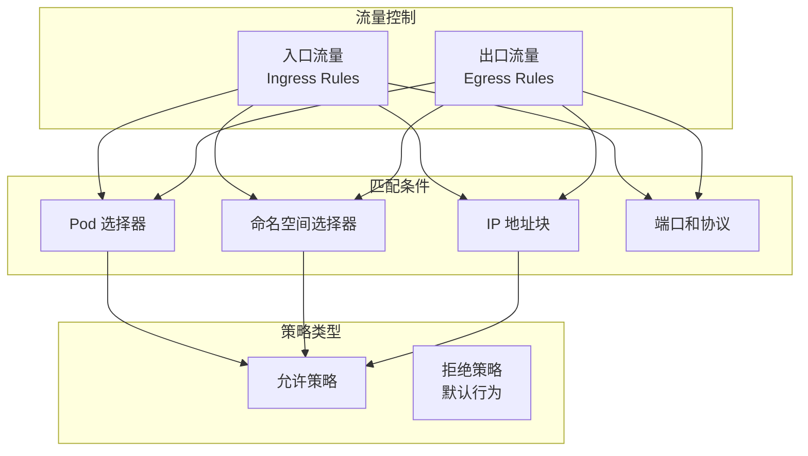
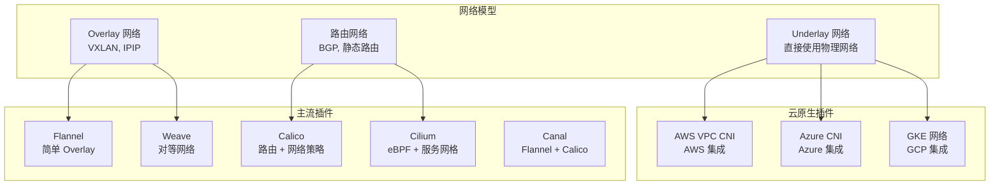
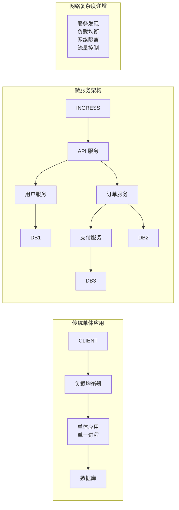
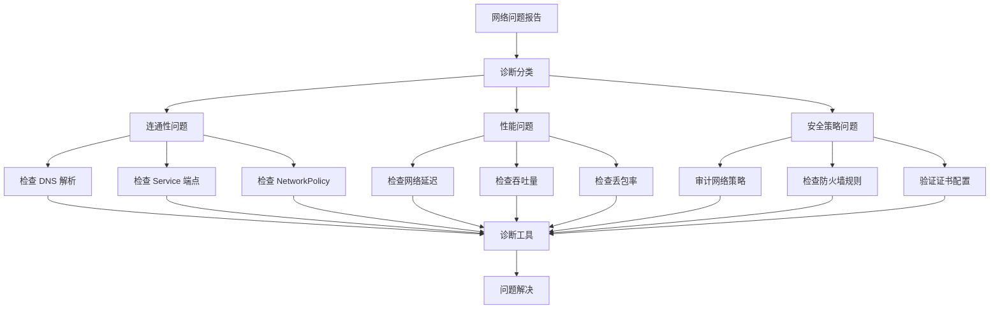

> 云原生网络的本质，是用软件定义的方式重塑连接、隔离与治理的边界，让复杂系统的流动性与安全性兼得。

Kubernetes 网络架构是云原生基础设施的核心组成部分，涵盖了容器通信、服务发现、负载均衡、安全隔离等关键能力。本文系统梳理了 Kubernetes 网络的模型层次、通信模式、策略机制及主流插件生态，帮助读者全面理解其设计原则与运维实践。

## 网络挑战与设计目标

Kubernetes 网络需要应对容器环境下的动态变化和多样化需求。下图总结了容器网络的主要挑战及对应解决方案。




{width=1920 height=548}

Kubernetes 网络设计遵循以下核心原则：

- 每个 Pod 都有唯一的 IP 地址
- Pod 间可以直接通信，无需 NAT
- Service 提供稳定的服务发现和负载均衡
- 网络策略控制流量访问
- 插件化架构支持多种实现

## 网络模型层次

Kubernetes 网络模型分为多个层次，便于理解各组件的职责和作用。下图展示了网络层次结构及通信对象。




{width=2120 height=198}

### 集群网络 (Cluster Network)

- 整个 Kubernetes 集群的网络范围，通常为一个大的 CIDR 块（如 `10.0.0.0/8`）。
- 由网络插件负责分配和管理。

### 节点网络 (Node Network)

- 每个节点的网络配置，包括节点 IP 和路由规则。
- 负责节点间通信。

### Pod 网络 (Pod Network)

- Pod 的网络命名空间，每个 Pod 有唯一的 IP 地址。
- 支持跨节点 Pod 间通信。

## 通信模式与实现机制

Kubernetes 支持多种通信模式，满足不同场景下的流量需求。下图展示了主要通信模式及其实现机制。




{width=1920 height=797}

### Pod-to-Pod 通信

- 所有 Pod 在同一个扁平网络中，无需 NAT 转换，可直接通信。
- 由 CNI 插件实现。

### Pod-to-Service 通信

- 通过 Service 抽象层，提供负载均衡和服务发现。
- 支持多种 Service 类型。

## Service 网络抽象与类型

Service 是 Kubernetes 网络的核心抽象，支持多种访问模型。下图展示了 Service 类型与网络实现的关系。




{width=1920 height=741}

Service 的 Endpoint 与网络拓扑如下图所示，便于理解流量分发过程。




{width=1920 height=1542}

## 网络策略与安全机制

Kubernetes 通过 NetworkPolicy 实现细粒度流量控制和零信任安全。下图展示了 NetworkPolicy 的模型结构。




{width=1920 height=1416}

以下是一个典型的零信任 NetworkPolicy 配置示例：

```yaml
apiVersion: networking.k8s.io/v1
kind: NetworkPolicy
metadata:
  name: api-allow
  namespace: production
spec:
  podSelector:
    matchLabels:
      app: api
  policyTypes:
  - Ingress
  - Egress
  ingress:
  - from:
    - podSelector:
        matchLabels:
          app: web
    ports:
    - protocol: TCP
      port: 8080
  egress:
  - to:
    - podSelector:
        matchLabels:
          app: database
    ports:
    - protocol: TCP
      port: 5432
```

## 网络插件生态与选择标准

Kubernetes 支持多种 CNI 网络插件，满足不同场景下的性能、安全和运维需求。下图展示了主流插件分类及其网络模型。




{width=2038 height=480}

选择网络插件时需综合考虑性能、安全、可观测性、运维复杂度和云兼容性等因素。下表对比了主流插件的关键维度。



| 维度       | 考虑因素                 | 示例                    |
|------------|-------------------------|------------------------|
| 性能       | 网络延迟、吞吐量、资源占用 | Cilium > Calico > Flannel |
| 安全性     | 网络策略支持、加密能力     | Calico, Cilium         |
| 可观测性   | 流量监控、故障排查         | Cilium, Calico         |
| 运维复杂度 | 部署难度、维护成本         | Flannel > Calico > CILIUM |
| 云兼容性   | 云厂商集成、网络策略支持    | AWS VPC CNI, Azure CNI |



## 网络架构演进与发展趋势

Kubernetes 网络架构从单体应用逐步演进到微服务和云原生模式。下图展示了架构演进过程及网络复杂度提升。




{width=1920 height=6186}

当前云原生网络发展趋势主要包括：

- 服务网格（Service Mesh）：如 Istio、Linkerd、Consul Connect，提升应用层流量治理能力。
- eBPF 加速：如 Cilium、Calico eBPF 模式，实现内核级高性能网络处理。
- 多集群网络：如 Submariner、Skupper，支持集群联邦和多集群服务发现。
- 零信任安全：基于身份的网络访问控制，声明式管理网络策略。

## 网络故障排查框架与工具

系统性排查方法有助于快速定位和解决网络问题。下图展示了故障排查流程。




{width=2202 height=882}

常用诊断工具如下，便于实际运维排查：

```bash
# 网络连通性测试
kubectl run test-pod --image=busybox --rm -it --restart=Never -- wget -qO- http://service-name

# DNS 解析测试
kubectl run test-pod --image=busybox --rm -it --restart=Never -- nslookup service-name

# 网络策略测试
kubectl run test-pod --image=busybox --rm -it --restart=Never -- wget -qO- http://blocked-service

# 抓包分析
kubectl run netshoot --image=nicolaka/netshoot --rm -it --restart=Never
```

## 最佳实践与运维建议

合理的网络规划和运维策略是保障集群稳定运行的基础。以下原则和建议可供参考：

### 网络规划原则

- IP 地址规划：为 Pod、Service、节点分配合适的 CIDR，预留扩展空间，避免冲突。
- 网络隔离策略：默认拒绝所有流量，基于最小权限原则开放访问，定期审计和更新策略。
- 性能优化：选择合适的网络插件，配置合适的 MTU，监控网络性能指标。

### 运维建议

- 监控重点：关注网络延迟、丢包率、DNS 解析性能、Service 端点变化、NetworkPolicy 生效情况。
- 故障应对：准备排查手册，建立问题升级流程，定期进行故障演练。
- 容量规划：监控资源使用，规划扩展容量，预留故障恢复资源。

## 总结

Kubernetes 网络架构采用分层设计，从底层容器网络到高层服务抽象，每一层都解决了特定的网络挑战。通过 CNI 插件机制，Kubernetes 支持多种网络实现方案，能够灵活适配不同应用场景和基础设施需求。掌握核心概念和设计原则，有助于在实际部署和运维中做出正确的架构决策，并高效排查网络相关问题。

## 参考文献

1. [Kubernetes 官方文档 - kubernetes.io](https://kubernetes.io/docs/concepts/cluster-administration/networking/)
2. [CNI 插件规范 - github.com/containernetworking/cni](https://github.com/containernetworking/cni)
3. [Service Mesh Landscape - servicemesh.cn](https://servicemesh.cn/)
