> 告警系统是 Kubernetes 可观测性体系的核心环节，帮助团队及时发现异常、自动通知并高效响应，保障业务稳定运行。

## 告警系统概述

在现代云原生环境中，告警系统不仅承担着异常检测和通知的职责，更是团队协作和故障响应的关键纽带。合理设计和运维告警系统，有助于减少宕机时间和业务损失。

### 告警系统的作用

告警系统主要实现以下功能：

- 问题检测：自动发现系统异常和性能瓶颈
- 及时通知：多渠道推送告警信息
- 事件关联：将相关事件和指标进行聚合
- 响应协调：促进团队间高效协作与响应

### 告警生命周期

下图展示了告警从监控到处理的完整生命周期。



{width=1920 height=3584}

### 告警类型

告警可分为以下几类：

- 基于指标的告警：如 CPU、内存、响应时间等
- 基于日志的告警：如错误日志数量、异常模式识别
- 基于事件的告警：如 Kubernetes 事件、服务状态变化
- 基于预测的告警：利用历史数据预测潜在风险

## Alertmanager 告警管理

Alertmanager 是 Prometheus 生态中的核心告警管理组件，负责告警聚合、抑制、静默和多渠道通知。

### 核心功能

Alertmanager 具备如下能力：

- 告警聚合：分组相关告警，减少通知噪音
- 告警抑制：已知问题时自动屏蔽相关告警
- 告警静默：临时抑制特定告警
- 多渠道通知：支持邮件、Slack、Webhook、PagerDuty 等
- 高可用性：支持集群部署，保障可靠性

### 架构和工作原理

下图展示了 Alertmanager 的核心架构及各组件协作流程。


{width=1920 height=2638}

### 核心概念

#### 告警路由（Routes）

告警路由用于定义告警分发策略：

```yaml
route:
  group_by: ['alertname', 'cluster', 'service']
  group_wait: 10s
  group_interval: 10s
  repeat_interval: 1h
  receiver: 'default'
  routes:
  - match:
      severity: critical
    receiver: 'critical'
```

#### 告警分组（Grouping）

分组机制将相关告警合并为单条通知，减少重复告警：

```yaml
group_by: ['alertname', 'cluster', 'service']
group_wait: 10s    # 等待新告警加入分组
group_interval: 10s # 发送分组后等待间隔
```

#### 告警抑制（Inhibition）

抑制规则用于屏蔽已知问题导致的连锁告警：

```yaml
inhibit_rules:
- source_match:
    alertname: 'NodeDown'
  target_match:
    alertname: 'PodCrashLooping'
  equal: ['node']
```

#### 告警静默（Silences）

静默功能可临时屏蔽特定告警，适用于维护窗口等场景：

```bash
# 创建静默
curl -X POST http://alertmanager:9093/api/v2/silences \
  -d '{
    "matchers": [{"name": "alertname", "value": "HighCPUUsage"}],
    "startsAt": "2023-10-19T00:00:00Z",
    "endsAt": "2023-10-19T01:00:00Z",
    "comment": "Scheduled maintenance"
  }'
```

## 通知渠道配置

Alertmanager 支持多种通知渠道，以下为常用配置示例。

### Email 配置

邮件通知适用于团队或个人告警推送：

```yaml
email_configs:
- to: 'alerts@example.com'
  from: 'alertmanager@example.com'
  smarthost: 'smtp.example.com:587'
  auth_username: 'alertmanager@example.com'
  auth_password: 'password'
  send_resolved: true
```

### Slack 配置

Slack 通知适合实时协作和告警分组：

```yaml
slack_configs:
- api_url: 'https://hooks.slack.com/services/xxx/yyy/zzz'
  channel: '#alerts'
  username: 'Alertmanager'
  title: '{{ .GroupLabels.alertname }}'
  text: '{{ .CommonAnnotations.description }}'
```

### Webhook 配置

Webhook 可集成自定义系统或自动化流程：

```yaml
webhook_configs:
- url: 'http://webhook-receiver:8080/alert'
  send_resolved: true
  http_config:
    basic_auth:
      username: 'alertmanager'
      password: 'password'
```

### PagerDuty 配置

PagerDuty 适用于紧急告警升级和值班通知：

```yaml
pagerduty_configs:
- service_key: 'your-service-key'
  description: '{{ .GroupLabels.alertname }}'
```

## 告警规则设计

合理的告警规则设计有助于提升系统可维护性和团队响应效率。

### 设计原则

- 减少噪音：合理阈值、聚合相关告警、自动升级机制
- 明确责任：告警路由到对应团队，设定响应时间和负责人
- 持续改进：定期审查告警有效性，反馈优化规则，自动化处理流程

### 告警规则示例

以下为 Prometheus Alerting Rule 的常见示例：

```yaml
groups:
- name: kubernetes-alerts
  rules:
  - alert: HighPodCPUUsage
    expr: rate(container_cpu_usage_seconds_total{pod=~"$pod"}[5m]) > 0.8
    for: 5m
    labels:
      severity: warning
      team: devops
    annotations:
      summary: "High CPU usage detected"
      description: "Pod {{ $labels.pod }} has high CPU usage: {{ $value }} cores"

  - alert: PodCrashLooping
    expr: kube_pod_container_status_restarts_total > 5
    for: 10m
    labels:
      severity: critical
      team: devops
    annotations:
      summary: "Pod crash looping"
      description: "Pod {{ $labels.pod }} is crash looping"
```

## 高可用性和扩展

Alertmanager 支持集群部署和多种扩展机制，保障告警系统的可靠性和灵活性。

### 集群部署

通过集群模式提升 Alertmanager 的高可用性：

```yaml
spec:
  replicas: 3
  forceEnableClusterMode: true
  cluster:
    listen-address: 0.0.0.0:9094
    peers:
    - alertmanager-0.alertmanager-headless:9094
    - alertmanager-1.alertmanager-headless:9094
    - alertmanager-2.alertmanager-headless:9094
```

### 扩展机制

- 外部集成：通过 Webhook 与第三方系统对接
- 自定义接收器：开发自定义通知渠道
- 告警聚合器：使用外部工具进行告警聚合和分析

## 监控和维护

为保障 Alertmanager 的稳定运行，需对自身指标和健康状态进行监控。

### 自身指标监控

Alertmanager 暴露 Prometheus 格式的关键指标：

```bash
# 关键指标
alertmanager_alerts_total          # 接收到的告警总数
alertmanager_notifications_total   # 发送的通知数量
alertmanager_notifications_failed_total  # 失败的通知数量
```

### 健康检查

可通过 HTTP 接口进行健康和就绪检查：

```bash
# 健康检查端点
curl http://alertmanager:9093/-/healthy

# 准备就绪检查
curl http://alertmanager:9093/-/ready
```

## 故障排除

遇到告警系统异常时，可参考以下排查方法。

### 常见问题

- 告警不发送：检查日志、验证配置语法
- 通知渠道失败：测试连接、检查凭据
- 告警分组异常：查看活跃告警、检查分组状态

```bash
# 检查日志
kubectl logs -n monitoring deployment/alertmanager

# 验证配置语法
amtool check-config alertmanager.yaml

# 测试连接
curl -f webhook-url

# 检查凭据
kubectl describe secret alertmanager-secret

# 查看活跃告警
curl http://alertmanager:9093/api/v2/alerts

# 检查分组状态
curl http://alertmanager:9093/api/v2/alerts/groups
```

### 调试技巧

- 启用调试日志：设置 `--log.level=debug`
- 使用 amtool 工具：验证配置、测试模板

```yaml
spec:
  containers:
  - name: alertmanager
    args:
    - --log.level=debug
```

```bash
# 验证配置
amtool check-config alertmanager.yaml

# 测试模板
amtool template render alertmanager.yaml template.tmpl
```

## 最佳实践

为提升告警系统的可维护性和响应效率，建议遵循以下最佳实践。

### 配置管理

- 版本控制：将告警配置纳入 Git 管理
- 环境分离：为不同环境维护独立配置
- 模板化：使用模板简化配置管理

### 告警策略

- 分层告警：按严重程度设置不同通知渠道
- 升级机制：未处理告警自动升级
- 业务时间：非工作时间调整告警策略

### 运维监控

- 监控自身：为 Alertmanager 设置自监控告警
- 性能监控：关注处理延迟和资源使用
- 告警审计：记录告警处理历史和趋势

## 总结

告警系统是 Kubernetes 可观测性体系的关键环节。通过 Alertmanager 的聚合、抑制、静默和多渠道通知能力，结合合理的告警规则和策略，可以构建高效、可靠的告警响应流程。平衡告警数量与质量，避免告警疲劳，确保关键问题及时响应，是高效运维的基础。

## 参考文献

1. [Alertmanager 官方文档 - prometheus.io](https://prometheus.io/docs/alerting/latest/alertmanager/)
2. [Prometheus 官方文档 - prometheus.io](https://prometheus.io/docs/introduction/overview/)
3. [Kubernetes 官方文档 - kubernetes.io](https://kubernetes.io/docs/)
4. [amtool 命令行工具 - prometheus.io](https://prometheus.io/docs/alerting/latest/clients/)
5. [PagerDuty 官方文档 - pagerduty.com](https://support.pagerduty.com/docs/prometheus-integration)
