> Kiali 是 Istio 服务网格的可视化观测与配置平台，提供服务拓扑、流量监控、配置验证和分布式追踪集成，是微服务架构下运维与故障排查的利器。

## Kiali 简介

Kiali 是专为 Istio 服务网格设计的开源观测控制台，提供服务拓扑图、流量监控、配置验证等功能。作为 Istio 生态的重要组成部分，Kiali 帮助用户理解和监控服务网格的行为，提升可观测性和运维效率。

### 核心特性

Kiali 具备以下核心能力：

- 服务拓扑可视化：图形化展示服务间通信关系
- 流量监控：实时显示请求流量、延迟和错误率
- 配置验证：检查 Istio 配置的有效性和一致性
- 分布式追踪集成：支持 Jaeger 等追踪系统
- 安全策略可视化：展示认证和授权策略应用情况
- 多集群支持：管理多个 Kubernetes 集群

## Kiali 架构

下图展示了 Kiali 的主要架构组件及其交互关系。



{width=1920 height=1592}

### 组件说明

- Web UI：基于 React 的用户界面
- GraphQL API：灵活的数据查询接口
- 业务逻辑服务：数据聚合与业务规则处理
- 配置验证器：Istio 配置一致性检查
- 指标适配器：采集 Prometheus、Jaeger 等监控数据

## 安装与配置

Kiali 可与 Istio 集成安装，也支持独立部署。以下为常见安装方式和配置示例。

### 使用 Istio 集成安装

推荐通过 Istioctl 或 Helm 一键安装 Kiali：

```bash
# 使用 Istioctl 安装 Istio 和 Kiali
istioctl install --set profile=demo --set addonComponents.kiali.enabled=true

# 或者使用 Helm
helm repo add kiali https://kiali.org/helm-charts
helm repo update

helm install kiali-server kiali/kiali-server \
  --namespace istio-system \
  --set auth.strategy=anonymous \
  --set external_services.prometheus.url=http://prometheus.istio-system.svc.cluster.local:9090 \
  --set external_services.grafana.url=http://grafana.istio-system.svc.cluster.local:3000
```

### 独立安装

如需独立部署，可参考以下 RBAC 和配置示例：

```yaml
apiVersion: v1
kind: ServiceAccount
metadata:
  name: kiali
  namespace: istio-system
---
apiVersion: rbac.authorization.k8s.io/v1
kind: ClusterRole
metadata:
  name: kiali
rules:
- apiGroups: [""]
  resources: ["configmaps", "namespaces", "nodes", "pods", "services"]
  verbs: ["get", "list", "watch"]
- apiGroups: ["apps"]
  resources: ["deployments", "replicasets"]
  verbs: ["get", "list", "watch"]
- apiGroups: ["batch"]
  resources: ["cronjobs", "jobs"]
  verbs: ["get", "list", "watch"]
- apiGroups: ["networking.k8s.io"]
  resources: ["ingresses"]
  verbs: ["get", "list", "watch"]
---
apiVersion: rbac.authorization.k8s.io/v1
kind: ClusterRoleBinding
metadata:
  name: kiali
roleRef:
  apiGroup: rbac.authorization.k8s.io
  kind: ClusterRole
  name: kiali
subjects:
- kind: ServiceAccount
  name: kiali
  namespace: istio-system
```

### 配置 Kiali

Kiali 支持通过 ConfigMap 进行灵活配置，集成外部监控与追踪系统：

```yaml
apiVersion: v1
kind: ConfigMap
metadata:
  name: kiali
  namespace: istio-system
data:
  config.yaml: |
    auth:
      strategy: anonymous
    external_services:
      prometheus:
        url: http://prometheus.istio-system.svc.cluster.local:9090
      grafana:
        url: http://grafana.istio-system.svc.cluster.local:3000
      jaeger:
        url: http://jaeger-query.istio-system.svc.cluster.local:16686
    server:
      port: 20001
      web_root: /
```

### 部署 Kiali

以下为 Kiali Deployment 典型配置：

```yaml
apiVersion: apps/v1
kind: Deployment
metadata:
  name: kiali
  namespace: istio-system
spec:
  replicas: 1
  selector:
    matchLabels:
      app: kiali
  template:
    metadata:
      labels:
        app: kiali
      annotations:
        sidecar.istio.io/inject: "false"
    spec:
      serviceAccountName: kiali
      containers:
      - name: kiali
        image: quay.io/kiali/kiali:latest
        ports:
        - containerPort: 20001
          name: http
        env:
        - name: CONFIG_FILE
          value: /kiali-configuration/config.yaml
        volumeMounts:
        - name: config
          mountPath: /kiali-configuration
      volumes:
      - name: config
        configMap:
          name: kiali
```

## 访问 Kiali

Kiali 支持多种服务暴露方式，便于集群内外访问。

### 服务暴露与 Ingress

以下为 Service 和 Ingress 配置示例：

```yaml
apiVersion: v1
kind: Service
metadata:
  name: kiali
  namespace: istio-system
spec:
  ports:
  - name: http
    port: 20001
    targetPort: 20001
  selector:
    app: kiali
---
apiVersion: networking.k8s.io/v1
kind: Ingress
metadata:
  name: kiali
  namespace: istio-system
  annotations:
    kubernetes.io/ingress.class: nginx
spec:
  rules:
  - host: kiali.example.com
    http:
      paths:
      - path: /
        pathType: Prefix
        backend:
          service:
            name: kiali
            port:
              number: 20001
```

### 端口转发访问

```bash
kubectl port-forward -n istio-system svc/kiali 20001:20001

# 浏览器访问 http://localhost:20001
```

## Kiali 主要功能

Kiali 提供丰富的服务网格观测与配置能力，核心功能包括：

### 服务网格拓扑图

Kiali 的核心功能是可视化服务网格的拓扑结构，下图为典型拓扑示意。


{width=1920 height=3554}

拓扑图展示：

- 服务间调用关系
- 流量大小与方向
- 健康状态与错误率
- 安全策略应用情况

### 应用详情页面

每个服务的详情页包含：

- 概览：基本信息、标签、注解
- 流量指标：请求率、延迟、错误率
- 链路追踪：与 Jaeger 集成
- 配置：Istio 相关配置
- 日志：关联日志条目

### Istio 配置验证

Kiali 可自动验证 Istio 配置，提升集群稳定性：

- 配置一致性检查
- 策略冲突检测
- 资源引用验证
- 配置最佳实践建议

### 分布式追踪集成

与 Jaeger 集成，支持：

- 请求链路查看：拓扑图直达追踪详情
- 性能瓶颈识别：高延迟服务突出显示
- 错误追踪：关联错误请求的完整链路

## 配置和定制

Kiali 支持丰富的外部服务集成和安全配置，适应多种生产场景。

### 外部服务集成

```yaml
external_services:
  prometheus:
    url: http://prometheus.istio-system.svc.cluster.local:9090
    custom_metrics_url: http://prometheus.istio-system.svc.cluster.local:9090
  grafana:
    url: http://grafana.istio-system.svc.cluster.local:3000
    dashboards:
    - name: "Istio Service Dashboard"
      variables:
        srcns: var-namespace
        srcwl: var-workload
        dstns: var-namespace
        dstwl: var-workload
  jaeger:
    url: http://jaeger-query.istio-system.svc.cluster.local:16686
    integration: true
```

### 安全配置

```yaml
auth:
  strategy: openshift  # 或 token, anonymous
  openshift:
    client_id_prefix: kiali-
    server_address: https://api.example.com:6443
  token:
    signing_key: "secret"
```

### 集群配置

```yaml
kiali:
  istio:
    root_namespace: istio-system
    component_status:
      enabled: true
      components:
      - app_label: istio-ingressgateway
        istio_deployment_name: istio-ingressgateway
        namespace: istio-system
  cluster_wide_access: true
  clusters:
  - name: "Kubernetes"
    secret_name: "kiali-kubernetes-secret"
```

## 监控与告警

Kiali 支持健康检查与 Prometheus 指标暴露，便于集成监控系统。

### 健康检查

```yaml
livenessProbe:
  httpGet:
    path: /api/healthz
    port: 20001
    scheme: HTTP
  initialDelaySeconds: 5
  periodSeconds: 30

readinessProbe:
  httpGet:
    path: /api/healthz
    port: 20001
    scheme: HTTP
  initialDelaySeconds: 5
  periodSeconds: 30
```

### 指标暴露

Kiali 可通过 ServiceMonitor 暴露 Prometheus 格式指标：

```yaml
apiVersion: monitoring.coreos.com/v1
kind: ServiceMonitor
metadata:
  name: kiali
  namespace: istio-system
spec:
  selector:
    matchLabels:
      app: kiali
  endpoints:
  - port: http
    path: /api/v1/metrics
    interval: 30s
```

## 故障排除

Kiali 运维过程中常见问题及排查方法如下。

### 常见问题

- 无法访问 Kiali UI：检查 Pod、Service 状态与日志

  ```bash
  kubectl get pods -n istio-system -l app=kiali
  kubectl get svc -n istio-system kiali
  kubectl logs -n istio-system deployment/kiali
  ```

- 拓扑图不显示：检查 Prometheus 连接与 Istio 配置

  ```bash
  curl http://kiali:20001/api/config
  kubectl get istiooperators -n istio-system
  ```

- 权限问题：检查服务账户权限与 ClusterRoleBinding

  ```bash
  kubectl auth can-i get pods --as=system:serviceaccount:istio-system:kiali
  kubectl get clusterrolebinding kiali
  ```

### 调试技巧

- 启用调试日志

  ```yaml
  spec:
    containers:
    - name: kiali
      env:
      - name: LOG_LEVEL
        value: "debug"
  ```

- 检查当前配置

  ```bash
  kubectl exec -n istio-system deployment/kiali -- cat /kiali-configuration/config.yaml
  ```

- API 调试

  ```bash
  curl -X POST http://kiali:20001/api/graphql \
    -H "Content-Type: application/json" \
    -d '{"query": "{namespaces}"}'
  ```

## 最佳实践

为保障生产环境的稳定性和安全性，建议遵循以下最佳实践。

### 生产环境配置

- 高可用部署

  ```yaml
  spec:
    replicas: 2
  ```

- 资源限制

  ```yaml
  resources:
    requests:
      cpu: 100m
      memory: 256Mi
    limits:
      cpu: 500m
      memory: 1Gi
  ```

- 安全加固

  ```yaml
  auth:
    strategy: token
  security:
    cert_file: /kiali-cert/tls.crt
    private_key_file: /kiali-cert/tls.key
  ```

### 监控策略

- 关键指标监控：服务网格健康、配置验证错误、性能延迟
- 告警配置：Istio 组件异常、配置验证失败、性能阈值超限

### 使用建议

- 定期检查配置验证结果
- 关注拓扑图中的错误和警告
- 利用链路追踪定位问题
- 监控服务间流量模式变化

## 总结

Kiali 是 Istio 服务网格的重要观测工具：

- 可视化服务拓扑，直观展示服务间复杂关系
- 实时流量监控，提供详细性能指标
- 配置验证，保障 Istio 配置正确性
- 多系统集成，与 Prometheus、Jaeger 等工具无缝协作

通过 Kiali，用户可深入理解服务网格行为，快速识别问题并优化性能，是构建和管理微服务架构不可或缺的工具。

## 参考文献

1. [Kiali 官方文档 - kiali.io](https://kiali.io/documentation/)
2. [Istio 官方文档 - istio.io](https://istio.io/latest/docs/)
3. [Prometheus 官方文档 - prometheus.io](https://prometheus.io/docs/introduction/overview/)
4. [Jaeger 官方文档 - jaegertracing.io](https://www.jaegertracing.io/docs/)
5. [Kubernetes 官方文档 - kubernetes.io](https://kubernetes.io/docs/)
